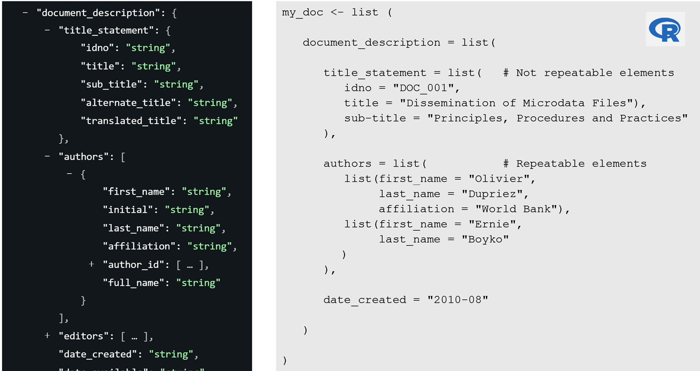
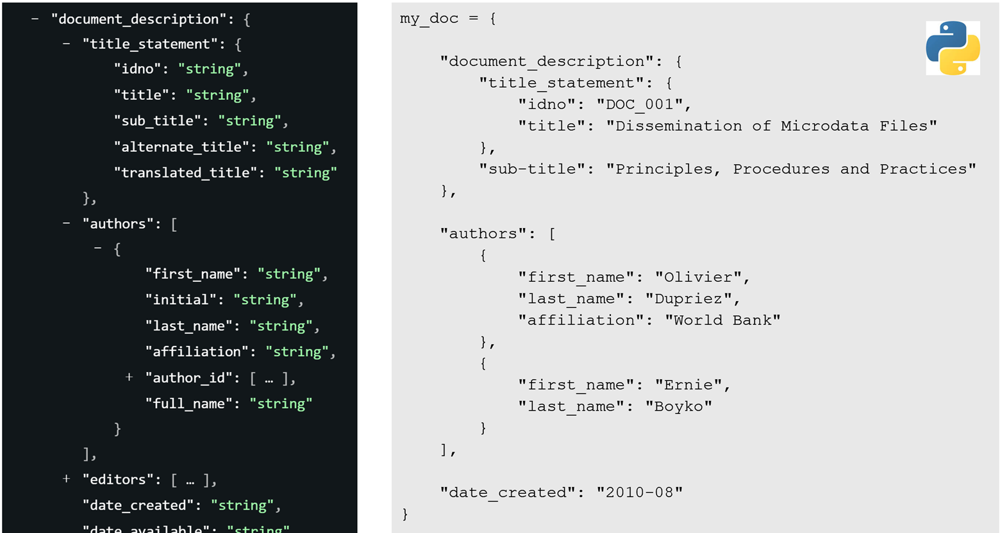
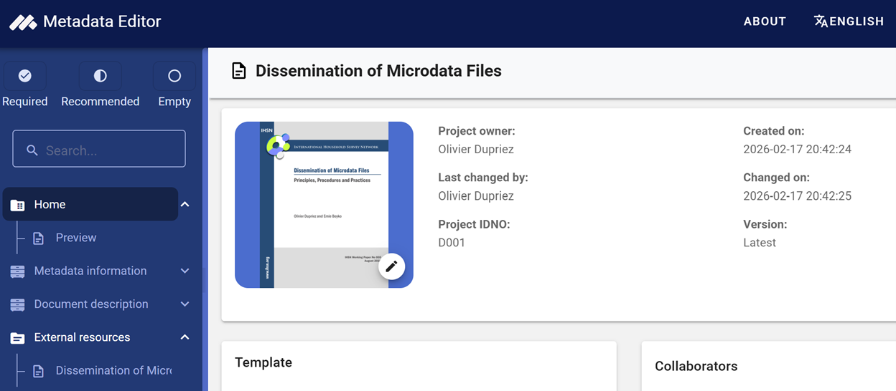
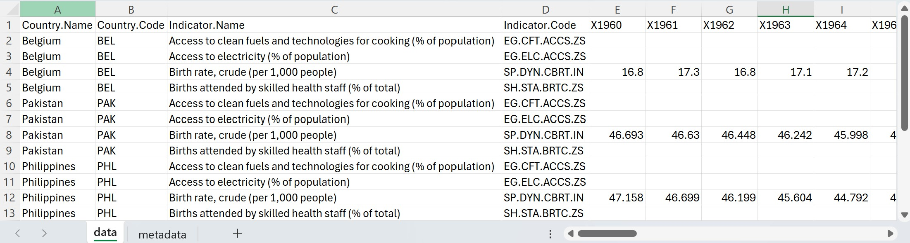
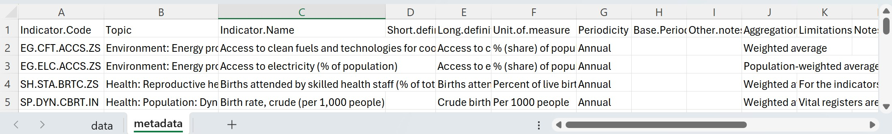

# Introduction to the Metadata Editor API

## Overview

The Metadata Editor provides a user-friendly interface for creating and maintaining standards-compliant metadata. Beyond its visual interface, the application is built on a powerful Application Programming Interface (API) that allows for full programmatic access.

An API is a set of rules and tools that enables other software applications to communicate directly with the Metadata Editor. The Metadata Editor API allows users to interact programmatically with the Metadata Editor. It enables automation of key tasks such as uploading, transforming, validating, and exporting metadata across supported formats. Every action available through the user interface—from creating and updating records to searching and exporting metadata—can also be performed automatically with a script. By using the API, you can manage metadata for indicators, microdata, geographic datasets, and documents programmatically using languages like R or Python.

The Metadata Editor API is a RESTful web service. It adheres to REST principles and supports standard HTTP methods (`GET`, `POST`, `PUT`, `DELETE`) for resource operations. All responses are returned in JSON format, and endpoints are secured using API keys tied to user permissions.

## How the API Works: Endpoints

The API is structured around endpoints, which are unique URLs that a script or application can send requests to. Think of an endpoint as a specific "door" into the application, with each door designed for a particular task.

For example, a script could send a GET request to the /indicators endpoint to retrieve a list of all indicator metadata records. To create a new record, it would send a POST request to that same endpoint.

Common tasks handled by endpoints include:
  - Retrieving a list of all projects in a collection.
  - Getting the complete metadata for a single project.
  - Creating a new metadata record.
  - Updating a specific field within a record.
  - Searching for records that match certain criteria.

The official API documentation serves as a directory, detailing which endpoint to use for each action, what parameters are required, and what format to expect in the response.

## API Documentation

The full documentation of the Metadata Editor API (list and description of all endpoints) is available in annex to this document. Many users will however prefer to make use of the R package or Python library provided to interact with the software (see below).


## Secure and Controlled Access

### Access Control Using API keys

Programmatic access is managed through a robust security model that ensures data integrity and control. Access is governed by roles and permissions. While some endpoints may be public for read-only access (e.g., for a public catalog), most actions—especially creating or editing metadata—require authorization. This is managed through API keys.

To generate an API Key, you must have access to the Metadata Editor. You can then:
   1. **Log in** to the Metadata Editor through the web interface.
   2. Navigate to **User profile** page.
   3. Click on **"Generate API Key"**.
   4. Copy and securely store your key.
   
An API key is a unique, secret token that functions like a password. Each API key is uniquely tied to a registered user account. The key carries the same permissions and roles as the user within the Metadata Editor interface. Any action permitted via the UI is also permitted through the API — and vice versa. 

API keys must be treated with the same level of security as passwords. Some keys grant powerful roles, such as administrator or editor, with the ability to add, modify, or delete content. If an API key is exposed, anyone who finds it can perform actions using your identity and permissions. It is critical to keep API keys confidential and avoid sharing them in any form where others might see, copy, or store them.

  - **Keep your API key secret**. Treat your API key like a password. Do not share it or expose it in public repositories, scripts, or notebooks.
  - **Never hard-code keys directly in scripts or notebooks**. Code is often shared, versioned, and reviewed, and embedding keys creates a high risk of accidental disclosure.
  - **What to do if you believe your API key has been compromised**. For example, it was accidentally committed to a repository, shared in a message, or appeared in a screenshot—immediately revoke the key and issue a new one. Notify your system administrator or security team so usage logs can be reviewed for unauthorized activity. Rapid revocation and replacement are essential to limit the window of exposure and protect the integrity of your metadata.
    
**Recommended Practices for Securely Managing API Keys**

There are multiple ways you can protect your API keys:

  - **Use Environment Variables**: Store your API key in an environment variable (e.g., METADATA_EDITOR_API_KEY) and have your script read it at runtime. Ensure that files containing these variables are not committed to version control (e.g., by adding them to .gitignore).
  - **Use a Secrets Manager**: For enterprise applications, use a dedicated secrets vault like AWS Secrets Manager or Azure Key Vault. Your application can then retrieve the key securely when needed.
  - **Encrypt Configuration Files**: If you must use a configuration file, encrypt it or protect it with OS-level permissions. Never store unencrypted keys in shared locations or repositories.
  - **Leverage OS-level Keychains**: On local machines, use the operating system’s secure credential storage (e.g., macOS Keychain, Windows Credential Manager) and access the key programmatically.
  - **Implement Runtime Prompts**: For interactive scripts, prompt the user to enter the key at runtime instead of embedding it in the code.
  - **Practice Logging Hygiene**: Ensure that your logging configuration does not print request headers or payloads that might contain the API key.
  - **Follow the Principle of Least Privilege**: Issue keys with only the minimum permissions required for the task (e.g., read-only vs. editor). Use separate keys for different workflows and rotate them regularly.

## Advantages of an API-Enabled System

Interacting with the Metadata Editor programmatically unlocks significant opportunities for automation and integration.

  1.	**Automation at Scale**: Manually entering or updating metadata for thousands of datasets is time-consuming and error-prone. With the API, you can write a script to perform these tasks automatically, ensuring consistency and freeing up your team to focus on more analytical work. For instance, you could automate the process of updating the "last modified" date for a large batch of documents.

  2.	**Integration with Other Systems**: The API allows the Metadata Editor to become a central, connected component of your data ecosystem. You can link it to other tools and platforms. For example, when a new dataset is added to a database, a script can automatically call the Metadata Editor's API to create its corresponding metadata record.
  
  3.	**Two-Way Communication**: The API supports both reading and writing information.
     - ***Extracting Information***: Use the API to read, search, and export any metadata stored in the application. This is useful for generating reports, populating a public data catalog, or performing automated quality checks.
     - ***Posting and Editing Information***: Use the API to create new records, update existing ones, or delete them. This enables programmatic maintenance and bulk updates, ensuring your metadata remains current.

## Examples of Use Cases

Here are examples of use cases for the use of the Metadata Editor API:

  1.	**Automated onboarding of new datasets**: When a new dataset is published in a data warehouse, a Python script detects it, creates a standards-compliant metadata record via the API, assigns tags and classifications, links to documentation, and sets review tasks—ensuring every dataset enters the catalog with complete, consistent metadata without manual steps.
  2.	**Batch updates for policy changes**: If a metadata standard changes, an R script using MetadataEditR scans all affected records, updates the field across thousands of entries, logs changes, and triggers validation via endpoints—bringing the catalog into compliance quickly and reliably.
  3.	**Quality assurance and validation pipelines**: Nightly jobs extract all newly edited records via the API, run automated checks for missing fields, inconsistent code lists, or invalid references, and post corrections (or flag issues for human review) back into the system, raising metadata quality continuously.
  4.	**Synchronizing with external catalogs**: A scheduled integration reads public catalog entries from another platform, compares them with local projects, and programmatically creates or updates metadata in the Editor.
  5.	**Versioning and release management**: For indicators updated monthly, a script creates a new metadata version for each release, copies prior fields, updates time coverage and source notes, assigns the release tag, and publishes the project—providing clear version history and reproducibility.
  6.	**Bulk document association**: When a large set of methodological notes or reports is finalized, a workflow attaches the correct PDFs to their corresponding datasets via endpoints, updates citation fields, and adds keywords—saving hours of manual uploading and ensuring documents are discoverable.
  7.	**Role-based editorial workflow**: Using API keys with embedded permissions, a pipeline routes new metadata to an editor role for review, then to an approver role for final publishing, recording actions and comments—formalizing governance and ensuring only authorized users can publish changes.
  8.	**Event-driven notifications and dashboards**: A monitoring service listens for changes in key endpoints (e.g., new microdata added or access level modified) and updates a dashboard, sends email alerts, or posts messages to collaboration tools—keeping stakeholders informed and enabling timely interventions.
  9.	**Data privacy and access controls at scale**: Scripts apply or update access levels across sensitive microdata collections (e.g., switching from “internal” to “restricted” with masked variables), verify compliance with policies, and audit who accessed what via API logs—strengthening data protection.
  10.	**Research reproducibility packs**: A researcher’s workflow uses PyMetadata to pull the exact metadata version referenced in a publication, bundles it with datasets and code, and pushes a curated “replication package” project into the Editor—making studies easier to reproduce and cite with complete provenance.

## R and Python Support

The Metadata Editor API can be used with any language that supports HTTP requests, such as R or Python commands. For example, the following commands will extract, return, and print a list of projects found in your Metadata Editor:

In R:
```r
library(httr)
api_key <- "your_api_key_here"
url <- "https://your-metadata-editor.org/api/projects"
res <- GET(url, add_headers(`X-API-Key` = api_key))
content(res, "parsed")
```

In Python:
```Python
import requests
API_KEY = "your_api_key_here"
headers = {"X-API-Key": API_KEY}
response = requests.get("https://your-metadata-editor.org/api/projects", headers=headers)
print(response.json())
```

To help users leverage the API without needing deep programming expertise, we developed specialized open-source packages for R and Python users. These packages are available on GitHub and provide a more accessible entry point to the API's capabilities.

  - **metadataeditr**: An R package providing high-level functions to connect to the Metadata Editor, retrieve metadata, and integrate it directly into R-based data analysis workflows. See https://github.com/ihsn/metadataeditr 
   - **PyMetadataEditor**: A Python library designed for developers and data engineers that simplifies authentication, API calls, and management of metadata records within Python applications. See https://github.com/mah0001/pymetadataeditor 


## Generating Metadata Programmatically - Principles

### Using R
In R, metadata is generated by constructing a list object comprising nested lists that correspond to the groups of metadata elements defined in the standard. The organization of elements and their associated data types must adhere strictly to the schema specifications set forth in the Bank’s metadata standards. Within the description of standards, curly brackets { } signify that a group of elements must be represented as a list, while square brackets [ ] indicate repeatable elements which are implemented as lists of lists. The Figure below illustrates the mapping between schema notation and the corresponding R list structure.



### Using Python

In Python, metadata is organized as dictionaries, with nested dictionaries and lists reflecting the metadata standard's hierarchy. Non-repeatable elements use dictionaries, while repeatable ones are stored as lists of dictionaries. In the documentation of standards, { } denotes a dictionary and [ ] indicates repeatable items as lists of dictionaries. The Figure below illustrates the mapping between schema notation and the corresponding Python dictionary structure. 




## Code Examples

The examples below show how MetadataEditR (or PyMetadataEditor) are used in combination with base commands and functions from other packages (for R) or libraries (for Python) to automate tasks. 

### Example 1: Generating metadata for a document and publishing it in the Metadata Editor

We assume you have a PDF document (file “Doc01.PDF”) in a folder “C:\MyFolder”. You want to capture its cover page to be used as a thumbnail, generate core metadata for the document, and upload the metadata and the document in the Metadata Editor as a new project with ID = D001. 

Using R:

```r

# ------------------------------------------------------------------------------
# Generate metadata for a PDF document and publish it in the Metadata Editor
# ------------------------------------------------------------------------------

# Load the required package
library(metadataeditr)

# Set the default folder
setwd("C:/MyFolder")

# Set the credentials for accessing the Metadata Editor.
# Enter the URL to your Metadata Editor, and provide your API key.
# Here we assume that the API key is stored in cell (2,1) of a (hidden) CSV file.
# Reminder: Protect your API key! Never enter it directly in a script.
my_keys <- read.csv("C:/WBG/vault/APIkeys.csv", header = F, stringsAsFactors = F)
set_api_key(my_keys[2,1])
set_api_url("https://myurl.org/editor/index.php/api")

# Capture the document cover page and save it as a JPG file
capture_pdf_cover(file_path = "Doc001.PDF", file_name_jpg = "Doc001") 

# Generate the metadata as a list of lists. The structure of the object must 
# comply with https://worldbank.github.io/metadata-schemas/#tag/Document.
# The idno and title are the only required elements; others are optional.
this_doc <- list(
  metadata_information = list(
    producers = list(list(name = "John Doe", affiliation = "IHSN")),
    production_date = format(Sys.Date(), "%Y/%m/%d")
  ),
  document_description = list(
    title_statement = list(
      idno = "D001", 
      title = "Dissemination of Microdata Files",
      subtitle = "Principles, Procedures and Practices"
    ),
    authors = list(
      list(full_name = "Olivier Dupriez"),
      list(full_name = "Ernie Boyko")
    ),
    date_created = "2010-08",
    type = "working-paper",
    languages = list(
      list(name = "English", code = "EN")
    )
  )
)

# Publish the metadata object in the Metadata Editor as a new project
create_project(
  type = "document",
  idno = "D001",
  metadata = this_doc,
  thumbnail = "Doc001.JPG"
)

# Upload the PDF file to the Metadata Editor (attached to project D001)
resources_add(
  idno = "D001",
  dctype = "doc/anl",
  dcformat = "PDF",
  title = "Dissemination of Microdata Files",
  file_path = "Doc001.PDF"
)

```

In Python:
```Python

...

```

Atter running the script, the project will be in your Metadata Editor where you can further edit it.




### Example 2: Editing the title of some projects

We assume that your Metadata Editor contains projects for Demographic and Health Surveys from multiple countries. You noticed that in some cases, the acronym "DHS" was included in the title, and in other cases not. You want to be consistent and add the acronym when not included in the title. To do that, you will extract a list of all projects (ID and title), then conditionally edit the title. 

Using R:

```r

# Load the required package
library(metadataeditr)

# Set the credentials for accessing the Metadata Editor (we assume the API key provides admin privileges).
my_keys <- read.csv("C:/WBG/vault/APIkeys.csv", header = F, stringsAsFactors = F)
set_api_key(my_keys[2,1])
set_api_url("https://myurl.org/editor/index.php/api")

# Get a list of all projects (ID and title)

# Edit the title if needed
for(project in projects) {
if !"(DHS) "%in% title: replace "Demographic and Health Survey with "Demographic and Health Survey (DHS)"
push
}

```

Using Python:

```Python

...

```

### Example 3: Extract time series and related metadata from an Excel file, and publish in the Metadata Editor

You have an Excel file with time series data for multiple indicators in one sheet, and the related metadata in another sheet. You want to extract the data, format it in a suitable format for publishing in the Metadata Editor and NADA, create the descriptive and structural metadata, and publish it in the Metadata Editor (creating one project per indicator).

The data in the Excel file looks like this. It contains one row per series, with years in columns X1960 to X2023.



The metadata is provided in one row per indicator. It is provided in columns named Indicator.Code, Topic, Indicator.Name, Long.definition, Unit.of.measure, Periodicity, Other.notes, Notes.from.original.source, General.comments, Source, Statistical.concept.and.methodology, Development.relevance, Related.source.links, and Other.web.links. These columns will have to be mapped to the corresponding metadata elements in the metadata standard (see https://worldbank.github.io/metadata-schemas/#tag/Timeseries).



Using R:

```r

##### CODE NOT TESTED YET ; PROVIDE A LINK TO THE DATA FILE

# ------------------------------------------------------------------------------
# Extract data and metadata for 4 indicators from an Excel file, and publish 
# as 4 projects in the Metadata Editor. The data are from the World Bank WDI
# database (we selected 3 countries, 4 indicators for this example).
# ------------------------------------------------------------------------------

library(readxl)
library(dplyr)
library(tidyr)
library(collapse)
library(rlist)
library(metadataeditr)

# Set the default directory
setwd("C:/Users/WB147665/OneDrive - WBG/_OD/ANOMALY/WDI")

# Enter API credentials and URLs for Metadata Editor 
set_api_url("https://dev.ihsn.org/tot/editor/index.php/api")
set_api_key(my_keys[31,1])

# Extract the data and metadata from the Excel file
data <- read_xlsx("wdi_4_indicators.xlsx", sheet = "data")
meta <- read_xlsx("wdi_4_indicators.xlsx", sheet = "metadata")

# Replace "." with "_" in column names  
names(data) <- gsub("\\.", "_", names(data))
names(meta) <- gsub("\\.", "_", names(meta))

# Extract a list of all indicators found in the WDI data file
list_indicators <- unique(data$Indicator_Code)

# Reshape the WDI data from wide to long
data <- data %>%
  pivot_longer(cols = starts_with("X"), names_to = "Year",  values_to = "Value") %>%
  mutate(Year = as.integer(sub("X", "", Year))) 

# Loop through indicators; extract metadata and publish in Editor and NADA
# ------------------------------------------------------------------------

for(i in 1:length(list_indicators)) {
  
  print(paste0("Processing indicator ", i, " / ", length(list_indicators)))

  idno <- list_indicators[i]
  
  # Extract the data for the selected indicator
  df_sel <- data[data$Indicator_Code == idno, ] 

  # Extract the time coverage (for the full dataset)
  time_start <- min(df_sel$Year)
  time_end <- max(df_sel$Year)
  
  # Extract indicator's geographic coverage for geo coverage and DSD 
  geo_sel <- unique(df_sel[c("Country_Code", "Country_Name")]) 
  list_geo1 <- unname(Map(function(code, name) list(code = code, name = name), 
                          geo_sel$Country_Code, geo_sel$Country_Name))
  list_geo2 <- lapply(list_geo1, function(el) {names(el) <- c("code", "label"); el})
  
  # Get the row number for the selected indicator in the metadata file 
  iNo <- match(idno, meta$Indicator_Code)
  
  # Extract the notes/comments fromm the metadata file. We also drop empty or NA 
  # elements from the list
  list_notes = list(list(note = meta$Other_notes[iNo]),
                    list(note = meta$Notes_from_original_source[iNo], type = "Notes from original source"),
                    list(note = meta$General_comments[iNo], type = "General comments"))
  list_notes <- Filter(function(x) {
    !is.null(x$note) && !is.na(x$note) && nzchar(trimws(x$note))
  }, list_notes)
  
  # Generate/extract URLs from the metadata file. We then drop empty or NA URLs 
  # from the list
  iurl <- paste0("https://data.worldbank.org/indicator/", idno)
  list_links = list(list(description = "Indicator page in WB Database", uri = iurl),
                    list(description = "Other web links", uri = meta$Other.web.links[iNo]))
  list_links <- Filter(function(x) {
    !is.null(x$uri) && !is.na(x$uri) && nzchar(trimws(x$uri))
  }, list_links)
  
  # We create the data structure definition (we describe all data file columns).
  # This structure will be embedded in the indicator metadata.
  list_str <- list(
    list(
      name = "Country_Name",
      label = "Country name",
      data_type = "string",
      column_type = "attribute"
    ),
    list(
      name = "Country_Code",
      label = "Country code (ISO ALPHA 3)",
      data_type = "string",
      column_type = "geography",
      code_list = list_geo2
    ),
    list(
      name = "Indicator_Name",
      label = "Indicator name",
      data_type = "string",
      column_type = "indicator_name"
    ),
    list(
      name = "Indicator_Code",
      label = "Indicator identifier",
      data_type = "string",
      column_type = "indicator_id"
    ),
    list(
      name = "Year",
      label = "Year",
      data_type = "string",
      column_type = "time_period",
      time_period_format = "YYYY"
    ),
    list(
      name = "Value",
      label = "Value",
      data_type = "float",
      column_type = "observation_value"
    )
  )
  
  # Generate a schema-compliant metadata object for the indicator
  # Most components are extracted from the metadata file. Others were extracted
  # from the data file. Columns in the metadata file are mapped to elements from 
  # the metadata standard. The license is entered manually.
  i_meta <- list(
    metadata_information = list(
      producers = list(list(name = "John Doe")),
      prod_date = Sys.Date()
    ),
    series_description = list(   
      idno = list_indicators[i],
      name = df_doc$Indicator.Name[iNo],
      authoring_entity = list(list(name = "World Bank, Development Data Group")),
      measurement_unit = df_doc$Unit.of.measure[iNo],
      time_periods = list(list(start = time_start, end = time_end)),
      periodicity = df_doc$Periodicity[iNo],
      base_period = df_doc$Base.Period[iNo],
      definition_long = df_doc$Long.definition[iNo],
      methodology = df_doc$Statistical.concept.and.methodology[iNo], 
      aggregation_method = df_doc$Aggregation.method[iNo],
      limitation = df_doc$Limitations.and.exceptions[iNo],
      relevance = df_doc$Development.relevance[iNo],
      ref_country = list_geo1,
      notes = list_notes,
      links = list_links,
      sources = list(list(name = df_doc$Source[iNo])),
      license = list(
        list(name = "Creative Commons Attribution 4.0 International (CC BY 4.0)",
             uri = "https://creativecommons.org/licenses/by/4.0/")),
      series_groups = list(list(name = df_doc$Topic[iNo]))
    ),
    data_structure = list_str,
    data_notes = list_data_notes
  )
  
  # Publish the metadata to the Metadata Editor 
  metadataeditr::add_project(
    idno = idno, 
    type = "indicator", 
    metadata = i_meta, 
    overwrite = TRUE,
    thumbnail = thumbnail
  )
  
}  

```
