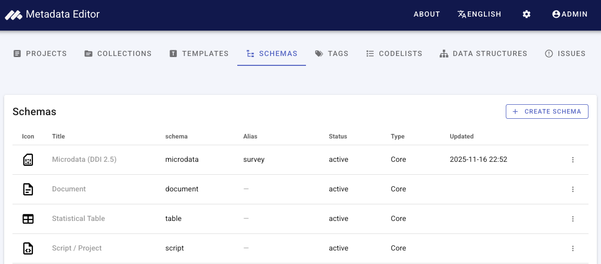
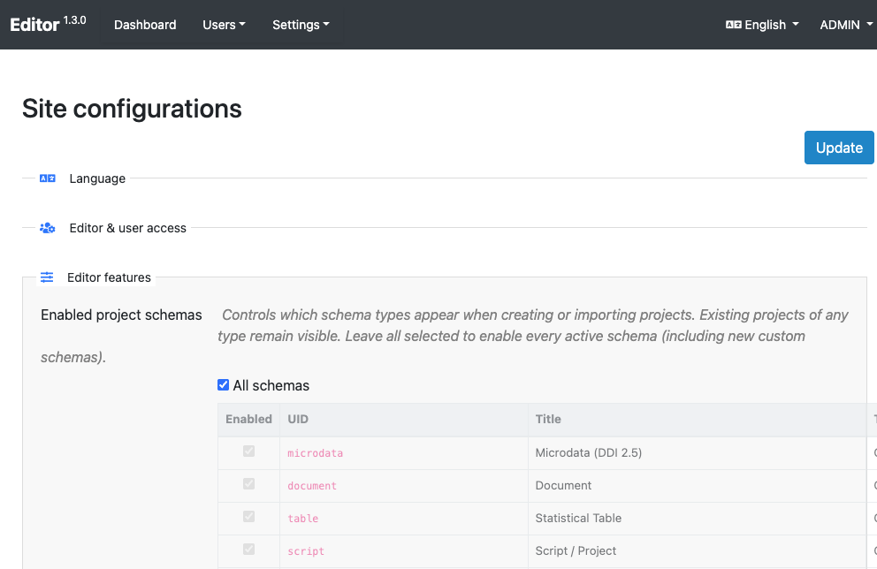

# Custom metadata schemas

The Metadata Editor includes a **schema registry** for **core** and **custom** metadata types. Core types (microdata, indicator, document, and others) ship with fixed JSON Schemas and templates. **Custom schemas** let an organization register its own **JSON Schema**(Draft-07) definitions as new project types.

## In this section

1. **[Managing custom schemas](/managing_custom_schemas.html)** — Open the registry, create and edit schemas, upload schema files, core field mappings, templates, and projects.
2. **[JSON Schema guidelines](/custom_schemas_json_schema_guidelines.html)** — Draft-07 rules, reserved root property names, `$ref` files, and validation behaviour.

## Who can manage schemas

- The **Schemas** tab in the main navigation is visible to users who have the **schema** permission (typically site administrators).
- **Creating**, **updating**, and **deleting** custom schemas requires **administrator** access (same as other site administration tasks).
- **Viewing** the registry and **previewing** a schema specification is available to users with schema view permission.

## Enable custom types for new projects

Which schema types appear when users **create** or **import** projects is controlled under **Site administration → Site configurations → Enabled project schemas**.

- Select **All schemas** to allow every active type, including new custom schemas as soon as they are registered.
- Or clear **All schemas** and check only the types you want exposed in the create-project dialog.

Existing projects keep their type regardless of this setting; only the create/import picker is filtered.

See also [Post-install configuration](/tech_post_install_configuration.html#enabled-project-schemas).

## Storage

Custom schema JSON files are stored on disk under the editor storage area (default: `{storage_path}/user-schemas/{uid}/`).  

## Typical workflow

1. Design a JSON Schema (see [guidelines](/custom_schemas_json_schema_guidelines.html)).
2. **Create schema** in the registry — upload the main file and any `$ref` siblings.
3. **Edit core mappings** — map identifier and title (required) and optional fields to JSON pointers in your schema.
4. Open **Templates** — a **generated** (read-only) template exists for the new type; **duplicate** it if curators need a tailored form.
5. Enable the type under **Enabled project schemas** if you use a restricted list.
6. Users **create projects** of the new type and document metadata like any other data type.
