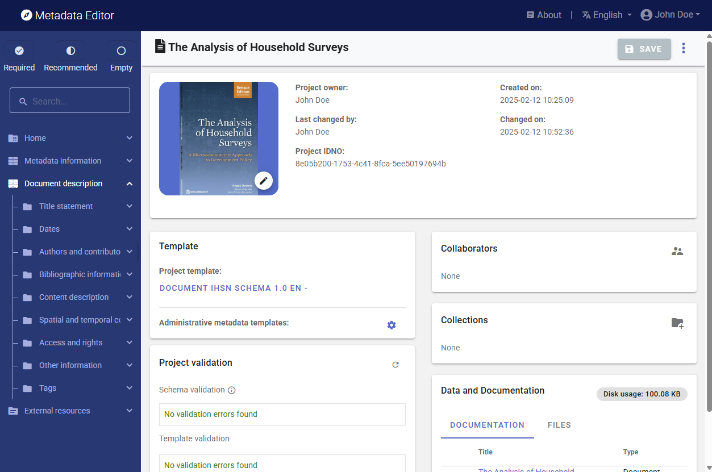

# Documenting a publication or report

> Note: The schema we describe here is the schema used to document publications and reports to be catalogued, not the schema used to documents resources that may be attached as external resources to data of any type, for which the *External resource* metadata schema is used (see ***Documenting Data: General instructions***).

Librarians have developed various standards to describe and catalog documents. The [MARC21](https://www.loc.gov/marc/bibliographic/) (**MA**chine-**R**eadable **C**ataloging) standard used by the United States Library of Congress is one of them. It provides a detailed structure for documenting bibliographic resources, and is the recommended standard for well-resourced document libraries.

For the purpose of cataloguing documents in a less-specialized data repository, we propose a simplerschema, based on the **Dublin Core Metadata Element Set**. The Dublin Core standard, developed by the [Dublin Core Metadata Initiative](https://dublincore.org/), consists of a list of fifteen core metadata elements to which more specialized elements can be added. These fifteen elements are the following (with their definition extracted from the Dublin Core [website](https://dublincore.org/):

|No | Element name         | Description                                                     | 
|-- | -------------------- | --------------------------------------------------------------- | 
|1  | `contributor`        | An entity responsible for making contributions to the resource. |
|2  | `coverage`           | The spatial or temporal topic of the resource, the spatial applicability of the resource, or the jurisdiction under which the resource is relevant. |
|3  | `creator`            | An entity primarily responsible for making the resource.         |
|4  | `date`               | A point or period of time associated with an event in the life cycle of the resource. |
|5  | `description`        | An account of the resource. |
|6  | `format`             | The file format, physical medium, or dimensions of the resource. |
|7  | `identifier`         | An unambiguous reference to the resource within a given context. |
|8  | `language`           | A language of the resource.                                      |
|9  | `publisher`          | An entity responsible for making the resource available.         |
|10 | `relation`           | A related resource.                                              |
|11 | `rights`             | Information about rights held in and over the resource.          |
|12 | `source`             | A related resource from which the described resource is derived. |
|13 | `subject`            | The topic of the resource.                                       |
|14 | `title`              | A name given to the resource.                                    |
|15 | `type`               | The nature or genre of the resource.                             |

Due to its simplicity and versatility, the Dublin Core is widely used for multiple purposes. It can be used to document not only documents but also resources of other types like images or others. Documents that can be described using the MARC21 standard can be described using the Dublin Core, although not with the same granularity of information. The US Library of Congress provides a [mapping between the MARC and the Dublin Core](https://www.loc.gov/marc/marc2dc.html) metadata elements. 

Another schema, [BibTex](https://en.wikipedia.org/wiki/BibTeX), has been developed for the specific purpose of recording bibliographic citations. BibTex is a list of fields that may be used to generate bibliographic citations compliant with different bibliography styles.  

The metadata schema implemented in the Metadata Editor to document publications and reports is a combination of Dublin Core, MARC21, and BibTex elements. The technical documentation of the schema and its API is available at https://ihsn.github.io/nada-api-redoc/catalog-admin/#tag/Documents.

## Documenting the publication or report

See the **Quick start: Document** chapter for a quick introduction to the documentation of a publication or report. 

### Create a new project

The first step in documenting a publication or report is to create a new project. You do that by clicking on `CREATE NEW PROJECT` in the *My projects* page. Select *Document* as data type. This will open a new, untitled *Project Home* page. 

In that page, edit the thumbnail (optional, not required). It is recommended to use a screenshot of the document's cover page as thumbnail.

Then, in the *Template* frame of the project *Home* page, select the project template you want to use to document the publication or report. A default template is proposed; no action is needed if you want to use the default template. Otherwise, switch to another template by clicking on the template name in the **Templates** frame. Note that you can at any time change the template used for the documentation of a project. The selected template will determine what you see in the navigation tree and in the metadata entry pages, but switching from one template to another will not impact the metadata that has already been entered; no information will be deleted from the metadata.

### Enter metadata

The metadata schema comprises two main blocks of elements, **`metadata_information`** and **`document_description`**. It also contains a few sets of elements common to all data types (*Tags*, *DataCite*, *Provenance*, *External resources*, and *Administrative metadata*).  

#### Metadata information

The **`metadata_information`** section contains information not related to the document itself but to its metadata. In other words, it contains metadata on the metadata. This information is optional but we recommend to enter content at least in the `name` and `date` sub-elements, which indicate who generated the metadata and when. This information is not useful to end-users of document catalogs, but is useful to catalog administrators for two reasons:

  - metadata compliant with standards are intended to be shared and used by inter-operable applications. Data catalogs offer opportunities to harvest (pull) information from other catalogs, or to publish (push) metadata in other catalogs. Metadata information helps to keep track of the provenance of metadata.
  
  - metadata for a same document may have been generated by more than one person or organization, or one version of the metadata can be updated and replaced with a new version. The `metadata information` helps catalog administrators distinguish and manage different versions of the metadata.

#### Document description

The **`Document description`** block contains the metadata elements used to describe the document. We provide below instructions or recommendations for some of the metadata elements of the metadata schema. 

In the list of metadata elements below, the *key* of each element in the metadata standard is provided between brackets next to the corresponding element's label in the template.

**TITLE STATEMENT**

- **`Primary ID`** (*idno* ; a required element): A unique identifier of the document, which serves as the "primary ID". `idno` is a unique identification number used to identify the database. A unique identifier is required for cataloguing purpose, so this element is declared as "Required". The identifier will allow users to cite the indicator/series properly. The identifier must be unique within the catalog. Ideally, it should also be globally unique; the recommended option is to obtain a Digital Object Identifier (DOI) for the study. Alternatively, the `idno` can be constructed by an organization using a consistent scheme. Note that the schema allows you to provide more than one identifier for a same study (in element `identifiers`); a catalog-specific identifier is thus not incompatible with a globally unique identifier like a DOI. The `idno` should not contain blank spaces.

- **`Other identifiers`** (*identifiers*) This element is used to enter document identifiers (IDs) other than the catalog ID entered in the `Title statement` (*idno*). It can for example be a Digital Object Identifier (DOI), an International Standard Book Number (ISBN), or an International Standard Serial Number (ISSN). The ID entered in the `title_statement` can be repeated here (the `Title statement` does not provide a `type` parameter; if a DOI, ISBN, ISSN, or other standard reference ID is used as `idno`, it is recommended to repeat it here with the identification of its `type`). The information on an identifier includes two components: the `type` of identifier (for example "DOI", "ISBN", or "ISSN"), and the `identifier` itself.   

- **`Title`** (*title*; a required element): The title of the book, report, paper, or other document. Pay attention to the use of capitalization in the title, to ensure consistency across documents listed in your catalog. Pay attention to the consistent use of capitalization in the title. It is recommended to use sentence capitalization.  

- **`Subtitle`** (*sub_title*) The document subtitle can be used when there is a need to distinguish characteristics of a document. Pay attention to the consistent use of capitalization in the subtitle. 

- **`Alternate title`** (*alternate_title*) An alternate version of the title, possibly an abbreviated version. For example, the World Bank’s World Development Report is often referred to as the WDR; the alternate title for the “World Development Report 2021” could then be “WDR 2021”. 

- **`Translated title`** (*translated_title*) A translation of the title of the document. Special characters should be properly displayed, such as accents and other stress marks or different alphabets. 

**DATES**

- **`Date created`** (*date_created*) The date, preferably entered in ISO 8601 format (YYYY-MM-DD or YYYY-MM or YYYY), when the document was produced. This can be different from the date the document was published, made available, and from the temporal coverage. 

- **`Date available`** (*date_available*) The date, preferably entered in ISO 8601 format (YYYY-MM-DD or YYYY-MM or YYYY), when the document was made available. This is different from the date it was published (see element `date_published` below).

- **`Date modified`** (*date_modified*) The date, preferably entered in ISO 8601 format (YYYY-MM-DD or YYYY-MM or YYYY), when the document was last modified. 

- **`Date published`** (*date_published*) The date, preferably entered in ISO 8601 format (YYYY-MM-DD or YYYY-MM or YYYY), when the document was published.

**AUTHORS AND CONTRIBUTORS**)

- **`Authors`** (*authors*) The authors should be listed in the same order as they appear in the source itself, which is not necessarily alphabetical. The information on authors include each author's `first_name`, `initials`, `last_name`, `affiliation`, and `author_id`. The author ID is an identifier in a registry of academic researchers such as the [Open Researcher and Contributor ID (ORCID)](https://orcid.org/). This is a repeatable element, as a person may have multiple IDs. When entered in the Metadata Editor, this information should therefore include the `type` of identifier (for example "ORCID") and the identifier itself (`id`). An option is also provided to enter the author's `full_name`. This element should only be used when the first and last name of an author cannot be distinguished, i.e. when elements `first_name` and `last_name` cannot be filled out. This element can also be used when the author of a document is an entity, not a person.

- **`Editors`** (*editors*) If the source is a text within an edited volume, it should be listed under the name of the author of the text used, not under the name of the editor. The name of the editor should however be provided in the bibliographic citation, in accordance with a [reference style](https://awelu.srv.lu.se/sources-and-referencing/using-a-reference-style/elements-of-the-reference-list/). The information on an editor includes the editor's `first_name`, `initial`, `last_name`, and `affiliation`.  

- **`Translators`** (*translators*) Information on translators, for publications that are translations of publication originally created in another language.
  - **`First name`** (*first_name*) The first name of the translator.
  - **`Initial`** (*initial*) The initials of the translator.
  - **`Last name`** (*last_name*) The last name of the translator.
  - **`Affiliation`** (*affiliation*) The affiliation of the translator.  

- **`Other contributors`** (*contributors*) These elements are used to acknowledge contributions to the production of the document, other than the ones for which specific metadata elements are provided (like `autors` or `translators`).
  - **`First name`** (*first_name*) The first name of the contributor.
  - **`Initial`** (*initial*) The initials of the contributor.
  - **`Last name`** (*last_name*) The last name of the contributor. If the contributor is an organization, enter the name of the organization here.
  - **`Affiliation`** (*affiliation*) The affiliation of the contributor. 
  - **`Contribution`** (*contribution*) A brief description of the specific contribution of the person to the document, e.g. "Design of the cover page", or "Proofreading".  

**BIBLIOGRAPHIC INFORMATION**

- **`Bibliographic citation`** (*bibliographic_citation*) The bibliographic citation provides relevant information about the author and the publication. When using the element `bibliographic_citation`, the citation is provided as a single item. It should be provided in a standard style: Modern Language Association ([MLA](https://www.mla.org/)), American Psychological Association ([APA](https://apastyle.apa.org/)), or [Chicago](https://owl.purdue.edu/owl/research_and_citation/chicago_manual_17th_edition/cmos_formatting_and_style_guide/chicago_manual_of_style_17th_edition.html). Note that the schema provides an itemized list of all elements (BibTex fields) required to build a citation in a format of their choice. 
  - **`Style`** (*style*) The citation style, e.g. "MLA", "APA", or "Chicago".
  - **`Citation`** (*citation*) The citation in the style mentioned in `style`.   

  The elements that are required to form a complete bibliographic citation depend on the type of document. The table below, adapted from the [BibTex templates](https://www.bibtex.com/format/), provides a list of required and optional fields by type of document:

   | Document type                      | Required fields                   | Optional fields                      |
   |------------------------------------|-----------------------------------|--------------------------------------|
   | Article from a journal or magazine | author, title, journal, year  | volume, number, pages, month, note, key  |
   | Book with an explicit publisher    | author or editor, title, publisher, year | volume, series, address, edition, month, note, key  |
   | Printed and bound document without a named publisher or sponsoring institution | title  | author, howpublished, address, month, year, note, key  |
   | Part of a book (chapter and/or range of pages) | author or editor, title, chapter and/or pages, publisher, year | volume, series, address, edition, month, note, key  |
   | Part of a book with its own title | author, title, book title, publisher, year | editor, pages, organization, publisher, address, month, note, key  |
   | Article in a conference proceedings | author, title, book title, year | editor, pages, organization, publisher, address, month, note, key  |
   | Technical documentation | title | author, organization, address, edition, month, year, key  |
   | Master's thesis | author, title, school, year | address, month, note, key  |
   | Ph.D. thesis | author, title, school, year | address, month, note, key  |
   | Proceedings of a conference | title, year | editor, publisher, organization, address, month, note, key  |
   | Report published by a school or other institution, usually numbered within a series | author, title, institution, year | type, number, address, month, note, key |  
   | Document with an author and title, but not  formally published | author, title, note | month, year, key |

- **`Book title`** (*booktitle*) Title of a book, part of which is being cited. If you are documenting the book itself, this element will not be used; it is only used when <u>part of a book</u> is being documented.

- **`Chapter`** (*chapter*) A chapter (or section) number. This element is only used to document a resource which has been extracted from a book.   

- **`Edition`** (*edition*) The edition of a book - for example "Second". When a book has no edition number/name present, it can be assumed to be a first edition. If the edition is other than the first, information on the edition of the book being documented must be mentioned in the citation. The edition can be identified by a number, a label (such as “Revised edition” or “Abridged edition”), and/or a year. The first letter of the label should be capitalized.

- **`Institution`** (*institution*) The sponsoring institution of a technical report. For citations of Master's and Ph.D. thesis, this will be the name of the school.

- **`Journal`** (*journal*) A journal name. Abbreviations are provided for many journals.

- **`Volume`** (*volume*) The volume of a journal or multi-volume book. Periodical publications, such as scholarly journals, are published on a regular basis in installments that are called issues. A volume usually consists of the issues published during one year.

- **`Number`** (*number*) The number of a journal, magazine, technical report, or of a work in a series. An issue of a journal or magazine is usually identified by its `volume` (see previous element) and `number`; the organization that issues a technical report usually gives it a number; and sometimes books are given numbers in a named series.

- **`Pages`** (*pages*) One or more page numbers or range of numbers, such as 42-111 or 7,41,73-97 or 43+ (the `+' indicates pages following that don't form a simple range).

- **`Publisher`** (*publisher*) The entity responsible for making the resource available. For major publishing houses, the information can be omitted. For small publishers, providing the complete address is recommended. If the company is a university press, the abbreviation UP (for University Press) can be used. The publisher is not stated for journal articles, working papers, and similar types of documents.

- **`Publisher address`** (publisher_address**) The address of the publisher. For major publishing houses, just the city is given. For small publishers, the complete address can be provided.

- **`Series`** (*series*) The name of a series or set of books. When citing an entire book, the title field gives its title and an optional series field gives the name of a series or multi-volume set in which the book is published.

- **`Cross reference`** (*crossref*) The catalog identifier ("database key") of another catalog entry being cross referenced. This element may be used when multiple entries refer to a same publication, to avoid duplication. 

- **`Key`** (*key*) A key is a field used for alphabetizing, cross referencing, and creating a label when the `author' information is missing. 

- **`Organization`** (*organization*) The organization that sponsors a conference or that publishes a manual.

- **`Annotation`** (*annote*) An annotation. This element will not be used by standard bibliography styles like the MLA, APA or Chicago, but may be used by others that produce an annotated bibliography.
  
- **`How published`** (*howpublished*) The `howpublished` element is used to store the notice for unusual publications. The first word should be capitalized. For example, "WebPage", or "Distributed at the local tourist office". 

- **`URL`** (*url*) The URL of the document, preferably a permanent URL.

**CONTENT DESCRIPTION**

- **`Document type`** (*type*) This describes the nature of the resource. It is highly recommended to select a value from a controlled vocabulary. The vocabulary can be entered in the metadata template (see section *Designing templates*), and could for example include the following options:
  - article
  - book
  - booklet
  - collection
  - conference proceedings
  - manual
  - master thesis
  - patent
  - PhD thesis
  - proceedings
  - technical report
  - working paper
  - website
  - other
  
  Specialized agencies may want to create more specific controlled vocabularies. For example, a national statistical agency may use options like:
  - Statistical Yearbooks
  - Survey and Census Reports 
  - Analytical and Thematic Reports 
  - Statistical Bulletins 
  - News Releases
  - Methodological and Technical Reports
  - Metadata and Documentation Reports
  - Annual Reports
  - Administrative Documents
  - Legal Documents
  - Tenders
  
  The `type` element can be used to create a "Document type" facet (filter) in a data catalog. If the controlled vocabulary is such that it contains values that are not mutually exclusive (i.e. if a document could possibly have more than one type), the element `type` cannot be used as it is not repeatable. In such case, the solution is to provide the type of document as `tags`, in a `tag_group` that could for example be named *type* or *document_type*. Note also that the Dublin Core provides a controlled vocabulary (the [DCMI Type Vocabulary](https://www.dublincore.org/specifications/dublin-core/dcmi-terms/#section-7)) for the `type` element, but this vocabulary is related to the types of resources (dataset, event, image, software, sound, etc.), not the type of document which is what we are interested in here. 

- **`publication_frequency`** (**) Some documents are published regularly. The frequency of publications can be documented using this element. It is recommended to use a controlled vocabulary, for example the [PRISM Publishing Frequency Vocabulary](http://prismstandard.org/vocabularies/3.0/pubfrequency.xml) which identifies standard publishing frequencies for a serial or periodical publication.

   | Frequency    | Description                       |
   |--------------|-----------------------------------|
   | annually     | Published once a year             |
   | semiannually | Published twice a year            |
   | quarterly    | Published every 3 months, or once a quarter|
   | bimonthly    | Published twice a month           |
   | monthly      | Published once a month            |
   | biweekly     | Published twice a week            |
   | weekly       | Published once a week             |
   | daily        | Published every day               |
   | continually  | Published continually as new content is added; typical of websites and blogs, typically several times a day|
   | irregularly  | Published on an irregular schedule, such as every month except July and August|
   | other        | Published on another schedule not enumerated in this controlled vocabulary |

- **`Language`** (*languages*) The language(s) in which the document is written. For the language codes and names, the use of the ISO 639-2 standard is recommended. This is a block of two elements (at least one must be provided for each language): `name` (the name of the language), and `code`. The use of [ISO 639-2](https://www.loc.gov/standards/iso639-2/php/code_list.php) (the alpha-3 code in Codes for the representation of names of languages) is recommended. Numeric codes must be entered as strings.

- **`Description`** (*description*) This element is used to provide a brief description of the document (not an abstract, which would be provided in the field `abstract`). It should not be used to provide content that is contained in other, more specific elements. As stated in the [Dublin Core Usage Guide](https://www.dublincore.org/specifications/dublin-core/usageguide/elements/), "Since the `description` field is a potentially rich source of indexable terms, care should be taken to provide this element when possible. Best practice recommendation for this element is to use full sentences, as description is often used to present information to users to assist in their selection of appropriate resources from a set of search results."  

- **`Abstract`** (*abstract*) The abstract is a summary of the document, usually about one or two paragraph(s) long (around 150 to 300 words).

- **`Scope`** (*scope*) A textual description of the topics covered in the document, which complements (but does not duplicate) the elements `description` and `topics` available in the schema.
 
- **`Keywords`** (*keywords*) A list of keywords that provide information on the core content of the document. Keywords provide a convenient solution to improve the discoverability of the document, as it allows terms and phrases not found in the document itself to be indexed and to make a document discoverable by text-based search engines. A controlled vocabulary can be used (although not required), such as the [UNESCO Thesaurus](http://vocabularies.unesco.org/browser/thesaurus/en/). The list provided here can combine keywords from multiple controlled vocabularies and user-defined keywords.  
  - **`Keyword`** (*name*) The keyword itself.
  - **`Vocabulary`** (*vocabulary*) The controlled vocabulary (including version number or date) from which the keyword is extracted, if any.
  - **`URL`** (*uri*) The URL of the controlled vocabulary from which the keyword is extracted, if any.

- **`Topics`** (*topics*) Information on the topics covered in the document. A controlled vocabulary will preferably be used, for example the [CESSDA Topics classification](https://vocabularies.cessda.eu/vocabulary/TopicClassification), a typology of topics available in 11 languages; or the [Journal of Economic Literature (JEL) Classification System](https://en.wikipedia.org/wiki/JEL_classification_codes), or the [World Bank topics classification](https://documents.worldbank.org/en/publication/documents-reports/docadvancesearch). The list provided here can combine topics from multiple controlled vocabularies and user-defined topics. The element is a block of five fields: 
  - **`ID`** (*id*) The identifier of the topic, taken from a controlled vocabulary.
  - **`Topic`** (*name*) The name (label) of the topic, preferably taken from a controlled vocabulary.
  - **`Parent ID`** (*parent_id*) The parent identifier of the topic (identifier of the item one level up in the hierarchy), if a hierarchical controlled vocabulary is used.
  - **`Vocabulary`** (*vocabulary*) The name (including version number) of the controlled vocabulary used, if any.
  - **`URL`** (*uri*) The URL to the controlled vocabulary used, if any.
 
- **`Themes`** (*themes*) A list of themes covered by the document. A controlled vocabulary will preferably be used. The list provided here can combine themes from multiple controlled vocabularies and user-defined themes. Note that `themes` will rarely be used as the elements `topics` and `disciplines` are more appropriate for most uses. This is a block of five fields:
  - **`ID`** (*id*) The ID of the theme, taken from a controlled vocabulary.
  - **`Theme`** (*name*) The name (label) of the theme, preferably taken from a controlled vocabulary.
  - **`Parent ID`** (*parent_id*) The parent ID of the theme (ID of the item one level up in the hierarchy), if a hierarchical controlled vocabulary is used.
  - **`Vocabulary`** (*vocabulary*) The name (including version number) of the controlled vocabulary used, if any.
  - **`URL`** (*uri*) The URL to the controlled vocabulary used, if any.  

- **`Disciplines`** (*disciplines*) Information on the academic disciplines related to the content of the document. A controlled vocabulary will preferably be used, for example the one provided by the list of academic fields in [Wikipedia](https://en.wikipedia.org/wiki/List_of_academic_fields). The list provided here can combine disciplines from multiple controlled vocabularies and user-defined disciplines. This is a block of five elements: 
  - **`ID`** (*id*) The identifier of the discipline, taken from a controlled vocabulary.
  - **`Discipline`** (*name*) The name (label) of the discipline, preferably taken from a controlled vocabulary.
  - **`Parent ID`** (*parent_id*) The parent identifier of the discipline (identifier of the item one level up in the hierarchy), if a hierarchical controlled vocabulary is used.
  - **`vocabulary`** (*vocabulary*) The name (including version number) of the controlled vocabulary used, if any.
  - **`URL`** (*uri*) The URL to the controlled vocabulary used, if any.  

- **`Table of contents`** (*toc*) The table of content of the document, provided as a single string element, i.e. with no structure (an structured alternative is provided with the field `toc_structured` described below). This element is also a rich source of indexable terms which can contribute to document discoverability; care should thus be taken to use it (or the `toc_structured` alternative) whenever possible.

- **`Table of contents (structured)`** (*toc_structured*) This element is used as an alternative to `toc` to provide a structured table of content. The element contains a repeatable block of sub-elements which provides the possibility to define a hierarchical structure:
  - **`ID`** (*id*) A unique identifier for the element of the table of content. For example, the `id` for Chapter 1 could be "1" while the `id` for section 1 of chapter 1 would be "11".
  - **`Parent ID`** (*parent_id*) The `id` of the parent section (e.g., if the table of content is divided into chapters, themselves divided into sections, the `parent_id` of a section would be the id of the chapter it belongs to.)
  - **`Name`** (*name*) The label of this section of the table of content (e.g., the chapter or section title)

**SPATIAL AND TEMPORAL COVERAGE** 

- **`Countries`** (*ref_country*) The list of countries (or regions) covered by the document, if applicable. This is a repeatable block of two elements:
  - **`Name`** (*name*) The country/region name. Note that many organizations have their own policies on the naming of countries/regions/economies/territories, which data curators will have to comply with.
  - **`Code`** (*code*) The country/region code. It is recommended to use a standard list of countries codes, such as the [ISO 3166] (https://en.wikipedia.org/wiki/List_of_ISO_3166_country_codes).

    Considering the importance of the geographic coverage of a document as a filter, the `ref_country` element deserves particular attention. Consistency in the use of country codes and country names is essential in a data catalog. The field `ref_country` will often be used as a filter (facet) in data catalogs. Therefore, make sure that you do not refer to a same country using different names (for example, the Democratic Republic of Congo should not be named "Congo, D.R." in some instances and "Congo, Dem.Rep." or "Democratic Republic of congo" in other instances). When a document is related to only part of a country, we still want to capture this information in the metadata. For example, the `ref_country` element for the document ["Sewerage and sanitation : Jakarta and Manila"](https://documents.worldbank.org/en/publication/documents-reports/documentdetail/880091468095971513/sewerage-and-sanitation-jakarta-and-manila) will list "Indonesia" (code IDN) and "Philippines" (code PHL). 

  The document title will often but not always provide the necessary information. Using R, Python or other programming languages, a list of all countries mentioned in a document can be automatically extracted, with their frequencies. This approach (which requires a lookup file containing a list of all countries in the world with their different denominations and spelling) can be used to extract the information needed to populate the `ref_country` element (not all countries in the list will have to be included; some threshold can be set to only include countries that are "significantly" mentioned in a document). Tools like the R package [countrycode](https://cran.r-project.org/web/packages/countrycode/index.html) are available to facilitate this process.

  When a document is related to a region (not to specific countries), or when it is related to a topic but not a specific geographic area, the `ref_country` might still be applicable. Try and extract (possibly using a script that parses the document) information on the countries mentioned in the document. For example, `ref_country` for the World Bank document ["The investment climate in South Asia"](http://documents1.worldbank.org/curated/en/242391468114239381/pdf/715140v10ESW0P0Climate0I0OCR0Needed.pdf) should include Afghanistan (mentioned 81 times in the document), Bangladesh (113), Bhutan (94), India (148), Maldives (62), Nepal (64), Pakistan (103), and Sri Lanka (98), but also China (not a South-Asian country, but mentioned 63 times in the document).

  If a document is not specific to any country, the element `ref_country` would be ignored (not included in the metadata) if the content of the document is not related to any geographic area (for example, the user's guide of a software application), or would contain "World" (code WLD) if the document is related but not specific to countries (for example, a document on "Climate change mitigation").

- **`Geographic areas`** (*geographic_units*) A list of geographic units covered in the document, other than the countries listed in `ref_country`. The geographic units will be identified by their `name`, `code`, and `type` (for example, "province", "state", "district", or "town"). 

- **`Bounding box`** (*bbox*) This element is used to define one or multiple geographic bounding box(es), which are the rectangular fundamental geometric description of the geographic coverage of the data. A bounding box is defined by west and east longitudes and north and south latitudes, and includes the largest geographic extent of the dataset’s geographic coverage. The bounding box provides the geographic coordinates of the top left (north/west) and bottom-right (south/east) corners of a rectangular area. This element can be used in catalogs as the first pass of a coordinate-based search. The valid range of latitude in degrees is -90 and +90 for the southern and northern hemisphere, respectively. Longitude is in the range -180 and +180 specifying coordinates west and east of the Prime Meridian, respectively. This element will rarely be used for documenting publications. Bounding boxes are an optional element, but when a bounding box is defined, all four coordinates are required. 

- **`Spatial coverage`** (*spatial_coverage*) This element provides another space for capturing information on the spatial coverage of a document, which complements the `ref_country`, `geographic_units`, and `bbox` elements. It can be used to qualify the geographic coverage of the document, in the form of a free text. For example, a report on refugee camps in the Cox's Bazar district of Bangladesh would have Bangladesh as reference country, "Cox's Bazar" as a geographic unit, and "Rohingya's refugee camps" as spatial coverage. 

- **`Temporal coverage`** (*temporal_coverage*) Not all documents have a specific time coverage. When they do, it can be specified in this element.

  
**ACCESS AND RIGHTS**

- **`Status`** (*status*) The status of the document. The status of the document should (but does not have to) be provided using a controlled vocabulary, for example with the following options:
  - first draft
  - draft
  - reviewed draft
  - final draft
  - final
 Most documents published in a catalog will likely be "final".

- **`Rights`** (*rights*) A statement on the rights associated with the document (others than the copyright, which should be described in the element `copyright` described below). 

- **`Copyright`** (*copyright*) A statement and identifier indicating the legal ownership and rights regarding use and re-use of all or part of the resource. If the document is protected by a copyright, enter the information on the person or organization who owns the rights.

- **`License`** (*license*) Information on the license(s) attached to the document, which defines the terms of use. A license is identified by its `name` (for example, CC BY 4.0 International) and `uri` (the URL of the license, where detailed information on the license can be obtained).
 
- **`Usage_terms`** (*usage_terms*) This element is used to provide a description of the legal terms or other conditions that a person or organization who wants to use or reproduce the document has to comply with. 

- **`Disclaimer`** (*disclaimer*) A disclaimer limits the liability of the author(s) and/or publisher(s) of the document. A standard legal statement should be used for all documents from a same agency. 

- **`Security classification`** (*security_classification*) Information on the security classification attached to the document. The different levels of classification indicate the degree of sensitivity of the content of the document. This field should make use of a controlled vocabulary, specific or adopted by the organization that curates or disseminates the document. Such a vocabulary could contain the following levels: `public, internal only, confidential, restricted, strictly confidential` 

- **`Access restrictions`** (*access_restrictions*) A textual description of access restrictions that apply to the document.

- **`Pricing`** (*pricing*) The current price of the document in any defined currency. As this information is subject to regular change, it will often not be included in the document metadata.

**OTHER INFORMATION**

- **`contacts`** (*contacts*) Contact information for a person or organization that can be contacted for inquiries related to the document.
  - **`name`** (*name*) The name of the contact. This can be a person or an organization..
  - **`role`** (*role*) The specific role of the person or organization mentioned in `contact`.
  - **`affiliation`** (*affiliation*) The affiliation of the contact person. 
  - **`email`** (*email*) The email address of the contact person or organization. Personal emails should be avoided.  
  - **`telephone`** (*telephone*) The telephone number for the contact person or organization. Personal phone numbers should be avoided.  
  - **`uri`** (*uri*) A link to an on-line resource related to the contact person or organization.  

- **`Sources`** (*sources*) This element is used to describe the sources of different types (except data sources, which must be listed in the element "Data sources") that were used in the production of the document.
  - **`source_origin`** (*source_origin*) For historical materials, information about the origin(s) of the sources and the rules followed in establishing the sources should be specified.
  - **`source_char`** (*source_char*) Characteristics of the source. Assessment of characteristics and quality of source material.
  - **`source_doc`** (*source_doc*) Documentation and access to the source.
    
- **`Data sources`** (*data_sources*) Used to list the machine-readable data file(s) -if any- that served as the source(s) of data.
  - **`name`** (*name*) Name (title) of the dataset used as source. For example: "Bangladesh Demographic and Health Survey 2017-18"
  - **`uri`** (*uri*) Link (URL) to the dataset or to a web page describing the dataset. For example: "https://www.dhsprogram.com/methodology/survey/survey-display-536.cfm"
  - **`note`** (*note*) Additional information on the data source. For example: "Household survey conducted by the National Institute of Population Research and Training, Medical Education and Family Welfare Division and Ministry of Health and Family Welfare. Data and documentation available at https://dhsprogram.com/)"

- **`Reproducibility statement`** (*reproducibility.statement*) The "Reproducibility statement" is a general statement on reproducibility and replicability of the analysis (including data processing, tabulation, production of visualizations, modeling, etc.) being presented in the document.

- **`Reproducibility links`** (*reproducibility.links*) The "Reproducibility links" provides links to web pages where reproducible materials and the related information can be found.

- **`Audience`** (*audience*) Information on the intended audience for the document, i.e. the category or categories of users for whom the resource is intended in terms of their interest, skills, status, or other.

- **`Mandate`** (*mandate*) The legislative or other mandate under which the resource was produced.

- **`Related resources`** (*relations*) References to related resources with a specification of the type of relationship.
  - **`name`** (*name*) The related resource. Recommended practice is to identify the related resource by means of a URL. If this is not possible or feasible, a string conforming to a formal identification system may be provided.
  - **`type`** (*type*) The type of relationship. The use of a controlled vocabulary is recommended. The Dublin Core proposes the following vocabulary: {`isPartOf`, `hasPart`, `isVersionOf`, `isFormatOf`, `hasFormat`, `references`, `isReferencedBy`, `isBasedOn`, `isBasisFor`, `replaces`, `isReplacedBy`, `requires`, `isRequiredBy`}. 

- **`Notes`** (*notes*) This field can be used to provide information on the document that does not belong to the other, more specific metadata elements provided in the schema.

#### DataCite

See section **Documenting - General instructions**.

#### Tags

See section **Documenting - General instructions**.

#### Provenance 

The **Provenance** container is used to document how and when the dataset was acquired. It is used to ensure traceability. See chapter **Documenting - General instructions**.

#### External resources

If you intend to publish the metadata and the publication or report in a catalog, you may want to provide users not only with a description of the document, but also with the document itself (or with a link to the document), and possibly other related materials (such as a link to electronic annexes, images, tabulations in Excel format, related news releases, or other. YOu will do that by attaching and documenting one or multiple external resources to the metadata (for example, a PDF copy of the document). 

External resources are all materials (and links) that relate to the indicator. This may include documents on methodology, scripts, photos and videos, and any other resource available in digital format. These materials and links are added to the documentation of an indicator in the External resources container. Select *External resources* in the navigation tree, then on `CREATE RESOURCE`. Enter the relevant information on the resource (at least a title), then provide either a filename (the file will then be uploaded on the server that hosts the Metadata Editor) or a URL to the resource.

External resources that have already been created for another project can also be imported. To do that, they must first be exported as JSON or RDF from the other project. Then click on `IMPORT` in the External resources page, and select the file. 

#### Administrative metadata

One or multiple administrative metadata templates can be attached to the project. See See chapter **Documenting - General instructions** and **Administrative metadata**.

