# General instructions

This section provides instructions related to the aspects of data documentation that apply to all data types. Instructions specific to each data type is provided in the subsequent sections.

## The "My projects" page

Every dataset documented in the Metadata Editor is a **project**. A **project** therefore corresponds to a dataset or digital resource that needs to be documented. What a project includes depends on the type of data.
- For microdata, a project is one or a collection of data files, with all related resources.
- For indicators, a project is an indicator (or time series).
- For database, a project corresponds to the "container" of indicators. It includes a list of indicators, but not the indicators themselves.
- For geographic datasets, a project corresponds to one or multiple raster files, or to one or multiple vector data files.
- For research and scripts, a project corresponds to one or multiple scripts and outputs.
- For images, a project corresponds to one image (which may be available in multiple formats and resolutions)
- For videos, a project corresponds to one single video. 

The "My projects" page is accessed by clicking on `PROJECTS` in the top menu.

See the **Managing projects** section for a detailed description of this page.


## Creating a new project

For all data types, the documentation process for a new project consists of: 
1. Creating a project (by clicking on `CREATE NEW PROJECT` of `IMPORT` in the *My Projects* page. Refer to the Quick start examples.
2. Selecting a template for the documentation of the project (optional, as a default template is automatically selected).
3. Populating the metadata fields
4. Adding external resources
5. Adding administrative metadata (optional)
6. Locking and versioning the metadata (optional)
7. Exporting or publishing the metadata

When a project has already been created, its content can be edited by clicking on the project name in the *My projects* page.
  
This work can be made collaborative, by sharing the project with other data curators or publishing the project in one or multiple collection(s); see section **Managing projects** and **Managing collections**. A project will be edited by one or multiple data curators. It may be reviewed, locked and versioned. A system expert may then add administrative metadata (this is usually not done by the data curators; it is a specific  role).


## The project "Home page"


### Home and preview

**Home** opens the *Project home* page with its multiple frames, allowing project owners to select templates, manage files, and obtain summary information on the project.

**Preview** shows all metadata entered for the project in one single page, in a non-editable page.


### Title and menu bar

The title and menu bar will display the project title (*untitled* untill you added a project title and saved the metadata), the `SAVE` button, and a button (triple dots) that opens the project main menu). The icon shown in front of the project title indicates the data type of the project.


### Header

The header frame in the *Project home page* provides information on the project identifiers (the editable user-defined primary identifier, and the read-only system-generated unique identifier), on the project owner (typically the project creator, or the user to whom the ownership was transferred), and on the dates the project was created and last modified. The Header also provides an option to select an image (JPG or PNG file) to be used as thumbnail. The thumbnail will be used in the Metadata Editor, and in NADA catalogs if the metadata are published in NADA. 


### Template selection

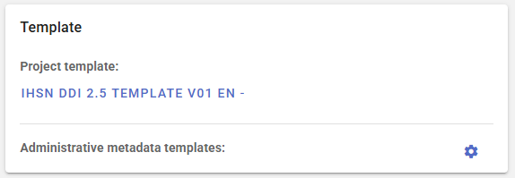

- ***Project template***

  Datasets are documented based on templates. Templates are customized subsets of the metadata elements available from the metadata standard, possibly complemented by user-defined additional elements. The template will determine what data curators see in the navigation tree of the *Project* pages, and the metadata entry pages. A default template is automatically selected when a new project is created (the template to be used as default is selected by the system administrator; see section *Designing templates*). 

  The data curator can select another template available in the Metadata Editor. The list of available templates is also selected by the system administrator. 

  Changing the template used for an existing project will NOT impact the content of the metadata that has already been entered. No information is lost when a less comprehensive template is selected; all metadata already captured is preserved, even if it is not displayed when the new template is used. 

- ***Administrative metadata templates***

  Select one or multiple administrative metadata templates (optional). See *Administrative metadata* below, and *Administrative metadata templates* in *Designing templates* for more information on the purpose and use of administrative metadata.


### Navigation tree

The navigation tree shown in the *Project* page reflects the content of the selected templates. In a template, metadata elements can be tagged as *required* or *recommended*. The navigation frame provides an option to filter elements, to display only required fields or recommended fields. It also provides an option to only display *empty fields*, i.e. metadata elements for which no content has been provided.

A search box is also provided, allowing users to search a metadata element based on keywords found in the element label.


### Project validation

The *Project home* page contains a frame titled *Project validation*, which will indicate whether the metadata that has been entered and saved violates some of the requirements of the standard itself or of the validation rules defined in the template used to document the dataset.

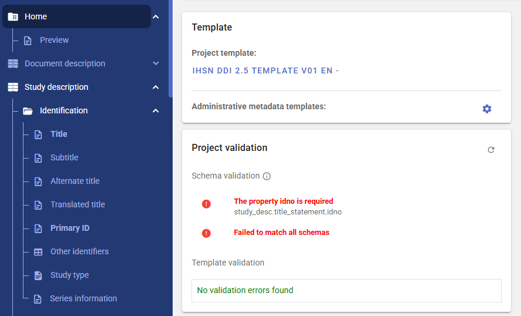

- ***Schema validation*** lists the violations of requirements of the metadata standard.
- ***Template validation*** lists the violations of custom validation rules defined in the metadata template.

Clicking on a validation error will take you to the element that needs to be edited.


### Collaborators

The frame *Collaborators* in the *Project home* page will show the list of collaborators who have access to the project, with information on their permission level (View, Edit, Admin, Owner). If you are the owner or administrator of the project, you may edit this list (adding or removing collaborators) from the list by clicking on the icon on top of the frame.

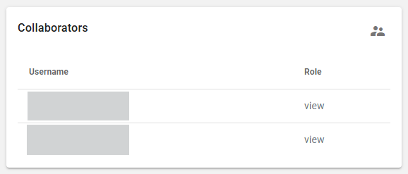


### Collections

The frame *Collections* in the *Project home* page will show the list of collections to which the project belongs. If you are the owner or administrator of the project, you may edit this list (adding or removing collections) from the list by clicking on the icon on top of the frame.


### File manager 

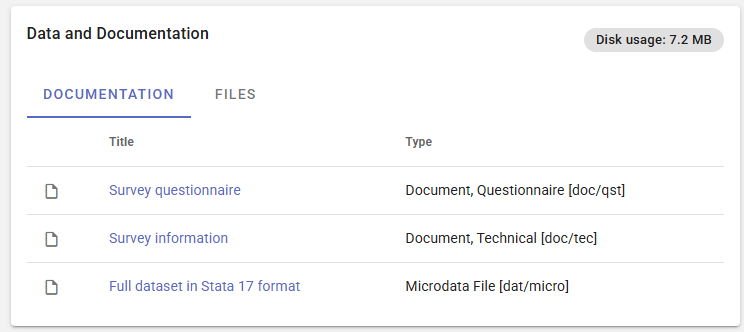

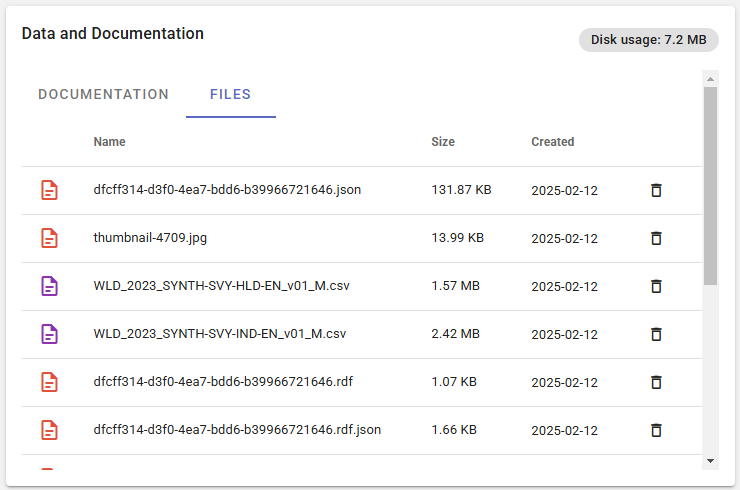


## Common metadata sections  

A few gruops of metadata elements are common to all metadata standards, and will be found in the navigation tree. 


### Information on metadata 

All metadata standards and schemas supported by the Metadata Editor include a set of elements intended to document the metadata itself. This set of elements is found in section *Document description* in the DDI (microdata), and *Metadata information* for other types of data. Although these elements are all optional, it is good practice to enter content in this section, if only on the author of the metadata and on the date it was generated. This information is not useful to the data users, but will be useful to catalog administrators to ensure traceability of the information stored in the metadata.


### Tags

All metadata standards and schemas supported by the Metadata Editor include a **Tags** element (this element is not part of all standards; it has been added to standards that did not include it). This element enables the implementation of filters (facets) in data cataloguing applications, in a flexible manner. The tags metadata element is repeatable (meaning that more than one tag can be attached to a dataset) and contains two sub-elements to capture a tag (word or phrase), and the tag_group (if any) it belongs to.

To illustrate the use of tags, let’s assume that you want to indicate whether a dataset is available free of charge or for a fee, and another tag that indicates whether the dataset meets differebntial privacy or not. None of the metadata schemas contains an element specifically designed to indicate the “free” or “for a fee” nature of the dataset, or "differentially private" or not. But this information can be captured in a tag “Free” or “For a fee” within a tag group that could be named “free_or_fee”, and "Differentially private" or "Not differentially private" in a tag group that could be named "differential_privacy". This information becomes part of the metadata, abd can be used by catalog administrators to create customized filtering options (facets) in their user interfaces. 

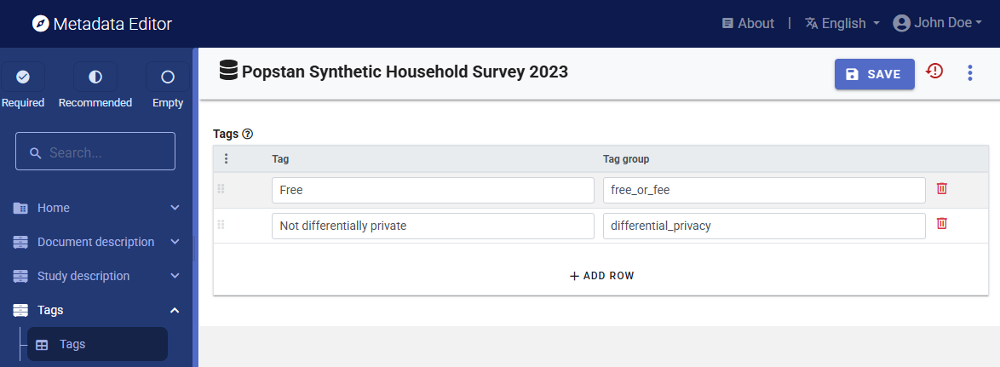


### External resources

**External resources** are not a specific type of data. They are resources of any type (data, document, web page, or any other type of resource that can be provided as an electronic file or a web link) that can be attached as a "related resource" to a catalog entry. A metadata schema that is intentionally kept very simple, based on the Dublin Core standard, is used to describe these resources. 

The table below shows some examples of the kind of external resources that may be attached to the metadata of different data types.

| Data type          | Examples of resources that may be documented and published as external resources  |
| ------------------ | ------------------------------------------------------------ |
| Document           | MS-Excel version of tables included in a publication ; PDF/DOC version of the publication ; visualizations files (scripts and image) for visualizations included in the publication ; link to electronic annexes |
| Microdata          | survey questionnaire ; survey report ; technical documentation (sampling, etc.) ; data entry application ; survey budget in Excel ; microdata files in different formats ; link to an external website|
| Geographic dataset | link to an interactive web application ; technical documentation in PDF ; data analysis scripts ; publicly accessible data files |
| Time series        | link to a database query interface ; technical documents ; link to external websites ; visualization scripts |
| Tables             | link to an organization website ; tabulation scripts | electronic copy of the table |
| Images             | image files in different formats and resolutions ; link to a photo album application ; link to a photographer website |
| Audio recordings   | audio file in MP3 or other format ; transcript in PDF |
| Videos             | video file in WAV or other format ; transcript in PDF |
| Scripts            | publication ; link to a package/library web page ; link to datasets | 

To add an external resource, click on *External resources* in the navigation tree. This will open the **External resource** page which lists all external resources already added. The click on CREATE RESOURCE. This will open a new page, where information on the resource can be added. Enter at least the title, type, and upload a file or provuide a URL. Then SAVE.

The *Resource type* element is very important; it will determine how the resource is published in a NADA catalog. Particular attention must be paid to resources of type *Microdata*. When publishing the resource in a NADA catalog, resources of type *Microdata* will not automatically be made available to users of the catalog; the access policy selected when publishing the project in NADA will apply. This could be "Open data" or "Direct access", which will make the data downloadable without restriction, but it could be another access policy such as "Licensed access" which would require that users request access to the data. 


### DataCite 

A Digital Object Identifier (DOI) is a unique, persistent identifier assigned to a digital object, such as a research article, dataset, report, or other scholarly content. It provides a permanent link to the object, ensuring that it can always be reliably located, even if the URL or hosting platform changes. DOIs facilitate accurate citation, improve discoverability, and promote long-term access to digital resources, making them essential for maintaining the integrity and traceability of academic and scientific work.

A DOI is issued by a DOI Registration Agency (RA), which is a member of the International DOI Foundation (IDF). When a publisher, data repository, or other content provider wants to assign a DOI to a digital object, they register the object with an RA, such as Crossref or DataCite. The content provider submits metadata about the object, including its title, authors, publication date, and a URL where the object can be accessed. The RA assigns a unique DOI, which is permanently linked to the metadata and the URL. This ensures that even if the object's location changes, the DOI remains a persistent identifier that redirects users to the correct location.

DataCite is a service that offers Fabrica as a DOI and metadata management service allowing organizations to register and manage DOIs for their data products (see https://datacite.org/create-dois/). With Fabrica, organizations can assign DOIs, maintain accurate and FAIR metadata, and ensure persistent links for long-term accessibility and citation of their valuable research outputs. Generating a DOI requires that a core set of metadata be provided to the DOI registration service. This section of the navigation tree contains the elements that are needed for that purpose. This section is only used when you plan to issue a DOI for the dataset. 

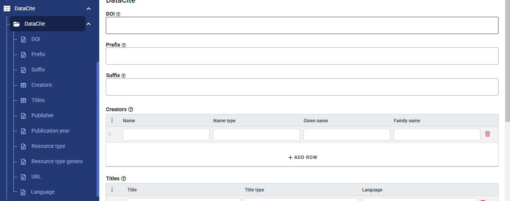


### Provenance

 Projects can easily be shared across organizations. They can be shrared by tranferring ZIP packages or via API. When a project is published in a catalog like NADA, a project can be imported into the Metadata Editor from the NADA catalog using the API. This means that projects found in an instance of the Metadata Editor are not always created in tht same instance of the application. When projects are obtained from an external source, it is important to keep track of (i) from where the project originated, and (ii) from where the project was imported, which may be different from the originating repository. To maintain traceability, all metadata standards supported by the Metadata Editor include a common *Provenance* section with two main components: (i) original repository, and (ii) source repository.  

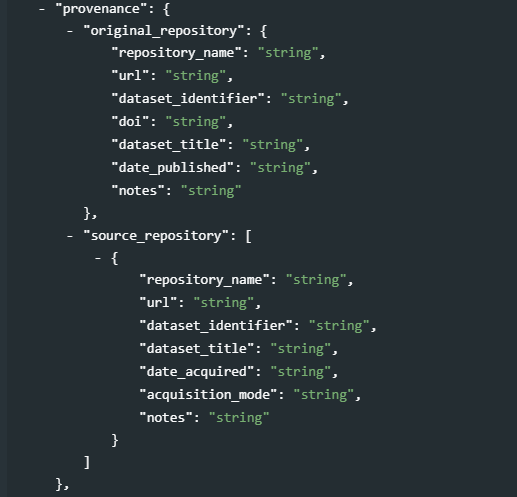

The goal is to preserve information on at least the name, URL, and identifier of the original catalog, and the name, URL, identifier of the repository from which the project was imported, and its identifier and date/time when it was harvested.   


### Administrative metadata

**Administrative metadata** will only appear in the navigation tree if administrative metadata templates have been selected in the **Template selection**. Administrative metadata consists of information needed by systems or systems administrators to determine how a dataset should be published in a particular data dissemination platform. This information is not intended to be used or visible by the data users; they only serve an internal purpose for the organization that crates the data. For that reason, when a project metadata is exported, administrative metadata is by default not included. 

The content of the administrative metadata is determined by the administrative metadata template(s) selected for the project. If the project (meta)data is intended to be published in multiple platforms, multiple templates will be used for the project.

The content of the administrative metadata section is not intended to be entered by data curators. They will typically be entered by system administrators. Entering administrative metadata therefore requires a specific role/permission (see *Setting roles and permissions**).


## Project-level tools and options 

Some elements in the menu apply to all data types, some are specific to the data type.

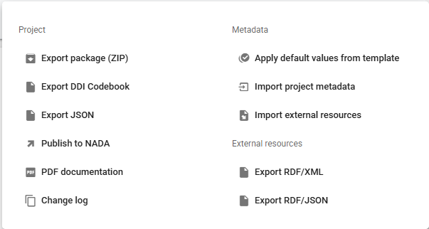

### Saving and exporting project and metadata

- ***Export package*** A project contains the metadata you enter, the data files you may have imported (for microdata), the project thumbnail, and possibly external resources of different types. The Metadata Editor stores this information in a database and on the webserver that hosts the Editor. You may export a *package* that contains all materials related to the project. This package will consist of a ZIP file containing all files (including the metadata you entered, even if you did not export them). The ZIP file can be archived, or shared. A package can be imported in the Metadata Editor.     

- ***Export DDI Codebook*** This option ony applies to project of type *microdata*. It will generate a DDI Codebook file (XML format) containing the metadata, **not including** the metadata related to external resources. 

- ***Export JSON*** This option applies to project of all types. It will generate a metadata file in JSON format. The file will contain the core metadata and other components based on the options you will select: including external resources, including metadata elements marked as *private* in the metadata template,  and including the administrative metadata.

  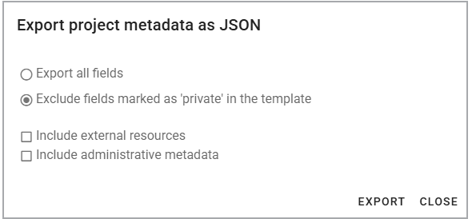

- ***Export MSD (SDMX/XML 3.0):*** (applies to project of type *indicator* only)

- ***Export Metadataset (SDMX/JSON):*** (applies to project of type *indicator* only)

- ***Export RDF/XML:*** This option will export the metadata related to the external resources as an Resource Description Framework (RDF) / XML file.

- ***Export RDF/JSON:*** This option will export the metadata related to the external resources as an Resource Description Framework (RDF) / JSON file.


### Locking and versioning

- ***Lock & version:**


### Publishing metadata

- ***Publish to NADA:*** This option allows you to publish your metadata (and related materials, optionally including data) to a NADA catalog. See chapter **Publish to NADA** for more information.

- ***PDF documentation:*** This option will generate a formatted PDF document containing the project metadata, including metadata on external resources.

- ***Change log:*** This option will open a page that shows all actions taken on the project, with identification of who took the action (change log). This option can be used to undo some actions.
    
  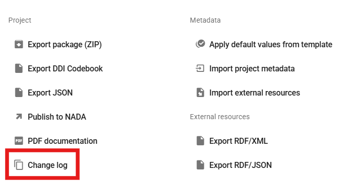

  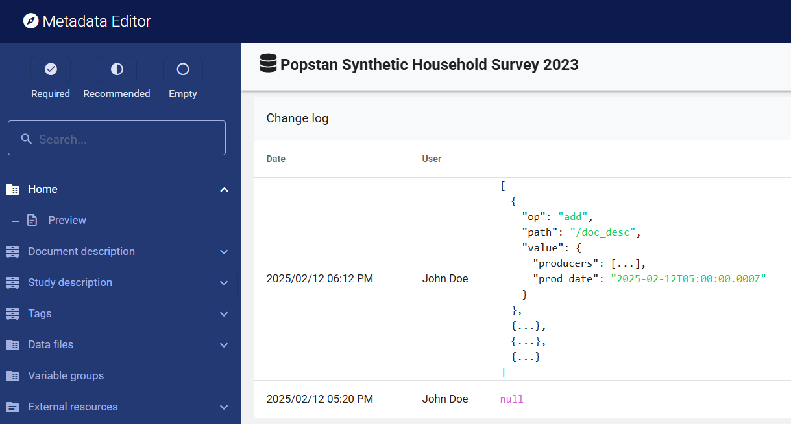


### Importing metadata

- ***Applying default values from template:*** If the template used for documenting the dataset contains default values, this option will allow you to apply them to your project. Default values are not imputed in a project unless this option is selected. When you apply default value, you will be offered to apply default values to all metadata elements for which a default value exists, or only to metadata elements that do not contain any information (this option will protect information you may have entered against overwriting).

  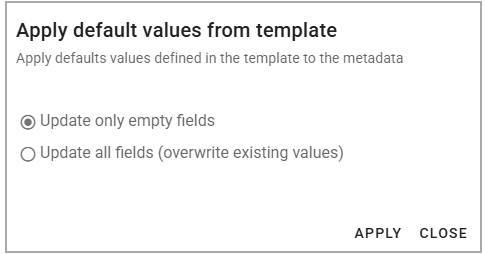
  
- ***Import project metadata:*** This option will allow you to select a metadata file (JSON) and import its content in your project. For microdata, you will be provided with an option to select the components of the metadata you want to import.

  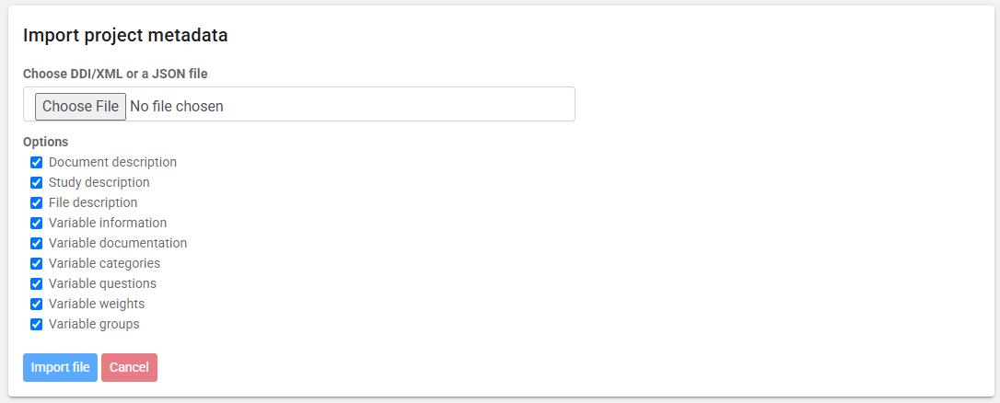

- ***Import external resources:*** This option allows you to import an external resource that has been exported from another project as a RDF/JSON file (see below). Select the Resource Description Framework (RDF) / JSON file and click IMPORT FILE.


### Other tools and options

- ***Diagnostic:*** This option will open an HTML page that provides a diganostic of the metadata for the project. The disgnostic will cover both the issues of required or recommended information that may be missing, errors in schema and template validation (also shown in the project Home page), and diagnostic based on other criteria based on good practice. 


## Help 

The metadata entry pages will show a [?] icon next to the title of all metadata elements. Clicking on this icon will show the instructions for the element, extracted from the selected metadata template.

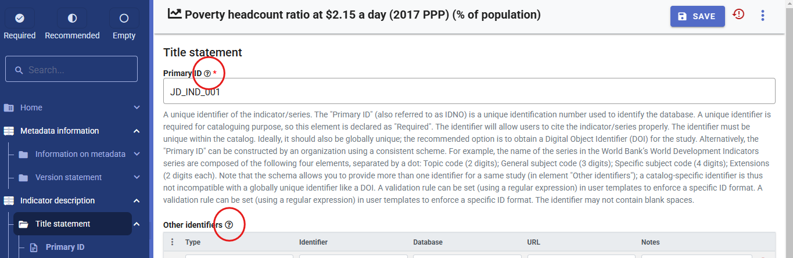


## Canceling changes (Undo) 

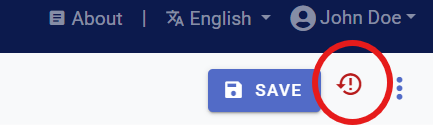


## Formatted metadata

Metadata is intended to be used in many applications. It is therefore essential to make the file format as open and interoperable as possible. For that reason, the preferred format for saving metadata is JSON. The JSON format is non-proprietary plain text format. It is important to also ensure that the content of the file is as interoperable as possible. For that reason, including formatting in the metadata is not recommended, unless absolutely necessary. The metadata template may however mark some metadata elements to allow using markdown, HTML, or LaTex formulas (see *Designing templates*). 

For example: 

- ***Plain text (no formatting):*** 

  The Metadata Editor is compatible with Version 2.5 of the DDI Codebook metadata standard.

- ***Formatted text entered as markdown:***

  ```
  The Metadata Editor is compatible with **Version 2.5** of the *DDI Codebook* metadata standard.
  ```

- ***Formatted text entered as HTML:***

  ```
  <p>The Metadata Editor is compatible with <strong>Version 2.5</strong> of the <em>DDI Codebook</em> metadata standard.</p>
  ```

- ***Formatted text, as rendered in a web broswer:***

  The Metadata Editor is compatible with **Version 2.5** of the *DDI Codebook* metadata standard.


Formatting metadata elements in the Metadata Editor may also consist of entering LaTex formulas, which is a way of capturing complex formulas in plain text format, leaving it to other applications like web browsers to render the LaTex content into readable formulas. For example:

- ***Variance formula as entered in the Metadata Editor:***
  
  ```latex
  \text{Variance: } \sigma^2 = \frac{\sum_{i=1}^{n} (x_i - \mu)^2}{n}
  ```

- ***Variance formula as rendered in a web browser:***

  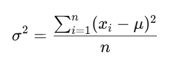
