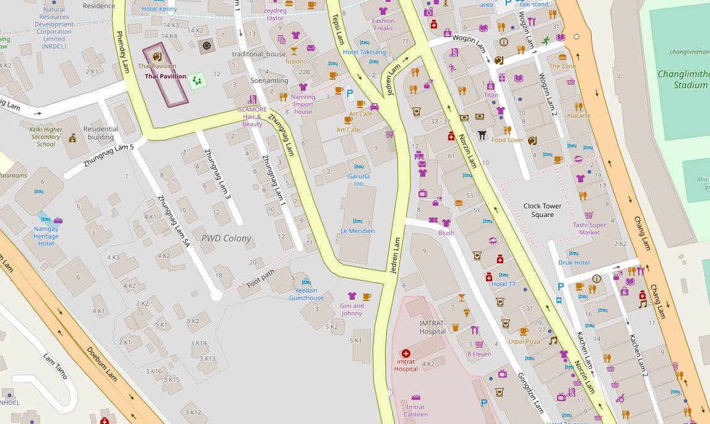
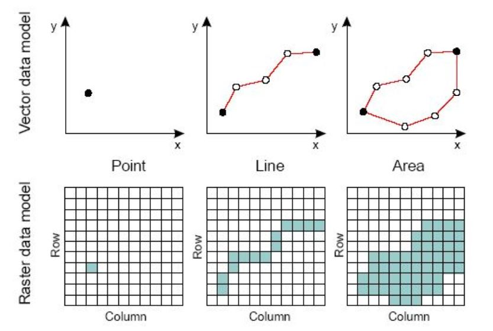
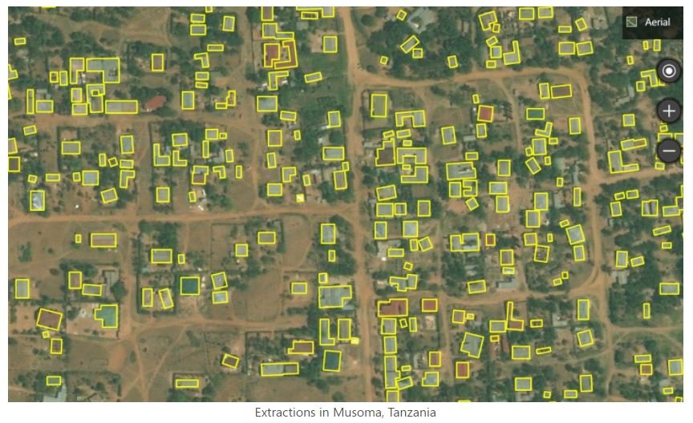
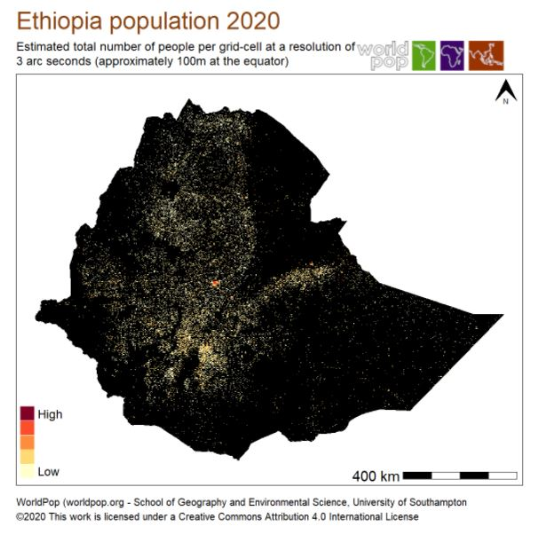
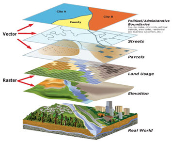

# Documenting geographic datasets and services

## The ISO 19100 metadata standards 

To make geographic information discoverable and to facilitate their dissemination and use, the ISO Technical Committee on Geographic Information/Geomatics (ISO/TC211) created a set of metadata standards to describe geographic **datasets** (ISO 19115-1 for vector datasets and ISO 19115-2 for raster datasets) and geographic **data services** (ISO 19119). 

The ISO 19115-2 provides the necessary metadata elements to describe the structure of raster data. The ISO 19115-1 standard does not provide all necessary metadata elements needed to describe the structure of vector datasets. The description of data structures for vector data (also referred to as *feature types*) is therefore often omitted. The ISO 19110 standard solves that issue, by providing the means to document the structure of vector datasets (column names and definitions, codes and value labels, measurement units, etc.), which will contribute to making the data more discoverable and usable.

This set of standards, known as the ISO 19100 series, have been "unified" into a common XML specification (ISO 19139). 

These standards served as the cornerstone of multiple initiatives to improve the documentation and management of geographic information such as the [Open Geospatial Consortium (OGC)](https://www.ogc.org/), the [US Federal Geographic Data Committee (FDGC)](https://www.fgdc.gov/), the [European INSPIRE directive](https://inspire.ec.europa.eu), or more recently the [Research Data Alliance (RDA)](https://rd-alliance.org/), among others.

The ISO 19100 standards have been designed to cover the large scope of geographic information. The level of detail they provide goes beyond the needs of most data curators. What we use in the Metadata Editor is a subset of the standards, which focuses on what we consider as the most relevant metadata elements to describe and catalog geographic datasets and services. 

## Documenting geographic datasets, series, and services

### Geographic datasets

**Geographic datasets** Geographic datasets refers to the actual stored data about the Earth’s features, phenomena, or events. Geographic datasets "identify and depict geographic locations, boundaries and characteristics of features on the surface of the earth. Geographic datasets can be vector data (points, lines, polygons) or raster data (grids, pixels, imagery). They include geographic coordinates (e.g., latitude and longitude) and data associated to geographic locations (...)". (Source: https://www.fws.gov/gis/) The ISO 19115 standard defines the structure and content of the metadata to be used to document geographic datasets. The ISO 19115 standard is split into two parts covering:
- ***vector data*** (ISO 19115-1), and 
- ***raster data*** including imagery and gridded data (ISO 19115-2). 
The elements of ISO 19115 are included in the XML specification ISO 19139.

*Vector* and *raster* spatial datasets are built with different structures and formats. The following summarizes how these two categories differ and how they can be processed using the R software. The descriptions of vector and raster data provided in this chapter are adapted from:
   - https://gisgeography.com/spatial-data-types-vector-raster/
   - https://datacarpentry.org/organization-geospatial/02-intro-vector-data/index.html]

#### Vector data 

Vector data are comprised of **points**, **lines**, and **polygons** (areas). 

A vector **point** is defined by a single x, y coordinate. Generally, vector points are a latitude and longitude with a spatial reference frame. A point can for example represent the location of a building or facility. When multiple dots are connected in a set order, they become a vector **line** with each dot representing a **vertex**. Lines usually represent features that are linear in nature, like roads and rivers. Each bend in the line represents a vertex that has a defined x, y location. When a set of 3 or more vertices is joined in a particular order and closed (i.e. the first and last coordinate pairs are the same), it becomes a **polygon**. Polygons are used to show boundaries. They will typically represent lakes, oceans, countries and their administrative subdivisions (provinces, states, districts), building footprints, or outline of survey plots. Polygons have an area (which will correspond to the square-footage for a building footprint, to the acreage for an agricultural plot, etc.) 

Vector data are often provided in one of the following file formats:

   - ESRI Shapefile (actually a zip set of files; not standard and limited as it is based on an outdated DBF format, but still widely used);
   - ESRI GeoDatabase file (not a standard format, but widely used);
   - GML: the Official OGC geospatial standard format, used by standard spatial data services;
   - GeoPackage: the OGC recommended standard for handling vector data;
   - GeoJSON: another OGC standard, often used when a *service* is associated to the data;
   - KML/KMZ: [Keyhole Markup Language](https://en.wikipedia.org/wiki/Keyhole_Markup_Language), an XML notation for expressing geographic annotation and visualization within two-dimensional maps and three-dimensional Earth browsers;
   - CSV file: Comma-separated values files, with geometries provided in OGC Well-Known-Text (WKT);
   - OSM: An XML-formatted file containing "nodes" (points), "ways" (connections), and "relations" from [OpenStreetMap](https://www.openstreetmap.org) format. 

The figure below provides an example of vector data extracted from [Open Street Map](https://www.openstreetmap.org/node/1376501203#map=18/27.47008/89.63725) for a part of the city of Thimphu, Bhutan (as of 17 May, 2021). 

#### Raster data

**Raster data** are made up of pixels, also referred to as *grid cells*. Satellite imagery and other remote sensing data are raster datasets. Grid cells in raster data are usually (but not necessarily) regularly-spaced and square. Data stored in a raster format is arranged in a grid without storing the coordinates of each cell (pixel). The coordinates of the corner points and the spacing of the grid can be used to calculate (rather than to store) the coordinates of each location in a grid.

Any given pixel in a grid stores one or more values (in one or more bands). In geographic raster datasets, ***bands*** represent separate layers of data values within a raster. Each band corresponds to a matrix of values for the same spatial extent, often representing measurements in different spectral ranges or thematic data layers. For example:
- In satellite imagery, one band may capture red light, another green, another blue, and others might capture infrared or thermal information.
- In a digital elevation model, a single band might contain elevation values only.
- In a multi-variable raster dataset, different bands may represent different variables (e.g., temperature, salinity).

Raster data can be **discrete** or **continuous**. Discrete rasters have distinct themes or categories. For example, one grid cell can represent a land cover class, or a soil type. In a discrete raster, each thematic class can be discretely defined (usually represented by an integer) and distinguished from other classes. In other words, each cell is definable and its value applies to the entire area of the cell. For example, the value 1 for a class might indicate "urban area", value 2 "forest", and value 3 "others". Continuous (or non-discrete) rasters are grid cells with gradual changing values, which could for example represent elevation, temperature, or an aerial photograph.

The difference between vector and raster data, and between different types of vectors, is clearly illustrated in the figure below taken from the World Bank's [Light Every Night GitHub repository](https://worldbank.github.io/OpenNightLights/tutorials/mod2_1_data_overview.html).

Raster data are sometimes converted into vector data. For example, a building footprint layer (vector data, composed of polygons) can be derived from a satellite image (raster data). Such conversions can be implemented in a largely automated manner using machine learning algorithms. 

Source: https://blogs.bing.com/maps/2019-09/microsoft-releases-18M-building-footprints-in-uganda-and-tanzania-to-enable-ai-assisted-mapping

Raster data are often provided in one of the following file formats:

   - GeoTiFF (standard): Most of the remote sensing data are stored as GeoTIFF files. https://www.ogc.org/standards/geotiff
   - NetCDF (standard) https://www.unidata.ucar.edu/software/netcdf/docs/netcdf_introduction.html
   - ECW: https://en.wikipedia.org/wiki/ECW_(file_format)
   - JPEG 2000: https://fr.wikipedia.org/wiki/JPEG_2000
   - MrSid: https://en.wikipedia.org/wiki/MrSID
   - ArcGrid (ESRI Grid format)

**GeoTIFF** is a popular file format for raster data. A *Tagged Image File Format* (TIFF or TIF) is a file format designed to store raster-type data. A GeoTIFF file is a TIFF file that contains specific tags to store structured geospatial metadata including:

   - Spatial extent: the area coverage of the file
   - Coordinate reference system: the projection / coordinate reference system used
   - Resolution: the spatial extent of each pixel (spatial resolution)
   - Number of layers: number of layers or bands available in the file

TIFF files can be read using (among other options) the R package [*raster*](https://cran.r-project.org/package=raster) or the Python library [*rasterio*](https://pypi.org/project/rasterio/). 

GeoTIFF files can also be provided as **Cloud Optimized GeoTIFFS (COGs)**. In COGs, the data are structured in a way that allows them to be shared via web services which allow users to query, visualize, or download a user-defined subset of the content of the file, without having to download the entire file. This option can be a major advantage, as geoTIFF files generated by remote sensing/satellite imagery can be very large. Extracting only the relevant part of a file can save significant time and storage space.

The example below shows the spatial distribution of the Ethiopian population in 2020. The data file was downloaded from the [WorldPop](https://www.worldpop.org/) website on 17 May 2021.

#### Combining vector and raster data in GIS applications

In GIS applications, vector and raster data are often combined into multi-layer datasets, as shown in the figure below extracted from the [County of San Bernardino (US) website](http://sbcounty.gov/). 

### Geographic datasets series

**Geographic datasets series** Geographic datasets can be organized in ***series***. In ISO 19139 (and ISO 19115), *series* refers to a collection of related datasets that are grouped together because they share a common purpose, theme, method of production, or spatial/temporal extent. In other words, a series is a set of datasets that are logically connected and can be described together at a higher level.

Examples:
- A series of annual land use maps for different years (2000, 2005, 2010, etc.).
- A collection of satellite images covering different tiles of a country.
- A set of topographic maps produced at the same scale for different regions.

In the metadata, some elements in the ISO 19139 are dedicated to provide information on series. You can describe the series itself at a general level. Then you can have metadata for individual datasets linked to that series. This helps avoid duplication — common information is stored once at the series level, and dataset-level metadata can focus on the differences. In ISO 19139 XML, you will often see fields like:
- resourceScope set to series (to show you are describing a series, not a single dataset);
- aggregationInfo to link datasets to their series or services.

### Geographic data services

**Geographic data services** refers to  operations or set of operations that allows users to access, manipulate, transform, analyze, or visualize geographic data over a network or system. It’s not the data itself — it’s the functionality provided to interact with the data. In other words, a geographic data service is something you can call or use to work with geographic data without downloading the full dataset first. Geographic data servies are documented using metadata elements from the ISO 19119 metadata standard. The elements of ISO 19119 are included in the XML specification ISO 19139.

## Unified metadata specification - The ISO/TS 19139 standard

The three metadata standards previously described - ISO 19115 for vector and raster datasets, ISO 19110 for vector data structures, and ISO 19119 for data services, provide a set of concepts and definitions useful to describe the geographic information. To facilitate their practical implementation, a digital specification, which defines how this information is stored and organized in an electronic metadata file, is required. The ISO/TS 19139 standard, an XML specification of the ISO 19115/10110/19119/, was created for that purpose.

The ISO/TS 19139 is a standard used worldwide to describe geographic information. It is the backbone for the implementation of [INSPIRE](https://inspire.ec.europa.eu/) dataset and service metadata in the European Union. It is supported by a wide range of tools, including desktop applications like [Quantum GIS](https://qgis.org/en/site/), [ESRI ArcGIS](https://www.arcgis.com/index.html)), and OGC-compliant metadata catalogs (e.g., [GeoNetwork](https://geonetwork-opensource.org/)) and geographic servers (e.g., [GeoServer](http://geoserver.org/)). 

ISO 19139-compliant metadata can be generated and edited using specialized metadata editors such as [CatMDEdit](http://catmdedit.sourceforge.net/) or [QSphere](https://www.fgdc.gov/organization/working-groups-subcommittees/mwg/iso-metadata-editors-registry/qsphere), or using programmatic tools like Java Apache SIS or the R packages [geometa](https://cran.r-project.org/web/packages/geometa/index.html) and [geoflow](https://github.com/eblondel/geoflow), among others.

The Metadata Editor uses the ISO 19139 to provide a solution compatible with the ISO 19115, ISO 19110, and ISO 19119 standards.

## Metadata templates or profiles for the practical implementation of ISO 19139

The ISO 19139 specification is complex. To enable and simplify its use in the Metadata Editor, we produced a JSON version of (part of) the standard. We selected the elements we considered most relevant for our purpose, and organized them into the JSON schema described below. For data curators with limited expertise in XML and geographic data documentation, this JSON schema will make the production of metadata compliant with the ISO 19139 standard easier. 

Some organizations have sought to make the use of ISO 19139 manageable, by defining *templates* or *profiles* that consist of subsets. This includes the INSPIRE set of elements defined by the European Union, and the GEMINI set of elements defined by the United Kingdom.

The Metadata Editor is also provided with recommended templates that only contain the elements of the ISO 19139 that are considered the most useful for the documentation of geographic datasets and services. The template provided in the Metadata Editor contains all elements from the INSPIRE and GEMINI profiles, and a few more.

### INSPIRE - Infrastructure for Spatial Information in Europe

The EU INSPIRE Directive (Infrastructure for Spatial Information in the European Community), adopted in 2007, establishes a legal framework for the creation of a unified spatial data infrastructure across the European Union. Its goal is to enable the sharing, discovery, and use of interoperable spatial data among public authorities, policymakers, and the public, particularly to support environmental policies and activities that may impact the environment. INSPIRE requires EU Member States to document, harmonize, and provide access to spatial datasets and services related to 34 environmental themes, including land use, transport networks, and biodiversity. The Directive mandates the use of standardized metadata (based on ISO 19115 and ISO 19139), common data specifications, and network services (discovery, view, download, etc.), ensuring that spatial information is easily searchable and accessible across borders and administrative levels.

See the INSPIRE knowledge base at https://knowledge-base.inspire.ec.europa.eu/index_en

### UK GEMINI 2.3

The UK GEMINI (GEo-spatial Metadata INteroperability Initiative) standard is the United Kingdom's national metadata standard for describing geographic datasets and services. Developed by the Association for Geographic Information (AGI) and maintained by the UK Metadata Working Group, GEMINI ensures consistent and interoperable metadata across UK public sector organizations. It is based on and fully compatible with international standards ISO 19115 for geographic information and ISO 19139 for XML encoding. GEMINI supports the requirements of the UK Location Programme and the European INSPIRE Directive, enabling efficient discovery, access, and use of spatial data through standardized metadata elements such as dataset identification, spatial and temporal extent, quality, access constraints, and responsible organizations.

See:
- https://guidance.data.gov.uk/publish_and_manage_data/harvest_or_add_data/harvest_data/gemini/#gemini-and-iso-19139-metadata
- A description of UK GEMINI 2.3 2020-04-07 dataset or series: [https://agiorguk.github.io/gemini/1062-gemini-datasets-and-data-series.html](https://agiorguk.github.io/gemini/1037-uk-gemini-introduction.html)
  
  
## Documenting a geographic dataset 

This section describes how to document a geographic dataset (vector or raster) using the Metadata Editor. Documenting a data service follows the exact same principles, except that the option to extract metadata from data files does not apply when documenting a data service.

The metadata template provided with the Metadata Editor identifies metadata elements that are specific to vector or raster datasets, or to data services.

### Prepare your materials

As a data curator preparing a geographic dataset for documentation using the ISO 19139 standard, it is essential to ensure that the dataset and all supporting materials are complete, well-organized, and ready for standardized metadata creation. Below are core recommendations for preparing a dataset prior to its documentation:

**1. Ensure dataset completeness and consistency**

- Verify that the dataset is finalized, with complete records and no missing key attributes or geometries.
- Check for consistency in coordinate systems, units of measurement, and naming conventions across all layers or features.
- Ensure the dataset is in a recognized and interoperable format (e.g., GeoPackage, shapefile, GML, GeoJSON).

**2. Confirm spatial reference information**

- Identify and record the Coordinate Reference System (CRS) used, including the full name and EPSG code.
- If multiple CRSs are used, provide clear documentation and justification.
- Check the vertical reference system if vertical data is present.

**3. Prepare descriptive and contextual information**

- Write a clear and concise title and abstract for the dataset that accurately describes its content and purpose.
- Define the geographic extent (bounding box or polygon), temporal extent, and data collection period.
- Identify the data theme or subject area (e.g., hydrography, land cover, administrative boundaries).

**4. Identify data lineage and quality information**

- Document the origin of the data, including source datasets, data capture methods, and any processing steps applied.
- Record known limitations, accuracy, and quality assessments (e.g., positional accuracy, completeness).
- Note any validation or quality control procedures performed.

**5. Organize supporting files and graphics**

- Prepare any graphic overviews (e.g., thumbnail maps, sample visualizations) to be referenced in metadata.
- Assemble distribution files and note their formats and versions (e.g., ZIP, GeoTIFF, CSV).
- Collect legal documents, such as terms of use, licenses, and access conditions.

**6. Identify responsible parties**

- Record the organization or person responsible for creating, maintaining, and distributing the dataset.
- Include contact information with roles (e.g., point of contact, metadata author, distributor).

**7. Determine access and use constraints**
   
- Identify and clearly state any restrictions on access or limitations on use, including intellectual property rights.
- Prepare text for disclaimers, preferred citations, or user guidance.

**8. Review related resources and linkages**

- List any related datasets, services, or documents (e.g., methodology reports, feature catalogues).
- Collect unique identifiers, such as UUIDs, for related resources when available.

**9. Validate the dataset’s technical readiness**

- Ensure file names and field names follow naming conventions (e.g., no special characters, reasonable length).
- Verify that all attribute fields are well-documented, with field names, definitions, and value domains.
- Check that feature types are defined consistently and that geometry types are valid and appropriate.

**10. Maintain versioning and update information**

- Record the dataset version, date of last update, and frequency of updates.
- Keep track of historical versions if applicable, for transparency and reproducibility.

**11. Generate images for the Graphic Overview section**

- Create at least one graphic overview image that visually summarizes the dataset (e.g., a map showing coverage or key features).
- Ensure the image is clear, appropriately scaled, and provides useful context for users.
- Include a descriptive file name, brief caption, and file format (e.g., PNG, JPEG).
- Save the image in a standard resolution and aspect ratio suitable for web display and embedding in metadata tools.

### Create a project

The first step in documenting a dataset is to create a new project. You do that by clicking on `CREATE NEW PROJECT` in the *My projects* page. Select *Geospatial* as data type. This will open a new, untitled project *Home* page. 

In the **Templates** frame, select the template you want to use to document the dataset. A default template is proposed; no action is needed if you want to use that template. Otherwise, switch to another template by clicking on the template name. Note that you can at any time change the template used for the documentation of a project. The selected template will determine what you see in the navigation tree and in the metadata entry pages. 

> Switching from one template to another will not impact the metadata that has already been entered; no information will be deleted from the metadata.

Once a project has been created, you can import the data files (if available) and start documenting the dataset. 

### Extract metadata from data files [under development - to be available in version 1.1 of the application]

The Metadata Editor allows you to extract metadata contained in geographic datasets. The following formats are supported:
- Vector datasets: GeoJSON, Shapefile (SHP), KML, GPKG, GDB
- Raster datasets: NetCDF (NC), geoTIF, BIL, ASCII (XYZ), GeoPDF (PDF), JPG, GIF, ADF, OVR

To extract information from data files:
- Click on DATA in the navigation bar. The data import page will be displayed. Select the data file(s) to be imported, then click `IMPORT`.  

The metadata that will be extracted will be automatically entered in the relevant metadata elements. What can be extracted depends on the data format, and on what the data producer may have included in the data files. Typically, the following metadata will be extracted: Filename, Bounding boxes, Reference system, Features (for vector datasets), Bands, and more.

### Enter additional metadata

We describe below the metadata elements included in the recommended INSPIRE + GEMINI + ADDITIONAL ELEMENTS template. This is only a subset of the elements contained in the ISO 19139. If you developed or imported a different, more comprehensive template, consult the description of metadata elements provided by the ISO 19139 documentation.

**DOCUMENT DESCRIPTION**

This section is not specific to geographic datasets. It corresponds to the *Document description* section of the DDI Codebook metadata standard (for microdata) and to the *Information on metadata* section in other metadata standards and schemas. This section contains metadata on the metadata, structured in a format consistent across metadata standards supported by the Metadata Editor. The content of this section is maintly intended to be used by catalog administrators, and will not be exported to ISO 19139 metadata files. 

**DESCRIPTION**

**METADATA**

- **`Hierarchy level`** This is the type of resource being described by the metadata and it is filled in with a value from a classification of the resource based on its scope. The choice of Resource Type will be probably the first decision made by the user and it will define the metadata elements that should be filled.

   The hierarchy level defines the scope of the resource. It indicates whether the resource is a collection, a dataset, a series, a service, or another type of resource. The ISO 19139 provides a controlled vocabulary for this element. It is recommended but not mandatory to make use of it. The most relevant levels for the purpose of cataloguing geographic data and services are dataset (for both raster and vector data), service (a capability which a service provider entity makes available to a service user entity through a set of interfaces that define a behavior), and series. Series will be used when the data represent an ordered succession, in time or in space; this will typically apply to time series, but it can also be used to describe other types of series (e.g., a series of ocean water temperatures collected at a succession of depths). Note that:
   - dataset: is an identifiable data that can be accessed separately. A dataset can be a part of a whole (series) or a segregate resource.
   - series: is a collection of resources or related datasets that share the same product specification.
   - service: technologies providing availability and access to spatial information, for example, web map services, web feature services, web coverage services, web processing services, catalogue web services, etc.

- **`Primary ID`** The "Primary ID" (also referred to as IDNO) is a unique identification number used to identify the study (geographic dataset or service). A unique identifier is required for cataloguing purpose, so this element is declared as "Required". The identifier will allow users to cite the study properly. The identifier must be unique within the catalog. Ideally, it should also be globally unique; the recommended option is to obtain a Digital Object Identifier (DOI) for the study. Alternatively, the "Primary ID" can be constructed by an organization using a consistent scheme. The identifier should not contain blank spaces.

- **`Parent identifier`** (*for hierarchy level = series, not for datasets*) A geographic data resource can be a subset of a larger dataset. For example, an aquatic species distribution map can be part of a data collection covering all species, or the 2010 population census dataset of a country can be part of a dataset that includes all population censuses for that country since 1900. In such case, the parent identifier metadata element can be used to identify this higher-level resource. As for the fileIdentifier, the parentIdentifier must be a unique identifier persistent in time. In a data catalog, a parentIdentifier will allow the user to move from one dataset to another. The parentIdentifier is generally applied to datasets, although it may in some cases be used in data services descriptions.

- **`Metadata date`** Date and time when the metadata record was created or updated. Requires an extended ISO 8601 formatted combined UTC date and time string (2009-11-17T10:00:00).
  
- **`Metadata language`** Main language used in the metadata description. It is recommended to select a value from a controlled vocabulary, for example that provided by ISO 639-2.

- **`Metadata contact`** 
  - **`Individual name`** The responsible party (person) in charge of the metadata production.
  - **`Organisation name`** The responsible party (organization) in charge of the metadata production.
  - **`Email`** Enter the email address of the contact person for this metadata. To ensure continuity and long-term accessibility, avoid using personal email addresses. Use a role-based or institutional email account (e.g., help@myorganization.org) that remains valid even if individual staff members change.
  - **`Phone`** Enter the phone number for contacting the person or team responsible for the metadata. To ensure continuity and accessibility, avoid using personal or direct mobile numbers. Instead, provide a general or role-based contact number (e.g., a departmental line or help desk number) that will remain valid even if individual staff members change. 
  - **`Address`** 
      - **`Delivery point`** Physical address - Street, building number, etc.
      - **`City`** Physical address - City name
      - **`Postal code`** Physical address - Postal code
      - **`Country`** Physical address - Country name
    - **`Online resource`** 
      - **`Name`** Name of the online resource.
      - **`Description`** Description of the online resource
      - **`URL`** URL of the online resource. 

- **`Metadata standard name`** The name of the geographic metadata standard used to describe the resource. The recommended values are:
  - In the case of vector dataset metadata: ISO 19115 Geographic information - Metadata
  - In the case of grid/imagery dataset metadata: ISO 19115-2 Geographic Information - Metadata Part 2 Extensions for imagery and gridded data
  - In the case of service metadata: ISO 19119 Geographic information - Services

- **`Metadata standard version`** The version of the metadata standard being used. It is good practice to enter the standard’s inception/revision year. ISO standards are revised with an average periodicity of 10-year. Although the ISO TC211 geographic information metadata standards have been reviewed, it is still accepted to refer to the original version of the standard as many information systems/catalogs still make use of that version. The recommended values are:
  - In the case of vector dataset metadata: ISO 19115:2003
  - In the case of grid/imagery dataset metadata: ISO 19115-2:2009
  - In the case of service metadata: ISO 19119:2005

- **`Dataset URI`** A unique resource identifier for the dataset, such as a web link that uniquely identifies the dataset. The use of a Digital Object Identifier (DOI) is recommended.

- **`Metadata maintenance and update frequency`** The metadata maintenance and update frequency elements provide information on the maintenance of the metadata including the frequency of updates. This is a free text element. The information should be chosen from values recommended by the ISO 19139 controlled vocabulary with the following options: continual, daily, weekly, fortnightly, monthly, quarterly, biannually, annually, asNeeded, irregular, notPlanned, unknown.

- **`Metadata character set`** This element specifies the character encoding used in the metadata record itself — i.e., how the text in the metadata is encoded. The purpose is to ensure that software applications can correctly interpret and display the metadata text, especially in multilingual or international contexts.
  - **`Characterset code`** This is the value element within the Metadata character set field. It contains the actual code (or abbreviation) representing the character set. It contains a code from a predefined list of values (controlled vocabulary), for example: "utf8". 
  - **`Codelist used`** Refers to the controlled vocabulary or authoritative list from which the Characterset code value is taken. The purpose is to provide a reference to the standardized list of valid character set codes, ensuring interoperability and consistent interpretation across systems.

**IDENTIFICATION** 

**DATASET IDENTIFICATION**

These elements are used to clearly and uniquely identify a geographic dataset and establish its relationship to other resources. Proper identification is essential for users to understand the nature, scope, and context of the dataset.

- **`Title`** The primary name by which the dataset, series, or service is known. It should be unique, concise, and descriptive, reflecting the content and scope of the resource. The title helps users discover and distinguish the dataset from others. Example: "Land Use Map of Northern Ireland, 2022 Edition".

- **`Alternate title`** An alternative name used to refer to the dataset. This may include abbreviations, translated titles, project names, or legacy titles. Including alternate titles improves discoverability, especially when datasets are known by different names in different contexts or languages. Example: "NI_LU_2022", or "Carte de l’occupation du sol – Irlande du Nord, 2022".

- **`Collective title`** The title of a larger resource or collection of which this dataset is a part. This element is used when the dataset is a component of a series, such as a national spatial data infrastructure collection, a thematic series, or a multi-part publication. It helps group related datasets under a common collection title and supports hierarchical or thematic navigation. Example: "UK National Land Use Dataset Series".

- **`Responsible party`** The Responsible party element identifies the individual or organization that has a specific role in relation to the dataset being documented. This includes responsibilities such as authoring, publishing, maintaining, or distributing the dataset. The purposes are to: (i) ensure users know who to contact for more information, assistance, or clarification; (ii) Enhance transparency, traceability, and accountability ; and (iii) Support data governance and helps with data stewardship and maintenance over time.
  - **`Individual name`** The responsible party (person) in charge of the dataset or service.
  - **`Organisation name`** The responsible party (organization) in charge of the dataset or service.
  - **`Email`** Enter the email address of the contact person for this dataset. To ensure continuity and long-term accessibility, avoid using personal email addresses. Use a role-based or institutional email account (e.g., help@myorganization.org) that remains valid even if individual staff members change.
  - **`Phone`** Enter the phone number for contacting the person or team responsible for the dataset or service. To ensure continuity and accessibility, avoid using personal or direct mobile numbers. Instead, provide a general or role-based contact number (e.g., a departmental line or help desk number) that will remain valid even if individual staff members change. 
  - **`Address`** 
      - **`Delivery point`** Physical address - Street, building number, etc.
      - **`City`** Physical address - City name
      - **`Postal code`** Physical address - Postal code
      - **`Country`** Physical address - Country name
    - **`Online resource`** 
      - **`Name`** Name of the online resource. In case of a geographic standard data services, this should be filled with the identifier of the resource as published in the service. Example, for an OGC Web Map Service (WMS), we will use the layer name.
      - **`Description`** Description of the online resource.
      - **`URL`** URL of the online resource. In case of a geographic data services, only the base URL should be provided, without any service parameter.

- **`Reference dates`** Date(s) associated to the resource. This may include different types of dates. The metadata shall contain a date of publication, revision or creation of the resource.
  - **`Date`** The date, in ISO format.
  - **`Type`** The type of date should be provided, and selected from the controlled vocabulary proposed by the ISO 19139. The following date types will often be used:
    - *Date of publication*: This is the date of publication of the resource when available, or the date of entry into force. There may be more than one date of publication. Date of publication differs from the temporal extent. For example, a dataset might have been published in March 2009 (2009-03-15) but the covered information was collected over the year 2008 (temporal extent from 2008-01-01 to 2008-12-31).
    - *Date of last revision*: This date describes when the resource was last revised, if the resource has been revised. Date of revision differs from the temporal extent. For example, a dataset might have been revised in April 2009 (2009-04-15) but the covered information was collected over the year 2008 (temporal extent from 2008-01-01 to 2008-12-31).
    - *Date of creation*: This date describes when the resource was created. Date of creation differs from the temporal extent. For example, a dataset might have been created in February 2009 (2009-02-15) but the covered information was collected over the year 2008 (temporal extent from 2008-01-01 to 2008-12-31).

- **`Abstract`** This is a brief narrative summary of the content of the resource. The abstract provides a clear and concise statement that enables the reader to understand the content of the data or service. The following is recommended:
  - The resource abstract must be a succinct description that can include:
     - A brief summary with the most important details that summarize the data or service
     - Coverage: linguistic transcriptions of the extent or location in addition to the bounding box
     - Main attributes
     - Data sources
     - Legal references
     - Importance of the work
  - Do not use unexplained acronyms.
  - Summarize the most important details in the first sentence or first 100 characters.

- **`Additional information`** Any other descriptive information about the resource that doesn’t fit into other elements​.

- **`Topics`** The Topics element refers to the broad thematic categories under which the dataset can be classified. These topics are often linked to established taxonomies or classification schemes, such as those used in national or international data repositories. The purpose is to help users quickly identify the general subject area of a dataset (e.g., environment, economics, transportation, etc.). Topics are often selected from predefined, standardized lists or ontologies, such as the United Nations’ "Statistical Theme" classification or domain-specific controlled vocabularies (e.g., "land use," "biodiversity"). Examples: "Agriculture"; "Urban Planning"; "Climate Change". This classification is useful for large data portals, data aggregators, or metadata systems where users may want to filter or explore datasets based on high-level thematic areas.

- **`Keywords`** The Keywords element allows for more granular and specific terms that describe the dataset's content. These can be used to identify particular concepts, places, techniques, or any other relevant aspect that the dataset addresses. Keywords help users narrow down search results to find datasets that closely match their specific needs or queries. They are often free-text terms chosen by the dataset creators or curators. Keywords should include relevant technical terms, geographical locations, data formats, measurement units, or any other descriptors that might aid in discovering datasets.
  Example: "Soil Quality"; "Flood Risk Modeling"; "Carbon Emissions".
  In contrast to topics, keywords are typically more flexible and specific, often tailored to a particular dataset or user needs. They are usually entered as free text but may also follow controlled vocabulary schemes depending on the application.
  - **`Type`** Keywords type. The ISO 19139 provides a recommended controlled vocabulary.
  - **`Keyword`** The keyword itself. When possible, existing vocabularies should be preferred to writing free-text keywords. An example of global vocabulary is the Global Change Master Directory that could be a valuable source to reference data domains / disciplines, or the UNESCO Thesaurus.
  - **`Thesaurus name`** A reference to a thesaurus (if applicable) from which the keywords are extracted. The thesaurus itself should then be documented as a citation.

- **`Resource identifiers`** The Resource identifiers element is used to specify unique identifiers for a resource, ensuring that it can be consistently referenced and accessed. These identifiers are critical for distinguishing between different datasets or resources and for enabling their retrieval or citation.
  - **`Identifier`** The Identifier is a unique value assigned to an object (in this case, a dataset or resource) within a particular namespace. It is used to uniquely reference the resource, ensuring that it can be identified and distinguished from other resources. The purpose is to provide a permanent and unique way to reference a dataset, resource, or entity, making it easier for users, systems, or software to locate or retrieve the resource.
    The identifier can take different formats, such as a DOI (Digital Object Identifier), URI (Uniform Resource Identifier), or URN (Uniform Resource Name). It could also be a custom identifier depending on the institution or system. Examples: 
"doi:10.1234/abcd1234"; "urn:example:dataset:123456" ; "http://example.org/datasets/12345".
   The identifier is crucial for ensuring that datasets or resources are easily findable and retrievable, especially in large repositories or distributed systems.
  - **`Authority`** The Authority refers to the organization or system that is responsible for assigning or managing the Identifier. This ensures that the identifier has been issued by a recognized, trusted authority and can be linked back to an official registry or system. The purpose is to identify the entity responsible for managing and ensuring the persistence of the identifier. It provides context to users about where the identifier originates and whether it can be trusted for long-term access. Example: "International DOI Foundation (for DOI-based identifiers)"; "European Data Portal (for datasets related to EU resources)".
   The Authority typically represents a well-known organization or service that assigns and maintains identifiers, ensuring consistency and reliability for long-term data reference.

- **`Dataset language`** The dataset language, defaulted to the language of the metadata. This refers to the language(s) used within the resource (dataset, series, or service if relevant). It is recommended to use the alpha-3 codes of ISO 639-2. Use only three-letter codes from in ISO 639-2/B (bibliographic codes, example "eng" for English). The list of all the codes is defined at http://www.loc.gov/standards/iso639-2/. Regional languages also are included in this list.

- **`Presentation form`** The Presentation form element in the context of metadata (such as ISO 19139) refers to the way in which the dataset or resource is presented or made available for use. This element specifies the format or mode of delivery of the data, providing essential details about how the data is structured, represented, or visually displayed for users.
  Purpose: Presentation form helps users understand how the data will be consumed, interacted with, or visualized. It indicates the physical or logical structure of the data and guides users in selecting the appropriate tools or methods to work with the resource.
   Examples of Presentation form:
     - Digital: The data is in a digital format (e.g., a file that can be read by computer software).
     - Image: The data is represented as a graphic or map image, such as a JPEG, PNG, or TIFF format.
     - Vector data: The data is represented in a vector format (e.g., shapefiles, GeoJSON) suitable for use in Geographic Information Systems (GIS).
     - Text: The data is in textual form, such as a document, report, or database.
     - Spreadsheet: The data is presented in a tabular format, like an Excel spreadsheet or CSV file.
     - Service: The data is made available through a web service, such as a WMS (Web Map Service) or WFS (Web Feature Service).
     - Audio/Video: The data might be multimedia, such as a video or audio file.

   The Presentation form element often uses a codelist, which is a set of predefined values that represent different formats and types of presentation. These codelists standardize the types of data presentation, ensuring consistency across datasets. For example, a dataset could have the following presentation forms:
      - Map: The data is shown in a map format.
      - Report: The data is presented in a report, perhaps in a PDF or DOC format.
      - Tabular: The data is provided in a table format.

   Why is it important?
     - Clarifies data format: By specifying the presentation form, the metadata ensures that users know the format they are working with, allowing them to make decisions about how to access or use the data.
     - Improves interoperability: Understanding the presentation form helps ensure that systems, tools, and users can interact with the data properly, reducing errors or confusion.
     - Ensures proper visualization: If the dataset is visual (like a map or image), the presentation form indicates the type of visualization, helping users to prepare appropriate viewing tools.

- **`Contacts`** This is the description of the person or organization responsible for the establishment, management, maintenance or distribution of the resource. This description shall include at least the name of the organization and contact email address. The name of the organization should be given in full, without abbreviations. It is recommended to use institutional email instead of personal emails.
  - **`Individual name`** The responsible party (person).
  - **`Organisation name`** The responsible party (organization).
  - **`Email`** Enter the email address of the contact person. To ensure continuity and long-term accessibility, avoid using personal email addresses. Use a role-based or institutional email account (e.g., help@myorganization.org) that remains valid even if individual staff members change.
  - **`Phone`** Enter the phone number for contacting the person or team. To ensure continuity and accessibility, avoid using personal or direct mobile numbers. Instead, provide a general or role-based contact number (e.g., a departmental line or help desk number) that will remain valid even if individual staff members change. 
  - **`Address`** 
      - **`Delivery point`** Physical address - Street, building number, etc.
      - **`City`** Physical address - City name
      - **`Postal code`** Physical address - Postal code
      - **`Country`** Physical address - Country name
    - **`Online resource`** 
      - **`Name`** Name of the online resource. 
      - **`Description`** Description of the online resource.
      - **`URL`** URL of the online resource. 

- **`Dataset character set`** The Dataset character set refers to the character encoding standard used for representing the textual content of a geographic dataset. Character encoding is essential for ensuring that text data is stored, displayed, and interpreted correctly across different systems, software, and platforms. The Dataset character set element helps document which character encoding scheme is applied to the dataset, particularly if it deviates from the most common standards, such as UTF-8. The purpose is to specify the encoding format for text data within the dataset. This ensures compatibility and correct interpretation of text when the dataset is shared or accessed by different systems.
    - **`Codelist value`** The Codelist value element is used to reference the specific value from a predefined codelist that corresponds to the dataset's character encoding. Codelists are collections of standardized values used to describe or categorize certain elements. In the context of character sets, the codelist provides standard identifiers for commonly used encoding schemes. The purpose is to identify the specific character set in use by referencing a standardized value from a predefined list. Examples: "UTF-8" (code representing the UTF-8 character set); "ISO-8859-1" (code representing ISO Latin-1 character set). The Codelist value ensures that the encoding used is recognized and standardized, facilitating the exchange and interpretation of datasets.
  - **`Codelist URI`** The Codelist URI refers to the Uniform Resource Identifier (URI) that links to the specific codelist that contains the predefined values used in the Codelist value. A URI is a string that provides a unique reference to a resource, in this case, a codelist that defines the character sets used. The URI should point to a standardized, authoritative codelist that can be consulted for valid encoding options. The purpose is to provide a link to the codelist containing the relevant encoding options, enabling the reader or system to check and reference the standard list of accepted character encodings. Examples:
      - http://www.iso.org/iso-10646-1 (link to the official ISO 10646-1 standard codelist)
      - http://www.w3.org/TR/encoding (link to W3C encoding codelist)
   By providing the Codelist URI, the metadata makes it clear where to find the official list of encoding schemes, ensuring consistency and reference to accepted standards.

**SERVICE IDENTIFICATION** (this section applies to services only, not to datasets)

- **`Service type`** This element defines the type or category of service being described. It identifies the general functionality the service provides, usually by referencing a controlled vocabulary such as the OGC service taxonomy (e.g., WMS for Web Map Service, WFS for Web Feature Service, CSW for Catalogue Service for the Web, etc.). The purpose is to allow users and systems to understand what kind of operations the service supports and how to interact with it. It is often expressed as a text string, and may optionally include a URI that identifies the type in a controlled vocabulary.

- **`Service type version`** This element specifies the version of the service type being described. Different versions may support different operations, parameters, or protocols. Example: For a WMS service, this might be 1.3.0 or 1.1.1. The purpose is to ensure clients can interact with the service using the correct protocol version and avoid compatibility issues.

- **`Access properties`** This is a general category that includes metadata about how users or systems can access and use the service.
  - **`Fees`** Indicates any costs associated with accessing or obtaining the dataset. If there is no charge, specify "None" or "Free of charge".
  - **`Service availability date`** The date when the dataset or related service becomes (or became) available to users. This helps users know when they can access the resource.
  - **`Ordering instructions`** Describes how users can request or obtain the dataset, including any steps, forms, or systems required to place an order. 
  - **`Turnaround`** The expected time between placing an order and receiving the dataset or service. This helps users plan their data requests accordingly. 

- **`Restrictions`** Information about any limitations or conditions on accessing or using the dataset or service. This may refer to legal, security, or other types of restrictions.
  
  - **`Legal constraints`** This element specifies legal restrictions or obligations governing access to and use of the service. These may include intellectual property rights, licensing terms, or usage policies. 
    - **`Use limitation`** A free text field to describe any legal conditions or obligations that limit how the dataset or service can be used (e.g., “For non-commercial use only”, “Must cite the source”). 
    - **`Access constraints`** Controlled vocabulary values (e.g., “copyright”, “license”, “intellectual property rights”) that define legal limitations on accessing the service.
    - **`Use constraints`** Specifies legal restrictions on how the dataset or service can be used once accessed (e.g., no redistribution, attribution required).
    - **`Other constraints`** Lists any additional legal or contractual conditions not covered by the above fields. This can include terms of service, end-user license agreements, or disclaimers.
      
  - **`Security constraints`** This element describes any limitations or requirements related to the confidentiality, integrity, or availability of the service.
    - **`Use limitation`** Describes any restrictions based on security policies that affect how the dataset or service may be used.
    - **`Classification`** Indicates the security level assigned to the dataset or service (e.g., Unclassified, Confidential, Secret), following the organization’s classification scheme. 
    - **`Note on security classification`** Provides explanatory text or justification for the assigned security classification. 
    - **`Classification system`** Specifies the formal system or policy under which the security classification is defined (e.g., national security guidelines, internal protocols).
    - **`Handling description`** Details instructions for how the dataset or service must be handled to comply with its security classification (e.g., encryption, access logging).

- **`Keywords`** A keyword is defined by (i) a keyword value ("keyword"); (ii) an optional originating controlled vocabulary which in ISO standard is referred to as “Thesaurus”. If the keyword value originates from a controlled vocabulary (thesaurus, ontology), for example GEMET - Concepts; (iii) the citation of the originating controlled vocabulary shall be provided. It is better to select keyword values from a collection of terms linked and predefined (controlled vocabularies). If only one keyword is used, then for spatial dataset or spatial dataset series, the keyword (i) shall describe the relevant data theme; (ii) shall be expressed in the language of the metadata. For example, a keyword that comes from GEMET - Concepts shall be cited as follows: keyword: freshwater ; thesaurus name: GEMET - Concepts, version 2.4
  - **`Type`** Indicates the type or role of the keywords, using a controlled vocabulary. Common types include:
     - theme – describes the topic or subject matter (e.g., "elevation", "imagery")
     - place – refers to a geographic location (e.g., "France", "Amazon Basin")
     - stratum – refers to a layer or vertical component (e.g., "atmosphere", "surface")
     - temporal – relates to a time period (e.g., "2020", "historical")
     This allows metadata users and search engines to interpret keywords correctly and refine search results based on thematic, spatial, or temporal filters.
  - **`Keyword`** The keyword value is a commonly used word, formalized word or phrase used to describe the subject. While the topic category is too coarse for detailed queries, keywords help narrowing a full text search and they allow for structured keyword search. Examples:
    - Atmospheric conditions (INSPIRE Spatial Data Theme)
    - humanCatalogueViewer (spatial data service subcategory)
    - water springs (AGROVOC)
    - rain water (GEMET -GEneral Multilingual Environmental Thesaurus- Concepts)
  - **`Thesaurus name`** The thesaurus name shall include at least the title and a reference date (date of publication, date of last revision or of creation) of the originating controlled vocabulary. It is important to specify which version of the thesaurus was used to take the keyword value from.

- **`Coupled resource`** Refers to the dataset(s) that the service operates on or delivers. This links the service to the specific geographic data it provides access to or processes. 
  - **`Operation name`** The name of a specific function or operation that the service provides (e.g., GetMap, GetFeature). This typically corresponds to standard service operations like those in OGC Web Services.
  - **`Identifier`** A unique code or reference that identifies the service or dataset in a catalog or registry. It ensures consistency and supports interoperability across systems.

- **`Coupling type`** Describes how tightly the service is connected to the dataset. Common values include:
  - Tight: The service is designed to work only with a specific dataset.
  - Loose: The service can operate on multiple datasets.
  - Mixed: The service has both tightly and loosely coupled operations. 

- **`Operations contained in service`** The elements listed in this group are used to describe the operations supported by a service, how those operations can be invoked, and the technical parameters needed for execution. These elements are used to provide detailed documentation of service capabilities. Operations contained in service contains a list of all operations (i.e., service functions or actions) that the service supports.
  - **`Operation name`** The name of the operation supported by the service. Example: "GetFeature", "GetMap", "DescribeCoverage".
  - **`DCP`** (Distributed Computing Platform) Specifies the protocol or platform used to invoke the operation. The purpose is to indicate how the operation can be accessed over a network.
  - **`Operation description`** A free-text explanation of what the operation does.
  - **`Invocation name`** The formal name used to call the operation (e.g., in a WSDL or API). Example: "GetMap" (used in service interface)
  - **`Parameters`** Describes the input and output parameters of the operation. Each operation may have multiple parameters.
    - **`Name`** The name of the parameter. For example: "bbox", "format", "layers"
    - **`Direction`** Indicates whether the parameter is an input to, or output from, the operation.
    - **`Description`** A textual description of the purpose and content of the parameter.
    - **`Optionality`** Indicates whether the parameter is optional or mandatory.
    - **`Repeatability`** Indicates whether the parameter can occur multiple times (true or false).
    - **`Value type`** Describes the data type or value domain of the parameter. For example: string, integer, URI, geometry, enumeration of values.
  - **`Connect point`** Describes how and where to invoke the operation (i.e., its endpoint).
    - **`Linkage`** The URL or URI to access the operation.
    - **`Name`** A label or name for the resource (not the same as the operation name).
    - **`Description`** A textual description of the online resource.
    - **`Protocol`** The protocol used to communicate with the service endpoint.
    - **`Function`** Describes the intended function of the online resource (e.g., download, information, search).
      
- **`Operates on`** The element establishes a link between a service metadata record and the dataset(s) it serves. This element identifies the datasets that the service operates on — i.e., the resources that the service accesses, modifies, or delivers. It allows the metadata for a service to explicitly point to the metadata of the dataset(s) it supports, thereby facilitating dataset-service linkage. It can either contain embedded metadata for the dataset or (more commonly) a reference to a separate dataset metadata record.
    - **`uuidref`** A UUID (Universal Unique Identifier) reference to an external dataset metadata record. The purpose is to link the service metadata to a separate dataset metadata record stored elsewhere in a metadata catalog or registry.

**PURPOSE, CREDIT AND STATUS**

- **`Purpose`** A description of why the dataset or resource was created—in other words, its intended use or application. The expectations are as follows:
  - Content: A clear, concise explanation of the rationale behind the dataset's creation. This could include:
    - The objective of the data collection effort.
    - The decision-making context or policy needs the data supports.
    - Specific applications the dataset was designed for (e.g., urban planning, disaster risk assessment).
    - Any targeted users or communities (e.g., researchers, environmental agencies).
  - Format:
    - It is a free-text field.
    - The text should be descriptive, but not excessively long—typically one to a few sentences.
  - Best practices:
    - Avoid jargon; ensure it is understandable to a general audience.
    - Distinguish it from other elements like abstract (which describes the content) or useConstraints (which explains how the data may or may not be used).
    - Be specific enough to support discovery and evaluation by potential users.

- **`Credit`** This element is used to acknowledge individuals, organizations, or agencies that contributed to the creation, funding, or provision of the dataset or resource. The expectations are as follows:
  - Content: A free-text acknowledgment of contributors, typically including:
    - Data producers
    - Funders or sponsors
    - Collaborating institutions
    - Partner organizations
    - Any person or group whose contribution should be recognized
  - Best practices:
    - Be accurate and complete—credit all major contributors to avoid disputes or omission.
    - Use formal names of organizations or projects to support discoverability and proper attribution.
    - Do not use this field for legal constraints or licensing

- **`Status`** This element specifies the current state or progress of the dataset or resource. It is a mandatory element in ISO 19115 metadata, as it helps users understand whether the dataset is completed, ongoing, planned, or obsolete. The expectations are as follows:
  - Content: A code from a controlled vocabulary defined by ISO 19115. The expected value is taken from the MD_ProgressCode code list. Common values include:
    - completed – data collection and processing are finished
    - historicalArchive – no longer maintained but archived for reference
    - obsolete – superseded by a newer dataset
    - onGoing – being continually updated
    - planned – data collection or production is intended but not started
    - required – data is needed but not yet available
    - underDevelopment – in the process of being created
  - Best practices:
    - Use only values from the official code list.
    - Choose the code that best reflects the life cycle stage of the dataset.
    - Be consistent across related metadata records if the status applies to multiple datasets in a series.

**EXTENT (GEOGRAPHIC, TEMPORAL, VERTICAL)**

In metadata terms, Extent provides information about the geographic area, time period, and/or vertical range to which the data applies.

Types of extents:
- Geographic Extent: Describes the spatial coverage, typically using bounding boxes or geographic identifiers 
- Temporal Extent: Specifies the time period the data covers.
- Vertical Extent: Indicates the vertical range (e.g., altitude or depth) covered by the data.

The Extent element is crucial because it:
- Helps users determine if a dataset is relevant for their area or time of interest.
- Supports discovery and filtering in spatial data catalogs.
- Enables automated data integration and analysis processes.
- 
**`Geographic element`** 
  - **`Bounding box`** This is the extent of the resource in the geographic space, given as a bounding box. Defining the coordinates of a rectangle representing the resource area on a map allows the discovery by geographical area. Provide the coordinates bounding the limits of the dataset, by means of four properties:
    - **`West bound longitude`** Western-most coordinate of the limit of the dataset extent, expressed in longitude in decimal degrees.
    - **`East bound longitude`** Eastern-most coordinate of the limit of the dataset extent, expressed in longitude in decimal degrees.
    - **`South bound latitude`** Southern-most coordinate of the limit of the dataset extent, expressed in latitude in decimal degrees.
    - **`North bound latitude`** Northern-most coordinate of the limit of the dataset extent, expressed in latitude in decimal degrees.
- **`Geohash`** A short alphanumeric string representing a spatial location or bounding box using the Geohash encoding. The purpose is to provide a compact, human-readable, and indexable way to encode geographic areas.
  - **`Geohash`** The geohash is not explicitly defined in ISO 19139, but often used in profiles, extensions, or auxiliary metadata to support spatial search, indexing, or approximate location. For example, "u4pruydqqvj" represents a specific area near New York City. Geohashes can vary in length; more characters mean higher precision.
  - **`Note`** A descriptive or explanatory note about the Geohash value — e.g., resolution, use, limitations. For example, "Geohash at 8-character precision (~19 meters accuracy)."
- **`Geographic description`** A textual or coded description of the geographic area covered by the dataset or service. The purpose is to provide a named place or coded region (e.g., country, administrative unit) as a way to describe geographic extent, especially when precise coordinates or geometry are not available. This useful for indexing metadata by regions or matching data to known administrative areas.
- **`Bounding polygon`** A polygonal shape describing the precise spatial coverage of the dataset or service. The purpose is to provide more accurate spatial boundaries than a bounding box, especially for irregular or non-rectangular areas.
  - **`Polygon identifier (ID)`** A unique identifier assigned to the polygon for referencing or validation. The purpose is to allow referencing this specific geometry within the metadata or from external systems.
  - **`Polygon`** A geometric object that defines the shape and extent of the area covered. This is defined in GML (Geography Markup Language), typically using EPSG:4326 (WGS 84) as the coordinate system.
    - **`Interior or exterior ring`** Rings that define the boundary of the polygon. Each ring is defined with a list of coordinates.
       - Exterior ring: The outer boundary of the polygon.
       - Interior ring: One or more holes within the polygon (optional). 
    - **`Type`** The type of geometry used to represent the area. Common types are Polygon (a single closed area), MultiPolygon (a set of multiple polygons), and Envelope (a bounding rectangle).
    - **`Coordinates`** Coordinates of the polygon. These are the longitude-latitude pairs that define the polygon boundary. Each pair is ordered as **`longitude`** **`latitude`**, separated by spaces. The first and last coordinates must be the same to close the polygon.

**`Temporal element`** The temporal extent defines the time period covered by the content of the resource. Depending on the temporal characteristics of the dataset, this will consist in a Time period (made of a begin position and end position) or a time instant (made of a single time position) referencing date/time information according to ISO 8601. This time period may be expressed as an individual date, an interval of dates (starting date and ending date), or a mix of individual dates and intervals of dates.
  - **`beginPosition`** Begin time position. Requires an extended ISO 8601 formatted combined UTC date and time string (2009-11-17T10:00:00)
  - **`endPosition`** End time position. Requires an extended ISO 8601 formatted combined UTC date and time string (2009-11-17T10:00:00)

- **`Vertical element`** The vertical extent of the dataset or service, specifying the range of altitudes or depths it covers. The purpose is to document the vertical dimension (e.g., elevation above sea level, ocean depth) relevant to the data or service. This is essential for datasets that include 3D or altitude-related information, such as terrain models, atmospheric data, oceanographic observations, or data collected at specific depths.
  - **`Minimum value`** The lowest vertical value covered by the dataset or service. This is the lower bound of the vertical extent, typically in meters. It can be negative for data below a reference level (e.g., sea level).
  - **`Maximum value`** The highest vertical value covered by the dataset or service. This is the upper bound of the vertical extent.
  - **`Vertical CRS`** The coordinate reference system used to interpret the vertical values. The purpose is to ensure clarity and interoperability by specifying the reference surface or datum for elevation or depth.

**SPATIAL REPRESENTATION TYPE AND RESOLUTION** 

- **`Spatial representation type`** The spatial representation type of the dataset. Values should be selected from the following controlled vocabulary: {vector, grid, textTable, tin, stereoModel, video}.

- **`Spatial resolution`** The Spatial resolution element describes the level of spatial detail in a dataset. It can refer to how close together observations are made (e.g., pixel size in raster data or minimum mapping unit in vector data). It shall be expressed as a set of zero to many resolution distances (typically for gridded data and imagery-derived products) or equivalent scales (typically for maps or map-derived products). An equivalent scale is generally expressed as an integer value expressing the scale denominator. A resolution distance shall be expressed as a numerical value associated with a unit of length.
  - **`Spatial resolution UOM`** The unit of measure for the spatial resolution distance. Common units: "m" for meters, "km" for kilometers, or custom URIs referencing a units catalog.
  - **`Spatial resolution value`** This is the numerical value of the resolution, usually representing the smallest distance that can be reliably distinguished in the dataset. For example: a raster dataset with 30-meter resolution would have a spatial resolution value of 30. 
  NOTES:
    - For services, it is not possible to express the restriction of a service concerning the spatial resolution in the current version of ISO 19119. While the problem is addressed by the standardization community, spatial resolution restrictions for services shall be expressed in the Abstract.
    - When two equivalent scales or two ground sample distances are expressed, the spatial resolution is an interval bounded by these two values.

**GRAPHIC OVERVIEW**

- **`Graphic overview`** A graphic or image that provides a quick visual representation of the dataset or service. The purpose is to help users quickly understand the nature, coverage, or content of the resource without needing to inspect the full data. Common examples include (i) a map thumbnail showing the dataset’s spatial extent; (ii) a sample chart or diagram illustrating data features; and (iii) a logo or icon representing the service.
  - **`File name`** The location or URL of the image file. This can be a relative or absolute path.
  - **`File description`** A textual description of the image’s content or purpose. The purpose is to provide context to help users interpret what the image represents. For example: "Overview map of dataset coverage" or "Elevation model sample visualization".
  - **`File type`** The format or file type of the image. For example, "jpeg" or "png". 

**FREQUENCY OF UPDATE**

This section of the metadata describes how often the dataset or service is maintained, updated, or revised. It helps users understand how current or dynamic the resource is, and whether it is suitable for time-sensitive applications.

- **`Resource maintenance`** This is a container element that provides information about routine or planned maintenance of the dataset.
   - **`Frequency`** (Maintenance and update frequency) This indicates how often updates or maintenance actions are performed on the dataset or service. Common values include:
      - continual – Data is repeatedly and frequently updated.
      - daily – Updated every day.
      - weekly – Updated every week.
      - monthly – Updated every month.
      - annually – Updated every year.
      - asNeeded – Updated when necessary (no regular schedule).
      - irregular – Updated at unpredictable intervals.
      - notPlanned – No updates are planned.
      - unknown – Frequency is unknown.
   - **`Maintenance note`** A free-text note providing additional information about the maintenance strategy, versioning policy, or details about how updates are applied. This can be used to explain specific conditions, responsible parties, data revision processes, or known limitations in maintenance.

**SPECIFIC USAGE** 

- **`Resource specific usage`** This element describes how the resource (dataset or service) has been or can be used, including information on usage contexts, limitations, and responsible parties. The purpose is to help users understand real-world applications of the resource and any constraints or conditions that affect its use.
  - **`Specific usage`** A free-text description of a particular use or application of the dataset or service. For example, "Used for land cover classification analysis", or "Applied in coastal erosion monitoring projects".
  - **`Time (date)`** The date or time period when the resource was used in the specific context.
  - **`User determined limitations`** A description of limitations identified by the user during the actual use of the resource. Examples: (i) "Data resolution was insufficient for urban-scale planning."; (ii) "Dataset lacks recent updates beyond 2020." 
  - **`Contacts`** Information about the individual or organization who used the resource or can provide details about its use.
    - **`Individual name`** The responsible party (person).
    - **`Organisation name`** The responsible party (organization). 
    - **`Email`** Enter the email address of the contact person. To ensure continuity and long-term accessibility, avoid using personal email addresses. Use a role-based or institutional email account (e.g., help@myorganization.org) that remains valid even if individual staff members change.
    - **`Phone`** Enter the phone number for contacting the person or team. To ensure continuity and accessibility, avoid using personal or direct mobile numbers. Instead, provide a general or role-based contact number (e.g., a departmental line or help desk number) that will remain valid even if individual staff members change.
    - **`Address`** Physical address of the person or organization.
      - **`Delivery point`** Physical address - Street, building number, etc.
      - **`City`** Physical address - City name
      - **`Postal code`** Physical address - Postal code
      - **`Country`** Physical address - Country name
    - **`Online resource`** Description and link to an online resource
    - **`Name`** Name of the online resource. 
    - **`URL`** URL of the online resource. 
    - **`Description`** Description of the online resource

    
**LEGAL CONSTRAINTS**

- **`Legal constraints`** A metadata section that documents legal or regulatory limitations on the access to, or use of, the dataset or service. The purpose is to inform users of any intellectual property rights, licensing terms, privacy protections, access restrictions, and required citations or disclaimers associated with the resource.
  - **`Use limitation`** A free-text description of limitations on the use of the resource imposed by law or policy. Examples: (i) "Restricted to academic research only."; (ii) "Licensed under Creative Commons Attribution 4.0 International (CC BY 4.0)." ; (iii) "Redistribution prohibited without prior written consent."
  - **`Access constraints`** Describes legal constraints on accessing the dataset or service (e.g. due to privacy, confidentiality, or licensing). The ISO 19139 provides a controlled vocabulary. These are the access constraints applied to assure the protection of privacy or intellectual property, and any special restrictions or limitations on obtaining the resource. Common values from the controlled vocabulary are:
    - copyright – Copyright-protected
    - intellectualPropertyRights – IP rights apply
    - license – License restrictions apply
    - privacy – Limited to protect personal or sensitive information
    - confidential – Only authorized users may access
    - restricted – Access limited for other reasons
    - otherRestrictions – Other restrictions apply
    - unrestricted – No legal access constraints
  - **`Use constraints`** Describes how the data may or may not be used, usually entered as free text. While Access constraints controls who can access, Use constraints controls what users can do with the data once accessed. Typical content:
    - Terms of use
    - Disclaimers
    - Preferred citations
    - Attribution requirements
    - Data limitations (if legal in nature)
   Examples: (i) "Users must cite the source when publishing results."; (ii) "Not for navigation or emergency use."; (iii) "Use of data is subject to the terms described at https://example.org/license".
  - **`Other constraints`** Any other legal restrictions and legal prerequisites for accessing and using the resource or metadata. Use cases include:
    - Mandatory citation format
    - Mandated attribution wording
    - Data sharing policies
    - Jurisdiction-specific legal notes

**RESOURCE FORMAT`** 

- **`Resource format`** The format of the resource, describing the file format, encoding, or structure used to store or represent the dataset or service. This metadata element helps users understand the type of file(s) they are dealing with, whether it's a dataset, document, or service, and the technology or software needed to process or interpret the resource. The purpose is to specify the file format(s) (such as CSV, JSON, NetCDF, or GeoTIFF) or the service format (e.g., WMS, WFS) that the resource is delivered in.
  - **`Name`** The name of the format used to store or represent the resource. This could refer to the type of file (e.g., CSV, GeoTIFF, XML, JSON), the technology (e.g., WMS for Web Map Service), or the application-specific format (e.g., Shapefile for vector data).
  - **`Version`** The version of the format used. This helps identify specific versions of a format that may have different features, capabilities, or compatibility issues. Version information is important for ensuring the correct version of a format is used, as formats can evolve over time (e.g., a new version of GeoTIFF might support different compression methods).

**REFERENCE SYSTEM**

- **`Reference system`** The reference system(s) typically (but not necessarily) applies to the geographic reference system of the dataset. Multiple reference systems can be listed if a dataset is distributed with different spatial reference systems. This block of elements may also apply to service metadata. A spatial web-service may support several map projections / geographic coordinate reference systems. A reference system is defined by two properties:
    - **`Code`** The identifier of the reference system. The recommended practice is to use to the Spatial Reference IDentifier (SRID) number. For example, the SRID of the World Geodetic System (WGS 84) is 4326.
    - **`Code space`** The code space of the source authority providing the SRID. The best practice is to use the EPSG authority code EPSG (as most of geographic reference systems are registered in it). Codes from other authorities can be used to define ad-hoc projections, for example:
      - ESRI:54012 (Eckert IV equal area projection)
      - EPSG:4326 (World Geodetic System 84 - aka WGS84), the system used for GPS
      - EPSG:3857 (Web Mercator / Pseudo-Mercator) - widely used for map visualization from web map tile providers.
  
  The main reference system registry is EPSG, which provides a “search by name” tool for users who need to find a SRID (global or local/country-specific). Other websites reference geographic systems, but are not authoritative sources including http://epsg.io/ and https://spatialreference.org/ The advantage of these sites is that they go beyond the EPSG registry, and handle other specific registries given by providers like ESRI.

  The following ESRI projections could be relevant, in particular those in support of world equal-area projected maps (maps conserving area proportions):
  - ESRI:54012 (Eckert IV)
  - ESRI:54009 (Mollweide)
  - ESRI:54030 (Robinson)

 
**SPATIAL REPRESENTATION**

Spatial representation describes how spatial data is represented — that is, the method used to encode the spatial characteristics of the dataset. This element provides structured metadata about the type and structure of spatial data in the resource. It helps users understand how location data is stored and whether the format fits their needs.

- **`Vector data`** For data consisting of points, lines, and polygons (e.g., shapefiles, geoJSON, feature classes in GIS), spatial representation includes Geometric objects (type and count of geometric features) and topology level (which describes topological complexity, e.g., planar graph).
  - **`Topology level`** Topology level is the type of topology used in the vector spatial dataset. The ISO 19139 provides a controlled vocabulary. In most cases, vector datasets will be described as geometryOnly which covers common geometry types (points, lines, polygons).
  - **`Geometric objects`**
    - **`Type`** The type of geometry handled. A controlled vocabulary is used. In the case of an homogeneous geometry type, a single geometricObjectselement can be defined. For complex geometries (mixture of various geometry types), one geometricObjects element will be defined for each geometry type.
    - **`Count`** The number (count) of geometries in the dataset.

- **`Grid data`** For grid/raster data (e.g., satellite imagery, gridded climate data), spatial representation includes: Cell size and orientation; Transformation parameters (if georeferenced); and Whether the grid is georectified or georeferenceable.
  - **`Number of dimensions`** Number of dimensions in the grid.
  - **`Axis dimension properties`** A list of each dimension including, for each dimension, the name, size, and resolution.
    - **`Name`** The name of the dimension type: the ISO 19139 provides a controlled vocabulary with the following options: row, column, vertical, track, crossTrack, line, sample, and time. These options represent the following:
      - row: ordinate (y) axis
      - column: abscissa (x) axis
      - vertical: vertical (z) axis
      - track: along the direction of motion of the scan point
      - crossTrack: perpendicular to the direction of motion of the scan point
      - line: scan line of a sensor
      - sample: element along a scan line
      - time: duration
    - **`Size`** The length of the dimension.
    - **`Resolution`** The dimension resolution: a resolution number associated to a unit of measurement. This is the resolution of the grid cell dimension. For example:
      - for longitude/latitude dimensions, and a grid at 1deg x 5deg, the ‘row’ dimension will have a resolution of 1 deg and the ‘column’ dimension will have a resolution of 5 deg.
      - for a “vertical” dimension, this will represent the elevation step. For example, the vertical resolution of the mean Ozone concentration between 40m and 50m altitude at a location of longitude x/ latitude y would be 10 m.
      - similar: in case of a spatial-temporal grid, the “time” resolution will represent the time lag (e.g., 1 year, 1 month, 1 week, etc.) between two measures.
    - **`Cell geometry`** The type of geometry used for grid cells. Possible values are: point, area, voxel, and stratum. Most “grids” are commonly area-based, but in principle a grid goes beyond this and the grid cells can target a point, an area, or a volume.
      - point: each cell represents a point
      - area: each cell represents an area
      - voxel: each cell represents a volumetric measurement on a regular grid in a three dimensional space
      - stratum: height range for a single point vertical profile
    - **`Transformation parameter availability`** 

**DATA QUALITY**

This section of the metadata document describes the quality of the resource by including specific measures, methods, and procedures used to assess its fitness for use. It helps users assess the trustworthiness of the data for their specific needs.

- **`Scope`** Describes the scope or extent of the quality evaluation. It indicates which part of the resource (e.g., dataset, attribute, metadata) the quality assessment applies to. Examples: "Dataset level"; "Attribute level"; "Metadata level"; "Feature level". The ISO 19139 recommends the use of a controlled vocabulary.
  
- **`Report`** The Report section documents the specific quality measures and the methods used to evaluate the data quality. It provides detailed information on the data quality measures taken and the process by which they were assessed. Each report will include the following key elements: information on the measure (what was measured), a description of the evaluation method (how the quality was evaluated, e.g., direct internal check, external test), and the result (the outcome of the evaluation, e.g., quantitative result, pass/fail). There can be multiple report entries (`element types`), each representing a different dimension of quality.
  - **`Element type`** Each report details one quality evaluation, the `element type`, such as Completeness, Logical consistency, Positional accuracy, Temporal accuracy, or Thematic accuracy. The Element type must be selected from the following controlled vocabulary: 
    - "DQ_CompletenessOmission"	
    - "DQ_CompletenessCommission"	
    - "DQ_ConceptualConsistency"	
    - "DQ_DomainConsistency"	
    - "DQ_FormatConsistency"	
    - "DQ_TopologicalConsistency"	
    - "DQ_PositionalAccuracy"	
    - "DQ_ThematicAccuracy"	
    - "DQ_TemporalAccuracy"	
    - "DQ_QuantitativeAttributeAccuracy"	
    - "DQ_UsabilityElement"	
  - **`Name of measure`** The name of the quality measure used to evaluate the dataset's quality. This could refer to specific accuracy measures, completeness, consistency, or other quality indicators. Examples: "Positional accuracy"; "Logical consistency"; "Completeness"; "Temporal accuracy", "Thematic accuracy".
  - **`Measure identification`** An identifier for the specific quality measure, often referencing standards, documents, or predefined measurement systems. Examples: "ISO 19157:2013"; "FGDC-STD-007.3-1998".
  - **`Measure description`** A detailed description of the quality measure used, explaining its purpose, how it was applied, and any specific methodologies or protocols followed. Example: "This measure evaluates the accuracy of the spatial location of each feature compared to the actual location using high-precision GPS data."
  - **`Evaluation method type`** Specifies the type of method used to evaluate the quality of the data, such as statistical analysis, expert review, or automated testing. Examples: "Statistical analysis"; "Expert review"; "Automated testing"; "Sampling" The ISO 19139 recommends the use of a controlled vocabulary with the following options: directInternal, directExternal, indirect.
  - **`Evaluation method description`** A description of the evaluation method, detailing how the quality was assessed and the procedures followed. Example: "Accuracy assessment performed by comparing GPS-derived points with the dataset’s coordinates using a root mean square error calculation."
  - **`Evaluation procedure`** The Evaluation procedure documents the specific process used for evaluating the quality measure.
    - **`Title`** The title of the evaluation procedure, describing the assessment process. Example: "Spatial accuracy evaluation procedure".
    - **`Dates`** The date related to the evaluation procedure, indicating when the evaluation was conducted or published.
      - **`Date`** The actual date when the evaluation was performed.
      - **`Type`** Specifies the type of date, such as creation, publication, or last modified.
    - **`Identifier authority`** The authority that issued or controls the identifier for the evaluation procedure. 
    - **`Identifier code`** The code or unique identifier used to reference the evaluation procedure. Examples: "ISO-19157:2013"; "FGDC-STD-007.3-1998".

  - **Conformance result`** The Result of consistency check element documents the findings of any consistency checks performed on the data or resource. These checks are typically conducted to ensure that the data conforms to established standards, rules, or expected values, helping verify its validity and reliability. This element is used to record the outcomes of these checks, which can include the results of tests for consistency, accuracy, logical integrity, or any other form of validation.
    - **`Title`** The title of the consistency check performed. This could describe the specific test or procedure used to verify the data’s quality or conformity. Example: "Positional Accuracy Consistency Check"; "Attribute Consistency Test".
    - **`Dates`** 
      - **`Date`** The date when the consistency check was performed or completed. This indicates when the check was conducted, which helps provide context for the data's current validity. 
      - **`Type`** The type of date related to the consistency check. This refers to the nature of the date, such as whether it is the date of creation, date of publication, or date of revision. Example: (i) "Creation" (Indicates that the date marks the creation of the check) ; "Revision" (Indicates that the check was revised at this date)
    - **`Responsible party`** The party responsible for carrying out the consistency check or for ensuring the data's consistency. This typically refers to an individual, organization, or group that conducted the check or is accountable for the quality and validity of the data.
      - **`Individual name`** 
      - **`Organisation name`**  
      - **`Email`** 
      - **`Phone`**  
      - **`Address`** 
        - **`Delivery point`** 
        - **`City`** 
        - **`Postal code`** 
        - **`Country`** 
      - **`Online resource`** 
        - **`Name`** 
        - **`URL`** 
        - **`Description`** 
    - **`Resource presentation`** The Resource presentation element specifies how a resource is provided, accessed, or presented to users. It indicates the format or method of delivery, such as a document, dataset, map, or service, and how the resource is structured or made available for users to interact with or utilize. This is important for understanding how a resource can be accessed and what type of presentation or output format users can expect when interacting with the data. Example: "PDF document", "CSV file", "Web service", "GeoTIFF", "Shapefile". The element describes the presentation format of the resource, indicating whether it is downloadable, interactive, or available through a service.
    - **`Explanation`** The Explanation element provides additional context or a more detailed description about a specific process, measurement, or result related to the resource. It can include clarification about how a result was obtained, how a test was performed, or why a certain decision was made. This is important for transparency, providing users with the rationale or detailed information behind the data, quality assessments, or any checks that have been carried out. Example: "The resource was assessed using a positional accuracy check, and the dataset passed the consistency check due to correct geospatial coordinates within the acceptable range." This field is used to give further details and clarification on why a result or value was recorded in the metadata.
    - **`Pass`** The Pass element indicates the outcome of a conformance check or validation test conducted on the resource. This is a boolean indicator (True or False) that specifies whether the resource has passed or failed a specific conformance test. If not evaluated, the value may be left blank (null). This helps the user understand the conformance status of the resource in terms of whether it meets certain predefined quality or technical standards. Values: True (the resource has successfully met the required standard or passed the test, indicating conformance) ; False (the resource did not meet the required standard, indicating non-conformance) ; Null/Blank (the resource has not been evaluated, and no conformance status is available). Example: If a dataset has been checked for consistency, a Pass value of "True" would mean that the dataset passed the check, whereas "False" would indicate that it did not meet the required standard. This element is used to track and report the results of quality control or validation tests performed on the resource.
- **`Quantitative result`** Quantitative results that describe the outcome of a data quality evaluation using numeric measures. These results provide detailed metadata about the type of result, the units used, and the actual values.
   - **`Value type`** The type of data used to express the result value(s). This indicates the data type (e.g., Real, Integer, Text) of the values listed under value.
   - **`Value unit identifier`** A unique ID for the unit of measure (usually a URI). This enables referencing a well-defined, controlled unit.
   - **`Value unit name`** Human-readable name of the unit (e.g., "metre", "seconds"). This makes the unit understandable without resolving the identifier.  
   - **`Value unit quantity type`** Type of quantity measured (e.g., Length, Time, Angle). This indicates the conceptual type of measurement for which the unit is appropriate.
   - **`Value`** The actual numeric result(s) of the evaluation. This represents the measured outcome of the data quality check.
  
-**`Lineage`**
  - **`Lineage statement`** Lineage is “a statement on process history and/or overall quality of the spatial data set. Where appropriate it may include a statement whether the data set has been validated or quality assured, whether it is the official version (if multiple versions exist), and whether it has legal validity. The value domain of this element is free text.” This element is not applicable to geographic services.
  
     RECOMMENDATIONS:
     - If a data provider has a procedure for the quality management of their spatial data set (series) then the appropriate ISO data quality elements and measures should be used to evaluate and report (in the metadata) the results. If not, the Lineage metadata element (defined in the Implementing Rules for Metadata) should be used to describe the overall quality of a spatial data set (series).
     - The use of acronyms should be avoided. If used, their meaning should be explained.

  - **`Process steps`** The process history may be described by information on the source data used and the main transformation steps that took place in creating the current data set (series). It consists of a list of events or transformations applied during dataset production.
     - **`Description`** A textual description of the process that was executed (e.g., "resampled from 1m to 10m grid", or "aggregated by region"). This describes what was done during the process step.
     - **`Rationale`** An explanation of why the process step was undertaken (e.g., "to harmonize resolution with other datasets"). This documents the intent or justification behind the processing.
     - **`Date`** The date and time at which the process step was completed. This supports tracking the sequence and timing of processing events.
     - **`Processor`** The party (organization or individual) responsible for executing the process step. This identifies who performed the processing, ensuring accountability and traceability.
        - **`Individual name`**
        - **`Organisation name`**
        - **`Role`**
        - **`Email`**
        - **`Phone`**
        - **`Address`**
          - **`Delivery point`**
          - **`City`**
          - **`Postal code`**
          - **`Country`**
        - **`Online resource`**
          - **`Name`**
          - **`URL`**
          - **`Description`**
     - **`Source`** Specifies the input data used in the process step. 
        - **`Title`** The name of the source dataset or resource. This provides a short reference to the input data.
        - **`Description`** Details about the content and role of the source dataset. This helps users understand the nature and function of the input data.
        - **`Date`** Represents one or more dates associated with the source data (e.g., publication date, creation date).
           - **`Date`** The date itself (e.g., 2024-12-27).
           - **`Type`** The type of date (e.g., creation, publication, revision).
        - **`Identifier authority`** The organization responsible for assigning the identifier (e.g., a DOI registration agency). This establishes provenance and authority of the identifier.  
        - **`Identifier code`** A unique string or code used to identify the source dataset (e.g., DOI, catalogue ID).
        - **`Responsible party`** An individual or organization responsible for the source dataset (e.g., data producer or publisher).
          - **`Individual name`**
          - **`Organisation name`**
          - **`Position`**
          - **`Role`**
          - **`Email`**
          - **`Phone`**
          - **`Address`**
            - **`Delivery point`**
            - **`City`**
            - **`Postal code`**
            - **`Country`**
          - **`Online resource`**
            - **`Name`**
            - **`URL`**
            - **`Description`**
            - **`Protocol`**
            - **`Function`**
        - **`Resource presentation`** The form in which the source resource is presented (e.g., mapDigital, documentDigital).

**CONTENT**

- **`Coverage description`** This section is used to describe the content and structure of a gridded dataset (e.g., imagery, elevation models, multi-band raster data). It describes the attributes or characteristics of the coverage data, which are typically structured in a grid or other regular pattern. It includes general information about the contents and structure of the dataset.
  - **`Content type`** Indicates the type of information represented in the coverage (e.g., physical measurement, thematic classification, etc.). Examples: image, thematicClassification, physicalMeasurement
  - **`Dimension`** Represents the axes or bands of the data — typically refers to spectral, temporal, or other data dimensions.
    - **`Band`** A specific type of range dimension used to describe spectral bands in a raster (e.g., a satellite image or multispectral scan).
      - **`Band name`** Name or identifier for the spectral band (e.g., “Red”, “Band_1”).
      - **`Band type`** A label describing the band function (e.g., "reflectance", "temperature").
      - **`Band description`** Narrative text describing what the band measures.
      - **`Minimum value`** The smallest possible or observed value in the band.
      - **`Maximum value`** The largest possible or observed value in the band.
      - **`Band unit identifier`** Unique identifier for the unit of measurement (often a URI).
      - **`Band unit name`** The name of the measurement unit (e.g., "W/m²/sr/μm").
      - **`Band unit quantity type`** The physical quantity measured (e.g., "radiance", "temperature").
      - **`Band peak response`** Wavelength or frequency where the band is most sensitive.
      - **`Band bits per value`** Number of bits used to encode each pixel value in the band.
      - **`Band tone gradation`** Number of gradations (distinct values) that can be represented.
      - **`Band scale factor`** Scale multiplier applied to stored pixel values to get physical values.
      - **`Band offset`** Offset added to scaled pixel values to get physical values.
    - **`Range dimension`** A general description of a data dimension (not necessarily a spectral band).
      - **`Range dimension name`** Label for the dimension (e.g., "Time", "Elevation").
      - **`Range dimension type`** Type or purpose of the dimension.
      - **`Range dimension description`** Explanation of the role or content of the range dimension.

**DISTRIBUTION**

- **`Distribution format`** The Distribution format element specifies the format in which the resource (such as data or metadata) is distributed or made available to users. This element helps to describe the technical format of the resource as it is provided for download, transfer, or access through an external service. It identifies the file format or structure in which the resource is presented to the users. The purpose is to describe the format in which a resource is distributed, making it easier for users to know in what format the data or resource is provided. 
Examples: "CSV" (Comma Separated Values); "GeoTIFF" (for geospatial data); "JSON" (JavaScript Object Notation); "PDF" (Portable Document Format); "Shapefile" (ESRI Shapefile format). This element is critical for users to understand the type of file or format they will receive when they access or download the resource. It provides clarity on how the data or information is structured for compatibility with software tools or systems.
  - **`Name`** The Name element under Distribution format specifies the name of the format in which the resource is distributed. It gives the specific format type used for distribution (such as "CSV", "GeoTIFF", "XML", etc.). The purpose is to provide the specific name of the format, ensuring that users can understand what type of data they are accessing and whether they can use it with their software tools.
  - **`Version`** The Version element under Distribution format indicates the version of the format used for distribution. This is important when different versions of a format exist, as software compatibility or features may vary across different versions of the same format. By specifying the version, users are informed about the specific iteration of the format that applies to the resource. The purpose is to specify the exact version of the format in use, ensuring clarity on what version is being distributed and helping users ensure compatibility with their tools or systems. For example: For a "Shapefile", the version might be something like "1.0" or "2.0", depending on the specific release of the Shapefile format.

- **`Distributor`** The Distributor element in the context of ISO 19139 metadata provides information about the entity or organization responsible for distributing a resource (such as a dataset or service). This element is essential for identifying who is making the resource available to the public or specific users and often includes contact information for accessing the resource. The Distributor element identifies the party (person, organization, or agency) that distributes the resource. This entity is responsible for making the data, service, or information available to users, either by providing access, facilitating downloads, or managing any other type of distribution channel. The purpose is to specify the organization or entity that is responsible for the availability and distribution of the resource. This can include details like the name of the distributor, contact details, and information about how the resource can be obtained.
  - **`Individual name`** 
  - **`Organisation name`** 
  - **`Email`** 
  - **`Phone`** 
  - **`Address`** 
    - **`Delivery point`** 
    - **`City`** 
    - **`Postal code`** 
    - **`Country`** 
  - **`Online resource`** 
      - **`Name`** 
      - **`URL`** 
      - **`Description`** 

**FEATURE CATALOGUE**

A Feature Catalogue defines the types of features and their attributes used in a dataset. It describes the content and structure of geographic features, enabling consistency, interoperability, and understanding when sharing or using data.

- **`Name`** The official title or name of the feature catalogue. The purpose is to identify the catalogue referenced or used by the dataset. Example: "Topographic Features Catalogue v2"
- **`Scope`** Describes the subject or domain covered by the feature catalogue. The purpose is to clarify the thematic or spatial extent, or the application domain (e.g., marine data, cadastral data). Example: "Hydrographic data for coastal management".
- **`Fields of application`** Describes the subject or domain covered by the feature catalogue. The purpose is to clarify the thematic or spatial extent, or the application domain (e.g., marine data, cadastral data). Example: "Hydrographic data for coastal management".
- **`Version number`** The identifier for the specific version of the feature catalogue. The purpose is to ensure clarity when multiple versions exist; essential for version control and traceability. Example: "2.1".
- **`Version date`** The date the version of the feature catalogue was published or became effective. The purpose is to indicate the timeliness of the catalogue. Example: "2023-11-01" (date should be entered in ISO 8601 format).
- **`Version date type`** Specifies the type of date provided for the version (e.g., creation, publication, revision). This is usually drawn from ISO 19115 date types like: creation; publication; revision.

- **`Producer`** The organization or authority responsible for creating and maintaining the feature catalogue. The purpose is to provide attribution and a point of contact for updates or clarification.
  - **`Individual name`** 
  - **`Organisation name`** 
  - **`Email`** 
  - **`Phone`** 
  - **`Address`** 
    - **`Delivery point`** 
    - **`City`** 
    - **`Postal code`** 
    - **`Country`** 
  - **`Online resource`** 
      - **`Name`** 
      - **`URL`** 
      - **`Description`**
        
- **`Functional language`** The Functional language element specifies the primary natural language(s) used within the resource being described, such as a dataset, service, document, or feature catalogue. This is not the metadata language (which is recorded separately); it refers specifically to the language used within the content of the resource itself (e.g., labels, feature names, field values, or descriptive text in a dataset or service). The purpose is to help users understand the language context of the resource and to support multilingual data discovery, access, and interoperability. For example, a user searching for resources in Spanish can filter results using this metadata element. In ISO 19139, this will be represented using a code from the ISO 639-2 three-letter language codes. It may include multiple entries if the resource uses more than one language.
  
- **`Feature type`** A Feature type defines a category of real-world geographic entities that share common characteristics (attributes, relationships, and operations). Feature types are the core elements of a feature catalogue, which describes the structure and semantics of data in a geographic dataset.
  - **`Type name`** The unique name assigned to the feature type. The purpose is to identify the feature class (e.g., Building, Road, Parcel).
  - **`Definition`** A textual explanation of the meaning of the feature type. TThe purpose is to describe what the feature represents in the real world. Example: A natural or artificial channel through which water flows.
  - **`Code`** A unique identifier for the feature type (often used in systems or standards). The purpose is to enable machine-readable identification and mapping across systems.
  - **`Is abstract`** Indicates whether this feature type is abstract. If true, this feature type cannot have instances; it must be specialized (subtyped). Value: Boolean (true/false)
  - **`Aliases`** Alternative names used for the feature type. The purpose is to support interoperability and usability in multilingual or multi-standard environments. Example: Stream, Creek (as aliases for Watercourse)
  - **`Carrier of characteristics`** A carrier of characteristics defines the attributes or properties associated with the feature type (these are sometimes called feature attributes or feature properties).
    - **`Member name`** The name of the attribute or characteristic. Example: FlowRate, Name, Length
    - **`Definition`** Description of the meaning or role of the attribute. Example: The volume of water passing a point per unit of time.
    - **`Cardinality lower`** The minimum number of times this attribute may occur for a single feature instance. Example: 0 (optional), 1 (mandatory). 
    - **`Cardinality upper`** The maximum number of times this attribute may occur. Example: 1, * (unbounded)
    - **`Code`** A unique identifier for the attribute within the feature catalogue. This corresponds to the actual column name in an attributes table.
    - **`Measurement unit`** The unit of measure for the attribute, if it is quantitative. Example: m³/s for FlowRate
    - **`Value type`** The data type of the attribute value. Examples: CharacterString, Integer, Real, Date, Boolean
    - **`Listed values`** List of controlled value(s) used in the attribute member. Each value corresponds to an object compound by 1) a label, 2) a code (as contained in the dataset), 3) a definition. This element will be used when the feature member relates to reference datasets, such as code lists or registers. e.g., list of countries, land cover types, etc.
      - **`Label`** The human-readable name of the value. Example: Perennial
      - **`Code`** A machine-readable identifier of the value. Example: PER
      - **`Definition`** The description of what the code/label means. Example: A watercourse that flows continuously throughout the year. 

**TAGS** 

Tags, especially when organized in tag groups, provide a powerful and flexible solution to enable custom facets (filters) in data catalogs.
  - **`Tag`** A user-defined tag.
  - **`Tag group`** A user-defined group (optional) to which the tag belongs. Grouping tags allows implementation of controlled facets in data catalogs.
   

