# Documenting an image

"Although photographs may be more explicit than a long discourse for humans, they don’t describe themselves in term of content as texts do. For texts, authors use many clues to indicate what they are talking about: titles, abstract, keywords, etc. which may be used for automatic cataloguing. Searching for photos must rely on manual cataloguing, or relate texts and documents that come with the photos." (Source: https://citeseerx.ist.psu.edu/viewdoc/download?doi=10.1.1.43.5077&rep=rep1&type=pdf)

## Metadata standards

This chapter explains how to document digital images using the Metadata Editor. Digital images are electronic files typically stored in formats such as JPG, PNG, or TIFF. These may include photographs taken by digital cameras, computer-generated graphics, or scanned images. The Metadata Editor applies metadata standards to ensure that images are discoverable, accessible, and usable. To achieve this, metadata should cover:

- **Content information**: Caption, description, keywords, and other descriptive elements.
- **Provenance information**: Date, location, author, and source.
- **Rights and privacy considerations**: Copyright/license details and privacy-related information (e.g., presence of identifiable individuals, especially minors), enabling users to use images legally, ethically, and responsibly.

## Metadata embedded in digital image files

Some devices, such as digital cameras, automatically generate and embed metadata in image files. This metadata, known as EXIF (Exchangeable Image File Format), records:
- **Date and time** the image was taken.
- **GPS coordinates** (latitude, longitude, and possibly altitude) if geolocation was enabled.
- **Device information**: Manufacturer, model, lens type, focal range, aperture, shutter speed, and flash settings.
- **Unique image identifier** generated by the system.

EXIF metadata can be extracted or viewed using various tools. For instance, R packages such as *ExifTool* and *ExifR* allow extraction and processing of EXIF metadata, while applications like Flickr display EXIF content. However, beyond date, location, and unique identifiers, EXIF metadata provides little information relevant to identifying an image’s source or content.

## Enhancing metadata with additional descriptive information

Since EXIF metadata lacks detailed content descriptions, curators must supplement it with additional information. Some of this metadata can be manually entered, while other elements can be automatically extracted using machine learning models or APIs. This information is structured and stored according to metadata standards supported by the Metadata Editor.

The Metadata Editor offers two mutually exclusive options for documenting images:
- **Dublin Core (DCMI)**: A simple and flexible metadata schema.
- **IPTC**: A more detailed and comprehensive schema, by the International Press Telecommunications Council (IPTC).

Both options are supplemented with a few common metadata elements, including cataloging parameters and unique identifiers.

## IPTC and Dublin Core standards

### Dublin Core standard

The Dublin Core (DCMI) standard consists of 15 core metadata elements, which are supplemented in the Metadata Editor with additional elements, primarily from the ImageObject schema of schema.org. This option provides a simpler, flexible approach to documenting images.

### IPTC Standard

The IPTC Photo Metadata Standard (version 2019.1) is the most widely adopted standard for describing images, recognized by news agencies, photographers, libraries, museums, and other industries. It consists of two schemas:
- **IPTC Core**: Covers essential descriptive fields.
- **IPTC Extension**: Provides additional elements for greater detail.

IPTC metadata includes fields for time and geographic coverage, people and objects shown, usage rights, and more. Since the IPTC schema is highly detailed, curators will typically use only a subset of the available fields. Where applicable, the use of controlled vocabularies is recommended for consistency.

## Metadata structure and templates

The Metadata Editor uses a schema that contains:
- **Common metadata elements**: Used for cataloging, assigning unique identifiers, and documenting metadata provenance.
- **Two metadata blocks**: One for IPTC and one for Dublin Core. Users can choose one of these options to describe the image.
- **Additional elements**: Common to both options, providing supplementary documentation.

To facilitate image documentation, the Metadata Editor includes two pre-configured metadata templates: one based on Dublin Core, the other based on IPTC. These templates can be customized using the Template Manager to suit the organization’s needs.

## Documenting an image using the Dublin Core option

This section describes the documentation of an image using the Dublin Core (DCMI) option.

The Dublin Core standard contains 15 core elements, which are generic and versatile enough to be used for documenting different types of resources. Other elements can be added to the specification to increase its relevancy for specific uses. We added a few elements inspired by the [ImageObject](https://schema.org/ImageObject) schema from schema.org to the 15 elements.

The fifteen elements, with their definition extracted from the [Dublin Core website](https://dublincore.org/), are the following:

| Element name         | Description                                                      | 
| -------------------- | ---------------------------------------------------------------- | 
| `identifier `        | An unambiguous reference to the resource within a given context. |
| `type`               | The nature or genre of the resource.                             |
| `title`              | A name given to the resource.                                    |
| `description`        | An account of the resource.                                      |
| `subject`            | The topic of the resource.                                       |
| `creator`            | An entity primarily responsible for making the resource.         |
| `contributor`        | An entity responsible for making contributions to the resource.  |
| `publisher`          | An entity responsible for making the resource available.         |
| `date`               | A point or period of time associated with an event in the life cycle of the resource. |
| `coverage`           | The spatial or temporal topic of the resource, the spatial applicability of the resource, or the jurisdiction under which the resource is relevant.|
| `format`             | The file format, physical medium, or dimensions of the resource. |
| `language`           | A language of the resource.                                      |
| `relation`           | A related resource.                                              |
| `rights`             | Information about rights held in and over the resource.          |
| `source`             | A related resource from which the described resource is derived. |

The Metadata Editor does not use the `identifier` element, as the unique identifier is provided by the common element `idno`. 

The World Bank schema includes the following additional elements that are not part of the core list of the DCMI: 
- `identifiers`
- `caption`
- `keywords`
- `topics`
- `country`
- `gps` (latitude, longitude, altitude)
- `note`

These elements are included in the default template for the DCMI option.

### Create a new project

Create a new project by clicking on `CREATE NEW PROJECT` in the *My projects* page, and select option *Image* as data type.

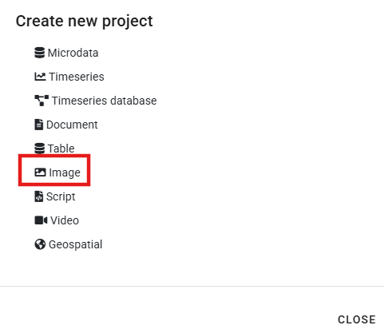

In the new *project home page*, select a DCMI template (one DCMI template is provided with the application).

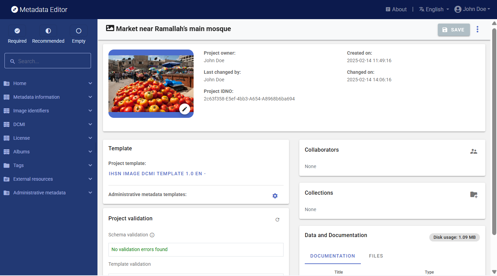

Edit the thumbnail by selecting an image. It is highly recommended to select the image being documented as thumbnail. The thumbnail will be used in the Metadata Editor itself, and in a NADA catalog is the image is published in NADA. The system will save the thumbnail as a low-resoluton image.

### Fill out the *Information on metadata* section

In the list of metadata elements below, the *key* of each element in the metadata standard is provided between brackets next to the corresponding element's label in the template.

### Fill out the DCMI and additional sections (image description)

We provide here some description and recommendations for the key metadata elements in the DCMI template.

**IMAGE DESCRIPTION** 

- **`Resource type`** (*type*) The Dublin Core schema is flexible and versatile, and can be used to document different types of resources. This element is used to document the type of resource being documented. The DCMI provides a list of suggested categories, including "image" which is the relevant type to be entered here. Some users may want to be more specific in the description of the type of resource, for example distinguishing color from black & white images. This distinction should not be made in this element; another element can be used for such purpose (like tags and tag groups). 

- **`date`** (*date*) The date when the photo was taken / the image was created, preferably entered in ISO 8601 format.

- **`Title`** (*title*) The title of the photo. 

- **`Caption`** (*caption*) A caption for the photo. 

- **`Description`** (*description*) A brief description of the content depicted in the image. This element will typically provide more detailed information than the title or caption. Note that other elements can be used to provide a more specific and "itemized" description of an image; the element `keywords` for example can be used to list labels associated with an image (possibly generated in an automated manner using machine learning tools).

- **`Keywords`** (*keywords*) Words or phrases that describe salient aspects of an image content. Can be used for building keyword indexes and for classification and retrieval purposes. A controlled vocabulary can be employed. Keywords should be selected from a standard thesaurus, preferably an international, multilingual thesaurus.  
  - **`Keyword`** (*name*) Keyword (or phrase). Keywords summarize the content or subject matter of the image. 
  - **`Vocabulary`** (*vocabulary*) Controlled vocabulary from which the keyword is extracted, if any.  
  - **`URL`** (*uri*) The URI of the controlled vocabulary used, if any.  

- **`Topics`** (*topics*) The `topics` field indicates the broad substantive topic(s) that the image represents. A topic classification facilitates referencing and searches in electronic survey catalogs. Topics should be selected from a standard controlled vocabulary such as the [Council of European Social Science Data Archives (CESSDA) thesaurus](https://vocabularies.cessda.eu/vocabulary/TopicClassification).
  - **`ID`** (*id*) The unique identifier of the topic. It can be a sequential number, or the ID of the topic in a controlled vocabulary.
  - **`Topic`** (*name*) The label of the topic associated with the data.  
  - **`Parent ID`** (*parent_id*) When a hierarchical (nested) controlled vocabulary is used, the `parent_id` field can be used to indicate a higher-level topic to which this topic belongs.
  - **`Vocabulary`** (*vocabulary*) The name of the controlled vocabulary used, if any. 
  - **`URL`** (*uri*) A link to the controlled vocabulary mentioned in field `vocabulary'.  

- **`country`** (*country*) The country shown in the image, if applicable. This information is highly relevant and will often be used as a filter (facet) in data catalogs. It is thus a "Recommended" field. An image will only represent part of a country, but we still want to capture this information in the metadata. Note that many organizations have their own policies on the naming and spelling of countries/regions/economies/territories, which data curators will have to comply with. In rare instances, the image may cover more than one country. The element is repeatable; multiple countries can be entered.
  - **`Name`** (*name*) The name of the country/economy where the photo was taken.
  - **`Code`** (*code*) The code of the country/economy mentioned in `name`. This will preferably be the ISO country code.  

- **`Geographic coverage`** (*coverage*) In the Dublin Core, the coverage can be either temporal or geographic. In the use of the schema, `coverage` is used to document the geographic coverage of the image. This element complements the `country` element, and allows more specific information to be provided.

- **`GPS position`** The geographic location where the photo was taken. Some digital cameras equipped with GPS can, when the option is activated, capture and store in the EXIF metadata the exact geographic location where the photo was taken. 
  - **`GPS latitude`** (*latitude*) The latitude of the geographic location where the photo was taken.
  - **`GPS longitude`** (*longitude*) The longitude of the geographic location where the photo was taken.
  - **`GPS altitude`** (*altitude*) The altitude of the geographic location where the photo was taken.  

- **`Format`** (*format*) This refers to the image file format. It is typically expressed using a MIME format.

- **`Languages`** (*languages*) The language(s) in which the image metadata (caption, title) is provided. This is a block of two elements (at least one must be provided for each language).
  - **`Name`** (*name*) The name of the language.
  - **`Code`** (*code*) The code of the language. The use of [ISO 639-2](https://www.loc.gov/standards/iso639-2/php/code_list.php) (the alpha-3 code in Codes for the representation of names of languages) is recommended. Numeric codes must be entered as strings.   

- **`Source`** (*source*) A related resource from which the described image is derived.

- **`Relations`** (*relations*) A list of related resources (images or of other type)
  - **`Name`** (*name*) The name (title) of the related resource.
  - **`Type`** (*type*) A brief description of the type of relation. A controlled vocabulary could be used.
  - **`URL`** (*uri*) A link to the related resource being described.  

- **`Note`** (*note*) Any additional information on the image, not captured in one of the other metadata elements.

**AUTHORS AND RIGHTS**

- **`Creator`** (*creator*) The name of the person (or organization) who has taken the photo or created the image.

- **`Contributor`** (*contributor*) The contributor could be a person or organization, possibly a sponsoring organizations.

- **`Publisher`** (*publisher*) The person or organization who publish the image.

- **`Rights`** (*rights*) The copyrights for the photograph. License is in another (common) element.

> This completes the Dublin Core set of metadata elements. When this information is complete, continue with the other sections (sections common to both the Dublin Core and the IPTC options).

  
## Documenting an image using the IPTC option

This section describes the documentation of an image using the IPTC option.

### Create a new project

Create a new project by clicking on `CREATE NEW PROJECT` in the *My projects* page, and select option *Image* as data type.

In the new *project home page*, select an IPTC template (one IPTC template is provided with the application).

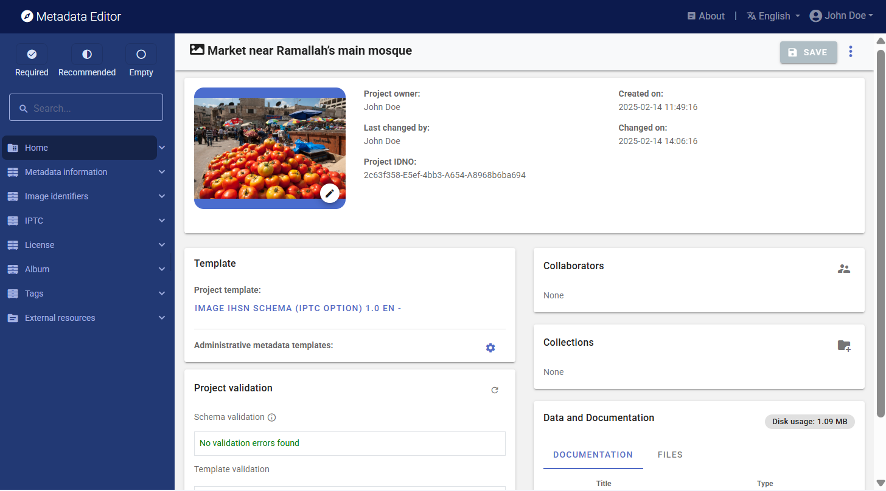

Edit the thumbnail by selecting an image. It is highly recommended to select the image being documented as thumbnail. The thumbnail will be used in the Metadata Editor itself, and in a NADA catalog is the image is published in NADA. The system will save the thumbnail as a low-resoluton image.

### Fill out the *Information on metadata* section

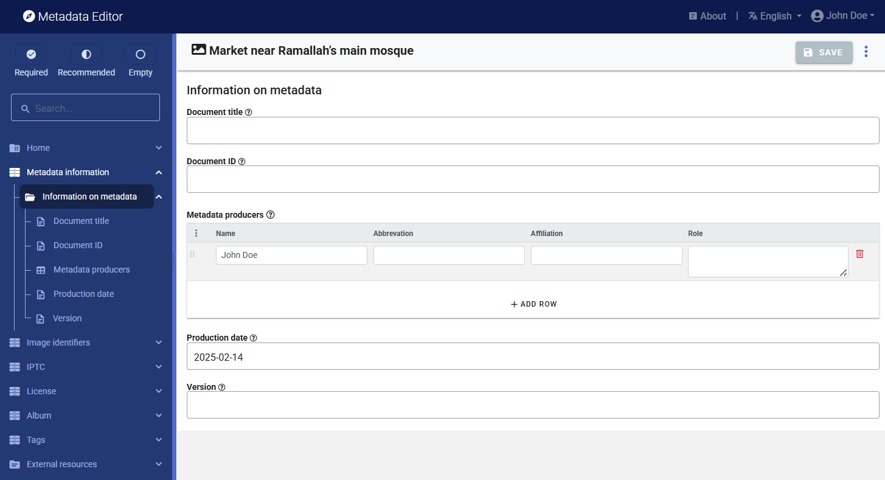

### Fill out the IPTC metadata and additional sections (image description)

We provide here some description and recommendations for the key metadata elements in the default IPTC metadata template provided in the Metadata Editor. The labels provided between parenthesis are the element names in the IPTC standard. The grouping of elements by section is the one in the template, not in the standard.

**TITLE STATEMENT**
                   
- **`Title`** (*tite*) The title is a shorthand reference for the digital image. It provides a short verbal and human readable name which can be a text and/or a numeric reference. It is not the same as the Headline (see below). Some may use the `title` field to store the file name of the image, though the field may be used in many ways. This element should not be used to provide the unique identifier of the image.

- **`Headline`** (*headline*) A brief publishable summary of the contents of the image. Note that a headline is not the same as a title.

- **`Globally unique identifier`** (*digitalImageGuid*) A globally unique identifier for the image. This identifier is created and applied by the creator of the digital image at the time of its creation. This value shall not be changed after that time. The identifier can be generated using an algorithm that would guarantee that the created identifier is globally unique. Device that create digital images like digital or video cameras or scanners usually create such an identifier at the time of the creation of the digital data, and add it to the metadata embedded in the image file (e.g., the EXIF metadata).IPTC’s requirements for unique ids are as follows:
  - It must be globally unique. Algorithms for this purpose exist.
  - It should identify the camera body.
  - It should identify each individual photo from this camera body.
  - It should identify the date and time of the creation of the picture.
  - It should be secured against tampering.

- **`Date created`** (*dateCreated*) Designates the date and optionally the time the content of the image was created. For a photo, this will be the date and time the photo was taken. When no information is available on the time, the time is set to 00:00:00. The preferred format for the `dateCreated` element is the truncated DateTime format, for example: 2021-02-22T21:24:06Z

**AUTHOR AND CONTRIBUTORS**

- **`Creator name`** (*creatorNames*) Enter details about the creator or creators of this image. The Image Creator must often be attributed in association with any use of the image. The Image Creator, Copyright Owner, Image Supplier and Licensor may be the same or different entities.       

- **`Creator job title`** (*jobtitle*) The job title of the photographer (the person listed in `creatorNames`). The use of this element implies that the photographer information (`creatorNames` is not empty). 

- **`Job ID`** (*jobid*) Number or identifier for the purpose of improved workflow handling (control or tracking). This is a user created identifier related to the job for which the image is supplied. 
  Note: As this identifier references a job of the receiver’s workflow it must first be issued by the receiver, then transmitted to the creator or provider of the news object and finally added by the creator to this field. 

- **`Source`** (*Source*) The name of a person or party who has a role in the content supply chain. The `source` can be different from the `creator` and from the entities listed in the Copyright Notice. 

- **`Supplier`** (*supplier*) The supplier of the image (person or organization)
  - **`Name`** (*name*) The name of the supplier of the image (person or organization). 
  - **`Identifier`** (*identifiers*) The identifier for the most recent supplier of this image. This will not necessarily be the creator or the owner of the image.  

- **`Supplier ID** (*imageSupplierImageId*) A unique identifier assigned by the image supplier to the image.
  
- **`Credit`** (*creditLine*) The credit to person(s) and/or organization(s) required by the supplier of the image to be used when published. This is a free-text field.

- **`Caption writer`** (*captionWriter*) An identifier, or the name, of the person involved in writing, editing or correcting the description of the image. 

- **`Contact`** (*creatorContactInfo*) The creator’s contact information provides all necessary information to get in contact with the creator of this image and comprises a set of elements for proper addressing. Note that if the creator is also the licensor, his or her contact information should be provided in the `licensor` fields.  
  - **`Country`** (*country*) The country name for the address of the person that created this image. 
  - **`Email (work)`** (*emailwork*) The work email address(es) for the creator of the image. Multiple email addresses can be given, in which case they should be separated by a comma. 
  - **`Region (State/Province)`** (*region*) The state or province for the address of the creator of the image. 
  - **`Phone (work)`** (*phonework*) The work phone number(s) for the creator of the image. Use the international format including the country code, such as +1 (123) 456789. Multiple numbers can be given, in which case they should be separated by a comma. 
  - **`URL`** (*weburlwork*) The work web address for the creator of the image. Multiple addresses can be given, in which case they should be separated by a comma. 
  - **`Address`** (*address*) The address of the creator of the image. This may comprise a company name. 
  - **`City`** (*city*) The city for the address of the person that created the image. 
  - **`Postal code`** (*postalCode*) Enter the local postal code for the address of the person who created the image.

**CONTENT DESCRIPTION**
    
- **`Description`** (*description*) A textual description, including captions, of the image. This describes the who, what, and why of what is happening in this image. This might include names of people, and/or their role in the action that is taking place within the image. Example: "The president of the Metadata Association delivers the keynote address".

- **`Scene codes`** (*sceneCodes*) The `sceneCodes` describe the scene of a photo content. The [IPTC Scene-NewsCodes](http://cv.iptc.org/newscodes/scene) controlled vocabulary (published under a Creative Commons Attribution (CC BY) 4.0 license) should be used, where a scene is represented as a string of 6 digits. 
   
  | code  | Label            | Description                       |
  |:-----:|:----------------:|-----------------------------------|
  |010100 | headshot         | A head only view of a person (or animal/s) or persons as in a montage.|
  |010200 | half-length      | A torso and head view of a person or persons.|
  |010300 | full-length      | A view from head to toe of a person or persons |
  |010400 | profile          | A view of a person from the side |
  |010500 | rear view        | A view of a person or persons from the rear. |
  |010600 | single           | A view of only one person, object or animal. |
  |010700 | couple           | A view of two people who are in a personal relationship, for example engaged, married or in a romantic partnership. |
  |010800 | two              | A view of two people |
  |010900 | group            | A view of more than two people |
  |011000 | general view     | An overall view of the subject and its surrounds |
  |011100 | panoramic view   | A panoramic or wide angle view of a subject and its surrounds |
  |011200 | aerial view      | A view taken from above |
  |011300 | under-water      | A photo taken under water |
  |011400 | night scene      | A photo taken during darkness |
  |011500 | satellite        | A photo taken from a satellite in orbit |
  |011600 | exterior view    | A photo that shows the exterior of a building or other object |
  |011700 | interior view    | A scene or view of the interior of a building or other object |
  |011800 | close-up         | A view of, or part of a person/object taken at close range in order to emphasize detail or accentuate mood. Macro photography. |
  |011900 | action           | Subject in motion such as children jumping, horse running |
  |012000 | performing       | Subject or subjects on a stage performing to an audience |
  |012100 | posing           | Subject or subjects posing such as a "victory" pose or other stance that symbolizes leadership. |
  |012200 | symbolic         | A posed picture symbolizing an event - two rings for marriage |
  |012300 | off-beat         | An attractive, perhaps fun picture of everyday events - dog with sunglasses, people cooling off in the fountain |
  |012400 | movie scene      | Photos taken during the shooting of a movie or TV production. |
  
- **`Scene codes labelled`** (*SceneCodesLabelled*) The `Scene codes` element described above only allows for the capture of codes. To improve discoverability (by indexing important keywords), not only the scene codes but also the scene description should be provided. The IPTC standard does not provide an element that allows the scene label and description to be entered. The `Scene codes labelled` is an element that we added to our schema. Ideally, curators will enter the scene codes in the element `Scene codes` to maintain full compatibility with the IPTC, and complement that information by also entering the codes and their description in the `Scene codes labelled` element. 
  - **`Code`** (*code*) The code for the scene of a photo content. The [IPTC Scene-NewsCodes](http://cv.iptc.org/newscodes/scene) controlled vocabulary (published under a Creative Commons Attribution (CC BY) 4.0 license) should be used, where a scene is represented as a string of 6 digits. See table above. 
  - **`Label`** (*label*) The label of the scene. See table above for examples. 
  - **`Description`** (*description*) A more detailed description of the scene. See table above for examples.  

- **`Subject codes`** (*subjectCodes*) Specifies one or more subjects from the [IPTC Subject-NewsCodes](http://cv.iptc.org/newscodes/subjectcode) controlled vocabulary to categorize the image. Each Subject is represented as a string of 8 digits. The vocabulary consists of about 1400 terms organized into 3 levels (users can decide to use only the first, or the first two levels; the more detail is provided, the better the discoverability of the image). The first level of the controlled vocabulary is as follows:
      
  | code   | Label             | Description                       |
  |:------:|:-----------------:|-----------------------------------|
  |01000000| arts, culture and entertainment | Matters pertaining to the advancement and refinement of the human mind, of interests, skills, tastes and emotions |
  |02000000| crime, law and justice | Establishment and/or statement of the rules of behavior in society, the enforcement of these rules, breaches of the rules and the punishment of offenders. Organizations and bodies involved in these activities. |
  |03000000| disaster and accident | Man made and natural events resulting in loss of life or injury to living creatures and/or damage to inanimate objects or property.|
  |04000000| economy, business and finance | All matters concerning the planning, production and exchange of wealth.|
  |05000000| education | All aspects of furthering knowledge of human individuals from birth to death.|
  |06000000| environmental issue | All aspects of protection, damage, and condition of the ecosystem of the planet earth and its surroundings.|
  |07000000| health | All aspects pertaining to the physical and mental welfare of human beings.|
  |08000000| human interest | Lighter items about individuals, groups, animals or objects.
  |09000000| labor | Social aspects, organizations, rules and conditions affecting the employment of human effort for the generation of wealth or provision of services and the economic support of the unemployed.|
  |10000000| lifestyle and leisure | Activities undertaken for pleasure, relaxation or recreation outside paid employment, including eating and travel.|
  |11000000| politics | Local, regional, national and international exercise of power, or struggle for power, and the relationships between governing bodies and states.|
  |12000000| religion and belief | All aspects of human existence involving theology, philosophy, ethics and spirituality.|
  |13000000| science and technology | All aspects pertaining to human understanding of nature and the physical world and the development and application of this knowledge|
  |14000000| social issue | Aspects of the behavior of humans affecting the quality of life.|
  |15000000| sport | Competitive exercise involving physical effort. Organizations and bodies involved in these activities.|
  |16000000| unrest | conflicts and war Acts of socially or politically motivated protest and/or violence.|
  |17000000| weather | The study, reporting and prediction of meteorological phenomena.
  
  As an example of subjects at the three levels, the list below zooms on the subject "education".
  
  | code   | Subject                | Description                       |
  |:------:|:----------------------:|-----------------------------------|
  |05000000| education              | All aspects of furthering knowledge of human individuals from birth to death|
  |05001000|   Adult education      | Education provided for older students outside the usual age groups of 5-25|
  |05002000|   Further education    | Any form of education beyond basic education of several levels|
  |05003000|   parent organization  | Groups of parents set up to support schools|
  |05004000|   preschool            | Education for children under the national compulsory education age|
  |05005000|   school               | A building or institution in which education of various sorts is provided|
  |05005001|     elementary schools | Schools usually of a level from kindergarten through 11 or 12 years of age|
  |05005002|     middle schools     | Transitional school between elementary and high school, 12 through 13 years of age|
  |05005003|     high schools       | Pre-college/ university level education 14 to 17 or 18 years of age, called freshman, sophomore, junior and senior|
  |05006000|   teachers union       | Organization of teachers for collective bargaining and other purposes|
  |05007000|   university           | Institutions of higher learning capable of providing doctorate degrees|
  |05008000|   upbringing           | Lessons learned from parents and others as one grows up|
  |05009000|   entrance examination | Exams for entering colleges, universities, junior and senior high schools, and all other higher and lower education institutes, including cram schools, which help students prepare for exams for entry to prestigious schools.|
  |05010000|   teaching and learning| Either end of the education equation|
  |05010001|     students           | People of any age in a structured environment, not necessarily a classroom, in order to learn something|
  |05010002|     teachers           | People with knowledge who can impart that knowledge to others|
  |05010003|     curriculum         | The courses offered by a learning institution and the regulation of those courses|
  |05010004|     test/examination   | A measurement of student accomplishment|
  |05011000|   religious education  | Instruction by any faith, in that faith or about other faiths, usually, but not always, conducted in schools run by religious bodies|
  |05011001|     parochial school   | A school run by the Roman Catholic faith|
  |05011002|     seminary           | A school of any faith specifically designed to train ministers|
  |05011003|     yeshiva            | A school for training rabbis|
  |05011004|     madrasa            | A school for teaching Islam|
 
- **`Subject codes labelled`** (*subjectCodesLabelled*) The `Subject codes` element described above only allows for the capture of codes. To improve discoverability (by indexing important keywords), not only the subject codes but also the subject description should be provided. The IPTC standard does not provide an element that allows the subject label and description to be entered. The `subjectCodesLabelled` is an element that we added to our schema. Ideally, curators will enter the subject codes in the element `subjectCodes` to maintain full compatibility with the IPTC, and complement that information by also entering the codes and their description in the `Subject codes labelled` element.   
  - **`Code`** (*code*) Specifies one or more subjects from the [IPTC Subject-NewsCodes](http://cv.iptc.org/newscodes/subjectcode) controlled vocabulary to categorize the image. Each Subject is represented as a string of 8 digits. The vocabulary consists of about 1400 terms organized into 3 levels (users can decide to use only the first, or the first two levels; the more detail is provided, the better the discoverability of the image). See examples in the table above. 
  - **`Label`** (*label*) The label of the subject. See table above for examples. 
  - **`Description`** (*description*) A more detailed description of the subject. See table above for examples.  

- **`Keywords`** (*keywords*) Keywords (terms or phrases) to express the subject of the image. Keywords do not have to be taken from a controlled vocabulary.  

- **`Topics`** (*aboutCvTerms*) One or more topics, themes or entities the content is about, each one expressed by a term from a controlled vocabulary. 
  - **`Vocabulary ID`** (*cvId*) The globally unique identifier of the Controlled Vocabulary the term is from.  
  - **`Term label`** (*cvTermName*) The natural language name of the term from a Controlled Vocabulary.  
  - **`Term ID`** (*cvTermId*) The globally unique identifier of the term from a Controlled Vocabulary.  
  - **`Details`** (*cvTermRefinedAbout*) Refined 'about' relationship of the CV-Term. The refined 'about' relationship of the term with the content. Optionally enter a refinement of the 'about' relationship of the term with the content of the image. This must be a globally unique identifier from a Controlled Vocabulary.  

- **``Event name``** (*eventName*) The name or a brief description of the event where the image was taken. If this is a sub-event of a larger event, mention both in the description. For example: "Opening statement, 1st International Conference on Metadata Standards, New York, November 2021". 

- **`Location shown`** (*locationsShown*) This block of elements is used to document the location shown in the image. This information should be provided with as much detail as possible. It contains elements that can be used to provide a "nested" description of the location, from a high geographic level (world region) down to a very specific location (city and sub-location within a city). 
  - **`Mame`** (*name*) The full name of the location. 
  - **`Identifier`** (*identifiers*) A globally unique identifier of the location shown. 
  - **`World region`** (*worldRegion*) The name of a world region. This element is at the first (top) level of the top-down geographical hierarchy. 
  - **`Country name`** (*countryName*) The name of a country of a location. This element is at the second level of a top-down geographical hierarchy.  
  - **`Country code`** (*countryCode*) The ISO code of the country mentioned in `countryName`.   
  - **`Sub-region`** (*provinceState*) The name of a sub-region of the country - for example a province or a state name. This element is at the third level of a top-down geographical hierarchy.     
  - **`City`** (*city*) The name of the city. This element is at the fourth level of a top-down geographical hierarchy.  
  - **`Sub-location`** (*sublocation*) The sublocation name could either be the name of a sublocation to a city or the name of a well known location or (natural) monument outside a city. This element is at the fifth (lowest) level of a top-down geographical hierarchy.  
  - **`GPS altitude`** (*gpsAltitude*) The altitude in meters of a WGS84 based position of this location. 
  - **`GPS latitude`** (*gpsLatitude*) Latitude of a WGS84 based position of this location (in some cases, this information may be contained in the EXIF metadata). 
  - **`GPS longitude`** (*gpsLongitude*) Longitude of a WGS84 based position of this location (in some cases, this information may be contained in the EXIF metadata).  

- **`Genres`** (*genres*) Artistic, style, journalistic, product or other genre(s) of the image (expressed by a term from any Controlled Vocabulary)
  - **`Vocabulary ID`** (*cvId*) The globally unique identifier of the Controlled Vocabulary the term is from.  
  - **`term label`** (*cvTermName*) The natural language name of the term from a Controlled Vocabulary.  
  - **`Term ID`** (*cvTermId*) The globally unique identifier of the term from a Controlled Vocabulary.  
  - **`About`** (*cvTermRefinedAbout*) Optionally enter a refinement of the 'about' relationship of the term with the content of the image. This must be a globally unique identifier from a Controlled Vocabulary. May be used to refine the generic about relationship.  

- **`Intellectual genre`** (*intellectualGenre*) A term to describe the nature of the image in terms of its intellectual or journalistic characteristics (for example "actuality", "interview", "background", "feature", "summary", "wrapup" for journalistic genres, or "daybook", "obituary", "press release", "transcript" for news category related genres. It is advised to use terms from a controlled vocabulary such as the [NewsCodes Scheme](http://cv.iptc.org/newscodes/genre) published by the IPTC under a Creative Commons Attribution (CC BY) 4.0 license. 

  | Genre              | Description                       |
  |:------------------:|-----------------------------------|
  |Actuality           | Recording of an event|
  |Advertiser Supplied | Content is supplied by an organization or individual that has paid the news provider for its placement|
  |Advice              | Letters and answers about readers' personal problems|
  |Advisory            | Recommendation on editorial or technical matters by a provider to its customers|
  |On This Day         | List of data, including birthdays of famous people and items of historical significance, for a given day|
  |Analysis            | Data and conclusions drawn by a journalist who has conducted in depth research for a story|
  |Archival material   | Material selected from the originator's archive that has been previously distributed|
  |Background          | Scene setting and explanation for an event being reported|
  |Behind the Story    | The content describes how a story was reported and offers context on the reporting|
  |Biography           | Facts and background about a person|
  |Birth Announcement  | News of newly born children|
  |Current Events      | Content about events taking place at the time of the report|
  |Curtain Raiser      | Information about the staging and outcome of an immediately upcoming event|
  |Daybook             | Items filed on a regular basis that are lists of upcoming events with time and place, designed to inform others of events for planning purposes.|
  |Exclusive           | Information content, in any form, that is unique to a specific information provider.|
  |Fact Check          | The news item looks into the truth or falsehood of another reported news item or assertion (for example a statement on social media by a public figure)|
  |Feature             | The object content is about a particular event or individual that may not be significant to the current breaking news.|
  |Fixture             | The object contains data that occurs often and predictably.|
  |Forecast            | The object contains opinion as to the outcome of a future event.|
  |From the Scene      | The object contains a report from the scene of an event.|
  |Help us to Report   | The news item is a call for readers to provide information that may help journalists to investigate a potential news story|
  |History             | The object content is based on previous rather than current events.|
  |Horoscope           | Astrological forecasts|
  |Interview           | The object contains a report of a dialogue with a news source that gives it significant voice (includes Q and A).|
  |Listing of facts    | Detailed listing of facts related to a topic or a story|
  |Music               | The object contains music alone.|
  |Obituary            | The object contains a narrative about an individual's life and achievements for publication after his or her death.|
  |Opinion             | The object contains an editorial comment that reflects the views of the author.|
  |Polls and Surveys   | The object contains numeric or other information produced as a result of questionnaires or interviews.|
  |Press Release       | The object contains promotional material or information provided to a news organisation.|
  |Press-Digest        | The object contains an editorial comment by another medium completely or in parts without significant journalistic changes.|
  |Profile             | The object contains a description of the life or activity of a news subject (often a living individual).|
  |Program             | A news item giving lists of intended events and time to be covered by the news provider. Each program covers a day, a week, a month or a year. The covered period is referenced as a keyword.|
  |Question and Answer Session | The object contains the interviewer and subject questions and answers.|
  |Quote               | The object contains a one or two sentence verbatim in direct quote.|
  |Raw Sound           | The object contains unedited sounds.|
  |Response to a Question | The object contains a reply to a question.|
  |Results Listings and Statistics | The object contains alphanumeric data suitable for presentation in tabular form.|
  |Retrospective       | The object contains material that looks back on a specific (generally long) period of time such as a season, quarter, year or decade.|
  |Review              | The object contains a critique of a creative activity or service (for example a book, a film or a restaurant).|
  |Satire              | Uses exaggeration, irony, or humor to make a point; not intended to be understood as factual|
  |Scener              | The object contains a description of the event circumstances.|
  |Side bar and supporting information | Related story that provides additional context or insight into a news event|
  |Special Report      | In-depth examination of a single subject requiring extensive research and usually presented at great length, either as a single item or as a series of items|
  |Sponsored           | Content is produced on behalf of an organization or individual that has paid the news provider for production and may approve content publication|
  |Summary             | Single item synopsis of a number of generally unrelated news stories|
  |Supported           | Content is produced with financial support from an organization or individual, yet not approved by the underwriter before or after publication|
  |Synopsis            | The object contains a condensed version of a single news item.|
  |Text only           | The object contains a transcription of text.|
  |Transcript and Verbatim | A word for word report of a discussion or briefing|
  |Update              | The object contains an intraday snapshot (as for electronic services) of a single news subject.|
  |Voicer              | Content is only voice|
  |Wrap                | Complete summary of an event|
  |Wrapup              | Recap of a running story|

**TERMS OF USE AND RIGHTS**

- **`Copyright notice`** (*copyrightNotice*) Contains any necessary copyright notice for claiming the intellectual property for this photograph and should identify the current owner of the copyright for the photograph. Other entities like the creator of the photograph may be added in the corresponding field. Notes on usage rights should be provided in "Rights usage terms". Example: ©2008 Jane Doe. If the copyright ownership must be expressed in a more controlled manner, use the fields "Copyright Owner", "Copyright Owner ID", "Copyright Owner Name" described below instead of the `copyrightNotice` element.  

- **`Copyright owners`** (*copyrightOwners*) Owner or owners of the copyright in the licensed image, described in a structured format (as an alternative to the element `copyrightNotice` described above. This block serves the same purpose of identifying the rights holder/s for the image. The Copyright Owner, Image Creator and Licensor may be the same or different entities.
  - **`Name`** (*name*) The name of the owner of the copyright in the licensed image. 
  - **`Role`** (*role*) The role the entity.   
  - **`Identifier`** (*identifiers*) The identifier of the owner of the copyright in the licensed image.  

- **`Usage terms`** (*usageTerms*) The licensing parameters of the image expressed in free-text. Enter instructions on how this image can legally be used. The PLUS fields of the IPTC Extension can be used in parallel to express the licensed usage in more controlled terms. 

- **`Rights expression`** (*embdEncRightsExpr*) An embedded rights expression using a rights expression language which is encoded as a string. (Embedded Encoded Rights Expression (EERE) structure)
  - **`Encoded rights expression`** (*encRightsExpr*) Rights Expression Language ID. An identifier of the rights expression language used by the rights expression.  
  - **`Encoding type`** (*rightsExprEncType*) The encoding type of the rights expression, identified by an IANA Media Type. 
  - **`Rights expression language ID`** (*rightsExprLangId*) An embedded rights expression using any rights expression language.  @@@@ 
https://www.iptc.org/std/photometadata/specification/IPTC-PhotoMetadata#embedded-encoded-rights-expression-eere-structure
   
- **`Linked rights expression`** (*linkedEncRightsExpr*) Link to Encoded Rights Expression.
   - **`Link to encoded rights expression`** (*linkedRightsExpr*) The link to a web resource representing an encoded rights expression. 
   - **`Encoding type`** (*rightsExprEncType*) The encoding type of the rights expression, identified by an IANA Media Type.  
   - **`Rights expression language ID`** (*rightsExprLangId*) The identifer of the rights expression language used by the rights expression.  

- **`Web statement rights`** (*webstatementRights*) URL referencing a web resource providing a statement of the copyright ownership and usage rights of the image.  

- **`Instructions to users`** (*instructions*) Any of a number of instructions from the provider or creator to the receiver of the image which might include any of the following: embargoes and other restrictions not covered by the "Rights Usage Terms" field; information regarding the original means of capture (scanning notes, colourspace info) or other specific text information that the user may need for accurate reproduction; additional permissions required when publishing; credits for publishing if they exceed the IIM length of the credit field.  

- **`Property release status`** (*propertyReleaseStatus*) This summarizes the availability and scope of property releases authorizing usage of the properties appearing in the photograph. One value should be selected from a controlled vocabulary. It is recommended to apply the value PR-UPR very carefully and to check the wording of the property release thoroughly before applying it. 
  - **`Vocabulary ID`** (*cvId*) The globally unique identifier of the Controlled Vocabulary the term is from.  
  - **`Term label`** (*cvTermName*) The natural language name of the term from a Controlled Vocabulary.  
  - **`Term ID`** (*cvTermId*) The globally unique identifier of the term from a Controlled Vocabulary.  
  - **`About`** (*cvTermRefinedAbout*) Refined 'about' relationship of the CV-Term. The refined 'about' relationship of the term with the content. Optionally enter a refinement of the 'about' relationship of the term with the content of the image. This must be a globally unique identifier from a Controlled Vocabulary.  

- **`Property release documents`** (*propertyReleaseDocuments*)

- **`Contact information`** (*creatorContactInfo*) Contact information for licensing and rights.
  - **`Country`** (*country*) The country name for the address of the person that created this image. 
  - **`Email (work)`** (*emailwork*) The work email address(es) for the creator of the image. Multiple email addresses can be given, in which case they should be separated by a comma. 
  - **`Region (State/Province)`** (*region*) The state or province for the address of the creator of the image. 
  - **`Phone (work)`** (*phonework*) The work phone number(s) for the creator of the image. Use the international format including the country code, such as +1 (123) 456789. Multiple numbers can be given, in which case they should be separated by a comma. 
  - **`URL`** (*weburlwork*) The work web address for the creator of the image. Multiple addresses can be given, in which case they should be separated by a comma. 
  - **`Address`** (*address*) The address of the creator of the image. This may comprise a company name. 
  - **`City`** (*city*) The city for the address of the person that created the image. 
  - **`Postal code`** (*postalCode*) Enter the local postal code for the address of the person who created the image.

**ART WORK, OBJECTS, PRODUCTS IN IMAGE**

- **`Art work or object`** (*artworkOrObjects*) This block provides a set of metadata elements to be used to describe the object or artwork shown in the image.
  - **`Title`** (*title*) A human readable name of the object or artwork shown in the image. 
  - **`Content description`** (*contentDescription*) A textual description of the content depicted in the object or artwork. 
  - **`Physical description`** (*physicalDescription*) A textual description of the physical characteristics of the artwork or object, without reference to the content depicted. This would be used to describe the object type, materials,  techniques, and measurements. 
  - **`Creator name`** (*creatorNames*) The name of the person(s) (possibly an organization) who created the object or artwork shown in the image. 
  - **`Creator identifier`** (*creatorIdentifiers*) One or multiple globally unique identifier(s) for the artist who created the artwork or object shown in the image. This could be an identifier issued by an online registry of persons or companies. Make sure to enter these identifiers in the exact same sequence as the names entered in the field `creatorNames`. 
  - **`Contribution description`** (*contributionDescription*) A description of any contributions made to the artwork or object. It should include the type, date and location of contribution, and details about the contributor. 
  - **`Style period`** (*stylePeriod*) The style, historical or artistic period, movement, group, or school whose characteristics are represented in the artwork or object. It is advised to take the terms from a Controlled Vocabulary. 
  - **`Date created`** (*dateCreated*) The date and optionally the time the artwork or object shown in the image was created. 
  - **`Circa date created`** (*circaDateCreated*) The approximate date or range of dates associated with the creation and production of an artwork or object or its components. 
  - **`Source`** (*source*) The name of the organization or body holding and registering the artwork or object in this image for inventory purposes. 
  - **`Source inventory number`** (*sourceInventoryNr*) The inventory number issued by the organization or body holding and registering the artwork or object in the image. 
  - **`Source inventory URL`** (*sourceInventoryUrl*) A reference URL for the metadata record of the inventory maintained by the Source. 
  - **`Current copyright owner name`** (*currentCopyrightOwnerName*) The name of the current owner of the copyright of the artwork or object. 
  - **`Current copyright owner identifier`** (*currentCopyrightOwnerIdentifier*) A globally unique identifier for the current copyright owner e.g. issued by an online registry of persons or companies. 
  - **`Copyright notice`** (*copyrightNotice*) Any necessary copyright notice for claiming the intellectual property for artwork or an object in the image and should identify the current owner of the copyright of this work with associated intellectual property rights. 
  - **`Current licensor name`** (*currentLicensorName*) Name of the current licensor of the artwork or object. 
  - **`Current licensor ID`** (*currentLicensorIdentifier*) A globally unique identifier for the current licensor e.g. issued by an online registry of persons or companies.  

- **`Products shown`** (*productsShown*) Details about a product shown in the image.
  - **`Name`** (*name*) The name of the product.  
  - **`Description`** (*description*) A textual description of the product. 
  - **`GTIN`** (*gtin*) The [Global Trade Item Number (GTIN)](https://www.gs1.org/standards/id-keys/gtin) of the product (GTIN-8 to GTIN-14 codes can be used). 
  

**PERSONS AND MODELS IN IMAGE**

- **`Persons in image (list)`** (*personInImageNames*) This repeatable block of elements is used to provide information on the person(s) shown in the image.    

- **`Persons shown (itemized)`** (*personsShown*) Details about person(s) shown in the image. It is not required to list all, just those details which can be recognized.
  - **`Name`** (*name*) The name of a person shown in the image. 
  - **`Description`** (*description*) A textual description of the person. For example, you may include actions taken, emotional expressions shown and more. 
  - **`Identifiers`** (*identifiers*) Globally Unique identifiers of the person, such as those from [WikiData](https://www.wikidata.org/wiki/Wikidata:Main_Page).  
  - **`Characteristics`** (*characteristics*) A property or trait of the person, provided as a term selected from a Controlled Vocabulary. 
    - **`Term label`** (*cvId*) The globally unique identifier of the Controlled Vocabulary the term is from.  
    - **`Term ID`** (*cvTermName*) The natural language name of the term from a Controlled Vocabulary.  
    - **`Vocabulary ID`** (*cvTermId*) The globally unique identifier of the term from a Controlled Vocabulary.  
    - **`About`** (*cvTermRefinedAbout*) The refined 'about' relationship of the term with the content. Optionally enter a refinement of the 'about' relationship of the term with the content of the image. This must be a globally unique identifier from a Controlled Vocabulary.   

- **`Model ages`** (*modelAges*) Age of the human model(s) at the time the image was taken. Be aware of any legal implications of providing ages for young models. Ages below 18 years should not be included.  

- **`Additional model information`** (*additionalModelInfo*) Information about other facets of the model(s).   

- **`Minor model age disclosure`** (*minorModelAgeDisclosure*) The age of the youngest model pictured in the image, at the time the image was created. This information is not intended to be displayed publicly; it is intended to be used as a filter for inclusion/exclusion of images in catalogs and dissemination processes. 

- **`Model release documents`** (*modelReleaseDocuments*) Identifier associated with each Model Release.   

- **`Model release status`** (*modelReleaseStatus*) Summarizes the availability and scope of model releases authorizing usage of the likenesses of persons appearing in the photograph.
  - **`Term label`** (*cvId*) The globally unique identifier of the Controlled Vocabulary the term is from.  
  - **`Term ID`** (*cvTermName*) The natural language name of the term from a Controlled Vocabulary.  
  - **`Vocabulary ID`** (*cvTermId*) The globally unique identifier of the term from a Controlled Vocabulary.  
  - **`About`** (*cvTermRefinedAbout*) The refined 'about' relationship of the term with the content. Optionally enter a refinement of the 'about' relationship of the term with the content of the image. This must be a globally unique identifier from a Controlled Vocabulary. May be used to refine the generic about relationship.   

**ORGANIZATIONS IN IMAGE**

- **`Name of the organization`** (*organisationInImageCodes*) The code, extracted from a controlled vocabulary, used to identify the organization or company featured in the image. For example a stock ticker symbol may be used. Enter an identifier for the controlled vocabulary, then a colon, and finally the code from the vocabulary assigned to the organization (e.g. nasdaq:companyA) 

- **`Code of the organization`** (*organisationInImageNames*) The name of the organization or company which is featured in the image.  

**TECHNICAL INFORMATION**

- **`Image rating`** (*imageRating*) Rating of the image by its user or supplier. The value shall be -1 or in the range 0 to 5. -1 indicates "rejected" and 0 "unrated". If an explicit value is not provided, the default value is 0 will be assumed. 

- **`Digital source type`** (*digitalSourceType*) The type of the source of this digital image. One value should be selected from the IPTC controlled vocabulary (published under a Creative Commons Attribution (CC BY) 4.0 license license) that contains the following values: 

  | Type               | Source             | Description                       |
  |:------------------:|:------------------:|-----------------------------------|
  |digitalCapture      | Original digital capture of a real life scene | The digital image is the original and only instance and was taken by a digital camera|
  |negativeFilm        | Digitized from a negative on film | The digital image was digitized from a negative on film on any other transparent medium|
  |positiveFilm        | Digitized from a positive on film | The digital image was digitized from a positive on a transparency or any other transparent medium |
  |print               | Digitized from a print on non-transparent medium | The digital image was digitized from an image printed on a non-transparent medium|
  |softwareImage       | Created by software | The digital image was created by computer software|
       
- **`Maximum available height`** (*maxAvailHeight*) The maximum available height in pixels of the original photo from which this photo has been derived by downsizing.   

- **`Maximum available width`** (*maxAvailWidth*) The maximum available width in pixels of the original photo from which this photo has been derived by downsizing.
  
- **`Registry entries`** (*registryEntries*) A structured element used to provide cataloguing information (i.e. an entry in a registry). It includes the unique identifier for the image issued by the registry and the registry’s organization identifier. 
  - **`Role`** (*role*) An identifier of the reason and/or purpose for this Registry Entry.
  - **`Asset identifier`** (*assetIdentifier*) A unique identifier created by the registry and applied by the creator of the digital image. This value shall not be changed after being applied. This identifier is linked to a corresponding Registry Organization Identifier. Enter the unique identifier created by a registry and applied by the creator of the digital image. This value shall not be changed after being applied. This identifier may be globally unique by itself, but it must be unique for the issuing registry. An input to this field should be made mandatory.
  - **`Registry identifier`** (*registryIdentifier*) An identifier for the registry/organization which issued the corresponding Registry Image Id.   

> This completes the IPTC set of metadata elements. When this information is complete, continue with the other sections (sections common to both the Dublin Core and the IPTC options).

### Fill out the *License* section

This section is common to both the DCMI and IPTC options.

- **`License`** (*license*) Enter the name and URL of the license under which the image is published (if any).
  - **`Name`** (*name*) The name of a person shown in the image. 
  - **`Description`** (*description*) A textual description of the person. For example, you may include actions taken, emotional expressions shown and more.

    
### Fill out the *Albums* section

This section is common to both the DCMI and IPTC options.

- **`Album`** (*album*) Enter information on the name, description, owner, and URL of the online album(s) in which the image is published. 
  - **`Name`** (*name*) The name (label) of the album. 
  - **`Description`** (*description*) A brief description of the album.
  - **`Owner`** (*owner*) The owner or custodian of the album.
  - **`URL`** (*URL*) A link (URL) to the album.

### Fill out the *Tags* section

This section is common to both the DCMI and IPTC options.

See section **Documenting data - General instructions**.

### Add the external resources

This section is common to both the DCMI and IPTC options.

External resources are all materials (and links) that relate to the image. This will typically include the image file itself, possibly in multiple resolutions. If provided in only one resolution, it is recommended to provide the highest resolution available. 

Click on **External resources** in the navigation tree, then on `CREATE RESOURCE`. Enter the relevant information on the resource (at least a title), then provide either a filename (the file will then be uploaded on the server that hosts the Metadata Editor) or a URL to the resource.

External resources that have already been created for another project can also be imported. To do that, they must first be exported as JSON or RDF from the other project. The click on `IMPORT` in the External resources page, and select the file. 

External resources will be part of the project ZIP package (when the ZIP package is generated - See the main menu).

See also section *Documentation - General instructions*.

### Add information on provenance

This section is common to both the DCMI and IPTC options.

The **Provenance** container is used to document how, frow where, and when the image was acquired. It is used to ensure traceability. See section *Documenting data - General instructions* for more information.

## Save and export metadata (DCMI or IPTC)

## Publish metadata (DCMI or IPTC)

## Augmenting image metadata using AI

To make images discoverable, metadata that describe the content depicted in an image, the source of the image and the rights and licensing associated with it, are essential but not provided in the EXIF. Additional metadata must be provided. 

Some of these metadata will have to be generated by image authors and/or curators, other can be generated in a much automated manner using machine learning models and tools. Image processing algorithms that make it possible to augmented metadata include algorithms of face detection, person identification, automated labeling, text extraction, and others. Before describing the proposed metadata schema in the following sections, we present here some example of tools that make such metadata enhancement easy and affordable. 

The example we provide below makes use of the [Google Vision API](https://cloud.google.com/vision/docs/drag-and-drop) to generate image metadata. Google Vision is one out of multiple tools that can be used for that purpose such as [Amazon Rekognition](https://aws.amazon.com/rekognition/), or [Microsoft Azure Computer Vision](https://azure.microsoft.com/en-us/services/cognitive-services/computer-vision/). This example makes use of a photo selected from the [World Bank Flickr album](https://www.flickr.com/photos/worldbank/1543136297/in/album-72157634086023459/).

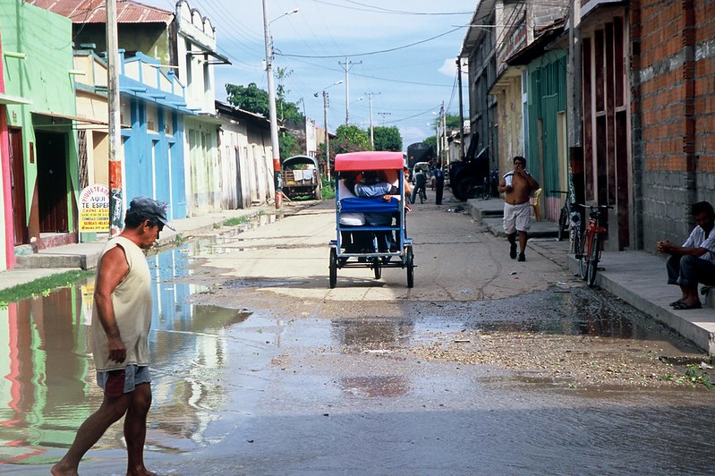

The image comes with a brief description that identifies the photographer, the location (name of the country and town, not GPS location), and the content of the image. The description of the image includes important keywords that, when indexed in a catalog, will support discoverability of the image. This information, to be manually entered, is valuable and must be part of the curated image metadata.

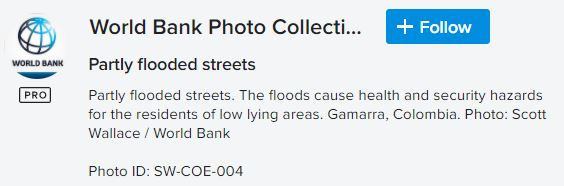

But we can add useful additional information in an automated manner and at low cost using machine learning models. In the example below, we use the (free) on-line ["Try it" tool](https://cloud.google.com/vision) of the Google Vision application. 

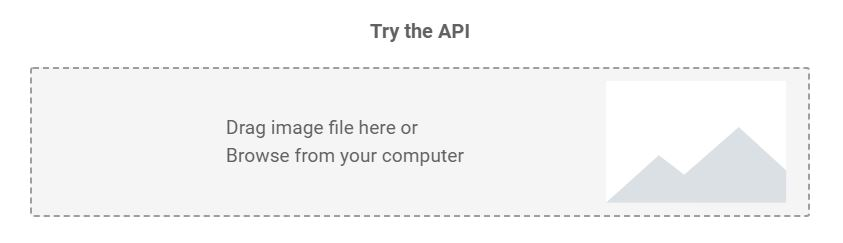

The Google Vision API returns and displays the results of the image processing in multiple tabs. The same content is available programmatically in JSON format. The content of this JSON file can be mapped to elements of the metadata schema, for automatic addition to the image metadata.

The first tab is the result of **faces** detection. Each detected face has a bounding box and metadata such as the derived emotion of the person. The bounding box can be used to automatically flag images that have one or multiple "significant size" face(s) and may have to be excluded from the published images for privacy protection reasons.

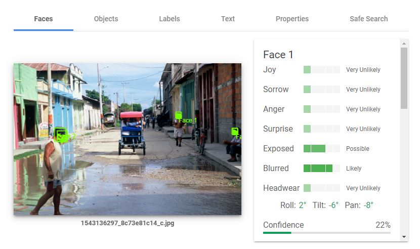

The second tab reports on detected **objects**.

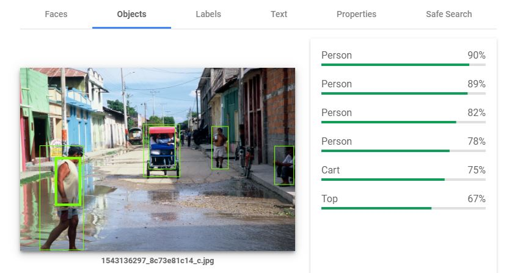

The third tab suggests **labels** that could be attached to the image, provided with a degree of confidence. A threshold can be set to automatically add (or not) each proposed label as a keyword in the image metadata.  

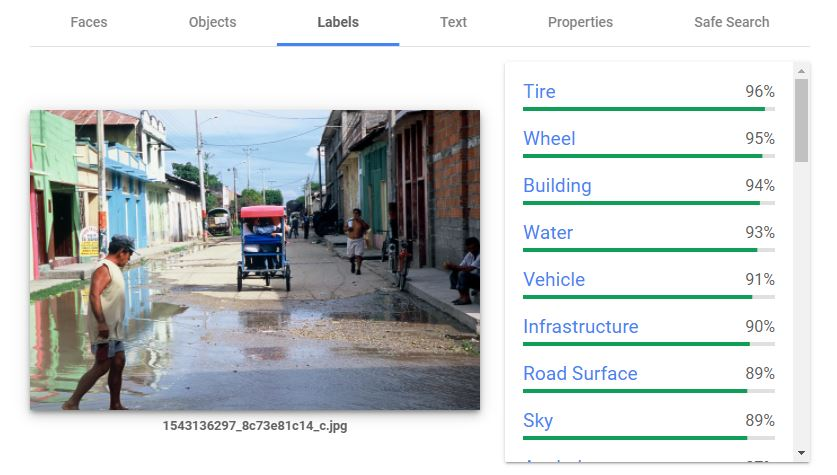

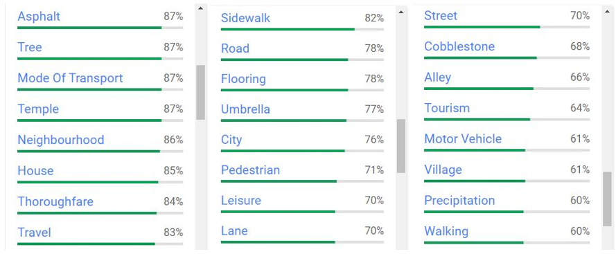

The fourth tab shows the **text** detected in the image. The quality of text detection and recognition depends on the resolution of the image and on the size and orientation of the text in the image. In our example, the algorithm fails to read (most of) the small, rotated and truncated text. 

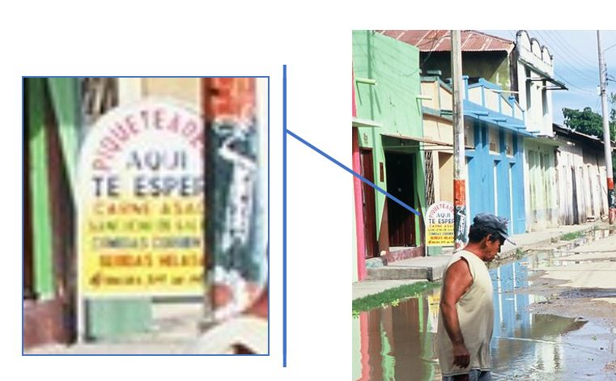

The tool managed to recognize some, but not all characters. In this case, this would be considered as not useful information to be added to the image metadata.

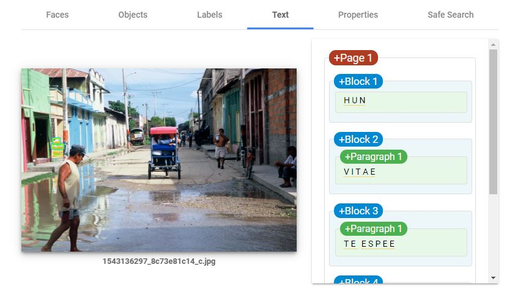

We are not interested in the **properties** tab which does not provide information that can be used for discoverability of images based on their content or source.

The last tab, **Safe search**, could be used as warnings if you plan to make the image publicly accessible.

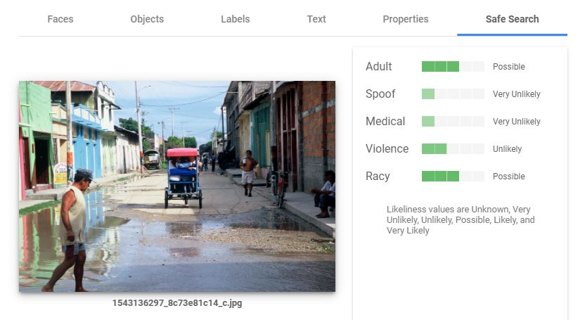

This "Try it" tool demonstrates the capabilities of the application which, for automating the processing of a collection of images, would be accessed programmatically using R, Python or another programming language. Accessing the application's API requires a key. The cost of image labeling, face detection, and other image processing is low. For information on pricing, consult the website of the API providers.
