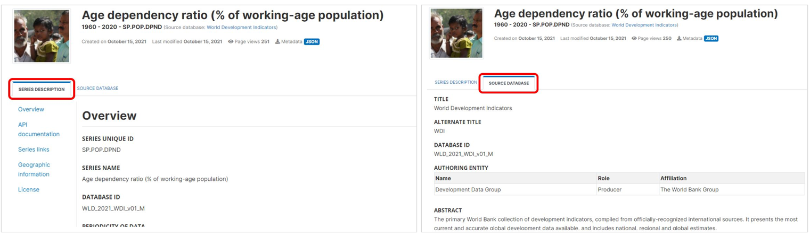
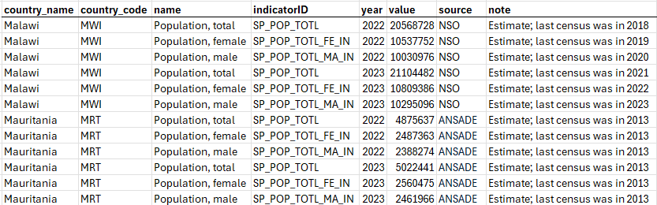
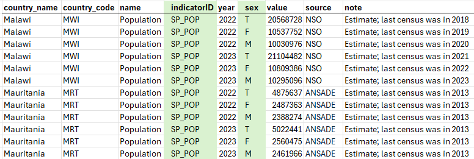
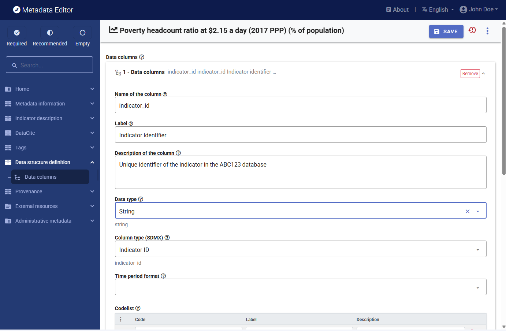
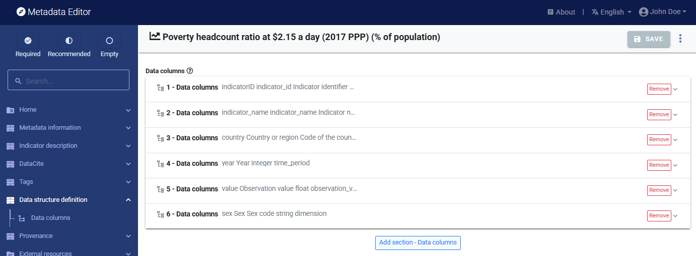

# Documenting indicators and databases

Two metadata schemas are employed to document indicators and their respective databases. The first schema is utilized to individually document each indicator. The second standard is applied to document collections or databases of indicators. We refer to these metadata as schemas and not standards, as they have been developed by the World Bank and are not maintained by an international community. 

## Metadata schemas

### Metadata schema for documenting indicators

Indicators are summary measures that capture key issues or phenomena, derived from observed data. When indicators are presented for a specific geographic area and include a temporal dimension — such as annual, quarterly, monthly, or daily values — they form time series.

To facilitate standardized documentation of indicators, the World Bank developed a metadata standard by compiling and structuring metadata elements commonly used by various organizations, including the World Bank itself, United Nations agencies, the International Monetary Fund (IMF), the Organisation for Economic Co-operation and Development (OECD), and Eurostat.

The World Bank metadata schema aligns with the Statistical Data and Metadata Exchange standard (SDMX), a standard designed to enable machine-to-machine data exchanges.  
- The *descriptive and reference metadata* component of the World Bank schema aligns with SDMX Metadata Structure Definitions (MSDs). MSDs provide a framework for structuring metadata, but do not define the metadata elements to be included. The World Bank’s schema therefore complements SDMX by specifying detailed content that can be incorporated into SDMX MSDs and metadatasets.
- The *structural metadata* in the World Bank schema, which describes how indicator data are organized in the data file or database, aligns with the SDMX Data Structure Definitions (DSDs). 

The Metadata Editor supports this integration by offering tools to:
- Export metadata templates as MSDs – ensuring compatibility with SDMX metadata structures.
- Export indicator metadata as meta-datasets – enabling seamless incorporation of metadata into SDMX-compliant systems.

### Metadata schema for documenting databases of indicators

In addition to documenting individual indicators, the World Bank has developed a complementary metadata schema for documenting databases of indicators (i.e., collections of indicators). This schema provides additional metadata at the database level, which enriches the contextual information available for each indicator.

To establish a clear link between an indicator and its associated database, the indicator metadata schema includes a dedicated element that stores the database identifier, enabling seamless association between indicator metadata and database metadata.

In data catalogs like a NADA catalog, the metadata on indicators and the raleted databases can be combined.
 

## Documenting an indicator

This section describes in detail the process of documenting an indicator, and the various functionalities provided in the Metadata Editor for generating and publishing indicators metadata. The section focuses on the functionalities specific to the documentation of indicators. Refer to the *General instructions* for guidance on the components of the application that are common to all data types.

### Key principles for producing high-quality metadata

The following general principles should be followed to ensure the production of high-quality metadata. They apply broadly across metadata elements used to document statistical indicators. Subsequent sections of this Guide provide detailed instructions and quality criteria for specific metadata elements. These elements and criteria form the foundation of an AI-enabled system for metadata quality assurance and augmentation.
- **Standardize terminology**. Use consistent terms across all metadata. Where applicable, adopt internationally recognized controlled vocabularies or code lists (e.g., for topics, sectors, geographic areas) to enhance interoperability and comparability.
- **Maintain consistency in terminology and jargon**. Avoid mixing technical jargon with general terms unless clearly explained. Use consistent language and avoid introducing synonyms or alternative phrases for the same concept without clear justification.
- **Link related indicators**. Where applicable, establish links among related indicators. Group variants, disaggregations, or derived indicators using relationships such as: Is part of, Has disaggregation, Derived from. This helps users navigate the catalog and understand the relationships among indicators.
- **Spell out acronyms and abbreviations**. Avoid using unexplained acronyms, especially in definitions. Widely recognized acronyms (e.g., GDP, USD) may be used in titles, but must be spelled out or explained in the metadata definition or notes.
- Use accessible and non-technical language. Write metadata in a clear and accessible style. Avoid excessive technical detail. Complex methodological information should be included in referenced documentation, not embedded in core metadata fields.

### Create a new project

The first step in documenting an indicator is to create a new project. You do that by clicking on `CREATE NEW PROJECT` in the *My projects* page, then selecting *Indicator* as data type when prompted. This will open a new, untitled indicator *Project page*. 

In that page, **select the template** you want to use to document the indicator. A default template is proposed; no action is needed if you want to use the default template. Otherwise, switch to another template by clicking on the template name in the *Templates* frame. Note that you can at any time change the template used for the documentation of a project. The selected template will determine what you see in the navigation tree and in the metadata entry pages, but switching from one template to another will not impact the metadata that has already been entered; no information will be deleted from the metadata.

### Enter information on metadata

The *Metadata information* section in the navigation tree (in the *Project page*) contains elements intended to document the metadata being generated, i.e., metadata about the metadata. All content in this section is optional; it is however recommended practice to document the metadata as precisely as possible. This information will not be useful to data users, but it will be to catalog administrators. When metadata is shared across catalogs, the information entered in the *Information on metadata* provides transparency and clarity on the origin of the metadata.

### Enter the indicator description (descriptive metadata)

The documentation of an indicator is a relatively straightforward process. The navigation tree in the *Project page* provides access to various metadata entry pages where the information about the indicator can be captured. These metadata entry pages are defined by the selected template. 

The template includes a description of each metadata element it contains, which can be used as instructions to data curators. Templates can be exported to PDF format, and used as a reference documents by data curators. The instructions contained in templates are also displayed in the metadata entry pages, by clicking on the `?` icon shown next to each metadata element's label.

We provide below some guidance on a selection of the metadata elements found in the metadata schema. A small number of these elements are marked as *required*. When documenting an indicator, it is advised to provide the most comprehensive information possible. 

In the list of metadata elements below, the *key* of each element in the metadata standard is provided between brackets next to the corresponding element's label in the template.

**TITLE STATEMENT**

- **`Primary ID`** (*idno*) A unique identifier (ID) for the indicator. This is a required element. Most agencies will (and should) use a coherent coding convention to generate their indicators identifiers

- **`DOI`** (*doi*) A Digital Object Identifier (DOI) for the the indicator. See the *Documenting data - General instructions* section of the User Guide for more information on DOIs.

- **`Other identifiers`** (*alternate_identifiers*) The element `idno` described above is the reference unique identifier for the catalog in which the metadata is intended to be published. But the same indicator/metadata may be published in other catalogs. For example, a data catalog may publish metadata for indicator extracted from the World Bank World Development Indicators (WDI) database. And the WDI itself contains indicators generated and published by other organizations, such as the World Health Organization or UNICEF. Catalog administrators may want to assign a unique identifier specific to their catalog (the `idno` element), but keep track of the identifier of the indicator or indicator in other catalogs or databases. The `alternate_identifiers` element serves that purpose. It includes the following sub-elements: 
  - **`Type`** (*type*) The type of identifier. For example: "ISBN". 
  - **`Identifier`** (*name*) This element will be used to provide the identifier. 
  - **`Database`** (*database*) The name of the database (or catalog) where this alternative identifier is used, e.g. "IMF, International Financial Statistics (IFS)". 
  - **`URL`** (*uri*) A link (URL) to the database mentioned in `database`.  
  - **`Notes`** (*notes*) Any additional information on the alternate identifier.
    
- **`Name`** (*name*) The name (label) of the indicator. Note that a field `aliases` is provided (see below) to capture alternative names for the indicator. 

- **`Display name`** (*display_name*) The name (label) of the indicator as it should be displayed in a data catalog. 

- **`Aliases`** (*aliases*) An indicator can be referred to using different names. The `aliases` element is provided to capture the multiple names and labels that may be associated with (i.e synomyms of) the documented indicator.

- **`Database ID`** (*database_id*) The unique identifier of the database the indicator belongs to. This field must correspond to the element `database_description > title_statement > idno` in the database schema. This is the field that will be used to establish the link between the database metadata and the indicator metadata.

- **`Database name`** (*database_name*) The name of the database the indicator belongs to (name of the database identified in `Database ID`).

- **`Date released`** (*date_released*) The date, in ISO format (YYYY-MM-DD) when the indicator was released.

**SOURCES, CONCEPTS, AND METHODS**

- **`Definition short`** (*definition_short*) A short definition of the indicator. The short definition captures the essence of the indicator. 
                                                          
- **`Definition long`** (*definition_long*) A long(er) version of the definition of the indicator. If only one definition is available (not a short/long version), it is recommended to capture it in the `definition_short` element. ALternatively, the same definition can be stored in both `definition_short` and `definition_long`.
                                                         
- **`Definition references`** (*definition_references*) This element is provided to link to an external resources from which the definition was extracted. 
  - **`Source`** (*source*) The source of the definition (title, or label).
  - **`URL`** (*uri*) A link (URL) to the source of the definition.
  - **`Note`** (*note*) This element provides for annotating or explaining the reason the reference has been included as part of the metadata.  

- **`Relevance`** (*relevance*) This field documents the relevance of an indicator in relation to a social imperative or policy objective.

- **`Mandate`**
   - **`Mandate`** (*mandate*) Description of the institutional mandate or of a set of rules or other formal set of instructions assigning responsibility as well as the authority to an organization for the collection, processing, and dissemination of statistics for this indicator. 
   - **`Mandate URL`** (*URI*) A link to a resource (document, website) describing the mandate.
 
- **`Data collection`** (*data_collection*) This group of elements can be used to document data collection activities that led to or allowed the production of the indicator. This element will typically be used for the description of surveys or censuses. 
Note: the schema also contains an element "sources". That element will be used to document the organization and/or main data production program from which the indicator is derived. 
  - **`Data source`** (*data_source*) A concise and standardized name (label) for the data source, e.g. "National Labor Force Survey, 1st quarter 2022". If multiple data sources were used, they can all be listed here. Note that if an indicator has values obtained from many different sources, the source for each value (or group of values) will not be part of the indicator metadata, but will be stored as an attribute in the data file where the information can be associated with a specific observation ("cell note" or group of observation (e.g. attached to an indicator for avv values for a same year or for a same area).
  - **`Data collection method`** (*method*) Brief information on the data collection method, e.g. :Sample household survey".
  - **`Data collection period`** (*period*) Information on the period of the data collection, e.g. "January to March 2022".  
  - **`Data collection note`** (*note*) Additional information on the data collection.
  - **`Data collection URL`** (*uri*) A link to a resource (website, document) where more information on the data collection can be found.
 
- **`Methodology`** (*methodology*) Methodological details on the production of the series or indicator.

- **`Methodology references`** (*methodology_references*) This element is provided to link to an external resources from which the definition was extracted.
  - **`Source`** (*source*) The source of the information on methodology. 
  - **`URL`** (*uri*) A link (URL) to the source of the information on methodology. 
  - **`Note`** (*note*) This element provides for annotating or explaining the reason the reference has been included as part of the metadata.
   
- **`Derivation`** (*derivation*) Description of the derivation method (not including imputations, which should be described in element "Imputation").
  - **`Source`** (*source*) The source of the information on derivation. 
  - **`URL`** (*uri*) A link (URL) to the source of the information on derivation. 
  - **`Note`** (*note*) This element provides for annotating or explaining the reason the reference has been included as part of the metadata.  

- **`Derivation references`** (*derivation_references*) This element is provided to link to an external resources from which the definition was extracted.

- **`Imputation`** (*imputation*) Data may have been imputed to account for data gaps or for other reasons (harmonization/standardization, and others). If imputations have been made, this element provides the space for their description.

- **`Imputation references`** (*imputation_references*) This element is provided to link to an external resources from which the definition was extracted.
  - **`Source`** (*source*) The source of the information on imputation. 
  - **`URL`** (*uri*) A link (URL) to the source of the information on imputation. 
  - **`Note`** (*note*) This element provides for annotating or explaining the reason the reference has been included as part of the metadata.

- **`Statistical concept`** (*statistical_concept*) This element allows to insert a reference of the indicator with content of a statistical character. This can include coding concepts or standards that are applied to render the data statistically relevant.

- **`Concept references`** (*concept_references*) This element is provided to link to an external resources from which the definition was extracted.
  - **`Source`** (*source*) The source of the information on statistical concepts. 
  - **`URL`** (*uri*) A link (URL) to the source of the information on statistical concepts. 
  - **`Note`** (*note*) This element provides for annotating or explaining the reason the reference has been included as part of the metadata.
                                                   
- **`Related concepts`** (*concepts*) This repeatable element can be used to document concepts related to the indicators (other than the main statistical concept that may have been entered in `statisticsl_concept`). For example, the concept of *malnutrition* could be documented in relation to the indicators "Prevalence of stunting" and "Prevalence of wasting".
  - **`Name`** (*name*) A concise and standardized name (label) for the concept.
  - **`Definition`** (*definition*) The definition of the concept. 
  - **`URL`** (*uri*) A link (URL) to a resource providing more detailed information on the concept.  

- **`Aggregation method`** (*aggregation_method*) The `aggregation_method` element describes how values can be aggregated from one geographic level (for example, a country) to a higher-level geographic area (for example, a group of country defined based on a geographic criteria (region, world) or another criteria (low/medium/high-income countries, island countries, OECD countries, etc.). The aggregation method can be simple (like "sum" or "population-weighted average") or more complex, involving weighting of values. 

- **`Aggregation references`** (*aggregation_references*) This element is provided to link to an external resources from which the aggregation method was extracted.
  - **`Source`** (*source*) The source of the information on aggregation. 
  - **`URL`** (*uri*) A link (URL) to the source of the information on aggregation. 
  - **`Note`** (*note*) This element provides for annotating or explaining the reason the reference has been included as part of the metadata.

- **`Sources of data`** (*sources*) This element provides information on the source(s) of data that were used to generate the indicator. A source can refer to an organization (e.g., "Source: World Health Organization"), or to a dataset (e.g., for a national poverty headcount indicator, the sources will likely be a list of sample household surveys). In `sources`, we are mainly interested in the latter. When an indicator in a database is an indicator extracted from another database (e.g., when the World Bank World Development Indicators include an indicator from the World Health Organization in its database), the source organization should be mentioned in the `authoring_entity` element of the schema. The `sources` element is a repeatable element. 
Note 1: In some cases, the source of a specific value in a database will be stored as an attribute of the data file (e.g., as a "footnote" attached to a specific cell. If the sources are listed in the data file, they may but do not need to be stored in the metadata. 
Note 2: the schema also contains an element "data_collection" that would be used to describe a specific data collection activity from which an indicator is derived. 
  - **`Identifier`** (*idno*) This element records the unique identifier of a source. It is a required element. If the source does not have a specific unique identifier, a sequential number can be used. If the source is a dataset or database that has its own unique identifier (possibly a DOI), this identifier should be used.
  - **`Other identifiers`** (*other_identifiers*) This repeatable element is used to enter identifiers (IDs) other than the primary ID.
    -  **`Type`** (*type*) The type of identifier. For example: “DOI”, or "ISBN". 
    -  **`Identifier`** (*identifier*) The identifier itself. 
  - **`Type`** (*type*) The type of source, e.g. "household survey", "administrative data", or "external database".
  - **`Name`** (*name*) The name (title, or label) of the source. 
  - **`Organization`** (*organization*) The organization responsible for the source data.  
  - **`Authors`** (*authors*) Authors (with detailed information on authors)
  - **`Datasets`** (*datasets*) 
    -  **`Identifier`** (*idno*) The identifier of the dataset.
    -  **`Title`** (*idno*) Name (title) of the dataset.
    -  **`URL`** (*idno*) Link to a dataset website.
  - **`Publisher`** (*publisher*) 
  - **`Publication date`** (*publication_date*) 
  - **`URL`** (*uri*) 
  - **`Date accessed`** (*access_date*) 
  - **`Notes`** (*note*) This element can be used to provide additional information regarding the source data.  

- **`Notes on data source`** (*sources_note*) Additional information on the source(s) of data used to generate the indicator or indicator.

**STANDARDS AND FRAMEWORKS**

- **`Standards`** (*compliance*) For some indicators, international standards have been established. This is for example the case of indicators like the unemployment or unemployment rate, for which the International Conference of Labour Statisticians defines the standards concepts and methods. The `compliance` element is used to document the compliance of an indicator with one or multiple national or international standards.  
  - **`Name`** (*standard*) The name of the standard that the indicator complies with. This name will ideally include a label and a version or a date. For example: "International Standard Industrial Classification of All Economic Activities (ISIC) Revision 4, published in 2007"
  - **`Abbreviation`** (*abbreviation*) The acronym of the standard that the indicator complies with.
  - **`Custodian`** (*custodian*) The organization that maintains the standard that is being used for compliance. For example: "United Nations Statistics Division".
  - **`URL`** (*uri*) A link to a public website site where information on the compliance standard can be obtained. For example: "https://unstats.un.org/unsd/classifications/Family/Detail/27
    
- **`Frameworks`** (*framework*) Some national, regional, and international agencies develop monitoring frameworks, with goals, targets, and indicators. Some well-known examples are the [Millennium Development Goals](https://www.un.org/millenniumgoals/) and the [Sustainable Development Goals](https://sdgs.un.org/goals) which establish international goals for human development, or the World Summit for Children (1990) which set international goals in the areas of child survival, development and protection, supporting sector goals such as women’s health and education, nutrition, child health, water and sanitation, basic education, and children in difficult circumstances. The `framework` element is used to link an indicator to the framework, goal, and target associated with it. 
  - **`Name`** (*name*) The name of the framework. 
  - **`Abbreviation`** (*abbreviation*) The abreviation of the name of the framework. 
  - **`Custodian`** (*custodian*) The name of the organization that is the official custodian of the framework.
  - **`Description`** (*description*) A brief description of the framework. 
  - **`Goal ID`** (*goal_id*) The identifier of the Goal that the indicator is associated with.
  - **`Goal name`** (*goal_name*) The name (label) of the Goal that the indicator is associated with.  
  - **`Goal description`** (*goal_description*) A brief description of the Goal that the indicator is associated with.
  - **`Target ID`** (*target_id*) The identifier of the Target that the indicator is associated with.
  - **`Target name`** (*target_name*) The name (label) of the Target that the indicator is associated with.
  - **`Target description`** (*target_description*) A brief description of the Target that the indicator is associated with.
  - **`Indicator ID`** (*indicator_id*) The identifier of the indicator, as provided in the framework (this is not the `idno` identifier).
  - **`Indicator name`** (*indicator_name*) The name of the indicator, as provided in the framework (which may be different from the name provided in `name`)
  - **`Indicator description`** (*indicator_description*) A brief description of the indicator, as provided in the framework.
  - **`URL`** (*uri*) A link to a website providing detailed information on the framework, its goals, targets, and indicators.
  - **`Notes`** (*notes*) Any additional information on the relationship between the indicator and the framework.  

**QUALITY**

- **`Limitation`** (*limitation*) This element is used to communicate to the user any limitations or exceptions in using the data. The limitations may result from the methodology, from issues of quality or consistency in the data source, or other. 
 
- **`Validation rules`** (*validation_rules*) Description of the set of rules (itemized) used to validate values for the indicator, e.g. "Is within range 0-100", or "Is the sum of indicator X + indicator Y".

- **`Quality checks`** (*quality_checks*) Data may have gone through data quality checks to assure that the values are reasonable and coherent, which can be described in this element. These quality checks may include checking for outlying values or other. A brief description of such quality control procedures will contribute to reinforcing the credibility of the data being disseminated. 

- **`Quality note`** (*quality_note*) Additional notes or an overall statement on data quality. These could for example cover non-standard quality notes and/or information on independent reviews on the data quality.

- **`Discrepancies`** (*sources_discrepancies*) This element is used to describe and explain why the data in the indicator may be different from the data for the same indicator published in other sources. International organizations, for example, may apply different techniques to make data obtained from national sources comparable across countries, in which cases the data published in international databases may differ from the data published in national, official databases.
 
- **`Adjustments`** (*adjustments*) Description of any adjustments with respect to use of standard classifications and harmonization of breakdowns for age group and other dimensions, or adjustments made for compliance with specific international or national definitions.

- **`Missing`** (*missing*) Information on missing values in the indicator or indicator. This information can be related to treatment of missing values, to the cause(s) of missing values, and others.

- **`Errata`** (*errata*) This element is used to provide information on detected errors in the data or metadata for the indicator, and on the measures taken to remedy them. 
  - **`Date`** (*date*) The date the erratum was published. 
  - **`Description`** (*description*) A description of the error and remedy measures.  

- **`Acknowledgements`** (*acknowledgements*) Itemized list of persons and organizations being acknowledged
  - **`Name`** (*name*) Name of the person or organization being acknowledged. 
  - **`Affiliation`** (*affiliation*) Affiliation of the person being acknowledged.
  - **`Role`** (*role*) Role of the person or organization being acknowledged. 

- **`Acknowledgement statement`** (*acknowledgement_statement*) Overall statement of acknowledgement.

 - **`Disclaimer`** (*disclaimer*) A disclaimer statement that applies to the indicator.

**GEOGRAPHIC AND TIME COVERAGE**

- **`Time coverage`** (*time_periods*) The time period covers the entire span of data available for the indicator. The time period has a start and an end and is reported according to the periodicity provided in a previous element. The dates should be entered in ISO 8601 format (YYYY-MM-DD or YYYY-MM or YYYY).
  - **`Start`** (*start*) The initial date of the indicator in the dataset. 
  - **`End`** (*end*) The end date is the latest date for which an estimate for the indicator is available. 

- **`Countries`** (*ref_country*) A list of countries or economies for which data are available in the indicator. This element is somewhat redundant with the next element (`geographic_units`) which may also contain a list of countries. Identifying geographic areas of type "country" is important to enable filters and facets in data catalogs (country names are among the most frequent queries submitted to catalogs).
  - **`Name`** (*name*) The name of the country.
  - **`Code`** (*code*) The code of the country. The use of the [ISO 3166-1 alpha-3](https://en.wikipedia.org/wiki/ISO_3166-1_alpha-3) codes is recommended. 
                             
- **`Geographic areas`** (*geographic_units*) List of geographic units (regions, countries, states, provinces, etc.) for which data are available for the indicator.
  - **`Name`** (*name*) Name of the geographic unit e.g. "World, "Africa", "Afghanistan", "OECD countries", "Bangkok".
  - **`Code`** (*code*) Code of the geographic unit. The [ISO 3166-1 alpha-3](https://en.wikipedia.org/wiki/ISO_3166-1_alpha-3)  code is preferred when the unit is a country.
  - **`Type`** (*type*) Type of geographic unit e.g. "country", "state", "region", "province", "city", etc.   

- **`Bounding box`** (*bbox*) This element is used to define one or multiple bounding box(es), which are the rectangular fundamental geometric description of the geographic coverage of the data. A bounding box is defined by west and east longitudes and north and south latitudes, and includes the largest geographic extent of the dataset's geographic coverage. The bounding box provides the geographic coordinates of the top left (north/west) and bottom-right (south/east) corners of a rectangular area. This element can be used in catalogs as the first pass of a coordinate-based search. This element is optional, but if the `bound_poly` element (see below) is used, then the `bbox` element must be included.
  - **`West`** (*west*) West longitude of the bounding box.
  - **`East`** (*east*) East longitude of the bounding box.
  - **`South`** (*south*) South latitude of the bounding box.
  - **`North`** (*north*) North latitude of the bounding box.

**DESCRIPTION**

- **`Authoring entity`** (*authoring_entity*) This set of five elements is used to identify the organization(s) or person(s) who are the main producers/curators of the indicator. Note that a similar element is provided at the database level. The authoring_entity for the indicator can be different from the authoring_entity of the database. For example, the World Bank is the authoring entity for the World Development Indicators database, which contains indicators obtained from the International Monetary Fund, World Health Organization, and other organizations that are thus the authoring entitis for specific indicators.  
  - **`Name`** (*name*) The name of the person or organization who is responsible for the production of the indicator. Write the name in full (use the element `abbreviation` to capture the acronym of the organization, if relevant). 
  - **`Affiliation`** (*affiliation*) The affiliation of the person or organization mentioned in `name`.  
  - **`Abbreviation`** (*abbreviation*) Abbreviated name (acronym) of the organization mentioned in `name`.
  - **`Email`** (*email*) The public email contact of the person or organizations mentioned in `name`. It is good practice to provide a service account email address, not a personal one.
  - **`URL`** (*uri*) A link (URL) to the website of the entity mentioned in `name`.
 
- **`Measurement unit`** (*measurement_unit*) The unit of measurement. Note that in many databases the measurement unit will also be mentioned in the indicator name. The World Bank's World Development Indicators (WDI) for example, contains indicators named as follows: "CO2 emissions (kg per 2010 US$ of GDP)", "GDP per capita (current US$)", "GDP per capita (current LCU)", or "Population density (people per sq. km of land area)".
 
- **`Dimensions`** (*dimensions*) An indicator can be made available with different levels of disaggregation. For example, an indicator containing annual estimates of the "Resident population (mid-year)" can be provided by urban/rural area of residence, by sex, and by age group. The `dimension` element may be used to document such disaggregations. Note that the element should only be used when the `Data Structure Definition` of the indicator is not documented (see below the section on structural metadata). Documenting the Data Structured Definition is the preferred way of documenting the dimensions of an indicator. 
  - **`Name`** (*name*) The name of the dimension.
  - **`Label`** (*label*) The label of the dimension, for example "sex", or "urban/rural".
  - **`Description`** (*description*) A description of the dimension (for example, if the label is "age group", the description can provide detailed information on the age groups, e.g. "The age groups in the database are 0-14, 15-49, 50-64, and 65+ years old".)  

- **`Release calendar`** (*release_calendar*) Information on when updates for the indicators can be expected. This will usually not consist of exact dates (which would have to be updated regularly), but of more general information like "Every first Monday of the Month", or "Every year on June 30", or "The last week of each quarter". 

- **`Periodicity`** (*periodicity*) The periodicity of the indicator. It is recommended to use a controlled vocabulary with values like *annual*, *quarterly*, *monthly*, *daily*, etc. 

- **`Base period`** (*base_period*) The base period for the indicator. This field will only apply to indicators that require a base year (or other reference time) used as a benchmark, like a Consumer Price Index (CPI) which will have a value of 100 for a reference base year. 
                                                        
- **`Breaks in series`** (*series_break*) Breaks in statistical series occur when there is a change in the standards, sources of data, or reference year used in the compilation of a series. Breaks in series must be well documented. The documentation should include the reason(s) for the break, the time it occured, and information on the impact on comparability of data over time.

- **`Keywords`** (*keywords*) Words or phrases that describe salient aspects of a data collection's content. Can be used for building keyword indexes and for classification and retrieval purposes. A controlled vocabulary can be employed. Keywords should be selected from a standard thesaurus, preferably an international, multilingual thesaurus.  
  - **`Keyword`** (*name*) Keyword (or phrase). Keywords summarize the content or subject matter of the study. 
  - **`Vocabulary`** (*vocabulary*) Controlled vocabulary from which the keyword is extracted, if any.  
  - **`URL`** (*uri*) The URI of the controlled vocabulary used, if any.

- **`Topics`** (*topics*) The `topics` field indicates the broad substantive topic(s) that the indicator covers. A topic classification facilitates referencing and searches in electronic survey catalogs. Topics should be selected from a standard controlled vocabulary such as the [Council of European Social Science Data Archives (CESSDA) topics classification](https://vocabularies.cessda.eu/vocabulary/TopicClassification).  
  - **`ID`** (*id*) The unique identifier of the topic. It can be a sequential number, or the ID of the topic in a controlled vocabulary.
  - **`Label`** (*name*) The label of the topic associated with the data.  
  - **`Parent ID`** (*parent_id*) When a hierarchical (nested) controlled vocabulary is used, the `parent_id` field can be used to indicate a higher-level topic to which this topic belongs.
  - **`Vocabulary`** (*vocabulary*) The name of the controlled vocabulary used, if any. 
  - **`URL`** (*uri*) A link to the controlled vocabulary mentioned in field `vocabulary`.
    
- **`Themes`** (*themes*) Themes provide a general idea of the research that might guide the creation and/or demand for the indicator. A theme is broad and is likely also subject to a community based definition or list. A controlled vocabulary should be used. This element will rarely be used (the element `topics` described below will be used more often).
  - **`ID`** (*id*) The unique identifier of the theme. It can be a sequential number, or the ID of the theme in a controlled vocabulary.
  - **`Name`** (*name*) The label of the theme associated with the data. 
  - **`Parent ID`** (*parent_id*) When a hierarchical (nested) controlled vocabulary is used, the `parent_id` field can be used to indicate a higher-level theme to which this theme belongs.
  - **`Vocabulary`** (*vocabulary*) The name of the controlled vocabulary used, if any. 
  - **`URL`** (*uri*) A link to the controlled vocabulary mentioned in field `vocabulary'.

- **`Disciplines`** (*disciplines*) Information on the academic disciplines related to the content of the document. A controlled vocabulary will preferably be used, for example the one provided by the list of academic fields in [Wikipedia](https://en.wikipedia.org/wiki/List_of_academic_fields). This is a block of five elements:
  - **`ID`** (*id*) The ID of the discipline, preferably taken from a controlled vocabulary.
  - **`Name`** (*name*) The name (label) of the discipline, preferably taken from a controlled vocabulary.
  - **`Parent ID`** (*parent_id*) The parent ID of the discipline (ID of the item one level up in the hierarchy), if a hierarchical controlled vocabulary is used.
  - **`Vocabulary`** (*vocabulary*) The name (including version number) of the controlled vocabulary used, if any.
  - **`URL`** (*uri*) The URL to the controlled vocabulary used, if any.  
 
- **`Disaggregation`** (*disaggregation*) This element is intended to inform users that an indicator is available at various levels of disaggregation. The related indicator should be listed (by andme and/or identifier). For indicator "Population, total" for example, one may inform the user that the indicator is also available (in other indicators) by sex, urban/rural, and age group (in indicator "Population, male" and "Population, female", etc.).

- **`Language`** (*language*) The language of the indicator/series metadata. For the language codes and names, the use of the ISO 639-2 standard is recommended.
  
- **`Acronyms`** (*acronyms*) The `acronyms` element is used to document the meaning of all acronyms used in the metadata of an indicator. If some acronyms are well known (like "GDP", or "IMF" for example), others may be less obvious or could be uncertain (does "PPP" mean "public-private partnership", or "purchasing power parity"?). In any case, providing a list of acronyms with their meaning will help users and make your metadata more discoverable. Note that acronyms should not include country codes used in the documentation of the geographic coverage of the data. 
  - **`Acronym`** (*acronym*) An acronym referenced in the indicator metadata (e.g. "GDP").
  - **`Expansion`** (*expansion*) The expansion of the acronym, i.e. the full name or title that it represents (e.g., "Gross Domestic Product").
  - **`Occurrence`** (*occurrence*) This numeric element can be used to indicate the number of times the acronym is mentioned in the metadata. The element will rarely be used.  

- **`Related indicators`** (*related_indicators*) This element allows to reference indicators that are often associated with the indicator being documented.
  - **`Code`** (*code*) The code for the indicator that is referenced in the document. It will likely be an ID that is used by that indicator.
  - **`Label`** (*label*) The name or label of the indicator that is associated with the indicator being documented.
  - **`URL`** (*uri*) A link to the related indicator.
 
- **`Indicator group`** (*series_group*) The group(s) the indicator belongs to. Groups can be create to organize indicators by theme, producer, or other.  
  - **`Group name`** (*name*) The name of the group.
  - **`Description`** (*description*) A brief description of the group.
  - **`Version`** (*version*) The version of the grouping.
  - **`URL`** (*uri*) A link to a public website site where information on the grouping can be obtained.   

- **`Notes`** (*notes*) This element is open and reserved for explanatory notes deemed useful to the users of the data. Notes should account for additional information that might help: replicate the indicator; access the data and research area, or discoverability in general. 
  - **`note`** (*note*) The note itself.  

 **ACCESS AND USE**
 
- **`License`** (*license*) The license refers to the accessibility and terms of use associated with the data. Providing a license and a link to the terms of the license allos data users to determine, with full clarity, what they can and cannot do with the data.
  - **`Name`** (*name*) The name of the license, e.g. "Creative Commons Attribution 4.0 International license (CC-BY 4.0)".
  - **`URL`** (*uri*) The URL of a website where the licensed is described in detail, for example "https://creativecommons.org/licenses/by/4.0/". 
  - **`Note`** (*note*) Any additional information on the license.  

- **`Confidentiality statement`** (*confidentiality*) A statement of confidentiality for the indicator. 
                                                                                
- **`Confidentiality status`** (*confidentiality_status*) This indicates a confidentiality status for the indicator. A controlled vocabulary should be used with possible options "public", "official use only", "confidential", "strictly confidential". When all indicators are made publicly available, and belong to a database that has an open or public access policy, this element can be ignored.

- **`Confidentiality note`** (*confidentiality_note*) This element is reserved for additional notes regarding confidentiality of the data. This could involve references to specific laws and circumstances regarding the use of data.

- **`Citation requirement`** (*citation_requirement*) This element is used to provide information on how the data should be cited. This can include the preferred citation format, the name of the author, the title of the data, the date of publication, the version of the data, and the URL of the data.
                                                 
- **`Links`** (*links*) This element provides links to online resources of any type that could be useful to the data users. This can be links to description of methods and reference documents, analytics tools, visualizations, data sources, or other. 
  - **`Type`** (*type*) This element allows to classify the link that is provided. 
  - **`Description`** (*description*) A description of the link that is provided. 
  - **`URL`** (*uri*) The uri (URL) to the described resource.  

- **`Contacts`** (*contacts*) The `contacts` element provides the public interface for questions associated with the production of the indicator.  
  - **`Name`** (*name*) The name of the contact person that should be contacted. Instead of the name of an individual (which would be subject to change and require frequent update of the metadata), a title can be provided here (e.g. "data helpdesk"). 
  - **`Role`** (*role*) The specific role of the contact person mentioned in `name`. This will be used when multiple contacts are listed, and is intended to help users direct their questions and requests to the right contact person.      
  - **`Affiliation`** (*affiliation*) The organization or affiliation of the contact person mentioned in `name`. 
  - **`Email`** (*email*) The email address of the person or organization mentioned in `name`. Avoid using personal email accounts; the use of an anonymous email is recommended (e.g, "helpdesk@....org")
  - **`Phone`** (*telephone*) The phone number of the person or organization mentioned in `name`.
  - **`URL`** (*uri*) The URI of the agency (typically, a URL to a "Contact us" web page).   
 
- **`API documentation`** (*api_documentation*) Increasingly, data are made accessible via Application Programming Interfaces (APIs). The API associated with an indicator must be documented. The documentation will usually not be specific to an indicator, but apply to all indicators in a same database.
  - **`Description`** (*description*) This element will not contain the API documentation itself, but information on what documentation is available.
  - **`URL`** (*uri*) The URL of the API documentation.  
 
- **`Periodicity`** (*periodicity*) The periodicity of the series. It is recommended to use a controlled vocabulary with values like annual, quarterly, monthly, daily, ad-hoc, etc.
                                                                 

**VERSION STATEMENT**

- **`Version`** (*version*)

- **`Version date`** (*version_date*) 

- **`Version notes`** (*version_notes*)

- **`Version responsibility`** (*version_resp*)

### Use of AI to enhance descriptive metadata

You may take advantage of generative AI tools like ChatGPT or equivalent to suggest content for selected fields. For example, generative AI can help:
- Suggest **keywords** (ask ChatGPT to "Please suggest 20 keywords related to an indicator titled (*enter the title of the indicator here*) defined as (*enter the definition of the indicator here*).
- Propose a **definition** (ask ChatGPT to either *Suggest a definition for a statistical indicator titled (...)*) or to *Improve the following definition of a statistical indicator titled (title) and currently defined as (definition)*. 
- Propose a description of the indicator's **relevance** (ask ChatGPT to either *Please describe the relevance of a statistical indicator titled (...) and defined as (definition). In the description, indicate to whom and for what purposes the indicator is relevant.* 
Do not blindly accept suggestions formulated by AI models. Carefully review and improve (or reject) the proposed content.

### Data structure (structural metadata)

The data structure definition (DSD) allows you to describe how the data are organized in the data file. This is the structural metadata for the indicator. The DSD in the Metadata Editor follows the SDMX standard.

In a data file, the indicator is supposed to be stored in long (not wide) format, i.e. in a database type of format where each row corresponds to one observation value. Each row must contain the core information required to define what the observation value represents, complemented by additional (optional) information.  

Typically, a data file for an indicator will look like one of the two options below, which use the population by sex of two countries as an example.

- ***Option 1***. In option 1, the population by sex is provided as three different indicators: Population, total", "Population, male", and "Population, female". The data file may look like this:

   

 - ***Option 2***. In option 2, the information is provided as a single indicator ("Population" with a *dimension* "sex" with values M, F or T for Male, Female, and Total).

   

Organizations make their own decisions on how to organize their indicators. Using dimensions has the advantage of reducing the number of indicators. But it makes data discovery (indexing and search in data catalogs) somewhat more complex. In some cases, the use of dimensions is the only practical option. For example, data on population by age group (with 9 age groups + total), sex (2 options + total), and urban/rural (2 options with total) would require 10 x 3 x 3 = 90 different indicators. Maintaining a single indicator "population" with 3 dimensions would be more efficient (one indicator can have multiple dimensions).

Properly documenting the data structure of an indicator provides users (and machines) with the information they need to query and use the data.

A data structure definition consists of providing the following information about the indicator and the way it is organized in the data file. This information will be provided **for each column of the data file**:
- ***Name:*** The column name
- ***Label:*** The column label
- ***Description:*** A brief description of the column
- ***Data type:*** The type of variable, with the following possible values: String, Integer, Float, Date, and Boolean.
- ***Column type:*** The type of column, with the following options:
  - ***Dimension:*** In our Option 2 example, column "sex" is a dimension.
  - ***Time period:*** The column indicates the time period to which the observation value applies. In our Option 2 example, "year" is a time period.
  - ***Attribute:*** 
  - ***Indicator ID:*** The column is the indicator unique identifier. Only one column can be an Indicator ID. In our Option 2 example, "IndicatorID" is the Indicator ID.
  - ***Indicator name:*** The column is the name (or title) of the indicator. In our Option 2 example, "Name" is the indicator name.
  - ***Annotation:*** 
  - ***Geography:*** The geographic area to which the value corresponds. In our example, column "country" is the geography.
  - ***Observation value:*** The observation value (the "data" itself). In our example, column "value" is the observation value.
  - ***Periodicity:*** 
- ***Time period format:*** Time period format is used to indicate the format of the date in the column identified as Time period. In our Option 2 example, Time period format is "YYYY" as we have data by year.
- ***Codelist:***
- ***Codelist reference:***

All columns in the data file will be documented.

### DataCite

See section "Documenting - General instructions".

### Provenance

The **Provenance** container is used to document how and when the dataset was acquired. It is used to ensure traceability. See section "Documenting - General instructions".

### Tags

See section "Documenting - General instructions".

### External resources

External resources are all materials (and links) that relate to the indicator. This may include documents on methodology, scripts, photos and videos, and any other resource available in digital format. These materials and links are added to the documentation of an indicator in the External resources container. Click on **External resources** in the navigation tree, then on CREATE RESOURCE. Enter the relevant information on the resource (at least a title), then provide either a filename (the file will then be uploaded on the server that hosts the Metadata Editor) or a URL to the resource.

External resources that have already been created for another project can also be imported. To do that, they must first be exported as JSON or RDF from the other project. The click on IMPORT in the External resources page, and select the file. 

External resources will be part of the project ZIP package (when the ZIP package is generated - See the main menu). 

### Export and publish

The indicator metadata can be saved as a JSON file, or exported as a ZIP package. The metadata can also be published in a NADA catalog using the *Publish to NADA* option.

## Database-level metadata

When an indicator is part of a database (or *dataset*), you may want to document the database in addition to each indicator it contains. The database-level metadata is the metadata that describes the database, which can be attached to the metadata of each indicator. The database only needs to be documented once. The database unique identifier can then be entered in the indicator-level metadata in the metadata element `databaseID`. 

### Create a new project

The first step in documenting a database is to create a new project. You do that by clicking on `CREATE NEW PROJECT` in the *My projects* page, then selecting *Database* as data type when prompted. This will open a new, untitled *Project page*. 

In that page, **select the template** you want to use to document the database. A default template is proposed; no action is needed if you want to use the default template. Otherwise, switch to another template by clicking on the template name in the *Templates* frame. Note that you can at any time change the template used for the documentation of a project. The selected template will determine what you see in the navigation tree and in the metadata entry pages, but switching from one template to another will not impact the metadata that has already been entered; no information will be deleted from the metadata.

### Enter information on metadata

The *Metadata information* section in the navigation tree (in the *Project page*) contains elements intended to document the metadata being generated, i.e., metadata about the metadata. All content in this section is optional; it is however recommended practice to document the metadata as precisely as possible. This information will not be useful to data users, but it will be to catalog administrators. When metadata is shared across catalogs, the information entered in the *Information on metadata* provides transparency and clarity on the origin of the metadata.

### Enter a description of the database (descriptive metadata)

We describe here the elements included in the proposed template.

**INFORMATION ON METADATA**

- **`Document title`** The title of the metadata document (which may be the title of the database itself). The "metadata document" is the metadata file (XML or JSON file) that is being generated.

- **`Document ID`** A unique identifier for the database metadata document. This identifier must be unique in the catalog where the metadata are intended to be published. Ideally, the identifier should also be unique globally. This is different from the "Primary ID" in section Database description / Title statement, although it is good practice to generate identifiers that establish a clear connection between these two identifiers. The Document ID could also include the metadata document version identifier. For example, if the "Primary ID" of the World Development Indicators (WDI) database - April 2022 is "WDI_2022-04, the "Document ID" in the Metadata information could be “WB_WDI_2022-04” if the metadata are produced by the World Bank. Each organization should establish systematic rules to generate such IDs. A validation rule can be set (using a regular expression) in user templates to enforce a specific ID format. The identifier may not contain blank spaces.

- **`Metadata producers`** The metadata producer is the person or organization with the financial and/or administrative responsibility for the processes whereby the metadata document was created. This is a "Recommended" element. For catalog administration purposes, information on the producer and on the date of metadata production is useful.
  - **`Name`** The name of the person or organization who produced the metadata or contributed to its production.
  - **`Abbreviation`** The abbreviation (or acronym) of the organization that is referenced in "Name".
  - **`Affiliation`** The affiliation of the person or organization mentioned in "Name".
  - **`Role`** The specific role of the person or organization mentioned in "Name" in the production of the metadata.

- **`Production date`** The date the metadata on this database was produced (not distributed or archived), preferably entered in ISO 8601 format (YYYY-MM-DD or YYY-MM). A validation rule can be set in user templates to enforce a date format. This is a "Recommended" element, as information on the producer and on the date of metadata production is useful for catalog administration purposes.

- **`Version`** The version of the metadata document (not the version of the database itself).

**DATABASE DESCRIPTION**

**TITLE STATEMENT** 

 - **`Primary ID`** A unique identifier of the database. For example, the World Bank’s World Development Indicators database published in April 2020 could have Main identifier = “WB_WDI_APR_2020”. The "Primary ID" (also referred to as IDNO) is a unique identification number used to identify the database. A unique identifier is required for cataloguing purpose, so this element is declared as "Required". The identifier will allow users to cite the database properly. The identifier must be unique within the catalog. Ideally, it should also be globally unique; the recommended option is to obtain a Digital Object Identifier (DOI) for the study. Alternatively, the "Primary ID" can be constructed by an organization using a consistent scheme. Note that the schema allows you to provide more than one identifier for a same study (in element "Other identifiers"); a catalog-specific identifier is thus not incompatible with a globally unique identifier like a DOI. A validation rule can be set (using a regular expression) in user templates to enforce a specific ID format. The identifier may not contain blank spaces.

- **`Other identifiers`** This repeatable element is used to enter identifiers (IDs) other than the "Primary ID" (IDNO). It can for example be a Digital Object Identifier (DOI). The "Primary ID" can be repeated here (the "Primary ID" does not provide a "Type" parameter, so if a DOI or other standard ID type is used as main identifier, it is recommended to repeat it here with the identification of the type).
  - **`Type`** The type of identifier. For example: “DOI”, or "ISBN".
  - **`Identifier`** The identifier itself.

- **`Title`** The title is the name by which the database is formally known. Make sure to use a unique title for each distinct database (or version of). It is good practice to include the year of production in the title (and possibly the month, or quarter, if a new version of the database is released more than once a year). For example, “World Development Indicators, April 2020”. Pay attention to the consistent use of capitalization in the title.

- **`Subtitle`** The database subtitle can be used when there is a need to distinguish characteristics of a database. This element will rarely be used. Pay attention to the consistent use of capitalization in the subtitle.

- **`Alternate title`** This can be an acronym, or an alternative name of the database. For example, “WDI April 2020”.

- **`Translated title`** The title of the database in a secondary language (if more than one other language, they may be entered as one string, as this element is not repeatable). Special characters should be properly displayed, such as accents and other stress marks or different alphabets.

**DESCRIPTION**

- **`Authoring entity`** This set of five elements is used to identify the organization(s) or person(s) who are the main producers/curators of the database. Note that a similar element is available at the indicator/series level.
  - **`Name`** The name of the person or organization who maintains the contents of the database (back-end). Write the name in full (use the element "Abbreviation" to capture the acronym of the organization, if relevant).
  - **`Affiliation`** The affiliation of the person or organization mentioned in "Name".
  - **`Abbreviation`** Abbreviated name (acronym) of the organization mentioned in "Name".
  - **`Email`** The public email contact of the person or organizations mentioned in name. It is good practice to provide a service account email address, not a personal one.
  - **`URL`** A link (URL) to the website of the entity mentioned in name.

- **`Abstract`** The abstract is a brief description of the database. It can for example include a short statement on the database scope and coverage (not in detail, as other fields are available for that purpose), objectives, history, and expected audience.

- **`Database type`** The type of database.

- **`Date created`** This is the date the database was created. The date should be entered in ISO 8601 format (YYYY-MM-DD, or YYYY-MM, or YYYY).

- **`Date published`** This is the date the database was made public. The date should be entered in ISO 8601 format (YYYY-MM-DD, or YYYY-MM, or YYYY).

- **`Version`** A database rarely remains static; it will be regularly updated and upgraded. The version element is a compound element and contains important information regarding the updating of the database. This includes any extension of the database (adding new series data), appending existing data, correcting existing data, etc.
  - **`Version`** A label for the version. The version specification will be determined by a curator or a data manager under conventions determined by the authoring entity.
  - **`Date`** The date the version was released. The date should be entered in ISO 8601 format (YYYY-MM-DD, or YYYY-MM, or YYYY).
  - **`Responsibility`** The organization or person in charge of this version of the database.
  - **`Notes`** Additional information on this version of the database. Notes can for example be used to document how this version differs from previous ones.

- **`Update frequency`** Indicates at which frequency the database is updated (for example, “annual” or “quarterly”). The use of a controlled vocabulary is recommended. If a database contains many indicators, the update frequency may vary by indicator (e.g., some may be updated on a monthly or quarterly basis while others are only updated annually). The information provided in "Update frequency" will correspond to the frequency of update for the indicators that are most frequently updated.

- **`Update schedule`** The update schedule is intended to provide users with information on scheduled updates. This is a repeatable field that allows for capturing specific dates, but this information would then have to be regularly updated. Often a single description will be used, which would avoid having to regularly update the metadata. For example, “The database is updated in January, April, July, October of each year.”
  - **`Update`** A description of the schedule of updates or a date entered in ISO 8601 format.

- **`Languages`** This set of elements is provided to list the languages that are supported in the database.
  - **`Name`** The official name of the language being supported; it is recommended to use a name from the ISO 639-1 language name list.
  - **`Code`** The code of the language mentioned in "Name", preferably the three letter ISO 639-1 code.

- **`Themes`** Themes provide a general idea of the research that might guide the creation and/or demand for the series. A theme is broad and is likely also subject to a community based definition or list. A controlled vocabulary should be used. This element will rarely be used (the element "Topics" will be used more often).
  - **`ID`** The unique identifier of the theme. It can be a sequential number, or the identifier of the theme in a controlled vocabulary.
  - **`Theme`** The label of the theme associated with the data.
  - **`Parent ID`** When a hierarchical (nested) controlled vocabulary is used, the "Parent ID" field can be used to indicate a higher-level theme to which this theme belongs.
  - **`Vocabulary`** The name of the controlled vocabulary used, if any.
  - **`URL`** A link to the controlled vocabulary mentioned in field ‘vocabulary’.

- **`Topics`** The topics field indicates the broad substantive topic(s) that the indicator/series covers. A topic classification facilitates referencing and searches in electronic survey catalogs. Topics should be selected from a standard controlled vocabulary such as the Council of European Social Science Data Archives (CESSDA) topic classification.
  - **`ID`** The unique identifier of the topic. It can be a sequential number, or the identifier of the topic in a controlled vocabulary.
  - **`Topic`** The label of the topic associated with the data.
  - **`Parent ID`** When a hierarchical (nested) controlled vocabulary is used, the "Parent ID" field can be used to indicate a higher-level topic to which this topic belongs.
  - **`Vocabulary`** The name of the controlled vocabulary used, if any.
  - **`URL`** A link to the controlled vocabulary mentioned in field `vocabulary’.

- **`Keywords`** Words or phrases that describe salient aspects of a data collection’s content. This can be used for building keyword indexes and for classification and retrieval purposes. Keywords can be selected from a standard thesaurus, preferably an international, multilingual thesaurus. The list of keywords can include keywords extracted from one or more controlled vocabularies and user-defined keywords.
  - **`Keyword`** A keyword (or phrase).
  - **`Vocabulary`** The name of the controlled vocabulary from which the keyword was extracted, if any.
  - **`URL`** The URL of the controlled vocabulary used, if any.

- **`Dimensions`** The dimensions available for the series included in the database. For example, "country, year".
  - **`Name`** The name of the dimension.
  - **`Label`** A label for the dimension.

- **`Sponsors`** The source(s) of funds for the production and maintenance of the database. If different funding agencies sponsored different stages of the database development, use the role attribute to distinguish their respective contributions.
  - **`Name`** Name of the funding agency/sponsor.
  - **`Abbreviation`** Abbreviation of the funding/sponsoring agency mentioned in "Name".
  - **`Role`** The role of the funding/sponsoring agency mentioned in "Name".
  - **`Grant`** Grant or award number. If an agency provided more than one grant, list all grants separated with a “;”.
  - **`URL`** URL of the sponsor agency mentioned in "Name".

- **`Acknowledgments`** An itemized list of person(s) and/or organization(s) other than sponsors and contributors already mentioned in metadata elements contributors and sponsors whose contribution to the database must be acknowledged. NOTE: Another element ("Acknowledgment statement") is available as an alternative to this itemized list of acknowledgments.
  - **`Name`** The name of the person or agency being recognized for supporting the database.
  - **`Affiliation`** Affiliation of the person or agency recognized or acknowledged for supporting the database.
  - **`Role`** Role of the person or agency that is being recognized or acknowledged for supporting the database.
  - **`URL`** Website URL or email of the person or organization being recognized or acknowledged for supporting the database.

- **`Acknowledgment statement`** An overall statement of acknowledgment, which can be used as an alternative (or supplement) to the itemized list provided in "Acknowledgments".

- **`Contacts`** The contacts element provides the public interface for questions associated with the development and maintenance of the database. There could be various contacts provided depending upon the organization.
  - **`Name`** The name of the contact person that should be contacted. Instead of the name of an individual (which would be subject to change and require frequent update of the metadata), a title can be provided here (e.g. “data helpdesk”).
  - **`Role`** The specific role of the contact person mentioned in "Name". This will be used when multiple contacts are listed, and is intended to help users direct their questions and requests to the right contact person.
  - **`Affiliation`** The organization or affiliation of the contact person mentioned in "Name".
  - **`Email`** The email address of the person or organization mentioned in "Name". Avoid using personal email accounts; the use of an anonymous email is recommended (e.g., “helpdesk@….org”)
  - **`Phone`** The phone number of the person or organization mentioned in "Name".
  - **`URL`** The URL of the agency (typically, a URL to a “contact us” web page)

- **`Errata`** A list of errata at the database level. Note that an "errata" element is also available in the schema used for the description of indicators/series.
  - **`Date`** The date the erratum was published.
  - **`Description`** A description of the error and measures taken to remedy.

- **`Notes`** This element is provided to add notes that are relevant for describing the database, that cannot be provided in other metadata elements.
  - **`Note`** A free-text note.

**GEOGRAPHIC COVERAGE**

- **`Countries`** A list of countries for which data are available in the database. This element is somewhat redundant with the element "Geographic areas". The list of countries should be entered in "Countries".
  - **`Name`** The name of the country.
  - **`Code`** The code of the country. The use of the ISO 3166-1 alpha-3 codes is recommended.

- **`Geographic areas`** A list of geographic areas (regions, states, provinces, etc.) for which data are available in the database. This can contain sub-national areas, supra-national regions, or non-administrative area names. The type element is used to indicate the type of geographic area. Countries should be provided in the element "Countries".
  - **`Name`** The name of the geographic area, e.g., "World", "Sub-Saharan Africa", "Low-income countries".
  - **`Code`** The code of the geographic unit.
  - **`Type`** The type of geographic area, e.g. "state", "region", or "province".

- **`Note on geographic coverage`** The note can be used to capture additional information on the geographic coverage of the database.

- **`Bounding boxes`** This element is used to define one or multiple geographic bounding box(es), which are the rectangular fundamental geometric description of the geographic coverage of the data. A bounding box is defined by west and east longitudes and north and south latitudes, and includes the largest geographic extent of the dataset’s geographic coverage. The bounding box provides the geographic coordinates of the top left (north/west) and bottom-right (south/east) corners of a rectangular area. This element can be used in catalogs as the first pass of a coordinate-based search. The valid range of latitude in degrees is -90 and +90 for the southern and northern hemisphere, respectively. Longitude is in the range -180 and +180 specifying coordinates west and east of the Prime Meridian, respectively.
  - **`West`** West longitude of the bounding box.
  - **`East`** East longitude of the bounding box.
  - **`South`** South latitude of the bounding box.
  - **`North`** North latitude of the bounding box.

- **`Geographic granularity`** Whereas the "Geographic areas" element lists the various geographic levels for which there is data in the database, the "Geographic granularity" element will provide information on the geographic levels for which information is available in the database. For example: “The database contains data at the national, provincial (admin 1) and district (admin 2) levels.”

- **`Geographic area count`** The number of geographic areas for which data are provided in the database. The World Bank World Development Indicators for example provides data for 262 different areas (which includes countries and territories, geographic regions, and other country groupings).

**TIME COVERAGE AND PERIODICITY** 

- **`Time coverage`** The time coverage is the time span of all the data contained in the database across all series.
  - **`Start`** Indicates the start date of the period covered by the data (across all series) in the database. The date should be provided in ISO 8601 format (YYYY-MM-DD, or YYYY-MM, or YYYY).
  - **`End`** Indicates the end date of the period covered by the data (across all series) in the database. The date should be provided in ISO 8601 format (YYYY-MM-DD, or YYYY-MM, or YYYY).

- **`Time coverage note`** The element is used to annotate and/or describe auxiliary information related to the time coverage described in "Time coverage".

- **`Periodicity`** The periodicity of the data describes the periodicity of the indicators contained in the database. A database can contain series covering different periods, in which case the information will be repeated for each type of periodicity. A controlled vocabulary should be used.
  - **`Period`** The periodicity of the time series included in the database, for example, “annual”, “quarterly”, or “monthly”.

**ACCESS, LICENSE AND RIGHTS**

- **`Access modes`** This repeatable set of elements describes the different modes and formats in which the database is made accessible. When more than one mode of access is provided, describe them separately.
  - **`Type`** The access type, e.g. “Application Programming Interface (API)”, “Bulk download in CSV format”, “On-line query interface”, etc.
  - **`URL`** The URL corresponding to the access mode mentioned in type.
  - **`Note`** This element allows for annotating any specific information associated with the access mode mentioned in type.

- **`Database URL`** The link to the public interface of the database (home page).

- **`Other links`** This field allows for the association of auxiliary links referring to the database.
  - **`URL`** The URL for the associated link.
  - **`Description`** A brief description of the link, in relation to the database.

- **`Copyright`** The copyright attached to the database, if any.

- **`License`** This set of elements is used to describe the access license(s) attached to the database.
  - **`Name`** The name of the license, for example “Creative Commons Attribution 4.0 International license (CC-BY 4.0)”.
  - **`URL`** A URL to a description of the license, for example “https://creativecommons.org/licenses/by/4.0/”.
  - **`Note`** Any additional information to qualify the license requirements.

- **`Disclaimer`** If the agency responsible for managing the database has determined that there may be some liability as a result of the data, the element may be used to provide a disclaimer statement.

- **`Citation requirement`** The citation requirement for the database (i.e. how users should cite the database in publications and reports).

**TAGS**

- **`Tags`** Tags, especially when organized in tag groups, provide a powerful and flexible solution to enable custom facets (filters) in data catalogs.
  - **`Tag`** A user-defined tag.
  - **`Tag group`** A user-defined group (optional) to which the tag belongs. Grouping tags allows implementation of controlled facets in data catalogs.

### Export and publish metadata

The database metadata can be exported to JSON, and saved as a ZIP package as for any other data type.

It can also be published in a NADA catalog using the *Publish to NADA* option. When a database metadata is published to NADA, it will be displayed in a separate tab in the indicator metadata pages, for all indicators that dentified this database in their metadata element `databaseID`. If no inficator contains this database ID, the database metadata will not be visible in NADA. 

