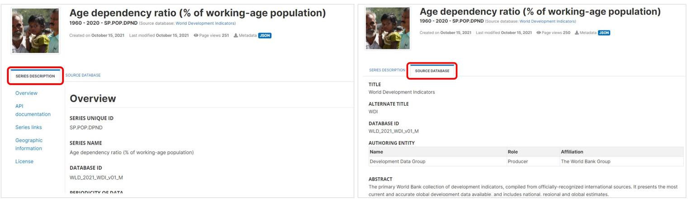

# Documenting indicators

Indicators are summary measures that capture key issues or phenomena, derived from observed data. When indicators are presented for a specific geographic area and include a temporal dimension — such as annual, quarterly, monthly, or daily values — they form time series.

To facilitate standardized documentation of indicators, the World Bank developed a metadata standard by compiling and structuring metadata elements commonly used by various organizations, including the World Bank itself, United Nations agencies, the International Monetary Fund (IMF), the Organisation for Economic Co-operation and Development (OECD), and Eurostat.

For how this schema relates to SDMX, see [SDMX and the World Bank schema](/documenting_indicator_concepts_sdmx.html).

### Metadata schema for documenting databases of indicators

In addition to documenting individual indicators, the World Bank has developed a complementary metadata schema for documenting databases of indicators (i.e., collections of indicators). This schema provides additional metadata at the database level, which enriches the contextual information available for each indicator.

To establish a clear link between an indicator and its associated database, the indicator metadata schema includes a dedicated element that stores the database identifier, enabling seamless association between indicator metadata and database metadata.

In data catalogs like a NADA catalog, the metadata on indicators and the related databases can be combined.

The technical description of the JSON schema is available at [worldbank.github.io/metadata-schemas](https://worldbank.github.io/metadata-schemas/#tag/Timeseries).

## Getting started

**New to indicators?** Follow [Quick start: Indicator](/quick_start_indicator.html) for a worked example using World Bank **SI.POV.DDAY** (metadata only).

**This chapter** is a **reference guide** for indicator support in the Metadata Editor: metadata fields, structural metadata, observation data, and export/publish. It does not repeat the step-by-step tutorial — use Quick start for that.

## Find what you need

| I want to… | Go to |
|------------|--------|
| Walk through SI.POV.DDAY (create project, fill metadata, export) | [Quick start: Indicator](/quick_start_indicator.html) |
| Look up a metadata field | [Reference metadata](/documenting_indicator_descriptive_metadata.html) |
| Understand SDMX, long vs wide, or dimensions | [Concepts](#concepts) below |
| Bind a DSD and validate structure | [Structural metadata (project)](/documenting_indicator_data_structure.html) |
| Import CSV, explore data, charts | [Observation data](/documenting_indicator_import_data.html) |
| Export JSON/ZIP/SDMX or publish to NADA | [Export and publish](/documenting_indicator_export_publish.html) |
| Maintain shared codelists or DSDs | [Structural metadata](/structural_metadata.html) (registry) |
| Document an indicator **database** (WDI-style container) | [Documenting a database or dataset](/documenting_dataset.html) |
| Review metadata quality | [Working with project issues](/project_issues.html) |

You can document **reference metadata only**, or also attach **structural metadata** and **observation data**.

## Concepts

- [SDMX and the World Bank schema](/documenting_indicator_concepts_sdmx.html)
- [Long vs wide format](/documenting_indicator_concepts_long_wide.html)
- [Dimensions vs separate indicators](/documenting_indicator_concepts_dimensions.html)

## Reference sections

- **[Before you start](/documenting_indicator_before_you_start.html)** — Scope, layers, and quality principles.
- **[Reference metadata](/documenting_indicator_descriptive_metadata.html)** — Field-by-field definitions for the indicator template.
- **[Structural metadata (project)](/documenting_indicator_data_structure.html)** — Attach a global DSD, column types, validation.
- **[Observation data](/documenting_indicator_import_data.html)** — CSV import, data explorer, charts.
- **[Export and publish](/documenting_indicator_export_publish.html)** — Export formats, external resources, NADA.

**Structural metadata registry** (codelists and data structures) is documented separately: [Structural metadata](/structural_metadata.html).
