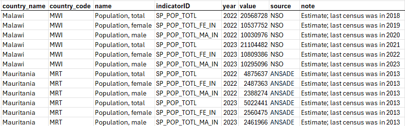
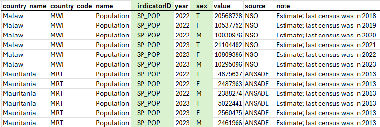

# Dimensions vs separate indicators

> **Worked example:** [SI.POV.DDAY](/quick_start_indicator.html) is a **single indicator** with no breakdown dimensions in the CSV — one indicator ID per project.

When an indicator can be disaggregated (for example by sex, age group, or urban/rural area), organizations choose one of two data organization patterns.

## Option 1 — Separate indicators

Each disaggregation is a **different indicator** with its own identifier.

Example: population by sex as three indicators — "Population, total", "Population, male", and "Population, female". Each has its own indicator ID column value; typically **one indicator project per ID**.

**SI.POV.DDAY** follows this pattern: one indicator ID (`SI.POV.DDAY`), no dimension columns in the long CSV.

## Option 2 — One indicator with dimensions

A **single indicator ID** with **dimension columns** in the long-format CSV (for example `SEX` with values M, F, T).

In the data structure, dimension columns use column type **Dimension** and are usually linked to [codelists](/managing_codelists.html). See [Column types](/documenting_indicator_data_structure.html#column-types).

## Choosing a pattern

| Consideration | Option 1 (separate indicators) | Option 2 (dimensions) |
|---------------|-------------------------------|------------------------|
| Catalog discovery | Simpler — one catalog entry per series | Fewer catalog entries; users filter by dimension |
| Number of projects | More indicator projects | Fewer projects |
| Complex cross-tabs | Many indicators (for example 90 combinations) | One indicator with multiple dimension columns |

Example where dimensions are often necessary: population by age group (9 groups + total), sex (2 + total), and urban/rural (2 + total) would require 10 × 3 × 3 = **90** separate indicators under Option 1. A single "population" indicator with three dimension columns is more maintainable.

## Reference metadata vs DSD

- Prefer documenting breakdowns in the **bound data structure** (structural metadata).
- The reference metadata **`Dimensions`** element is for cases when a DSD is **not** documented. When a DSD is attached, dimensions are defined by structure components. See [Reference metadata — Dimensions](/documenting_indicator_descriptive_metadata.html).

## See also

- [Long vs wide format](/documenting_indicator_concepts_long_wide.html)
- [Structural metadata at project level](/documenting_indicator_data_structure.html)
