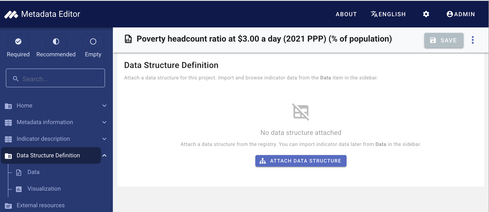
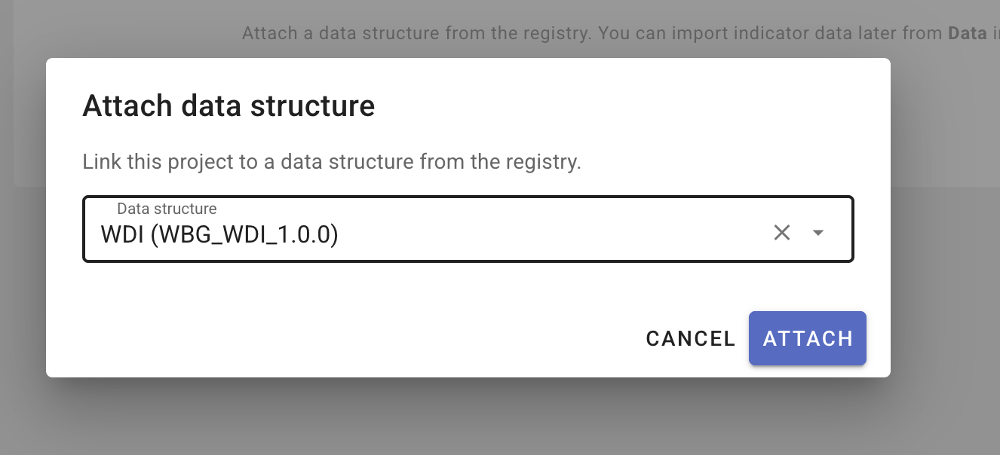
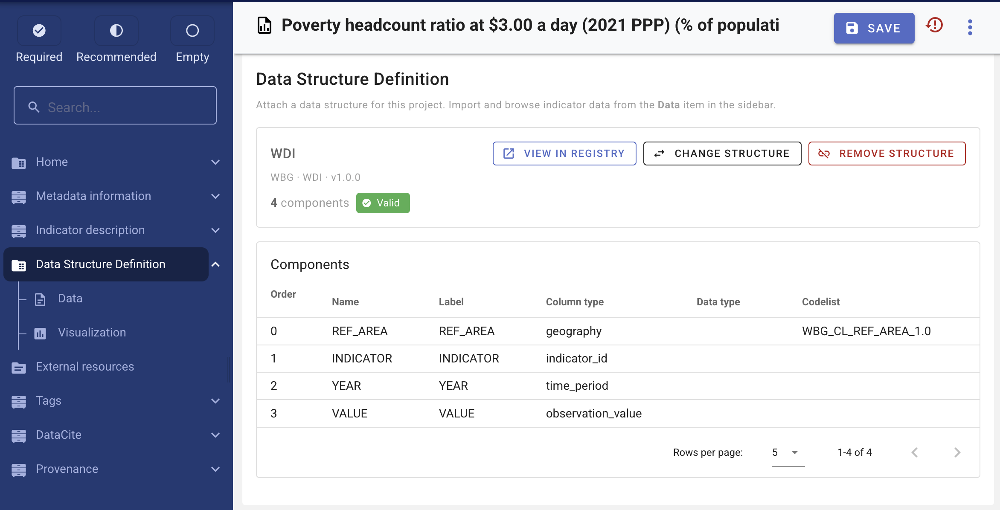
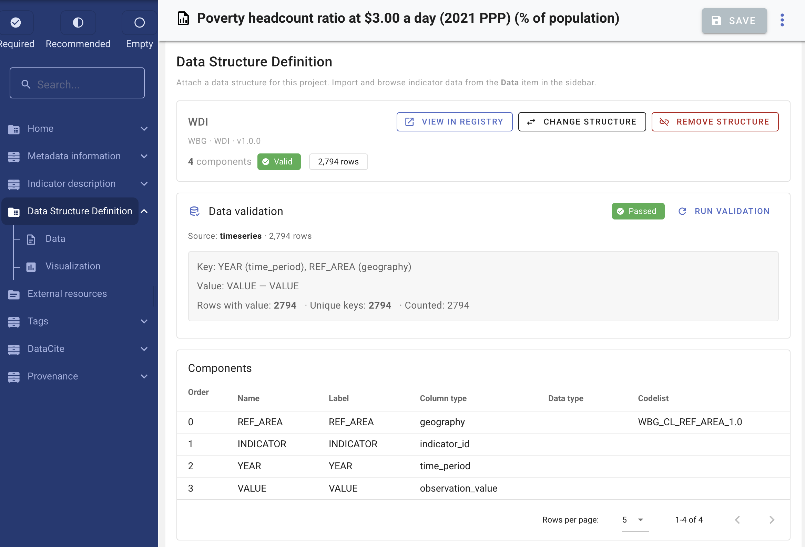
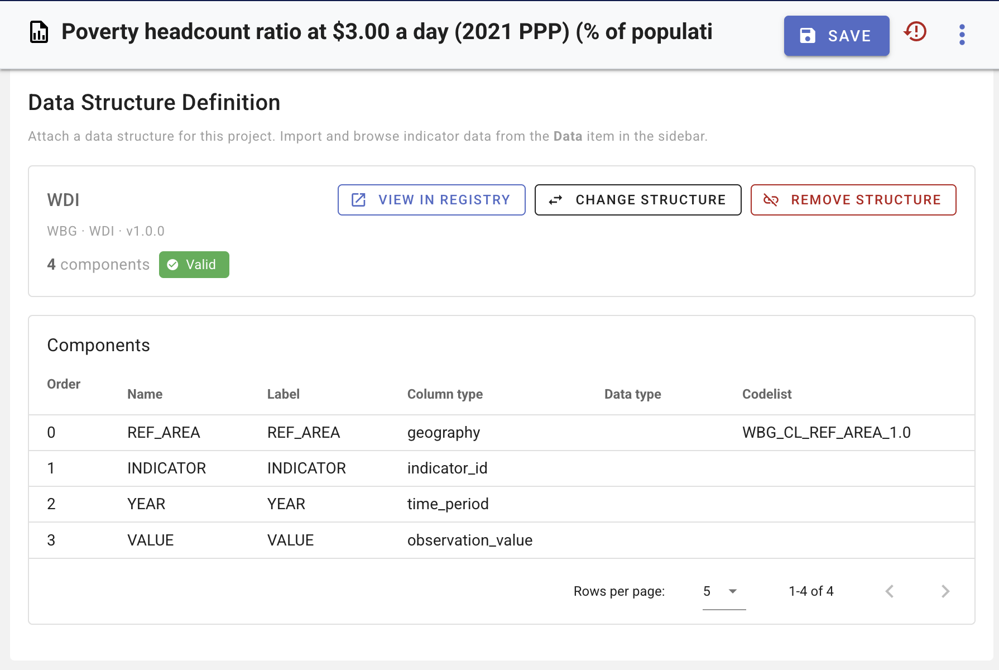

# Structural metadata (project)

> **Worked example:** [Quick start: Indicator](/quick_start_indicator.html) covers metadata only. For observation data, create a DSD in the [registry](/structural_metadata.html), then attach it here.

The **data structure definition (DSD)** describes how observation data are organized in the CSV file. It is the **structural metadata** for the indicator and aligns with SDMX Data Structure Definitions. See [SDMX and the World Bank schema](/documenting_indicator_concepts_sdmx.html).

- **Registry** — Create and maintain DSDs and codelists: [Managing data structures](/managing_data_structures.html), [Managing codelists](/managing_codelists.html).
- **Long-format CSV** — Import requires [long (not wide) format](/documenting_indicator_concepts_long_wide.html).
- **Dimensions** — See [Dimensions vs separate indicators](/documenting_indicator_concepts_dimensions.html) when planning column layout.

## Column types

For **each column** in the CSV, the data structure records:

| Field | Description |
|--------|-------------|
| **Name** | Column header in the CSV file |
| **Label** | Human-readable label |
| **Description** | Optional short description |
| **Data type** | String, Integer, Float, Date, or Boolean |
| **Column type** | SDMX role (see below) |
| **Time period format** | Required when column type is *Time period* (for example `YYYY` for annual data) |
| **Codelist** | Optional link to a [global codelist](/managing_codelists.html) |

### SDMX column roles

| Column type | Role |
|-------------|------|
| **Dimension** | Breakdown axis (for example sex, urban/rural). See [Dimensions vs separate indicators](/documenting_indicator_concepts_dimensions.html). |
| **Time period** | When the observation applies (for example `year`). |
| **Geography** | Geographic area (for example `country`). |
| **Indicator ID** | Unique identifier for the indicator in the file. **Exactly one** column must have this type. |
| **Indicator name** | Title or name of the indicator (optional if documented in reference metadata). |
| **Observation value** | The numeric or text observation. **Exactly one** column must have this type. |
| **Attribute** | Non-dimensional qualifier (SDMX attribute). |
| **Annotation** | Supplementary coded information. |
| **Periodicity (FREQ)** | Explicit frequency column when present; otherwise frequency may be set at import (see [Observation data](/documenting_indicator_import_data.html)). |

All columns that appear in the CSV should be represented in the bound data structure (except optional extra columns you choose to ignore at import).

### Example long-format file (SI.POV.DDAY)

The documentation example uses [`SI.POV.DDAY_countries_data-long.csv`](/quick_start_files/indicator/SI.POV.DDAY_countries_data-long.csv). Each row is one observation; column headers match the bound data structure component **names**.

**Sample rows** (from the example file):

| REF_AREA | REF_AREA_LABEL | INDICATOR | INDICATOR_LABEL | YEAR | VALUE |
|----------|----------------|-----------|-----------------|------|-------|
| ARG | Argentina | SI.POV.DDAY | Poverty headcount ratio at $3.00 a day (2021 PPP) (% of population) | 2010 | 1.5 |
| ARM | Armenia | SI.POV.DDAY | Poverty headcount ratio at $3.00 a day (2021 PPP) (% of population) | 2010 | 2.9 |
| ARM | Armenia | SI.POV.DDAY | Poverty headcount ratio at $3.00 a day (2021 PPP) (% of population) | 2015 | 2.9 |
| AUS | Australia | SI.POV.DDAY | Poverty headcount ratio at $3.00 a day (2021 PPP) (% of population) | 2010 | 0.5 |

**Column roles** for this file:

| CSV column | Column type |
|------------|-------------|
| `INDICATOR` | Indicator ID |
| `INDICATOR_LABEL` | Indicator name |
| `REF_AREA` | Geography |
| `REF_AREA_LABEL` | Label-only |
| `YEAR` | Time period (`YYYY`) |
| `VALUE` | Observation value |

At import, select indicator ID **`SI.POV.DDAY`**. More on file layout: [Long vs wide format](/documenting_indicator_concepts_long_wide.html).

## Attach a data structure to the project

Open your indicator project. In the navigation tree, expand **Data structure definition** and select the overview (the parent item, not **Data** or **Chart visualization**).

If no structure is attached, the page prompts you to **Attach data structure**.

> **Screenshot:** Data structure overview — empty state with **Attach data structure** button.

### Attach from the registry

1. Click **Attach data structure**.
2. Select a **global data structure** from the list (agency, name, version).
3. Confirm. The project now uses that structure for validation and import.

> **Screenshot:** **Attach data structure** dialog — list of global structures with search/filter.

When a structure is attached, the overview shows its title, component count, validation status, and row count (after data are imported).

> **Screenshot:** Data structure overview — bound structure summary card with **Valid** chip, **View in registry**, **Change structure**.

### Change or remove the binding

- **Change structure** — select a different global structure. Review impact on existing imported data before confirming.
- **Remove structure** — clears the binding and **removes published observation data**; import is blocked until a structure is attached again.
- **View in registry** — opens the global data structure in a new tab for viewing or editing.

Attached structures are **read-only inside the project**. To change components or codelists, edit the structure in [Managing data structures](/managing_data_structures.html), or attach a different structure.

If the project is **locked**, DSD binding and import are read-only until the project is unlocked.

When importing, use the same column layout as the [SI.POV.DDAY example file](#example-long-format-file-si-pov-dday) above.

## Validation

This section is **indicator data-structure** validation (required column types, codelists, observation keys). It is separate from project **metadata** schema and template validation; see [Validating metadata](/validating_metadata.html).

The overview page reports **structure validation** and, when data have been imported, **data validation**.

### Structure validation

Checks include required column types (Indicator ID, Observation value, Time period), consistent codelist references, and other SDMX-oriented rules. Errors and warnings are listed on the project overview page (the same rules apply in the [global DSD editor](/managing_data_structures.html#structure-validation) when defining components).

Import is blocked until structure validation passes (except for indicator ID selection, which is completed during import).

### Data validation

After data are imported, the overview can validate published rows against the structure (for example observation-key uniqueness and codelist codes present in the data). Use **Re-run** to refresh the report after import or structure changes.

> **Screenshot:** Data validation section on overview — passed/failed chip, observation key summary.

### Components table

The overview lists all components (order, name, label, column type, data type, codelist reference).

> **Screenshot:** Components table on the data structure overview page.

## Prerequisites for importing data

Before importing a CSV:

1. A global data structure is **attached** to the project.
2. **Structure validation** passes.
3. The [FastAPI data service](/tech_installation_data_api.html) is running and storage paths match [Post-install configuration](/tech_post_install_configuration.html).

See [Observation data](/documenting_indicator_import_data.html).
