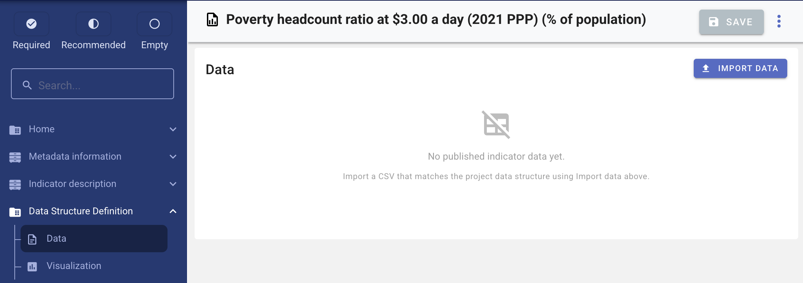
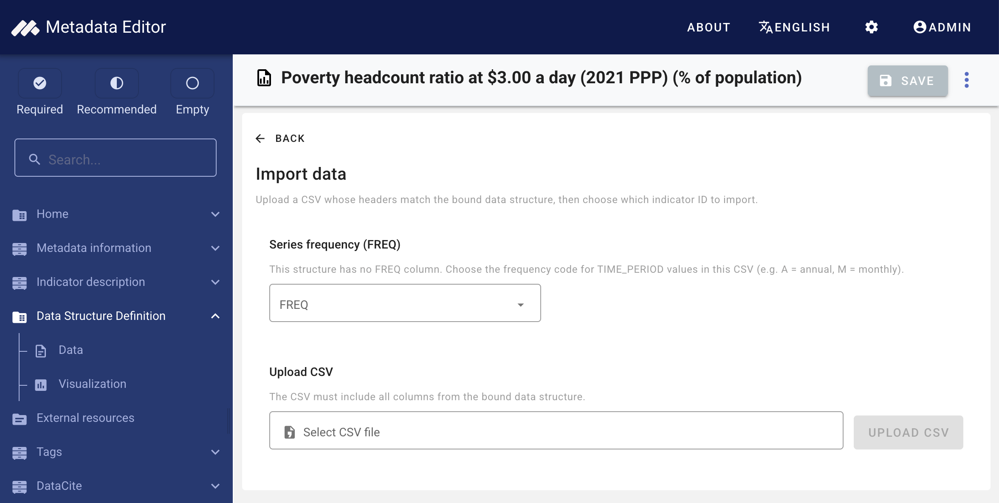
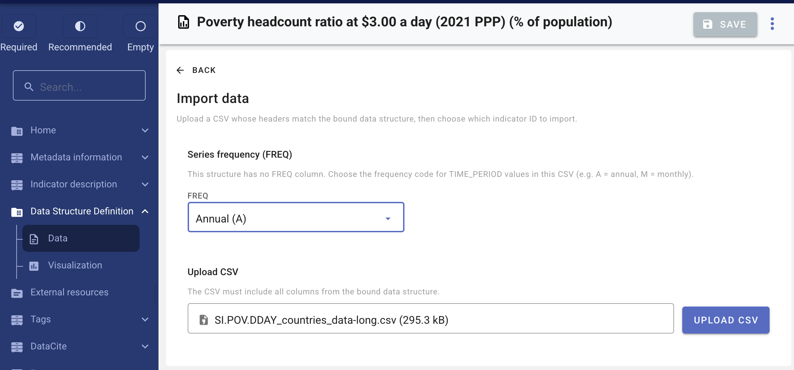
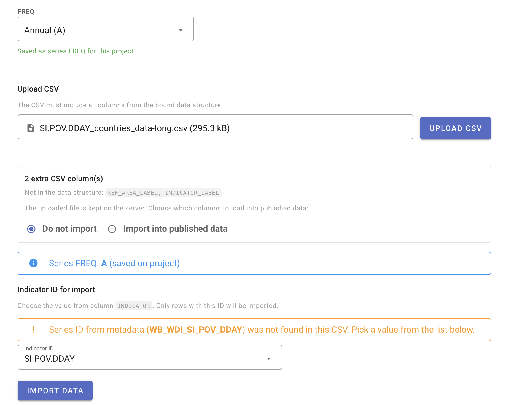
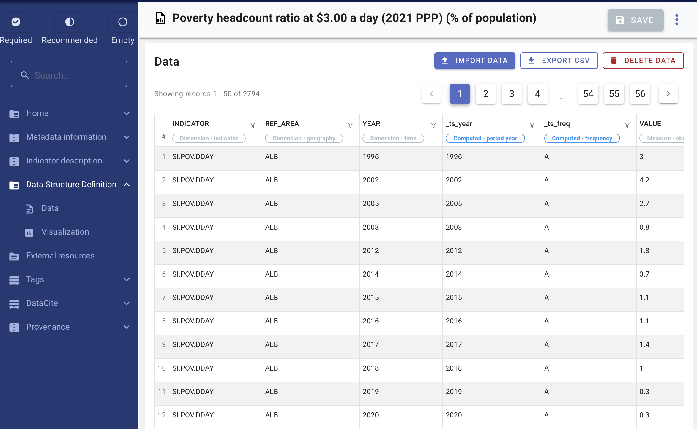
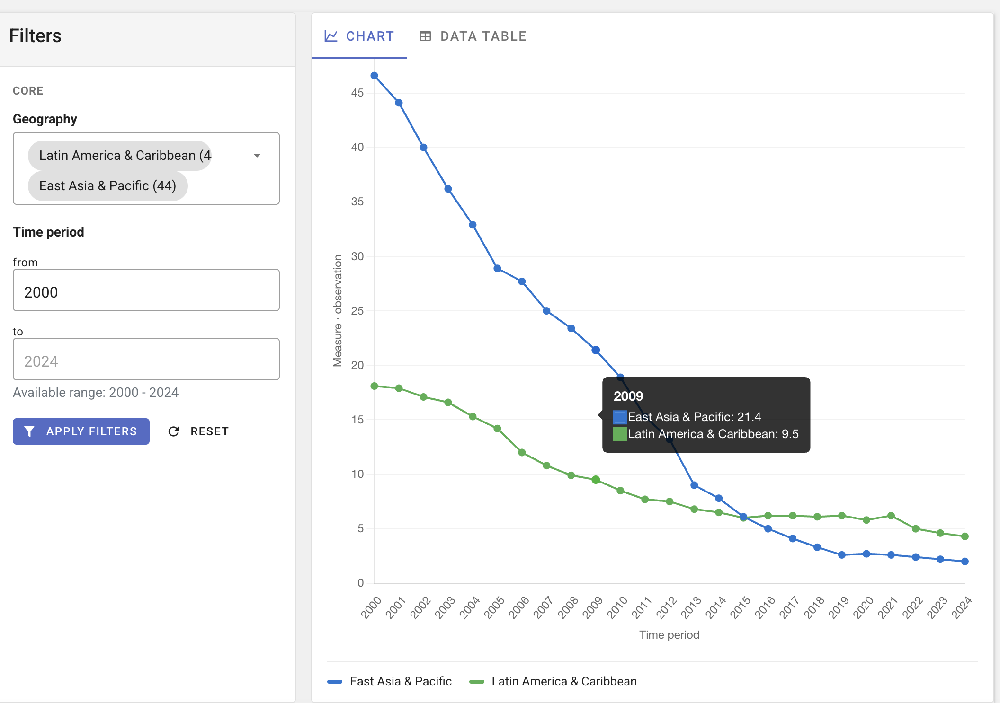
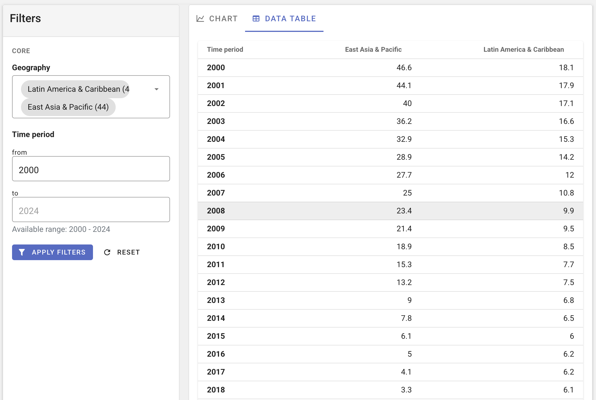

# Observation data

> **Getting started:** [Quick start: Indicator](/quick_start_indicator.html) covers metadata only. This page is the reference for importing and exploring observation data.

This page covers importing observation data into an indicator project, browsing imported rows, charting, and exporting data. It applies when you attach data to the indicator, not for metadata-only projects.

**Prerequisites:** [Data structure attached and validated](/documenting_indicator_data_structure.html), CSV in [long format](/documenting_indicator_concepts_long_wide.html), and the [FastAPI data service](/tech_installation_data_api.html) configured.

## Example file

The documentation uses the World Bank indicator **SI.POV.DDAY**. Download the long-format observations file:

[**SI.POV.DDAY_countries_data-long.csv**](/quick_start_files/indicator/SI.POV.DDAY_countries_data-long.csv)

At import, select indicator ID **`SI.POV.DDAY`**. See [Example files](/quick_start_files/indicator/README.html).

## Open the Data page

In the project navigation tree, under **Data structure definition**, click **Data**.

The **Data** page shows the data explorer when rows exist, or prompts you to import when the project has no published data yet.

> **Screenshot:** Data page — empty state with **Import data** button.

## Import workflow

Click **Import data** to open the import view.

> **Screenshot:** Import view — header **Import indicator data** and short help text.

If no structure is attached or structure validation failed, the import form shows a warning with links to the [data structure overview](/documenting_indicator_data_structure.html) or [Managing data structures](/managing_data_structures.html).

### Step 1 — Series frequency (when required)

If the bound structure has **no FREQ (periodicity) column**, choose the **FREQ** code for the time values in your CSV (for example **A** = annual, **M** = monthly) before uploading. This is saved on the project binding as **implied frequency**.

For the SI.POV.DDAY example (`YEAR` column, annual data), choose **A** (annual).

> **Screenshot:** Series frequency (FREQ) selector on import form.

### Step 2 — Upload and validate CSV

1. Select **`SI.POV.DDAY_countries_data-long.csv`** (or your own file) whose headers match the bound data structure column **names**.
2. Click **Upload CSV**. Large files use **resumable upload** with a progress indicator.
3. The editor validates headers against the structure. Missing required columns are reported; extra columns may be listed separately.

> **Screenshot:** Upload CSV — file input and **Upload CSV** button.

If the CSV contains **extra columns** not in the structure, choose whether to **exclude** them from published data or **import** them into the published table.

### Step 3 — Select indicator ID

After successful validation, choose **`SI.POV.DDAY`** from the distinct values in the indicator ID column. Only rows matching this ID are imported into the project (one indicator project typically imports one ID per run; re-import replaces data for that ID).

> **Screenshot:** Indicator ID dropdown populated from CSV distinct values.

### Step 4 — Import

Click **Import data**. The editor saves the indicator ID (and implied frequency if applicable), then runs the import through the FastAPI service (**synchronous** in the UI — wait until completion). On success, you return to the browse view with updated rows.

### Re-import and delete

- **Re-import** — upload a new CSV and import again; published rows for the bound indicator ID are **replaced**.
- **Delete data** — removes all published observation data for the project (metadata is unchanged). Available from the Data page toolbar when data exist.

## Browse and export data

After import, the **data explorer** shows paginated rows from the published table.

> **Screenshot:** Data explorer — table with pagination and column headers matching the DSD.

Use **Download data** to export the full published dataset as CSV.

## Chart visualization

Under **Data structure definition**, open **Chart visualization** to explore the imported series graphically.

For the SI.POV.DDAY example, try comparing **Argentina** and **Armenia** over time using geography filters.

Filters typically include geography, time period range, and other dimensions or attributes that have codelists. Switch between **chart** and **table** views of the aggregated result.

> **Screenshot:** Chart visualization — line chart with facet filters (geography, time range, dimensions).

> **Screenshot:** Chart visualization — table tab showing aggregated rows.

## Background import (API and jobs)

For automation or very large files (for example [`SI.POV.DDAY_countries_data-long.csv`](/quick_start_files/indicator/SI.POV.DDAY_countries_data-long.csv)) outside the interactive UI:

- Use **`POST /api/jobs/import_indicator_data`** with a resumable file upload and the PHP **`metadata-editor-worker`** (see [Jobs and workers](/tech_jobs_and_workers.html)).
- The editor UI import uses the FastAPI pipeline directly with **`wait: true`** and does not require the PHP worker for a single interactive upload.

Programmatic metadata and data workflows are described in [Using the API](/ME_API.html) (indicator examples are being updated for v1.3).

## Troubleshooting

| Symptom | What to check |
|---------|----------------|
| Import button disabled or blocked | Structure attached? Structure validation passed? |
| Upload fails / timeout | [FastAPI service](/tech_installation_data_api.html) running; shared `STORAGE_PATH` between PHP and FastAPI ([Post-install configuration](/tech_post_install_configuration.html)). |
| Missing columns error | CSV headers must match component **names** in the bound structure exactly. |
| Codes rejected after import | Data validation on [DSD overview](/documenting_indicator_data_structure.html#data-validation); codes must exist in linked global codelists. |

See also: [Export and publish](/documenting_indicator_export_publish.html).
