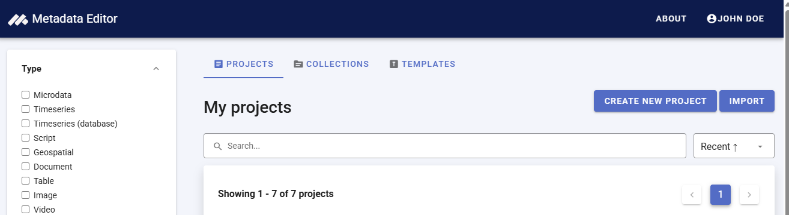
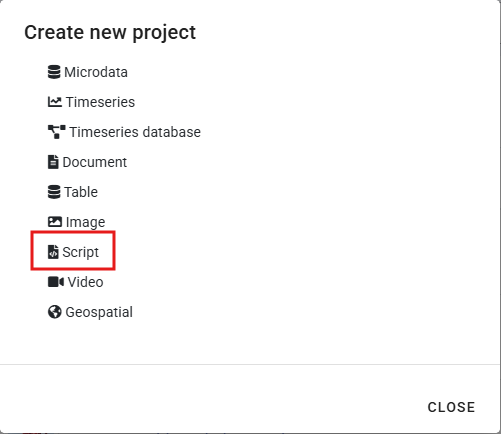
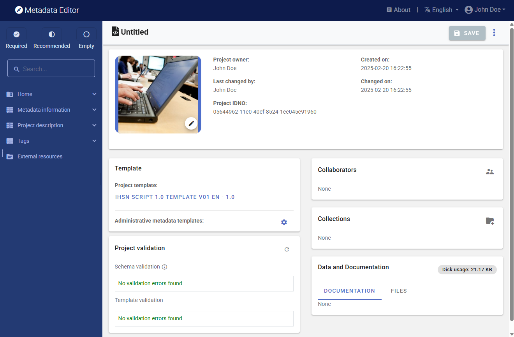
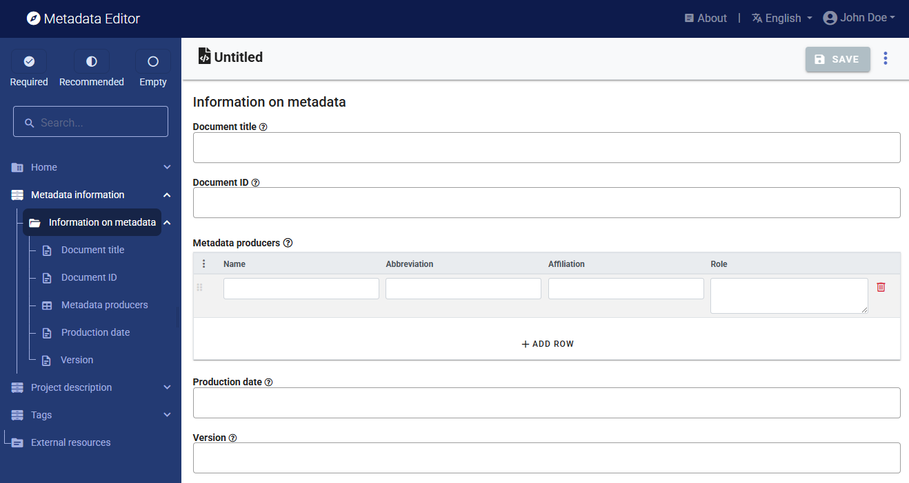
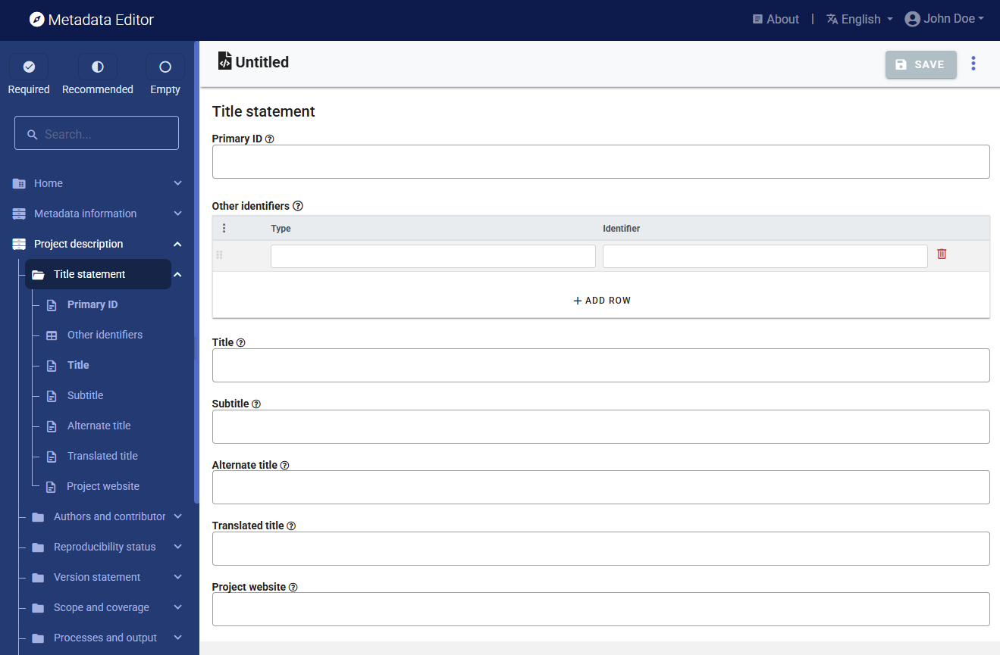

# Documenting research projects and scripts

## Rationale

Documenting, cataloguing and disseminating **data** has the potential to increase the volume and diversity of data analysis. There is also much value in documenting, cataloguing and disseminating **data processing and analysis scripts**. Technological solutions such as GitHub, [Jupyter Notebooks or Jupiter Lab](https://jupyter.org/) facilitate the preservation and sharing of code, and enable collaborative work around data analysis. Coding style guides like the [Google style guides](https://google.github.io/styleguide/) and the [Guide to Reproducible Code in Ecology and Evolution](https://www.britishecologicalsociety.org/wp-content/uploads/2017/12/guide-to-reproducible-code.pdf) by the British Ecological Society, contribute to foster the usability, adaptability, and reproducibility of code. But these tools and guidelines do not fully address the issue of cataloguing and discoverability of the data processing and analysis programs and scripts. We propose --as a complement to collaboration tools and style guides-- a metadata schema to document data analysis projects and scripts. The production of structured metadata will contribute not only to discoverability, but also to the reproducibility, replicability, and auditability of data analytics. 

There are multiple reasons to make reproducibility, replicability, and auditability of data analytics a component of a data dissemination system. This will:  

-	Improve the **quality of research and analysis**. Public scrutiny enables contestability and independent quality control of the output of research and analysis; these are strong incentives for additional rigor in data analysis. 
-	Allow the **re-purposing or expansion of analysis** by the research community, thereby increasing the relevance, utility and value of both the data and of the analytical work. 
-	Strengthen the **reputation and credibility** of the analysis. 
-	Provide students and peers with rich **training materials**.  
-	In some cases, satisfy a **requirement** imposed by peer reviewed journals or financial sponsors of research activities. For example, the [Data and Policy Code of the American Economic Association](https://www.aeaweb.org/journals/policies/data-code) (accessed on June 29, 2020), states that *It is the policy of the American Economic Association to publish papers only if the data and code used in the analysis are clearly and precisely documented, and access to the data and code is clearly and precisely documented and is non-exclusive to the authors. Authors of accepted papers that contain empirical work, simulations, or experimental work must provide, prior to acceptance, information about the data, programs, and other details of the computations sufficient to permit replication, as well as information about access to data and programs.* 
-	Contribute to **assuring the fairness of policy advice and interventions** resulting from data analysis. Data analysis may be used to identify or target the beneficiaries of policies and programs, or may contribute otherwise to the design and implementation of development policies and projects. By doing so, they also contribute to identifying populations to be excluded from these interventions. Errors and biases may be introduced in analysis by accidental or intentional human errors, by the algorithms themselves, or they can result from flaws in the data. The analysis that informs such projects and policies should therefore be made auditable and contestable, i.e. documented and published. 

## The metadata standard

To make data processing and analysis scripts more discoverable and usable, we propose a metadata schema inspired by the schemas available to document datasets. The proposed schema contains two main blocks of metadata elements: the *document description* intended to document the metadata themselves (the term *document* refers to the file that will contain the metadata), and the *project description* used to document the research or analytical work and the related scripts. We also include in the schema the `tags`, `provenance`, and `additional` elements common to all schemas.  

## Preparing for the documentation

Before you start documenting the project, it is highly recommended to organize all relevant resources in an optimal manner. This includes following best practice in the writing of scripts (and ideally adopting a relevant style guide), of naming the files containing your programs and scripts, or organizing a GitHub repository if you publish content on GitHib, and more.

Resources related to best practice in code writing and reproducibility include (among others):
- **World Bank Reproducible Research Catalog**: An online catalog of reproducible research by the World Bank, which makes use of the metadata standard documented in the chapter (https://reproducibility.worldbank.org/)
- **Reproducible Research**: A wiki page by the World Bank DIME department (https://dimewiki.worldbank.org/Reproducible_Research)
- **World Bank Reproducible Research Repository Resources**: (https://worldbank.github.io/wb-reproducible-research-repository/)
- **PEP 8 – Style Guide for Python Code** (for Python users) (https://peps.python.org/pep-0008/)
- **Tidyverse style guide** by the tidyverse team (for R users) (https://style.tidyverse.org/)

## Documenting the research project

### Create a new project

The first step in documenting a research project and its scripts is to create a new project. You do that by clicking on `CREATE NEW PROJECT` in the *My projects* page. Select *Script* as data type. This will open a new, untitled *Project Home* page.

In that page, edit the thumbnail and replace it with an image of your choice (recommended, not required).

Then select (in the *Template* frame) the project template you want to use to document the project. A default template is proposed; no action is needed if you want to use the default template. Otherwise, switch to another template by clicking on the template name in the **Templates** frame. Note that you can at any time change the template used for the documentation of a project. The selected template will determine what you see in the navigation tree and in the metadata entry pages, but switching from one template to another will not impact the metadata that has already been entered; no information will be deleted from the metadata.

### Enter metadata

#### Metadata information

The Metadata information section in the navigation tree (in the Project page) contains elements intended to document the metadata being generated, i.e., metadata about the metadata. All content in this section is optional; it is however recommended practice to document the metadata as precisely as possible. This information will not be useful to data users, but it will be to catalog administrators. When metadata is shared across catalogs, the information entered in the `Information on metadata` provides transparency and clarity on the origin of the metadata.

#### Project description

We provide below a description of the metadata elements contained in the `Project description` section of the default metadata template provided in the Metadata Editor. Other templates may show a different selection, different labels, or present the elements in a different sequence. When you document a dataset, it is not expected that all these elements will be filled. Fill all required elements, all recommended elements when content can be made available, and fill as many as the other elements (the required and recommended elements will be those marked as *required* or *recommended* in the metadata standard or template).

In the list of metadata elements below, the *key* of each element in the metadata standard is provided between brackets next to the corresponding element's label in the template.

**TITLE STATEMENT**

- **`Primary ID`** (*idno*) A unique identifier to the project. Define and use a consistent scheme to use. Avoid including spaces in the ID.  The ID number of a research project is a unique number that is used to identify a particular project. This ID number is a vital reference. A research project can be the formal cause of a survey, scripts, tables and knowledge products. Do not include spaces in the idno element. Use a system that guarantees uniqueness of the ID (DOI, own reference number).

- **`Other identifiers`** (*identifiers*) This repeatable element is used to enter identifiers (IDs) other than the `idno` entered in the `title_statement`. It can for example be a Digital Object Identifier (DOI). Note that the identifier entered in `idno` can (and in some cases should) be repeated here. The element `idno` does not provide a `type` parameter; repeating it in this section makes it possible to add that information. 
  - **`Type`** (*type*) The type of unique ID, e.g. "DOI".
  - **`Identifier`** (*identifier*) The identifier itself. 
   
- **`Title`** (*title*) The title is the official name of the project as it may be stated in reports, papers or other documents. The title will in most cases be identical to the Document Title (see above). The title may correspond to the title of an academic paper, of a project impact evaluation, etc. Pay attention to capitalization in the title.
 
- **`Subtitle`** (*sub_title*) Subtitle is optional and rarely used. A short subtitle for the project. Often the sub title is used to qualify the title or rephrase the title.    

- **`Alternate title`** (*alternate_title*) An alternate title of the project. This would be any alternate title that would help discover the research project. In countries with more than one official language, a translation of the title may be provided. Likewise, the translated title may simply be a translation into English from a country's own language.  

- **`Translated title`** (*translated_title*) A translated version of the title (this will be used for example when a catalog documents all entries in English, but wants to preserve the title of a project in its original language when the original language is not English).

- **`Project website`** (*project_website*) URL of the project website.

**AUTHORS AND CONTRIBUTORS**

- **`Authoring entity`** (*authoring_entity*) This section will identify the person(s) and/or organization(s) in charge of the intellectual content of the research project, and specify their respective role.
  - **`Name`** (*name*) Name of the person or organization responsible for the research project.
  - **`Role`** (*role*) Specific role of the person or organization mentioned in `name`.  
  - **`Affiliation`** (*affiliation*) Agency or organization affiliation of the author/primary investigator mentioned in `name`.
  - **`Abbreviation`** (*abbreviation*) Abbreviation used to identify the agency stated under `affiliation`. 
  - **`Email`** (*email*) Depending on the agency policies, a researcher may provide a personal email or an agency email to field inquires related to the project. 
  - **`Author ID`** (*author_id*) A block of two elements used to provide unique identifiers of the authors, as provided by different registers of researchers. For example, this can be an ORCID number (ORCID is a non-profit organization supported by a global community of member organizations, including research institutions, publishers, sponsors, professional associations, service providers, and other stakeholders in the research ecosystem.) 
    - **`Type`** (*type*) The type of ID; for example, "ORCID". 
    - **`ID`** (*id*) A unique identification number/code for the authoring entity, entered as a string variable.

- **`Contributors`** (*contributors*) This section is provided to record other contributors to the research project and provide recognition for the roles they provided. 
  - **`Name`** (*name*) Name of the person, corporate body, or agency contributing to the intellectual content of the project (other than the PI). If a person, invert first and last name and use commas.
  - **`Role`**  (*role*) Title of the person (if any) responsible for the work's substantive and intellectual content.
  - **`Affiliation`** (*affiliation*) Agency or organization affiliation of the contributor.
  - **`Abbreviation`** (*abbreviation*) Abbreviation used to identify the agency stated under `affiliation`. 
  - **`Email`** (*email*) Depending on the agency policies, a researcher may provide a personal email or an agency email to field inquires related to the project.  
  - **`URL`** (*url*) The URL that provides information on the contributor or its affiliate 

- **`Sponsors`** (*sponsors*) The source(s) of funds for production of the work. If different funding agencies sponsored different stages of the production process, use the 'role' attribute to distinguish them.
  - **`Name`** (*name*) Name of the funding agency/sponsor. 
  - **`Abbreviation`** (*abbreviation*) Abbreviation of the funding/sponsoring agency. 
  - **`Role`** (*role*) Specific role of the funding/sponsoring agency.     
  - **`Grant No`** (*grant_no*) Grant or award number. 

- **`Curators`** (*curators*) A list of persons and/or organizations in charge of curating the resources associated with the project.
  - **`Name`** (*name*) The name of the person or organization.  
  - **`Role`** (*role*) The specific role of the person or organization in the curation of the project resources.
  - **`Affiliation`** (*affiliation*) The affiliation of the person or organization.
  - **`Abbreviation`** (*abbreviation*) An acronym of the organization, if an organization was entered in `name`.
  - **`Email`** (*email*) The email address of the person or organization. The use of personal email addresses must be avoided.
  - **`URL`** (*url*) A link to the website of the person or organization. 

- **`Acknowledgments`** (*acknowledgments*) This repeatable block of elements is used to provide an itemized list of persons and organizations whose contribution to the project must be acknowledged. Note that specific metadata elements are available for listing financial sponsors and main contributors to the study. 
An alternative to this field is the `acknowledgment_statement` field (see below) which can be used to provide the acknowledgment in the form of an unstructured text.
  - **`Name`** (*name*) The name of the person or agency being recognized for supporting the project.
  - **`Affiliation`** (*affiliation*) The affiliation of the person or agency being acknowledged.
  - **`Role`** (*role*) A brief description of the role of the person or agency that is being recognized or acknowledged for supporting the project.

- **`Acknowledgement statement`** (*acknowledgement_statement*) This field is used to provide acknowledgments in the form of an unstructured text. An alternative to this field is the *acknowledgments* field which provides a solution to itemize the acknowledgments. 

**REPRODUCIBILIY STATUS**

- **`Status`** (*type*) Information on the reproducibility status of the project, using a controlled vocabulary

- **`Reproducibility note`** (*note*) Any additional information on the status of reproducibility.

**VERSION STATEMENT**

- **`Project completion date`** (*production_date*) The date in ISO 8601 format (YYYY-MM-DD) the project was completed (this refers to the version that is being documented and released.)

- **`Version`** (*version*) A label describing the version. For example, "Version 1.2" *[String]*
- **`Version date`** (*version_date*) Date (in ISO 8601 format, YYYY-MM-DD) the version was released *[String]*
- **`Responsibility`** (*version_resp*) Person(s) or organization(s) responsible for this version. *[String]*
- **`Note on version`** (*version_notes*) Additional information on the version if any; it is good practice to describe what distinguishes this version from the previous one(s). The version must be entered as a string, even when composed only of numbers. 

**SCOPE AND COVERAGE**
                                       
- **`Abstract`** (*abstract*) The abstract should provide a clear summary of the purposes, objectives and content of the project. An abstract can make reference to the various outputs associated with the research project. 
  Example: "Food price inflation is an important metric to inform economic policy but traditional sources of consumer prices are often produced with delay during crises and only at an aggregate level. This may poorly reflect the actual price trends in rural or poverty-stricken areas, where large populations reside in fragile situations. This data set includes food price estimates and is intended to help gain insight in price developments beyond what can be formally measured by traditional methods. The estimates are generated using a machine-learning approach that imputes ongoing subnational price surveys, often with accuracy similar to direct measurement of prices. The data set provides new opportunities to investigate local price dynamics in areas where populations are sensitive to localized price shocks and where traditional data are not available.",

- **`Geographic areas`** (*geographic_units*) The geographic areas covered by the project. When the project relates to one or more countries, or part of one or more countries, it is important to provide the country name. This means that for a project related to a specific province or town of a country, the country name will be entered in addition to the province or town (as separate entries in this repeatable block of elements). Note that the area does not have to be an administrative area; it can for example be an ocean.
  - **`Name`** (*name*) The name of the geographic area.
  - **`Code`** (*code*) The code of the geographic area. For countries, it is recommended to use the [ISO 3166](https://en.wikipedia.org/wiki/List_of_ISO_3166_country_codes) country codes and names. 
  - **`Type`** (*type*) The type of geographic area.

- **`Keywords`** (*keywords*) A list of keywords that provide information on the core scope and objectives of the research project. Keywords provide a convenient solution to improve the discoverability of the research, as it allows terms and phrases not found elsewhere in the metadata to be indexed and to make a project discoverable by text-based search engines. A controlled vocabulary will preferably be used (although not required), such as the [UNESCO Thesaurus](http://vocabularies.unesco.org/browser/thesaurus/en/). The list provided here can combine keywords from multiple controlled vocabularies, and user-defined keywords.  
  - **`Keyword`** (*name*) The keyword itself.
  - **`Vocabulary`** (*vocabulary*) The controlled vocabulary (including version number or date) from which the keyword is extracted, if any.
  - **`URL`** (*uri*) The URL of the controlled vocabulary from which the keyword is extracted, if any.

- **`Themes`** (*themes*) A list of themes covered by the research project. A controlled vocabulary will preferably be used. Note that `themes` will rarely be used as the elements `topics` and `disciplines` are more appropriate for most uses. This is a block of five fields:
  - **`ID`** (*id*) The ID of the theme, taken from a controlled vocabulary.
  - **`Name`** (*name*) The name (label) of the theme, preferably taken from a controlled vocabulary.
  - **`Parent ID`** (*parent_id*) The parent ID of the theme (ID of the item one level up in the hierarchy), if a hierarchical controlled vocabulary is used.
  - **`Vocabulary`** (*vocabulary*) The name (including version number) of the controlled vocabulary used, if any.
  - **`URL`** (*uri*) The URL to the controlled vocabulary used, if any. 

- **`Topics`** (*topics*) Information on the topics covered in the research project. A controlled vocabulary will preferably be used, for example the [CESSDA Topics classification](https://vocabularies.cessda.eu/vocabulary/TopicClassification), a typology of topics available in 11 languages; or the [Journal of Economic Literature (JEL) Classification System](https://en.wikipedia.org/wiki/JEL_classification_codes), or the [World Bank topics classification](https://documents.worldbank.org/en/publication/documents-reports/docadvancesearch). Note that you may use more than one controlled vocabulary. 
  This element is a block of five fields: 
  - **`ID`** (*id*) The identifier of the topic, taken from a controlled vocabulary.
  - **`Name`** (*name*) The name (label) of the topic, preferably taken from a controlled vocabulary.
  - **`Parent ID`** (*parent_id*) The parent identifier of the topic (identifier of the item one level up in the hierarchy), if a hierarchical controlled vocabulary is used.
  - **`Vocabulary`** (*vocabulary*) The name (including version number) of the controlled vocabulary used, if any.
  - **`URL`** (*uri*) The URL to the controlled vocabulary used, if any. 

- **`Disciplines`** (*disciplines*) Information on the academic disciplines related to the content of the research project. A controlled vocabulary will preferably be used, for example the one provided by the list of academic fields in [Wikipedia](https://en.wikipedia.org/wiki/List_of_academic_fields). This is a block of five elements: 
  - **`ID`**  (*id*) The identifier of the discipline, taken from a controlled vocabulary.
  - **`Name`** (*name*) The name (label) of the discipline, preferably taken from a controlled vocabulary.
  - **`Parent ID`** (*parent_id*) The parent identifier of the discipline (identifier of the item one level up in the hierarchy), if a hierarchical controlled vocabulary is used.
  - **`Vocabulary`** (*vocabulary*) The name (including version number) of the controlled vocabulary used, if any.
  - **`URL`** (*uri*) The URL to the controlled vocabulary used, if any.

- **`Related projects`** (*related_projects*) The objective of this block is to provide links (URLs) to other, related projects which can be documented and disseminated in the same catalog or any other location on the internet.
  - **`Name`** (*name*) The name (title) of the related project.
  - **`URL`** (*uri*) A link (URL) to the related project web page.
  - **`Note`** (*note*) A brief description or other relevant information on the related project. 

**PROCESSES AND OUTPUT**

- **`Process`** (*process*) This element is used to document the life cycle of the research project, from its design and inception to its conclusion. This can include phases of fundraising, IRB, concept note review, data acquisition, analysis, publishing of a working paper, peer review, publishing in journal, presentation to conferences, publishing, evaluation, reporting to sponsors, etc. It is recommended to provide these steps in a chronological order. 
  - **`Name`** (*name*) This is a header for the phase of the process. 
  - **`Start date`** (*date_start*) Date the phase started (preferably in ISO 8601 format, YYYY-MM-DD)
  - **`End date`** (*date_end*) Date the phase ended (preferably in ISO 8601 format, YYYY-MM-DD)
  - **`Description`** (*description*) A brief description of the phase. 

- **`Institutional review board`** (*review_board*) Information on whether and when the project was submitted, reviewed, and approved by an institutional review board (or independent ethics committee, ethical review board (ERB), research ethics board, or equivalent).

- **`Approval process`** (*approval_process*) The *`approval_process`* is a group of six elements used to describe the formal approval process(es) (if any) that the project had to go through. This may for example include an approval by an Ethics Board to collect new data, followed by an internal review process to endorse the results.
   - **`Phase name`** (*approval_phase*) A label that describes the approval phase.
   - **`Authority`** (*approval_authority*) Identification of the person(s) or organization(s) whose approval was required or sought. 
   - **`Submission date`** (*submission_date*) The date, entered in ISO 8601 format (YYYY-MM-DD), when the project (or a component of it) was submitted for approval. 
   - **`Reviewer`** (*reviewer*) Identification of the reviewer(s). 
   - **`Review status`** (*review_status*) Status of approval. 
   - **`Approval date`** (*approval_date*) Date the approval was formally received, preferably entered in ISO 8601 format (YYYY-MM-DD). 

- **`Reviews and comments`** (*reviews_comments*) Many research projects will be subject to a review process, which may happen at different stages of the project implementation (from design to review of the final output). This block is intended to document the comments received by reviewers during this process. It is a repeatable block of metadata elements, which can be used to document comments with a fine granularity. 
  - **`Date`** (*comment_date*) The date the comment was provided, in ISO 8601 format (YYYY-MM-DD or YYYY-MM).
  - **`Name`** (*comment_by*) The name of the person or organization that provided the comment. 
  - **`Comment`** (*comment_description*) The comment itself, in its original formulation or in a summary version.
  - **`Response`** (*comment_response*) The response provided by teh research team/person to the comment, in its original formulation or in a summary version.
   
- **`Output`** (*output*) This element will describe and reference all substantial/intended products of the research project, which may include publications, reports, websites, datasets, interactive applications, presentations, visualizations, and others. An output may also be referred to as a "deliverable". The `output` is a repeatable block of seven elements, used to document all output of the research project:
  - **`Type`** (*type*) Type of output. The type of output relates to the media which is used to convey or communicate the intended results, findings or conclusions of the research project. This field may be controlled by a controlled vocabulary. The kind on content could be "Working paper", "Database", etc. 
  - **`Title`** (*title*) Formal title of the output. Depending upon the kind of output, the title will vary in formality.
  - **`Authors`** (*authors*) Authors of the output; if multiple, they will be listed in one same text field. 
  - **`Description`** (*description*) Brief description of the output (NOT an abstract) 
  - **`Abstract`** (*abstract*) If the output consists of a document, the abstract will be entered here. 
  - **`URL`** (*uri*) A link where the output or information on the output can be found. 
  - **`DOI`*doi* (**) Digital Object Identifier (DOI) of the output, if available.
 
- **`Language`** (*language*) A block of two elements describing the language(s) of the project. At least one of the two elements must be provided for each listed language. The use of [ISO 639-2](https://www.loc.gov/standards/iso639-2/php/code_list.php) (the alpha-3 code in Codes for the representation of names of languages) is recommended.
  - **`Name`** (*name*) The name of the language.
  - **`Code`** (*code*) The code of the language. Numeric codes must be entered as strings. 
 
- **`Errata`** (*errata*) This field is used to list and describe errata.
  - **`Date`** (*date*) Date (in ISO 8601 format, YYYY-MM-DD) the erratum was released.
  - **`Description`** (*description*) Description of the error(s) and measures taken to address it/them. 

**DATA**

- **`Data statement`** (*data_statement*) An overall statement on the data used in the project. A separate field is provided to list and document the origin and key characteristics of the datasets.

- **`Datasets`** (*datasets*) This field is used to provide an itemized list of datasets used in the project. The data are not documented here (specific metadata are available for documenting data of different types, like the DDI for microdata, the ISO 19139 for geographic datasets, etc.)
  - **`Name`** (*name*) The dataset name (title) 
  - **`Dataset ID`** (*idno*) The unique identifier of the dataset
  - **`Note`** (*note*) A brief description of the dataset.
  - **`Access policy`** (*access_type*) The access policy pplied to the dataset.
  - **`License`** (*license*) The access license that applies to the dataset.
  - **`License URL`** (*license_uri*) The URL of a web page where more information on the license can be obtained. 
  - **`Data URL`** (*uri*) The URI where the dataset (or a detailed description of it) can be obtained.

**METHODS, SOFTWARE AND SCRIPTS**

- **`Methods`** (*methods*) A list of analytic, statistical, econometric, machine learning methods used in the project. The objective is to allow users to find projects based on a search on methods applied, e.g. answer a query like *"poverty prediction using random forest"*.
  - **`Name`** (*name*) A short name for the method being described.
  - **`Note`** (*note*) Any additional information on the method.

- **`Software`** (*software*) This field is used to list the software and the specialized packages and libraries/packages that were used to implement the project and that are required to reproduce the scripts. The libraries that are loaded by the scripts (e.g., by the R *require* or *library* command) are included (not all their own dependencies, which will be assumed to be installed automatically).
  - **`Name`** (*name*) The name of the software. 
  - **`Version`** (*version*) The version of the software. 
  - **`Library`** (*library*) A list of libraries/packages required to run the scripts. Note that the specific version of each package is not documented here; it is expected to be found in the script or in the reproduction instructions. 

- **`Scripts`** (*scripts*) This field is used to describe the scripts written by the project authors. All scripts are expected to have been written using software listed in the field *software*.
  - **`File_name`** (*file_name*) Name of the script file (for R users, this will typically include files with extension [.R], for Stata users it will be files with extension [.do], for Python users ...). But this can also include other files related and required to run the scripts (for example lookup CSV files, etc.) This does not include the data files, which are described ina  specific field. 
  - **``Zip package``** (*zip_package*) If the script files have been saved as or in a compressed file (zip, rar, of equivalent), we provide here the name of the zip file containing the script. 
  - **`Title`** (*title*) A title (label) given to the script file 
  - **`Authors`** (*authors*) This is a repeatable block that allows entering a list of authors and co-authors of a script 
    - **`Name`** (*name*) Name of the author (person or organization) of the script 
    - **`Affiliation`** (*affiliation*) The affiliation of the author.
    - **`Role`** (*role*) Specific role of the person or organization in the production of the script. 
  	
  - **`Date`** (*date*) Date the script was produced, in ISO 8601 format (YYYY-MM-DD) 
  - **`Format`** (*format*) File format 
  - **`Software`** (*software*) Software used to run the script 
  - **`Description`** (*description*) Brief description of the script 
  - **`Methods`** (*methods*) Statistical/analytic methods included in the script 
  - **`Dependencies`** (*dependencies*) Any dependencies (packages/libraries) that the script relies on. This field is not needed if dependencies were described in the `library` element. 
  - **`Instructions`** (*instructions*) Instructions for running the script. Information on the sequence in which the scripts must be run is critical. 
  - **`Repository`** (*source_code_repo*) Repository (e.g. GitHub repo) where the script has been published. 
  - **`Notes`** (*notes*) Any additional information on the script.
  - **`License`** (*license*) License, if any, under which the script is published.
    - **`Name`** (*name*) Name (label) of the license  
    - **`URL`** (*uri*) License URI 
  
- **`Repository`** (*repository_uri*) In the process of producing the outputs of the research project, a researcher may want to share their source code for transparency and replicability. This repository provides information for finding the repository where the source code is kept. 
  - **`Name`** (*name*) Name of the repository where code is hosted. 
  - **`Type`** (*type*) Repository type e.g.GitHub, Bitbucket, etc.
  - **`URL`** (*uri*) URI of the project source code/script repository 

- **`Reproducibility`**  
   - **`Technology environment`** (*technology_environment*) This field is used to provide a description (as detailed as possible) of the computational environment under which the scripts were implemented and are expected to be reproducible. A substantial challenge in reproducing analyses is installing and configuring the web of dependencies of specific versions of various analytical tools. Virtual machines (a computer inside a computer) enable you to efficiently share your entire computational environment with all the dependencies intact. (https://ropensci.github.io/reproducibility-guide/sections/introduction/) 
   - **`Technology requirements`** (*technology_requirements*) Software/hardware or other technology requirements needed to run the scripts and replicate the outputs
   - **`Reproduction instructions`** (*reproduction_instructions*) Instructions to secondary analysts who may want to reproduce the scripts.

**ACCESS AND RIGHTS**
 
- **`Disclaimer`** (*disclaimer*) Disclaimers limit the responsibility or liability of the publishing organization or researchers associated with the research project. Disclaimers assure that any research in the public domain produced by an organization has limited repercussions to the publishing organization. A disclaimer is intended to prevent liability from any effects occurring as a result of the acts or omissions in the research. 
                                                             
- **`Confidentiality`** (*confidentiality*) A confidentiality statement binds the publisher to ethical considerations regarding the subjects of the research. In most cases, the individual identity of an individual that is the subject of research can not be released and special effort is required to assure the preservation of privacy.

- **`Citation requirement`** (*citation_requirement*) The citation requirement is specific to the output and is a preferred shorthand or means to refer to the publication or published good.

- **`License`** (*license*) Information on the license(s) attached to the research project resources, which defines their terms of use.
  - **`Name`** (*name*) The name of the license.
  - **`URL`** (*uri*) The URL of the license, where detailed information on the license can be obtained.

- **`Copyright`** (*copyright*) Information on the copyright, if any, that applies to the research project metadata.

**CONTACTS**

- **`Contacts`** (*contacts*) The contacts element provides the public interface for questions associated with the research project. There could be various contacts provided depending upon the organization. It is important to assure that the proper contacts are provided to channel public inquiry. 
  - **`Name`** (*name*) The name of the contact person that should be contacted depending on the role defined below. 
  - **`Role`** (*role*) Role of the contact person. A research project may have contact persons depending on the output or some of the technical input. Some complex projects may have various data collection processes that have different processing channels and contacts. This section should provide for a key primary public interface that can refer the public inquiry or provide a collection of entry points. 
  - **`Affiliation`** (*affiliation*) The organization or affiliation of the contact person. This is usually the organization that the contact person represents.
  - **`Email`** (*email*) Email address of the responsible person, institution, or division in charge of the research project or output.
  - **`Phone`** (*telephone*) Phone number of the responsible institution or division of the research project or output. 
  - **`URL`** (*uri*) The URI of the agency or organization of the contact organization. This may be the same as the web page of the project or may be a permanent contact name at an institutional level and not project related. Eventually a project web site may be removed but there may still be need to have a contact. In this case, it is recommended to have a contact that is permanent.

#### DataCite

See section **Documenting - General instructions**.

#### Tags

See section **Documenting - General instructions**.

#### Provenance 

The **Provenance** container is used to document how and when the project was acquired, if the project was extracted from an external catalog. It is used to ensure traceability. See section **Documenting - General instructions**.

#### External resources

External resources are all materials (and links) that relate to the indicator. This will include the programs and scripts, documents, and other digital resources and links. These materials and links are added in the External resources container. Select *External resources* in the navigation tree, then on `CREATE RESOURCE`. Enter the relevant information on the resource (at least a title), then provide either a filename (the file will then be uploaded on the server that hosts the Metadata Editor) or a URL to the resource.

External resources that have already been created for another project can also be imported. To do that, they must first be exported as JSON or RDF from the other project. Then click on `IMPORT` in the *External resources* page, and select the file. 

