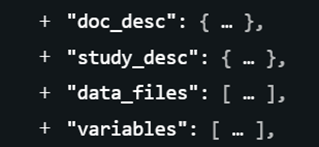
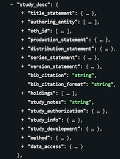

# Introduction to metadata standards

Data producers who seek to ensure that their data are credible, discoverable, visible, and usable must provide data users with rich and structured metadata—information that elucidates the context, quality, and characteristics of the underlying data. Comprehensive and structured metadata enhance the trustworthiness of the data but also enable advanced search functionalities that empower users to locate, assess, utilize, and repurpose the data effectively and responsibly. 

## Metadata: definition and types

Metadata refers to information that describes, explains, locates, or otherwise makes it easier to retrieve, use, or manage data.  It may also include information that describes how data should be published, managed, and displayed. 

Metadata can be categorized into several types, each serving a specific purpose in enhancing data transparency, discovery, management, and usability.

- **Metadata intended to be shared with data users**
   - ***Cataloguing metadata*** is used to uniquely identify and differentiate datasets within a collection or catalog. It includes key elements such as the dataset’s title, unique identifier, version number, and publication date. Cataloguing metadata functions as a bibliographic record, enabling efficient dataset discovery, retrieval, and tracking within a repository or catalog.
   - ***Descriptive and reference metadata*** provide complementary details about a dataset’s context, content, and creators, aiding users in understanding its origin, purpose, and applicability. *Descriptive metadata* focuses on identifying and describing the dataset, including elements such as title, creators and contributors (identifying individuals or organizations involved in dataset production), abstract, description, keywords, topics covered, and geographic and temporal coverage. *Reference metadata* offers deeper context about the dataset’s creation, including the rationale for its collection, methodologies used for data collection and processing, and quality-related information. Together, descriptive and reference metadata enable secondary users to assess the dataset’s relevance, understand its scope, and ensure its appropriate use.
   - ***Structural metadata*** defines the organization and format of the dataset, and the relationships between its components. Structural metadata ensures that datasets can be effectively analyzed and integrated into workflows. Structural metadata may include a *data dictionary* for microdata (providing a detailed list and description of data files and variables), a *data structure definition* outlining the modeling and structure of the data for indicators, or a *feature catalog* for geographic datasets.
 
- **Metadata intended for catalog and system administration**
   - ***Administrative metadata*** provides essential information for managing datasets, including details about their origin, acquisition date, and access rights (e.g., licensing and permissions). It defines the terms of use, specifying who can access the data, for what purposes, and under what conditions. Additionally, administrative metadata includes operational details necessary for IT staff to manage the dataset effectively, such as file formats, storage requirements, and system dependencies. This metadata type ensures that datasets are managed securely, efficiently, and in compliance with access policies.

## Structured metadata

*Structured metadata* refers to metadata that is organized in a predefined and consistent format, often using standardized structures or schemas to ensure uniformity and interoperability. 

Structured metadata helps maximizing the utility of data assets, as its predictable format enables advanced functionalities that are otherwise difficult to achieve: 
- **Supporting the development of advanced search and discovery tools**, allowing users to more efficiently locate and explore relevant datasets based on various parameters. It allows the development of advanced search tools and enables the optimization of search results ranking algorithms (e.g., by boosting the importance of selected components of the metadata). 
- **Facilitating seamless interaction** through application programmming interfaces (APIs), enabling integration with external applications and workflows. 
- **Improving the effectiveness of quality assurance processes** by standardizing how data descriptions are evaluated for completeness, consistency, and accuracy. 
- **Enhancing interoperability across systems**. Structured metadata enables automated harvesting and extraction of information across different platforms, fostering connections and relationships between assets stored in various systems. This interconnected approach improves data accessibility, consistency, and integration.
- **Supporting long-term data preservation**, as its clear organization aids in maintaining accessibility and usability over time.

Structured metadata contains *metadata elements*, each representing a specific piece of information about a dataset (metadata elements can for example be the dataset title or geographic coverage, producer, a variable name or variable label, etc.) Elements within all metadata standards are organized into groups and sub-groups. For instance, the DDI Codebook metadata standard, which is utilized for documenting microdata, comprises four primary sections: document description (`doc_desc`; metadata about the metadata), study description (`study_desc`; details regarding the study itself), file description (`data_files`; information pertaining to each data file), and variable description (`variables`; data at the level of each variable).

   
The *study description* section of the DDI Codebook includes sub-groups of elements that document the authorship of the study (`authoring_entity`), the processes involved in implementing the study (`study_development`), and other relevant aspects.

Each metadata element within a metadata standard or schema encompasses the following attributes:
- ***Key***: This denotes the standardized name assigned to the element and must remain constant (the key cannot be edited or translated).
- ***Type***: Metadata elements can be various types like text (string), numbers (numeric), arrays, or Booleans (logical). If an element is an array, its sub-elements can be any of the other types. Arrays are used for elements with sub-elements, like a country element including a name and a code. The type is defined by the standard and cannot be altered.
- ***Label***: A brief title for the element. While each element or sub-element has a default label, which can be modified to fit an organization's specific terminology.
- ***Repeatable status***: Shows if the element can accept multiple entries. For instance, the "nation" element used to describe the geographic coverage of a dataset is *repeatable* since a dataset can possibly cover multiple countries, but the "title" element is *not repeatable* as a dataset is expected to have one and only one primary title. The status of an element is defined in the metadata standard and cannot be altered.
- ***Required status***: Specifies whether the element is *required* (i.e., mandatory) or *optional*. This indicates whether metadata for a dataset that does not have content for this element should be validated or not. If the element is *required*, metadata with no content for this element will result in a schema validation error. A "recommended" status may also be included. Although it is advised to populate as many metadata elements as feasible, standards should allow for incomplete metadata. For that reason, very few elements are usually marked as "required". Required elements typically include a unique identifier (preferably a global unique identifier like a Digital Object Identifier/DOI), the dataset title, the authoring entity, and the geographic coverage. 
- ***Description***: Every element in a metadata standard comes with a default description which serves as instructions to data curators. These descriptions and guidelines can be edited as needed.
- ***Controlled vocabularies***: *Controlled vocabularies* consist of pre-defined code lists which define the list of acceptable values for a metadata element. Using controlled vocabularies fosters consistency and coherence in metadata. Controlled vocabularies may be part of some metadata standards, or (more frequently) provided in *metadata templates* specific to an organization.

## Metadata standards

A metadata schema or metadata standard  comprises an organized set of clearly defined metadata elements designed for documenting a dataset, accompanied by rules and instructions to ensure their uniform and consistent implementation. Adopting metadata standards represents a pragmatic and efficient approach to foster the completeness, usability, discoverability, and interoperability of the metadata. In addition to the benefits provided by structuring metadata, the adoption of standardized metadata structures offers the following advantages:
- **Completeness of metadata**: Metadata standards and schemas provide exhaustive checklists of required, recommended, and optional information for documenting datasets. Adherence to these standards ensures that essential information is systematically included, mitigating the risk of oversight.
- **Interoperability**: Metadata standards promote interoperability among data catalogs, enabling seamless information exchange through automated harvesting and synchronization mechanisms. 

Each primary type of development data (microdata, indicator, geographic dataset, and others) uses a specific metadata standard. The Metadata Editor supports the following types of data: microdata, indicators (or time series) and databases of indicators, geographic datasets, publications related to data products (documents), images, videos, and scripts used for data processing, editing, analysis, and other data transformations. Metadata standards have been independently developed for each data type. Ideally, common elements among various standards (such as those used to capture the title and identifier of the documented resource) would be consistently defined. However, such consistency is not always guaranteed as some metadata standards have been developed independently from each other. 

**Metadata standards supported by the Metadata Editor**

The schemas or standards implemented in the Metadata Editor are the following: 

| Data type                  | Standard                                        | 
| -------------------------- | ----------------------------------------------- | 
| Microdata                  | Data Documentation Initiative 2.5 (Codebook)    | 
| Geographic datasets and services | ISO 19110, ISO19115, ISO19119, ISO 19139  | 
| Time series, Indicators    | Custom-designed schema                          | 
| Documents                  | Dublin Core Metadata Initiative (DCMI), MARC    | 
| Statistical tables         | Custom-designed schema                          | 
| Photos / Images            | IPTC (for advanced use) or Dublin Core augmented| 
| Videos                     | Dublin Core augmented with VideoObject from schema.org | 
| Programs and scripts       | Custom-designed schema                          | 

The Metadata Editor can also export metadata to schema.org, Croissant, and DCAT formats, and to SDMX compliant metadata for indicators.
