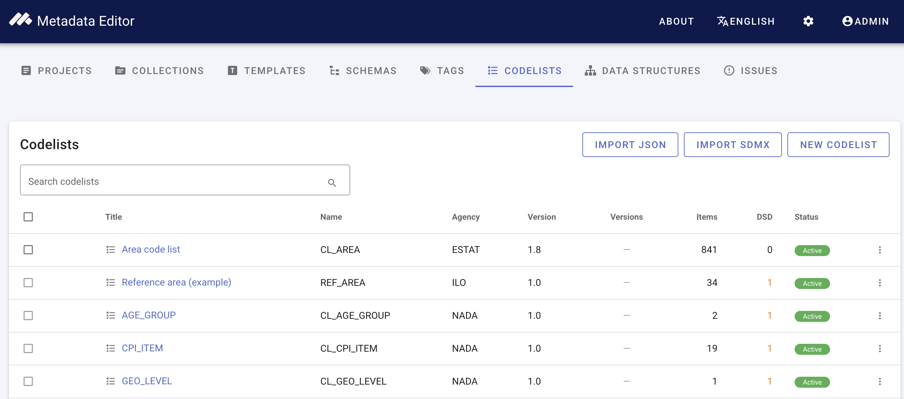
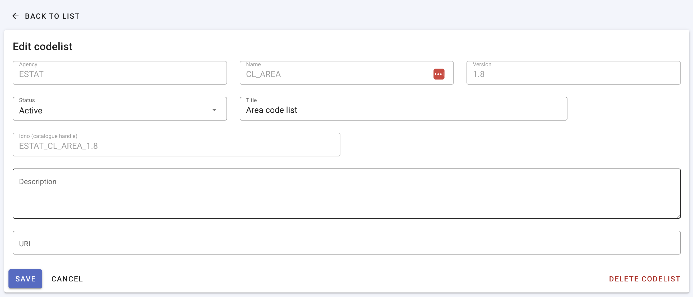
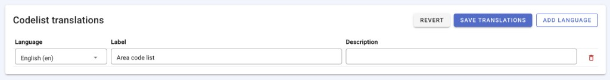
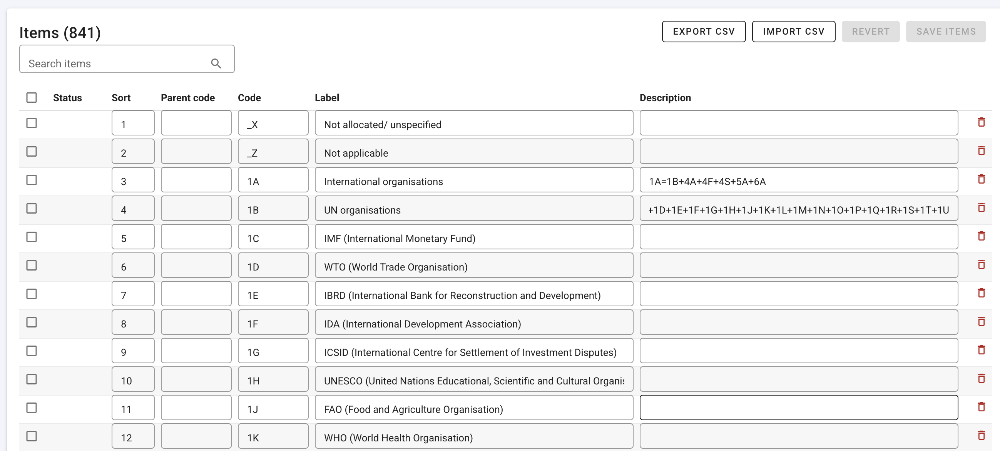
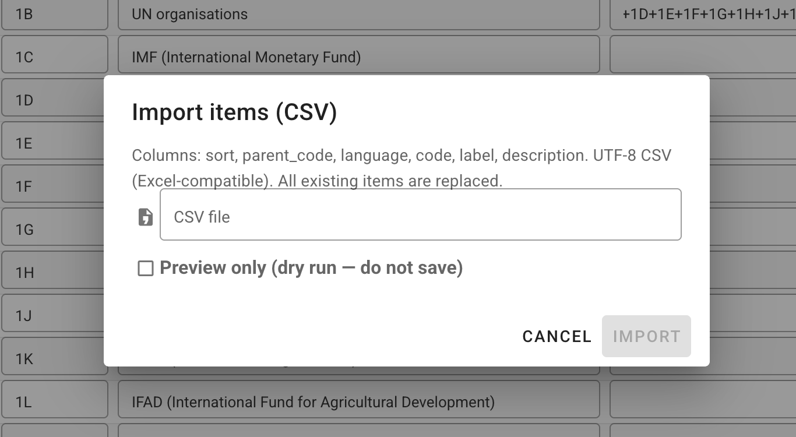
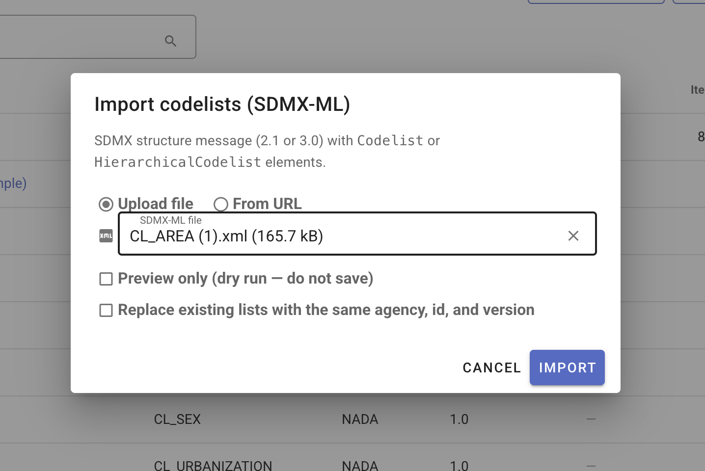
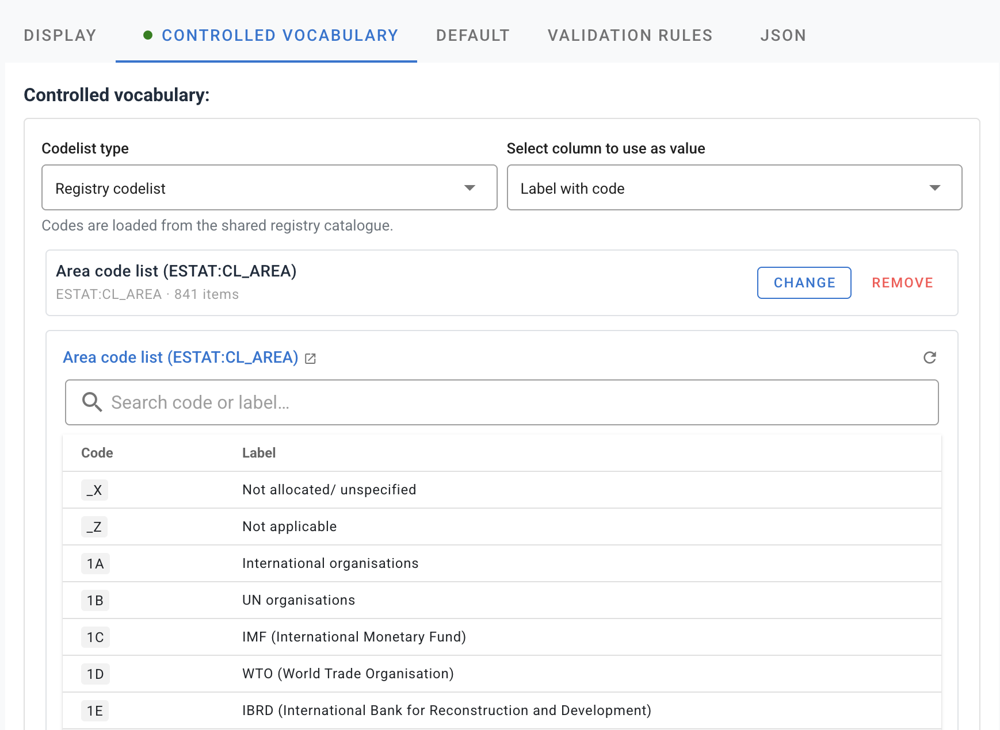

# Managing codelists

Codelists are controlled vocabularies (for example ISO country codes, SDMX frequency codes, or organization-specific code lists). Components in a [data structure](/managing_data_structures.html) can reference a **standard codelist** from the registry instead of defining codes inline.

See [Structural metadata](/structural_metadata.html) for how the registry relates to indicator projects.

## Open the codelists registry

From the main navigation, click **Codelists**.

The registry lists all site-wide codelists. Each row shows **Title**, **Name**, **Agency**, **Version**, **Versions** (when multiple versions exist), **Items** (code count), **DSD** (how many data structure components reference the list), and **Status**.

Use the search box to filter by title, name, or agency. Expand a row with multiple versions to see the version family (version number, status, item count, and DSD usage per version).

## Create a codelist

1. Click **New codelist**.
2. Enter identifying metadata:
   - **Agency**, **Name**, and **Version** — required; fixed after the codelist is created (create a new version to change these).
   - **Title** — display name shown in the registry and DSD picker.
   - **Idno** — optional catalogue handle; leave blank to auto-generate from agency, name, and version.
   - **Description** and **URI** — optional.
3. Click **Save**. The **Items** and **Codelist translations** sections appear after the first save.

Alternatively, [import a codelist from SDMX](#import-whole-codelists) or JSON instead of creating one manually.

## Codelist translations

Header translations define the codelist title and description in additional ISO languages. They are separate from individual code labels.

1. Open a saved codelist and scroll to **Codelist translations**.
2. Click **Add language** and select an ISO language code.
3. Enter the translated **Label** and optional **Description** for the codelist header.
4. Click **Save translations**.

Languages added here also appear in the **Items** grid, so you can enter multi-language labels for each code (one label row per language).

## Add and edit codes

After the codelist metadata is saved, use the **Items** section to maintain codes.

For each item you can set:

| Field | Purpose |
|-------|---------|
| **Code** | The value stored in observation data (for example `US`, `A`, `Q`) |
| **Label** | Human-readable name (for example *United States*, *Annual*) |
| **Description** | Optional longer text |
| **Sort** | Display order (numeric) |
| **Parent code** | Parent code for hierarchical lists (leave blank for top-level codes) |
| **Language** | Shown when multiple header languages are configured |

Edit codes inline in the grid. New and modified rows are highlighted until you click **Save items**. Use **Revert** to discard unsaved grid changes. **Search items** filters the current page; large lists are paginated (50 items per page).

Use **Add row** to insert a blank code, or select rows and **Delete selected** to remove saved codes in bulk.

### Import codes from CSV

On the edit page, click **Import CSV** to bulk-load or replace all items. You can also **Export CSV**, edit the file externally, and re-import to update codes in bulk.

Expected columns (UTF-8, comma-separated):

`sort`, `parent_code`, `language`, `code`, `label`, `description`

Import **replaces all existing items**. Use **Preview only (dry run)** to validate the file without saving. If you have unsaved grid edits, confirm before importing — the import discards them.

Click **Export CSV** to download the current items in the same format.

## View a codelist

Click a codelist title (or **View** in the row menu) to open the read-only **View** page. Locked and archived codelists open here instead of the editor.

The view page shows metadata, header translations, and a paginated, searchable codes table. Use **Edit** to switch to the editor (when the codelist is editable). Export buttons for JSON and SDMX are also available on this page.

## Status and versioning

Codelists use these statuses:

| Status | Meaning |
|--------|---------|
| **Draft** | Editable; not yet the canonical published version. |
| **Active** | Available for linking from data structure components. |
| **Locked** | Read-only in the registry. Unlock (admin) or create a new version to change codes. |
| **Archived** | Hidden from normal use; restore (admin) to return to active. |

Site administrators can change status from the row action menu (**Lock**, **Unlock**, **Archive**, **Restore**) or from the **Status** field on the edit form.

When a codelist has multiple versions, expand its row on the registry list to see the version family. To publish a new version, create a new codelist with the same agency and name but a different version string.

### Deletion rules

A codelist can be deleted only when:

- Status is **draft** or **active** (not locked or archived), and
- **DSD** usage is zero (no data structure components reference it).

The registry supports **batch delete**: select rows, then **Delete selected**. Lists in use or locked are skipped automatically. The **DSD** column on the registry list (see screenshot above) shows how many data structure components reference each codelist.

## Import and export whole codelists

Transfer codelists between sites or bulk-load from external sources.

### Import whole codelists

From the codelists list, use **Import JSON** or **Import SDMX**:

| Format | Source | Notes |
|--------|--------|-------|
| **JSON** | `.json` file upload | Single codelist export from this editor or API |
| **SDMX-ML** | `.xml` file upload or URL | Structure message with `Codelist` or `HierarchicalCodelist` elements (SDMX 2.1 or 3.0) |

Both import dialogs support:

- **Preview only (dry run)** — validate without saving (SDMX; JSON dry run reports planned action and code count).
- **Replace / overwrite** — update an existing list with the same agency, id, and version instead of skipping it.

#### Import from SDMX

1. On the codelists list, click **Import SDMX**.
2. Choose **Upload file** and select an SDMX-ML structure message, or choose **From URL** and paste a link to a structure message on the public internet (for example a codelist from the [SDMX Global Registry](https://registry.sdmx.org/sdmx/v2/structure/codelist/ESTAT/CL_AREA/1.8)).
3. Optionally enable **Preview only (dry run)** to confirm the file parses before saving.
4. If a list with the same agency, id, and version already exists, enable **Replace existing lists with the same agency, id, and version** to overwrite items.
5. Click **Import**. The new row appears in the registry; open it to review metadata and codes.

### Export (row menu or view page)

From each codelist's action menu (⋮) or the view page toolbar:

| Format | Use |
|--------|-----|
| **Export JSON** | Backup, migration, or API round-trip |
| **SDMX 2.1** | SDMX structure message for external systems |
| **SDMX 3.0** | SDMX 3 structure message |
| **Export CSV** | Item-level export from the edit page only (see [Import codes from CSV](#import-codes-from-csv)) |

Use export for backup, migration, or publishing codelists alongside DSDs to NADA or other SDMX-aware catalogs.

## Permissions

Access to the codelists registry is controlled by site roles (v1.3+). Typical permissions:

| Action | Requirement |
|--------|-------------|
| Browse the registry | Codelist browse permission (or administrator) |
| Create / edit codelists and codes | Codelist edit permission |
| Import JSON / SDMX | Codelist import permission |
| Delete codelists | Codelist delete permission |
| Lock, unlock, archive, restore | Site administrator |

Assign **Codelist manager** (or equivalent registry role) in **Users and roles** when non-administrators need to maintain shared lists. See [Upgrading to v1.3](/tech_upgrading_v1_3.html) for registry role assignments.

## Use codelists in metadata templates

Registry codelists are not only for [data structures](/managing_data_structures.html). In **Template Manager**, open a field’s **CONTROLLED VOCABULARY** tab and choose **Registry codelist** to link the field to a list in this registry instead of maintaining codes inline in the template.

- Maintain codes once in **Codelists**, then reuse them across many templates and DSD components.
- For **array** fields, map registry code and label columns to the array’s columns so curators pick codes from the registry when editing metadata.
- Fields restricted by schema **enum** values may only allow custom inline lists or must match schema allowed values; see [Designing templates — Controlled vocabularies](/templates_design.html#controlled-vocabularies).

## Next steps

1. [Managing data structures](/managing_data_structures.html) — link codelists to DSD components.
2. [Attach a data structure to an indicator project](/documenting_indicator_data_structure.html#attach-a-data-structure-to-the-project).
3. [Import observation data](/documenting_indicator_import_data.html) — imported codes must exist in linked global codelists.
