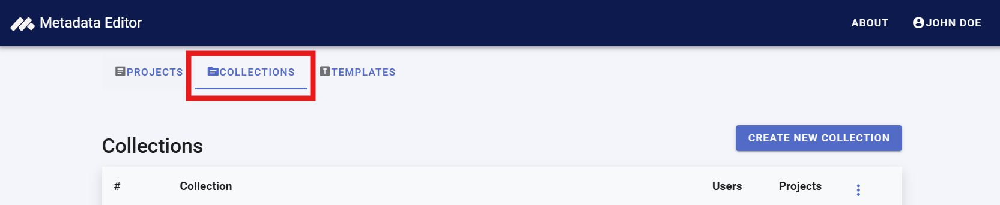
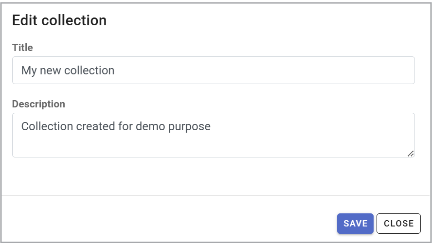
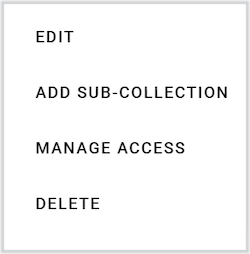
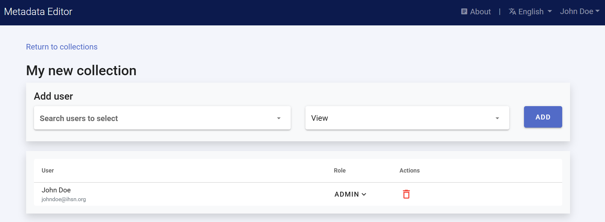
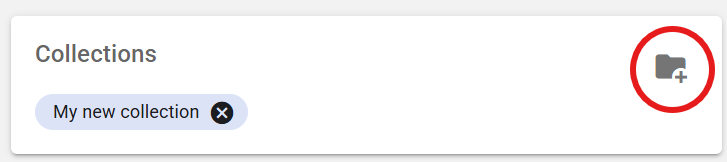

# Managing collections

When a project is created, it is initially visible only to its owner (creator). However, projects can be shared with other registered users of the Metadata Editor, granting different levels of permission (View, Edit, or Admin). This enables project owners to invite specific individuals to collaborate. For further details, refer to the section *Managing Projects*.

Another way to share projects and foster collaboration is by publishing them in *Collections*. Collections (and sub-collections) serve as virtual containers, allowing projects to be grouped based on themes, teams, or other organizational criteria. A project can belong to multiple collections simultaneously.

Collections are particularly useful for organizing projects when the Metadata Editor contains a large number of them. On the *My Projects* page, users can filter project lists by collection. Additionally, collections enable metadata administrators to generate summary reports for specific project groups (refer to the section *Administrator Tools*).

The primary and most significant role of collections is to facilitate permission management. Organizations often prefer to assign roles to teams rather than individual users. Permissions can be granted at both the project level (using the `SHARE` option, see section *Managing Projects*) and the collection level. Each collection has a defined list of collaborators, and all users with access to a collection automatically gain access to all projects published within it.

To access the collection management page in the Metadata Editor, click on `COLLECTIONS` in the main menu. 

## Creating, editing, or deleting a collection

Creating collections requires specific credentials. The system administrator has full authority to create collections, including those at the root level. Other authorized users can create sub-collections under a designated root-level collection. Up to two sub-levels of collections can be created.

To create a new root-level collection, click on `CREATE NEW COLLECTION`. Enter a short title and an optional description for the collection.

To create a sub-collection, open the *Options* menu for the parent collection and select `ADD SUB-COLLECTION`. Enter a name and description.

The `EDIT` button allows modification of the name and description of an existing collection.

The `DELETE` button removes a collection. Since collections serve as virtual containers, deleting a collection does not affect the projects within it.

## Setting permissions for a collection

To manage access, use the `MANAGE ACCESS` option to add or modify users and their roles. This feature allows you to grant or revoke access and adjust user roles. All users in the access list can view, edit, or delete collection entries, depending on their assigned roles.

## Adding projects to a collection

A project can be added to a collection from the *My Projects* page or the *Project* home page by selecting `ADD TO COLLECTION`. For additional details, refer to the sections *Managing Projects* and *Documenting Data*.

The collections to which a project belongs are displayed on the My Projects page. To remove a project from a collection, click the "X" next to the collection name.

