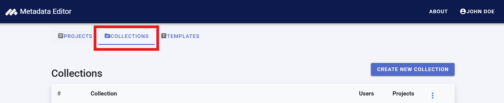
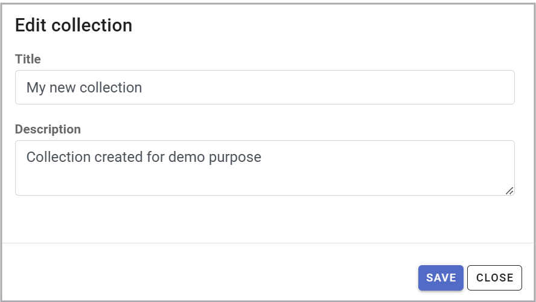
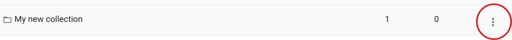
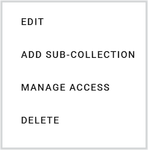
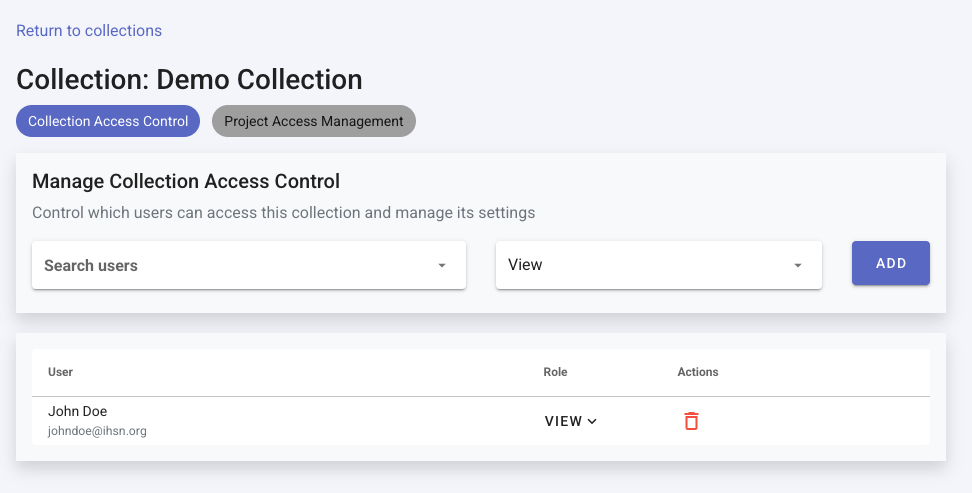
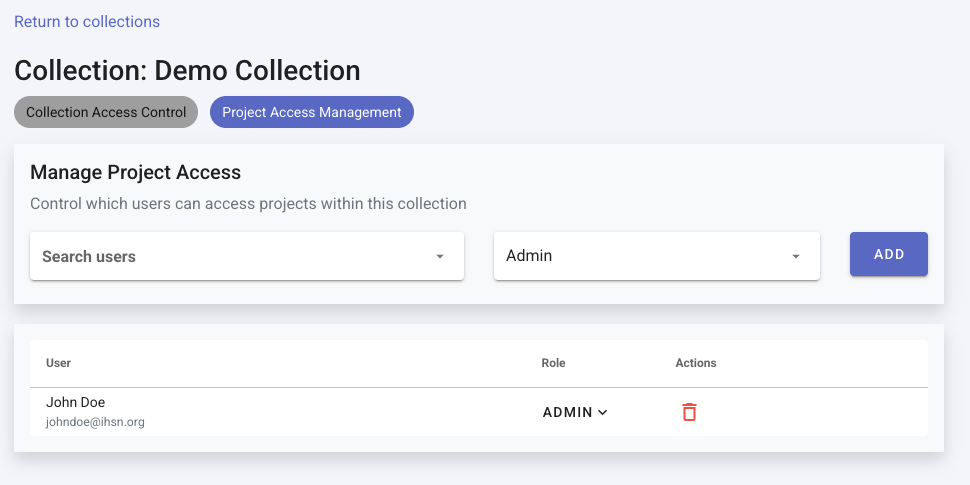
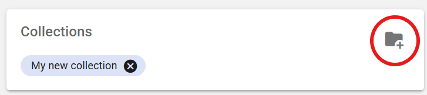
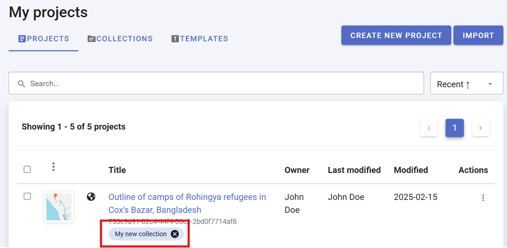

# Managing collections

When a project is created, it is initially visible only to its owner (creator). However, projects can be shared with other registered users of the Metadata Editor, granting different levels of permission (View, Edit, or Admin). This enables project owners to invite specific individuals to collaborate. For further details, refer to the section *Managing Projects*.

Another way to share projects and foster collaboration is by publishing them in *Collections*. Collections (and sub-collections) serve as virtual containers, allowing projects to be grouped based on themes, teams, or other organizational criteria. A project can belong to multiple collections simultaneously.

Collections are particularly useful for organizing projects when the Metadata Editor contains a large number of them. On the *My Projects* page, users can filter project lists by collection. Additionally, collections enable metadata administrators to generate summary reports for specific project groups (refer to the section *Administrator Tools*).

The primary and most significant role of collections is to facilitate permission management. Organizations often prefer to assign roles to teams rather than individual users. Permissions can be granted at both the project level (using the `SHARE` option, see section *Managing Projects*) and the collection level.

**Important:** Collections use two separate permission systems:
- **Collection Access Control**: Controls who can see and manage the collection itself (view, edit, or delete the collection)
- **Project Access Management**: Controls who can access projects that belong to the collection

These are managed separately through two tabs in the "Manage Access" interface. Users may need permissions in both systems depending on what they need to do. For example, a user with collection access can see the collection in the list, but they also need project access permissions to actually work with the projects inside the collection.

To access the collection management page in the Metadata Editor, click on `COLLECTIONS` in the main menu. 

## Creating, editing, or deleting a collection

Creating collections requires specific credentials. The system administrator has full authority to create collections, including those at the root level. Other authorized users can create sub-collections under a designated root-level collection. Up to two sub-levels of collections can be created.

To create a new root-level collection, click on `CREATE NEW COLLECTION`. Enter a short title and an optional description for the collection.

To create a sub-collection, open the *Options* menu for the parent collection and select `ADD SUB-COLLECTION`. Enter a name and description.

The `EDIT` button allows modification of the name and description of an existing collection.

The `DELETE` button removes a collection. Since collections serve as virtual containers, deleting a collection does not affect the projects within it.

## Setting permissions for a collection

The collection permissions system is designed to give you fine-grained control over who can access collections and the projects within them. This section explains how to manage these permissions.

### Understanding the Permission Interface

When you click `MANAGE ACCESS` for a collection, you'll see an interface with **two separate tabs**:

1. **Collection Access Control** - Controls access to the collection itself
2. **Project Access Management** - Controls access to projects within the collection

### Who Can Manage Permissions

Only users with **Admin** permission on a collection can manage its permissions. This includes:
- Collection owners (the user who created the collection)
- Users with Admin permission on the collection
- Global administrators

### Permission Levels Explained

Both permission systems use three permission levels:

- **View**: Read-only access
  - For Collection Access: Can see the collection in the list and view its details
  - For Project Access: Can view projects in the collection but cannot edit them
  
- **Edit**: Can modify content
  - For Collection Access: Can edit collection metadata (title, description) and add/remove projects from the collection
  - For Project Access: Can view and edit projects within the collection
  
- **Admin**: Full control
  - For Collection Access: Can edit collection settings, manage collection permissions, and delete the collection
  - For Project Access: Can view, edit, and manage projects within the collection

### Tab 1: Collection Access Control

This tab manages who can access and manage the collection itself.

**What it controls:**
- Who can see the collection in the collections list
- Who can edit the collection's title and description
- Who can add or remove projects from the collection
- Who can manage collection permissions
- Who can delete the collection

**To add users to Collection Access Control:**

1. Click `MANAGE ACCESS` on the collection
2. Select the **Collection Access Control** tab (should be selected by default)
3. In the user search field, type the username or email of the user you want to add
4. Select the permission level (View, Edit, or Admin) from the dropdown
5. Click `ADD`
6. The user will appear in the list below with their assigned permission level

**To modify a user's permission:**
- Click on the permission level next to the user's name
- Select a new permission level from the dropdown menu

**To remove a user:**
- Click the delete icon (trash/X) next to the user's name

### Tab 2: Project Access Management

This tab manages who can access projects that belong to the collection.

**What it controls:**
- Who can see and access projects within the collection
- Who can edit projects in the collection
- Who can manage project-level permissions

**Important:** This is separate from Collection Access Control. A user might be able to see the collection but not its projects, or vice versa, depending on which permissions they have.

**To add users to Project Access Management:**

1. Click `MANAGE ACCESS` on the collection
2. Select the **Project Access Management** tab
3. In the user search field, type the username or email of the user you want to add
4. Select the permission level (View, Edit, or Admin) from the dropdown
5. Click `ADD`
6. The user will appear in the list below with their assigned permission level

*Image: Project Access Management tab showing user search and permission selection*

**To modify a user's permission:**
- Click on the permission level next to the user's name
- Select a new permission level from the dropdown menu

**To remove a user:**
- Click the delete icon (trash/X) next to the user's name

### When to Use Each Tab

**Use Collection Access Control when:**
- You want to control who can see the collection
- You want to allow someone to manage the collection (edit title, add/remove projects)
- You want to delegate collection administration

**Use Project Access Management when:**
- You want to control who can work with projects inside the collection
- You want to give someone access to projects without giving them collection management rights
- You need different permissions for collection management vs. project work

**Use Both when:**
- You want someone to both manage the collection AND work with its projects
- You're setting up a complete team with full access

### Common Scenarios

**Scenario 1: Team member needs to edit projects**
- Add them to **Project Access Management** with **Edit** or **Admin** permission

**Scenario 2: Collection administrator**
- Add them to **Collection Access Control** with **Admin** permission
- Add them to **Project Access Management** with **Admin** permission (if they also need to manage projects)

**Scenario 3: Read-only access**
- Add them to **Collection Access Control** with **View** permission
- Add them to **Project Access Management** with **View** permission

### Troubleshooting Permission Issues

**"I can see the collection but not its projects"**
- Check if the user has permissions in the **Project Access Management** tab
- They may only have Collection Access Control permissions

**"I can access projects but can't see the collection"**
- Check if the user has permissions in the **Collection Access Control** tab
- They may only have Project Access Management permissions

**"I can't manage permissions"**
- Only users with **Admin** permission on the collection can manage permissions
- Collection owners automatically have Admin permission
- Global administrators can manage all collections

## Adding projects to a collection

A project can be added to a collection from the *My Projects* page or the *Project* home page by selecting `ADD TO COLLECTION`. For additional details, refer to the sections *Managing Projects* and *Documenting Data*.

The collections to which a project belongs are displayed on the My Projects page. To remove a project from a collection, click the "X" next to the collection name.

