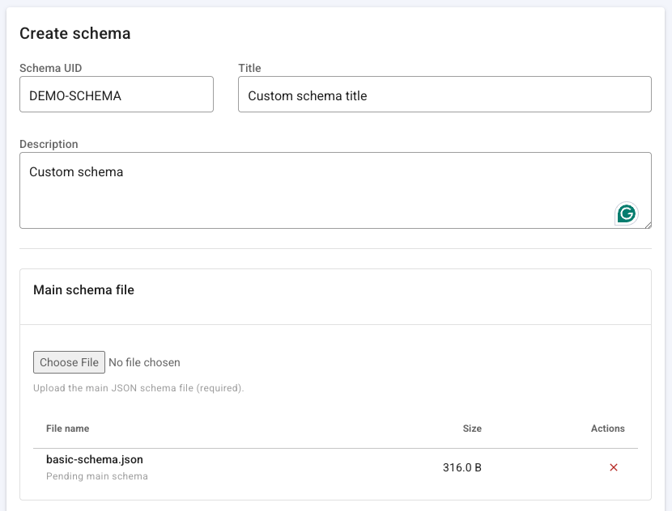
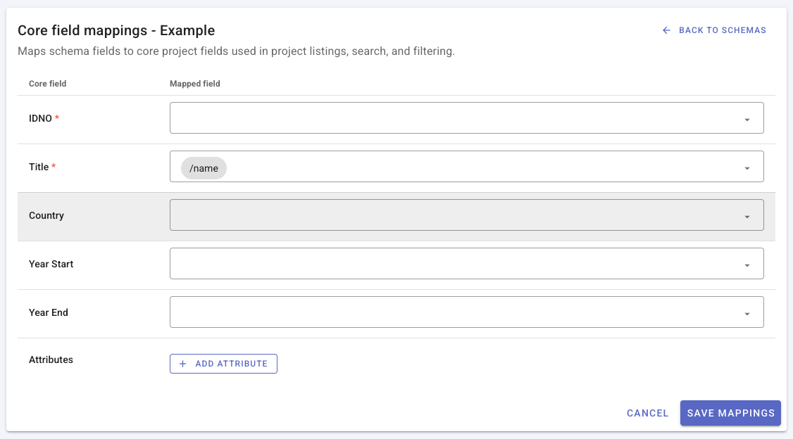

# Managing custom schemas

See [Custom metadata schemas](/custom_schemas.html) for an overview and how this feature relates to templates and structural metadata.

## Open the schema registry

From the main navigation, click **Schemas**.

The registry lists **core** schemas (built-in types) and **custom** schemas (organization-defined types). Each row typically shows an icon, **Title**, **UID**, **Alias** (if set), **Type** (Core or Custom), **Last updated**, and an actions menu.

- Click a **custom** schema title to open its edit page.
- Core schema titles are not editable from this screen; use **Preview** from the actions menu to inspect the specification.

## Create a custom schema

1. Click **Create schema**.
2. Enter:
   - **Schema UID** — unique identifier, 3–64 characters (letters, numbers, dash, underscore). Cannot be changed after creation. Do not use [reserved UIDs](/custom_schemas_json_schema_guidelines.html#schema-uid).
   - **Title** — display name in the registry and project UI.
   - **Description** — optional.
3. Under **Main schema file**, choose the root JSON Schema file (required on create).
4. Optionally under **Related schema files**, add JSON files referenced from the main schema via `$ref`.
5. Click **Save**.

On success, the editor validates the schema, stores files on disk, registers the type, and **generates a default template** for the new type.

## Edit schema metadata and files

Open a custom schema from the list (title link or **Edit** in the actions menu).

You can update **Title** and **Description** and manage files:

| Action | Purpose |
|--------|---------|
| **Replace main schema** | Upload a new root JSON Schema (validated on upload). |
| **Add related schema files** | Upload additional `$ref` targets without replacing the main file. |
| **Download** | Download an existing file from the manifest. |
| **Delete** (related files) | Remove a related file from the schema directory (not the main file from this action alone — use replace main to change the root). |

If the edit page shows a **Reserved root-level properties** warning, update the main schema so those names are nested under an object grouping, then replace the main file. See [JSON Schema guidelines](/custom_schemas_json_schema_guidelines.html#reserved-root-property-names).

## Core field mappings

Project lists, search, and filters use a small set of **core fields** (identifier, title, country, year range, and optional **attributes**). Each custom schema must map its JSON structure to these fields using **JSON pointers** (paths into the metadata object).

1. From the schema list actions menu, choose **Edit core mappings** (custom schemas only).
2. Map **IDNO** and **Title** (required) to one or more schema field paths.
3. Optionally map **Country**, **Year start**, **Year end**, and custom **Attributes**.
4. Click **Save mappings**.

The field picker is built from the compiled schema. After you change the main schema file, review mappings and use **Regenerate template** if the form layout should match the new structure.

## Preview the schema specification

From the actions menu, choose **Preview schema** to open a read-only API-style view of the schema (OpenAPI/Redoc). Use this to verify structure and share documentation with developers.

You can also download OpenAPI JSON or YAML from the preview page when available.

## Templates for custom types

When a custom schema is created or its main file is replaced, the Metadata Editor maintains a **generated** template that includes fields derived from the JSON Schema. Generated templates are **read-only**.

To tailor labels, required flags, or layout for curators:

1. Open **Templates** in the main navigation.
2. Filter by your custom schema type.
3. **Duplicate** the generated template and edit the copy (same workflow as [Designing templates](/templates_design.html)).

From the schema list, **Regenerate template** rebuilds the generated default from the current schema (overwriting that generated template). Confirm before running if curators rely on the auto-generated layout; customized duplicates are not removed.

## Create projects with a custom type

After the schema is active and [enabled for new projects](/custom_schemas.html#enable-custom-types-for-new-projects):

1. Go to **Projects** and create a new project.
2. Select your custom schema type in the type picker.
3. Choose a template (generated default or your duplicate).
4. Complete metadata entry and save.

Validation uses the registered JSON Schema for that type.

## Delete a custom schema

From the actions menu, choose **Delete** (custom schemas only).

- Deletion is blocked if **any projects** still use that schema UID.
- Deleting a schema **removes all templates** associated with that type.

Core schemas cannot be deleted from the registry.

## Programmatic management

Administrators can manage schemas through the REST API under `/api/schemas` (list, create, update, file upload, compiled schema, field list, regenerate template, delete). Operations mirror the UI constraints above. For built-in type payloads and project APIs, see the [Metadata Schemas API reference](https://worldbank.github.io/metadata-schemas/); schema-registry endpoints may be documented in your instance’s OpenAPI export as they are added to the public spec.
