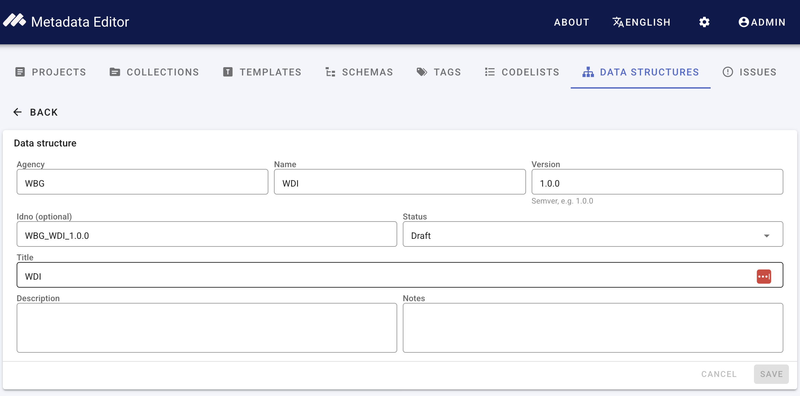
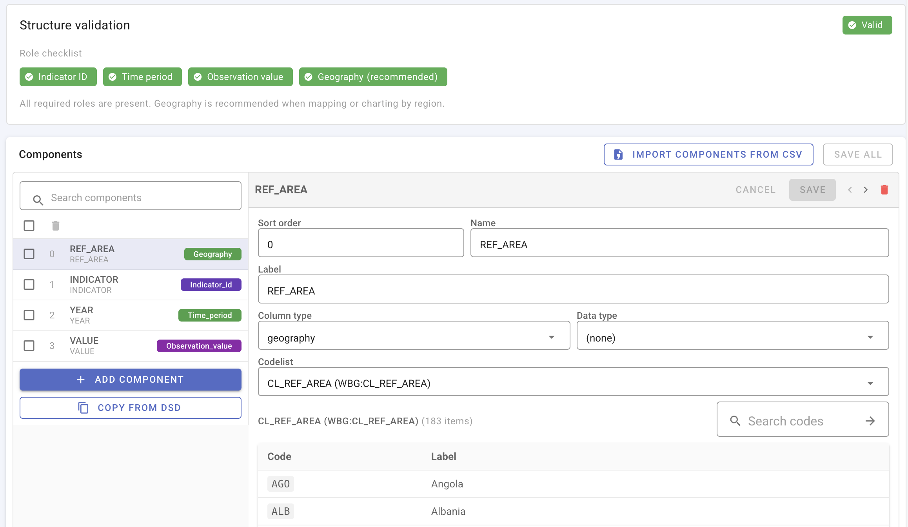
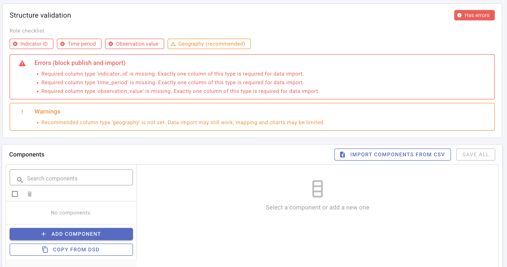
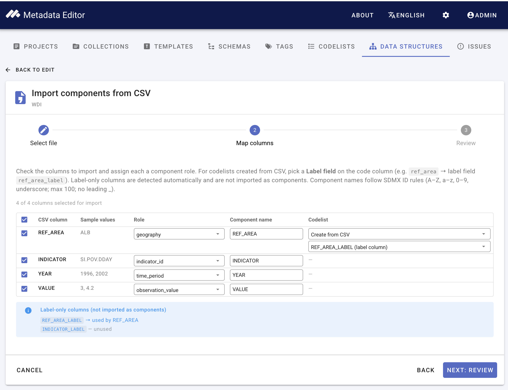
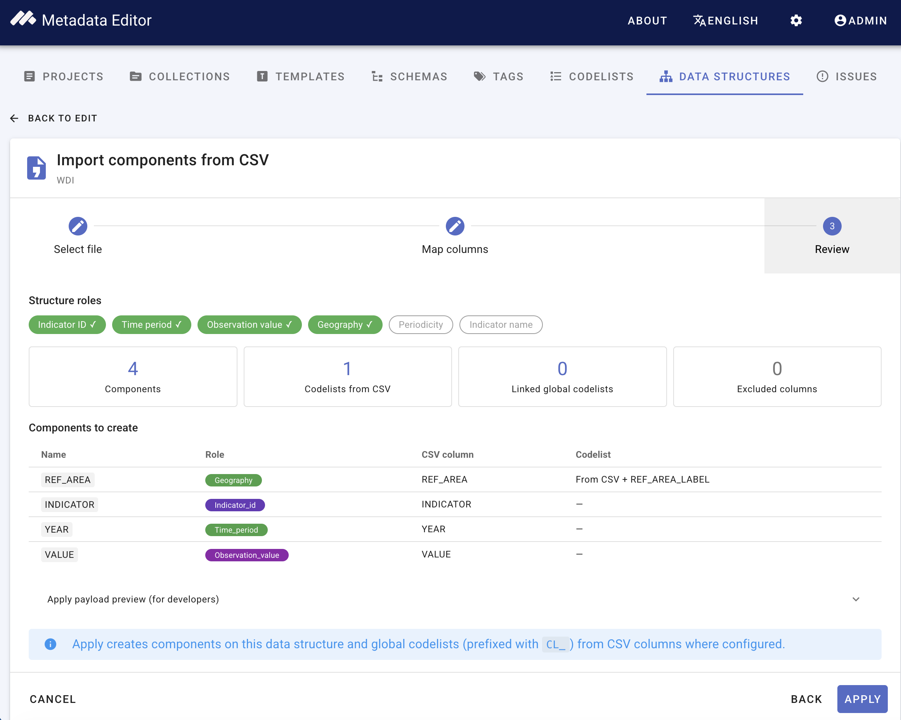

# Managing data structures

A **data structure** defines the columns expected in indicator CSV files: names, labels, SDMX column types, data types, time-period formats, and optional links to [global codelists](/managing_codelists.html).

See [Structural metadata](/structural_metadata.html) for how the registry relates to indicator projects. Column types are described in [Structural metadata (project)](/documenting_indicator_data_structure.html#column-types).

## Open the data structures registry

From the main navigation, click **Data structures**.

> **Screenshot:** New data structure — identifying metadata (agency, name, version, title).

## Create a data structure manually

Use this path when you know the column layout and want to define each component yourself (or link existing codelists).

1. Click **New data structure**.
2. Enter **idno**, **agency**, **name**, **version**, **title**, and optional description.
3. Add **components** (one per CSV column). For each component, set:
   - **Name** — column header in the CSV (must not start with `_`; system columns such as `_ts_year` are derived at import).
   - **Label** and optional **description**.
   - **Data type** — String, Integer, Float, Date, or Boolean.
   - **Column type** — SDMX role (see [Column types](/documenting_indicator_data_structure.html#column-types)).
   - **Time period format** — when the column type is *Time period* (for example `YYYY`, `YYYY-MM`).
   - **Codelist** — *None*, or **Standard codelist** linked from the registry.

4. Resolve **structure validation** messages before publishing the structure or binding it to indicator projects (see below).

> **Screenshot:** Data structure editor — component list (left) and component detail form (right), including column type and standard codelist picker.

### Structure validation

Immediately after you create a data structure, before any components are defined, validation reports **errors** for missing required column types (Indicator ID, Time period, Observation value) and **warnings** for recommended types (for example Geography). These must be resolved before the structure can be published or used for import.

> **Screenshot:** Global DSD page — structure validation with no components yet (**Has errors**; role checklist and error list).

Add components manually, or use [Create a data structure from a CSV file](#create-a-data-structure-from-a-csv-file) below, until validation passes.

## Create a data structure from a CSV file

Use this path when you have a sample CSV in **long format** and want the editor to infer column names and suggest mappings.

The documentation example uses the World Bank indicator **SI.POV.DDAY** (*Poverty headcount ratio at $3.00 a day (2021 PPP) (% of population)*). Download:

[`SI.POV.DDAY_countries_data-long.csv`](/quick_start_files/indicator/SI.POV.DDAY_countries_data-long.csv)

### Example file layout

| REF_AREA | REF_AREA_LABEL | INDICATOR | INDICATOR_LABEL | YEAR | VALUE |
|----------|----------------|-----------|-----------------|------|-------|
| ARG | Argentina | SI.POV.DDAY | Poverty headcount ratio at $3.00 a day (2021 PPP) (% of population) | 2010 | 1.5 |
| ARG | Argentina | SI.POV.DDAY | Poverty headcount ratio at $3.00 a day (2021 PPP) (% of population) | 2015 | 1.1 |
| ARM | Armenia | SI.POV.DDAY | Poverty headcount ratio at $3.00 a day (2021 PPP) (% of population) | 2010 | 2.9 |

### Suggested column mapping

| CSV column | Column type | Codelist |
|------------|-------------|----------|
| `INDICATOR` | Indicator ID | None |
| `INDICATOR_LABEL` | Indicator name | Label-only (not imported as a data column) |
| `REF_AREA` | Geography | Create from CSV, or link an existing codelist; label field `REF_AREA_LABEL` |
| `REF_AREA_LABEL` | — | Label-only |
| `YEAR` | Time period | Format `YYYY` |
| `VALUE` | Observation value | None |

### Steps

1. Click **New data structure** and enter identifying metadata (for example title *WDI poverty headcount DSD*).
2. Under **Components**, click **Import components from CSV**.
3. Upload `SI.POV.DDAY_countries_data-long.csv`. Leave delimiter as **Comma (,)** and continue to **Map columns**.
4. Confirm mappings match the table above. Create a geography codelist from `REF_AREA` / `REF_AREA_LABEL` if prompted.
5. Save the structure and resolve any validation messages before publishing.

> **Screenshot:** Data structure CSV bootstrap — column mapping step with SI.POV.DDAY columns mapped.

Do **not** use the **wide** WDI export (`SI.POV.DDAY_countries_data.csv`) for DSD bootstrap — year columns would be misread as separate components. That file is for [metadata coverage](/quick_start_indicator.html) only. See [Long vs wide format](/documenting_indicator_concepts_long_wide.html).

## Publish and export

- **Draft** structures can be edited freely. **Published** structures are locked; create a new version to change components after publication.
- **Validate** — run structure validation before binding to projects or publishing to NADA.
- **Export JSON** — download the DSD (including nested components) for backup or transfer.
- **Import JSON** — load a full DSD export (may include embedded codelists).
- **Import SDMX-ML** — import an SDMX structure message.
- **Duplicate / delete** — maintain version families; see linked **Projects** view for impact before deleting structures in use.

> **Screenshot:** Import from CSV — review mapped components before saving.

## Projects using a structure

From a data structure detail page, open **Projects** (or the equivalent linked-projects view) to see which indicator projects are bound to the structure.

## Next steps

1. [Attach the structure to an indicator project](/documenting_indicator_data_structure.html#attach-a-data-structure-to-the-project).
2. [Import observation data](/documenting_indicator_import_data.html) using the same long-format CSV.
