# Quick-start: Document

In this example, we will document a book titled *The Analysis of Household Surveys: A Microeconometric Approach to Development Policy* authored by Angus Deaton and published in 2019. This book is freely available from the World Bank's Open Knowledge Repository at http://hdl.handle.net/10986/30394. 

In this Quick-start exercise, we assume that you want to publish information on the book in a data catalog, with a link to the World Bank's Open Knowledge Repository (i.e., we assume that you not plan to make the book directly available from your catalog). The only file you need to reproduce this Quick-Start example is the image file of the book's cover page (file *.../quick_start_files/document/cover_deaton_survey_analysis.jpg*), although you may use another image file of your choice.

> This Quick Start section does not include detailed guidance on documenting publications. For comprehensive instructions, see the chapter **Documenting a publication or report**.

## Step 1: Create a new project and add a thumbnail

To begin, open the Metadata Editor in your web browser (the URL is determined by where you installed the application), and log in with your username and password. The *My projects* page will be displayed, showing all projects you have previously created and those that have been shared with you by other data curators, if any. If you are using the application for the first time and no project has been shared with you, the project list will be empty.

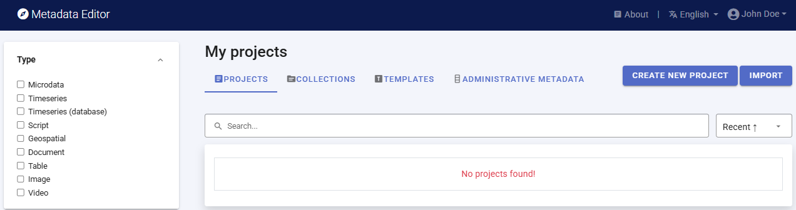

Click on `CREATE NEW PROJECT` and select *Document* when prompted to indicate that the resource you will be documenting is a document (a publication or report).

  
A new project page will open in a new tab.

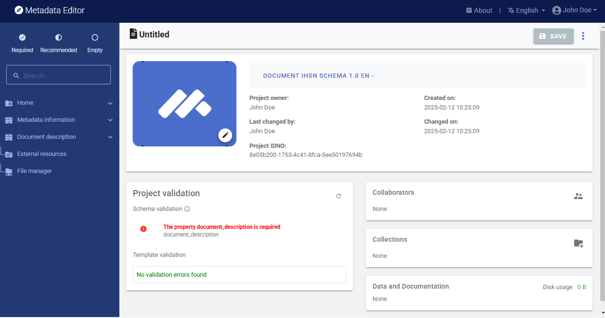

You will use the cover page of the book as a thumbnail. Note that providing a thumbnail is not required, but recommended. The thumbnail will be displayed in the Metadata Editor project list, and in the NADA catalog if the metadata is published in NADA. The cover page has been captured and saved as *cover_deaton_survey_analysis.jpg* (you can capture a document cover page with any screen capture tool, and save the image file in JPEG or PNG format). Click on the `edit` icon in the screenshot image, and select the image file when prompted. 

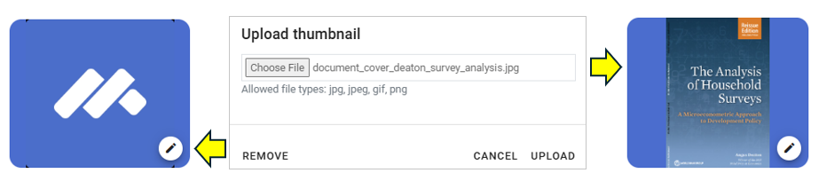

Documenting a dataset (or a document in this case) consists of entering metadata in metadata entry forms defined by a *metadata template*. When you create a new project, a default template is automatically selected. We will use this template, so there is no need to switch template. 

## Step 2: Enter metadata

In the navigation tree, select *Metadata information / Information on metadata* to enter information on who documented the publication and when. All information in this section is optional. Enter your name (as metadata producer) and the date of the day in ISO format YYYY-MM-DD (this is the date when the metadata, not the book, was produced). Then click on `SAVE`.

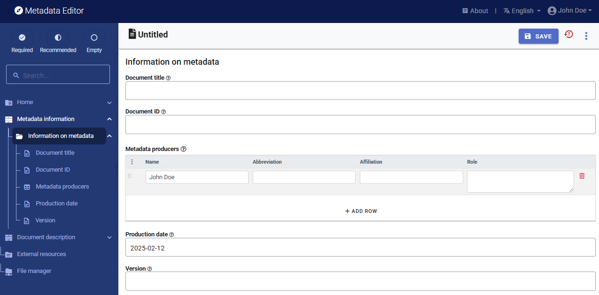

You can now start entering the metadata related to the book itself in the *Document Description* section. In the navigation tree, first select *Title statement* and enter the required `primary ID`, a unique identifier of your choice, e.g., JD_DOC_001 (if you want to publish the document in a NADA catalog, make sure that the identifier is not used by another user or for another project). Also enter the optional `Other identifiers` of the document, including the DOI (*10.1596/ 978-1-4648-1331-3*) and the ISBN (*978-1-4648-1352-8*). Then enter the `Title` of the book (*The Analysis of Household Surveys*) which is a required element, and its `Subtitle` (*A Microeconometric Approach to Development Policy*). Note that another option is to enter the title and subtitle as a single element under `Title`. 

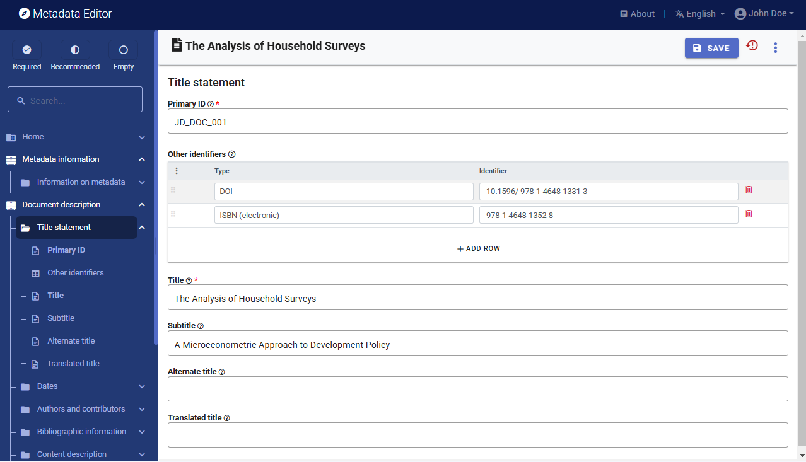

Then proceed with the other sections in the navigation tree and fill out the following elements. 

- ***Author***: Angus Deaton
- ***Publication date**** (in ISO format YYYY-MM-DD): 2019-01-16
- ***Abstract***: Two decades after its original publication, The Analysis of Household Surveys is reissued with a new preface by its author, Sir Angus Deaton, recipient of the 2015 Nobel Prize in Economic Sciences. This classic work remains relevant to anyone with a serious interest in using household survey data to shed light on policy issues. This book reviews the analysis of household survey data, including the construction of household surveys, the econometric tools useful for such analysis, and a range of problems in development policy for which this survey analysis can be applied. The author's approach remains close to the data, using transparent econometric and graphical techniques to present data in a way that can clearly inform policy and academic debates. Chapter 1 describes the features of survey design that need to be understood in order to undertake appropriate analysis. Chapter 2 discusses the general econometric and statistical issues that arise when using survey data for estimation and inference. Chapter 3 covers the use of survey data to measure welfare, poverty, and distribution. Chapter 4 focuses on the use of household budget data to explore patterns of household demand. Chapter 5 discusses price reform, its effects on equity and efficiency, and how to measure them. Chapter 6 addresses the role of household consumption and saving in economic development. The book includes an appendix providing code and programs using STATA, which can serve as a template for the users' own analysis.
- ***Language***: English (code EN)
- ***Rights***: CC BY 3.0 IGO
- ***Document type***: Book (select from drop down)
- ***Keywords***: Enter one keyword per row: household survey; survey design; data collection; economic development; development policy 
- ***Topics***: Enter one topic per row and only fill in column *Topic*): Development Patterns and Poverty; Living Standards; Poverty Assessment; Poverty and Policy; Statistical & Mathematical Sciences

This information can be entered in the Metadata Editor template in the following elements: 

| From World Bank           | In the metadata template (Document description)                             | 
| ------------------------- | --------------------------------------------------------------------------- | 
| Publication date          | Date / `Date published`                                                     |
| Author                    | Authors and contributors / `Authors`                                        |
| Document type             | Content description / `Document type`                                       | 
| Language                  | ontent description / `Language`                                             | 
| Abstract                  | Content description / `Abstract`                                            |
| Keywords                  | Content description / `Keywords`                                            |
| Topics                    | Content description / `Topics`                                              | 
| Rights                    | Access and rights / `Rights`                                                |

After entering all available information, click on `SAVE`. Click on *Preview* in the navigation tree to view all information you have entered so far.

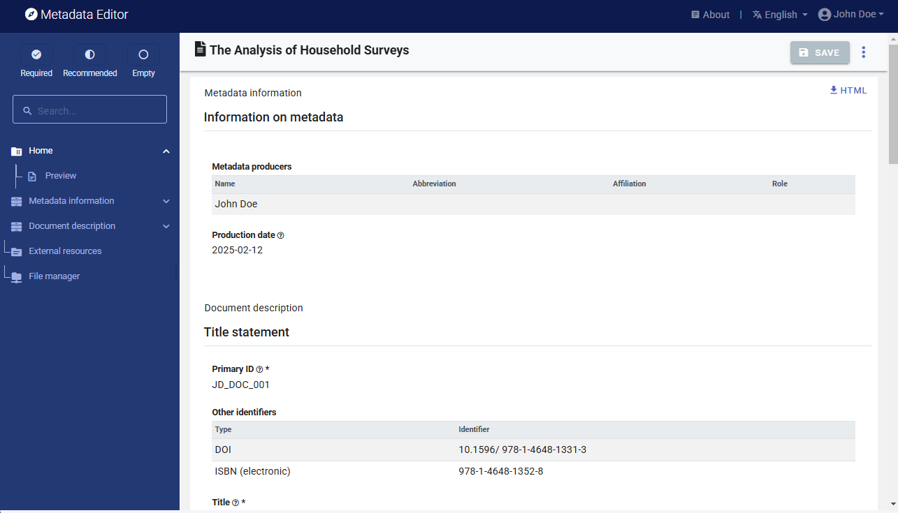

## Step 3: Provide a link to the document

The next step is to add a link (URL) to the book. Another option would be to upload the book in PDF; but in this exercise, we assume you do not want to distribute the book but only to list it in a catalog with a link to an external repository. This information, along with any other related files and links you may want to attach to the metadata, is referred to as *External resources*. To add external resources, click on *External resources* in the navigation tree and click on `CREATE RESOURCE`. 

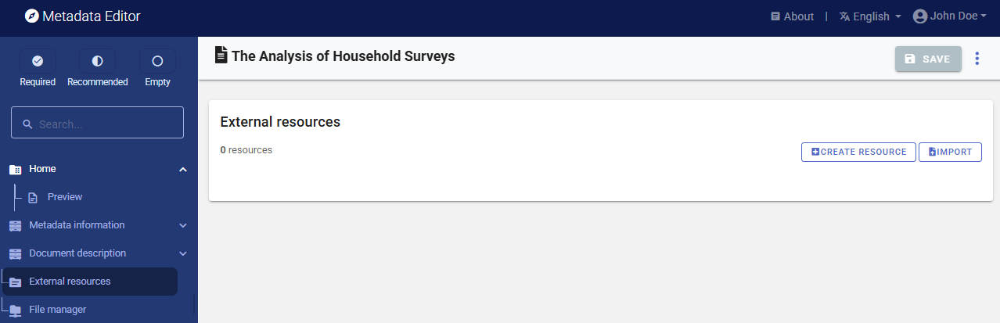

This will open a new resource page where you can describe the resource. Most elements are optional, but at a minimum, you should enter the `Resource type` (select *Document, Technical* from the drop down), the `Title` including the subtitle (*The Analysis of Household Surveys: A Microeconometric Approach to Development Policy*), the `Author` (Angus Deaton), and the `Date` (the date of publication, in ISO format: 2019-01-16). To provide users with access to the book, add the external link (*http://documents.worldbank.org/curated/en/593871468777303124*) in `Resource attachment`. 

Then click `SAVE`. The document will now be listed as an external resource.

With this, you have completed the documentation of the book. The *My Projects* page will show this new entry. You may at any time go back to it to edit or complete the metadata.

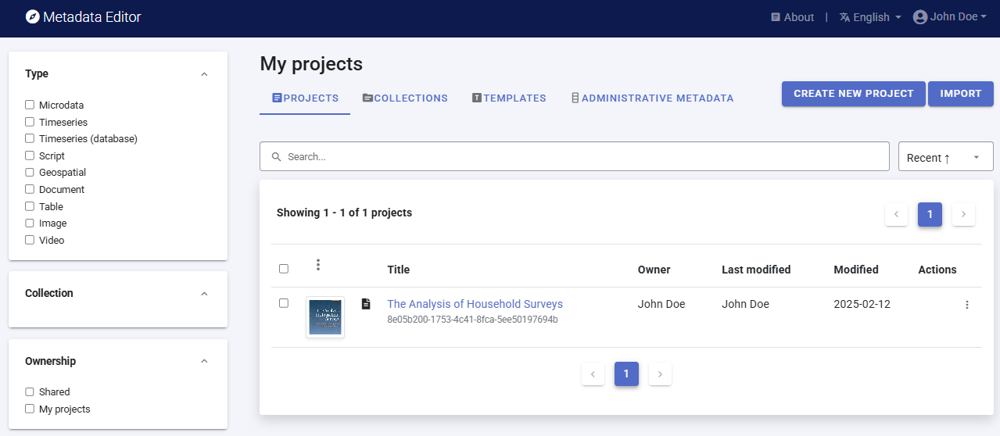

## Step 4: Export and publish metadata

In the *Project* page, a menu of options is available to you. 

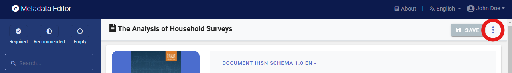

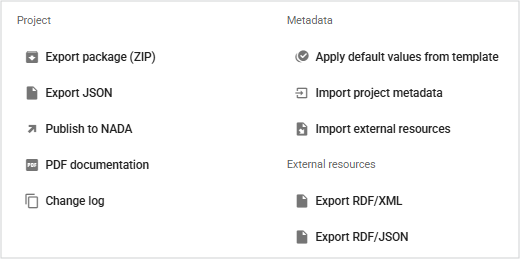

- ***Export package (ZIP)***

  This option will allow you to generate a ZIP file containing all metadata and resources related to the project. This package can be shared with others, who can import it in their own Metadata Editor.

- ***Export JSON***

  Export metadata to JSON will generate a JSON file containing the metadata. The option is provided to include all elements or only the non-private ones. The JSON file will look like this:

  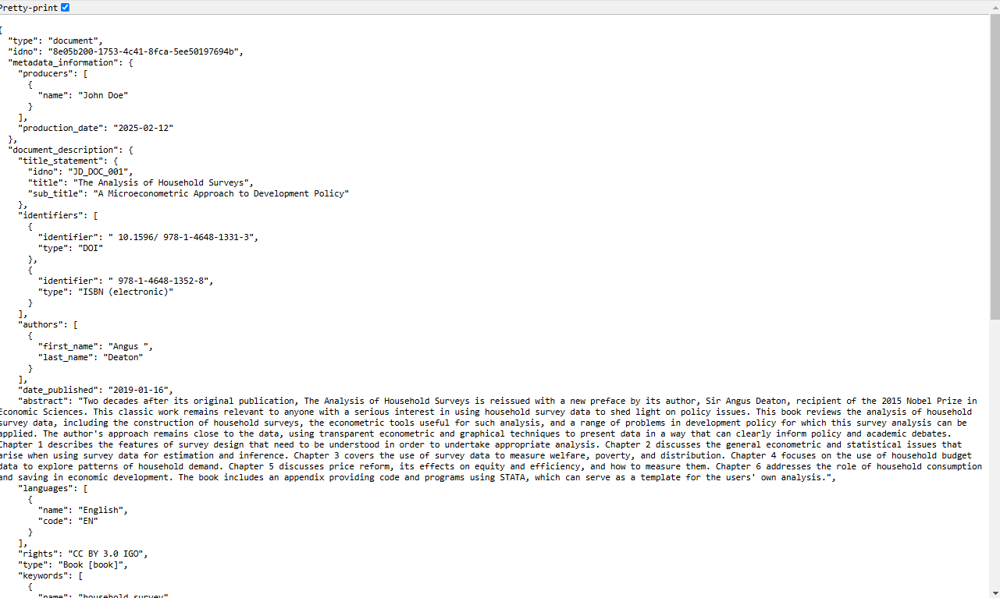

- ***Export RDF/XML** and **Export RDF/XML***

  These options allow you to export the metadata related to external resources in JSON or XML format.

  
- ***PDF documentation***

  A PDF version of the metadata can be automatically created. Select *PDF documentation* then click on `GENERATE PDF`. When the PDF is generated, click on `DOWNLOAD PDF`. You will obtain a bookmarked PDF file with all entered metadata.

  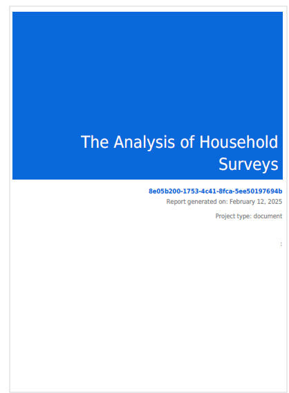

- ***Publish to NADA***

  If you have a NADA catalog and the credentials to publish content in it, you can also `Publish to NADA`. Select a configured NADA catalog, select the options as shown in the screenshot below, and click `PUBLISH`. 

  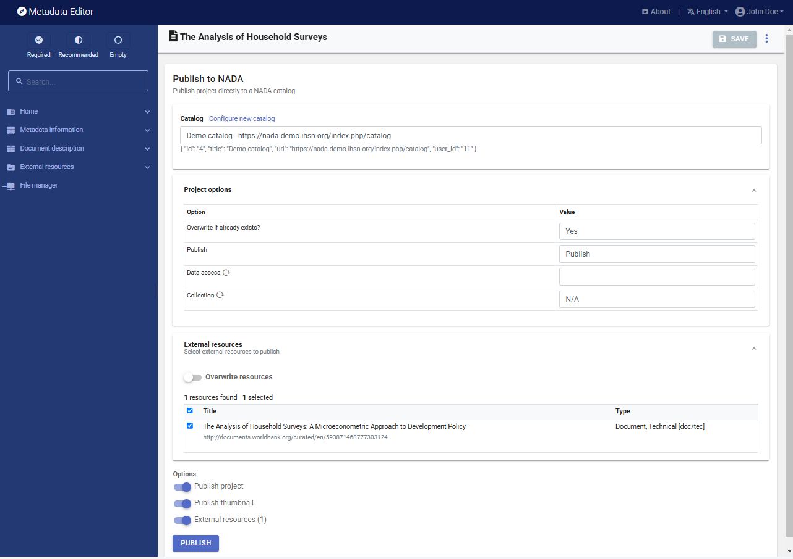

  The book will now be listed and made discoverable in the NADA catalog.

  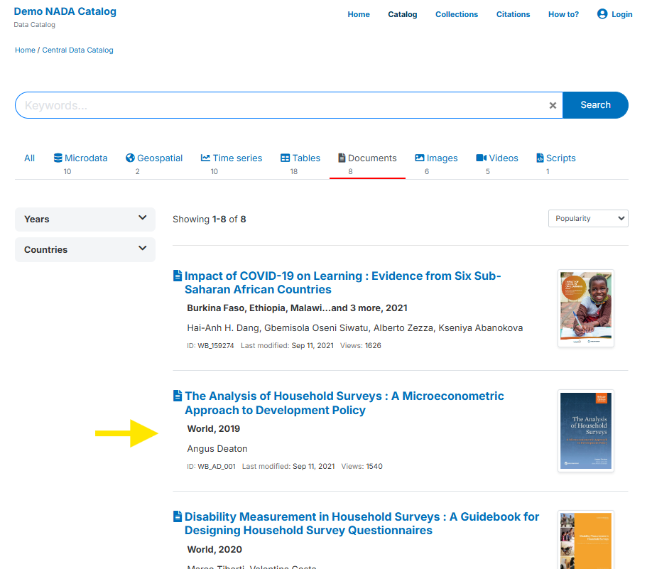

