# Quick start: Geographic dataset

In this example, we will document a geographic dataset extracted from the Humanitarian Data Exchange (HDX) website. This dataset provides an outline of camps of Rohingya refugees in Cox's Bazar, Bangladesh. The only file you need to reproduce this Quick start example is the image file *.../image/HDX_BGD_camps_thumbnail.jpg* (feel free to use any another PNG or JPG image file of your choice).

> This Quick start section does not include detailed guidance on documenting geographic data. For comprehensive instructions, see the chapter **Documenting geographic datasets and services**.

## Step 1: Create a new project and add a thumbnail

To begin, open the Metadata Editor in your web browser (the URL is determined by where you installed the application), and log in with your username and password. The *My projects* page will be displayed, showing all projects you have previously created and those that have been shared with you by other data curators, if any. If you are using the application for the first time and no project has been shared with you, the project list will be empty.

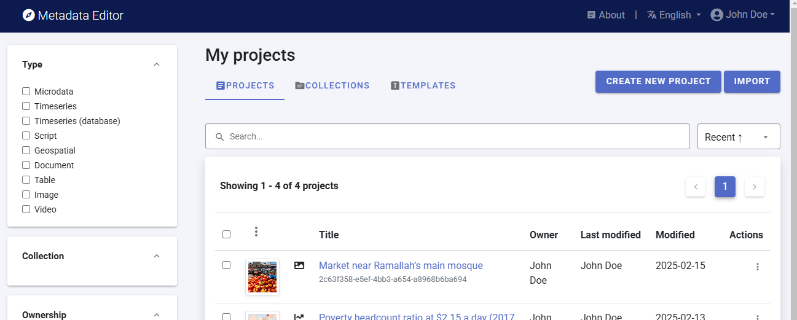

Click on `CREATE NEW PROJECT` and select *Geospatial* when prompted to indicate the type of resource you will be documenting (in this case a geographic dataset).

  
A new project page will open in a new tab.

You will use the JPG file *HDX_BGD_camps_thumbnail.jpg* as a thumbnail (or you may select another JPG or PNG image file of your choice). Note that providing a thumbnail is not required, but recommended. The thumbnail will be displayed in the Metadata Editor project list, and in the NADA catalog if the project is published in NADA. Click on the `edit` icon in the screenshot image, and select the image file when prompted.

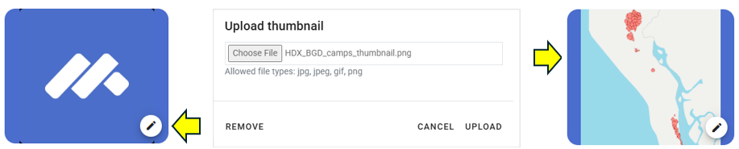

Documenting a dataset consists of entering metadata in metadata entry forms defined by a metadata template. When you create a new project, a default template is automatically selected. We will use this template, so there is no need to switch template. The template we will use is named *Geospatial - Inspire/Gemini with additional elements* (version 1.0). It contains the metadata elements recommended by the INSPIRE directive of the European Union and the GEMINI specification from the United Kingdom, to which a few elements have been added.

## Step 2: Enter metadata

On the left navigation tree, select *Document description* to enter optional elements used to capture information on who documented the dataset and when. Enter your `name` as netadata producer, and the `date` of the day in ISO format (YYYY-MM-DD). This is the date when the metadata, not the dataset, was produced. Then click on `SAVE`.

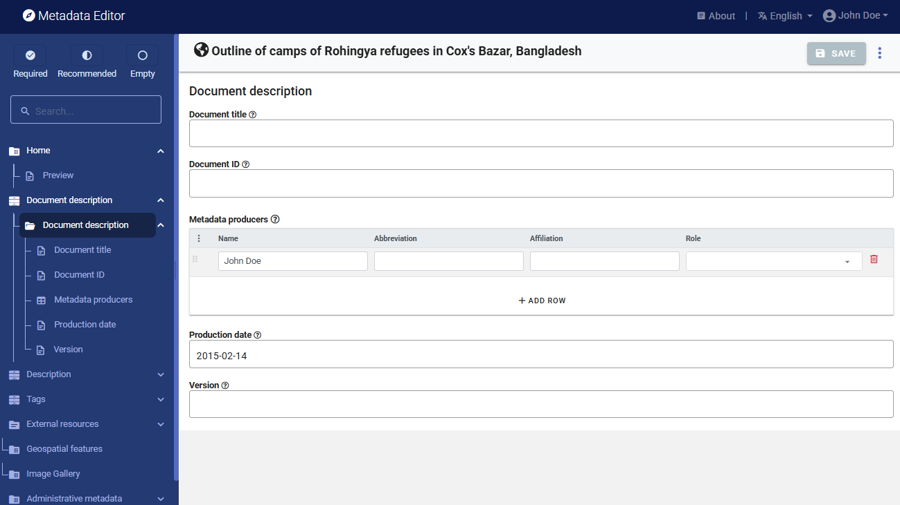

You can now start entering the metadata related to the geographic dataset itself. In the navigation tree, first select *Description / Metadata* and enter the required information on the type of resource ("Dataset") in the field `Hierarchy level` and the required `Primary ID` (a unique identifier of your choice, e.g., JD_GEO_001; if you want to publish the document in a NADA catalog, make sure that this same identifier is not used by another user or for another project). 

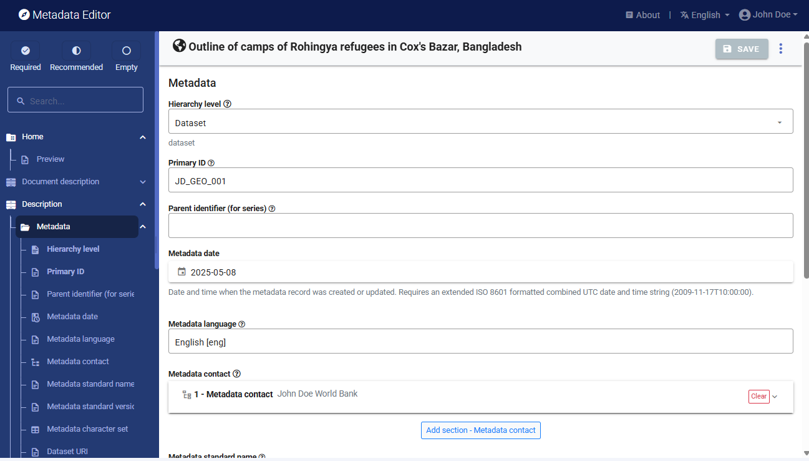

Then proceed with the other sections in the navigation tree and fill out the following elements using the information provided in the HDX website, also provided below (see *Additional information* section in web page https://data.humdata.org/dataset/outline-of-camps-sites-of-rohingya-refugees-in-cox-s-bazar-bangladesh). The metadata template is a bit complex, due to the complexity of the underlying ISO 19139 metadata standard.

- ***Type of dataset (hierarchy level) :***  Dataset
- ***Metadata date:*** (enter the date you are documenting the dataset)
- ***Metadata language:*** English
- ***Metadata contact:*** Enter your name and the date you are documenting the dataset.
- ***Metadata standard used:*** ISO 19139
- ***Dataset website:*** https://data.humdata.org/dataset/outline-of-camps-sites-of-rohingya-refugees-in-cox-s-bazar-bangladesh
- ***Metadata update:*** Not planned
- ***Title:*** Outline of camps of Rohingya refugees in Cox's Bazar, Bangladesh
- ***Source:*** RRRC, Inter Sector Coordination Group (ISCG), Site Management Sector, UNHCR, IOM
- ***Description:*** This spatial database contains the outline of the camps, settlements, and sites where Rohingya refugees are staying in Cox's Bazar, Bangladesh.
- ***Time period of the dataset:*** January 20, 2018 - April 05, 2024
- ***Modified:*** 19 May 2024
- ***Expected update frequency:*** As needed
- ***Location:*** Bangladesh
- ***Topics:*** Society
- ***Keywords:*** settlements; refugee crisis; refugees ; forced displacement ; refugee camps
- ***Dataset language:*** English
- ***Presentation form:*** Digital map
- ***Status:*** Completed
- ***Bounding box (W/E/S/N):*** 88.0844222351 ; 92.6727209818 ; 20.670883287 ; 26.4465255803
- ***Geographic description:*** Bangladesh
- ***Temporal element:*** From 2018-01-20 to 2024-04-05
- ***Contributor:*** Inter Sector Coordination Group (ISCG)
- ***Spatial representation type:*** Vector
- ***Frequency of updates:*** As needed
- ***Methodology (lineage):*** These polygons were digitized through a combination of methodologies, originally using VHR satellite imagery and GPS points collected in the field, verified and amended according to Shelter-CCCM Sector, RRRC, Camp in Charge (CiC) officers inputs, with technical support from other partners.
- ***Caveats/Comments:*** The camps are continuously expanding, and Camp Boundaries are structured around the GoB, RRRC official governance structure of the camps, taking into account the potential new land allocation. The database is kept as accurate as possible, given these challenges.
- ***License:*** Public Domain / No Restrictions (https://data.humdata.org/faqs/licenses)
- ***Tags:*** geodata ; populated places-settlements ; refugee crisis ; refugees 
- ***File formats:*** Geodatabase; SHP; KML
- ***Content of the layers:*** district, upazilla, union, campssid (camp's ID), campname (camp name), smsdcamp, npmcamp, camplabel (camp label), settlement, centroidx (X coordinate of centroid), centroidy (Y coordinate of centroid), areaacres (surface area in acres), areasqm (surface area in square meters), areasqkm (surface area in square kilometers). See:
  
  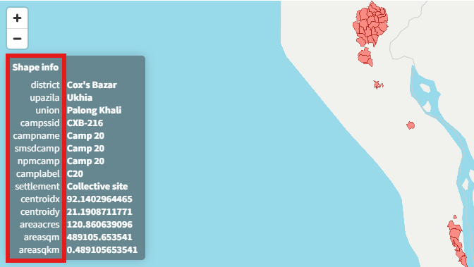

This information can be entered in the Metadata Editor as follows:

| Information from HDX      | Corresponding element in the metadata template                              | 
| ------------------------- | ----------------------------------------------------------------------------| 
| Type of dataset           | Description / Metadata / `Hierarchy level`                                  |
| Metadata date             | Description / Metadata / `Metadata date`                                    |
| Metadata language         | Description / Metadata / `Language`                                         |
| Metadata contact          | Description / Metadata / `Metadata contact`                                 |
| Metadata standard name    | Description / Metadata / `Metadata standard name`                           |
| Dataset website           | Description / Metadata / `Dataset URI`                                      |
| Metadata update           | Description / Metadata / `Metadata maintenance and update frequency`        |
| Title                     | Description / Identification / Dataset identification / `Title`                           |
| Source                    | Description / Identification / Dataset identification / Responsible party / `Org. name`   |
| Time period of the dataset| Description / Identification / Dataset identification / `Date` (creation and lastUpdate)  | 
| Modified                  | Description / Identification / Dataset identification / `Date` (released)                 |
| Description               | Description / Identification / Dataset identification / `Abstract`                        |
| Topics                    | Description / Identification / Dataset identification / `Topics`                          |
| Keywords                  | Description / Identification / Dataset identification / `Keywords`                        |
| Dataset language          | Description / Identification / Dataset identification / `Language`                        |
| Presentation form         | Description / Identification / Dataset identification / `Presentation form`               |
| Status                    | Description / Identification / Purpose, credit and status / `Status`                      |
| Bounding box              | Description / Identification / Extent (g,t,v) / `Geographic element` / `Bounding box`     |
| Spatial represent. type   | Description / Identification / Spatial representation and resolution / `Spatial represent. type`|
| Expected update frequency | Description / Identification / Frequency of update / `Resource maintenance`                |
| License                   | Description / Identification / Legal constraints / `Use constraints`                       | 
| Methodology               | Description / Data quality / Data quality / `Lineage statement` (scope = Dataset)          | 

After entering all available information, click on `SAVE`. Click on *Preview* in the navigation tree to view all information you have entered so far.

## Step 3: Add external resources

You can now finalize the documentation of the dataset by documenting and attaching *external resources*. External resources include all materials (files or links) you want to make accessible to users when you publish the dataset in a catalog. In this example, we will only add one resource: a link to the HDX website. 

To create an external resource, select *External resources* in the navigation tree and then click on `Create resource`. Most elements available to describe an external resource are optional, but at a minimum, you should enter the `Resource type` ("Web Site" in this case), the `Title` *(HDX Data Platform)*, and the URL in the section *Resource attachment*. *(https://data.humdata.org/dataset/outline-of-camps-sites-of-rohingya-refugees-in-cox-s-bazar-bangladesh)*. Then click `SAVE`. You will now have the external resource listed.

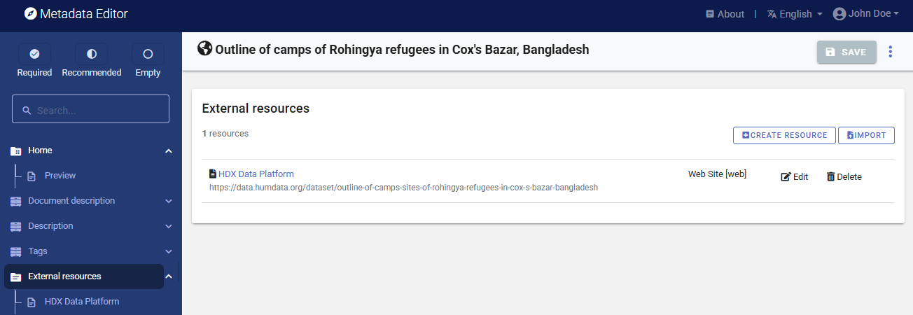

With this, you have completed the documentation of the dataset (note that in practice, you would generate more detailed metadata than what we did in this example). The *My Projects* page will show this new entry. You may at any time go back to it to edit or complete the metadata.

## Step 4: Export and publish metadata

In the *Project* page, a menu of options is available to you.

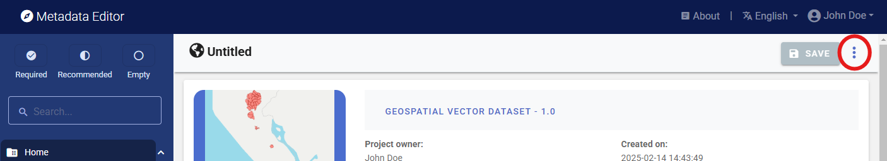

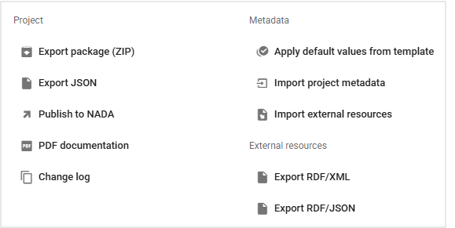

- ***Export package (ZIP)***

  This option will allow you to generate a ZIP file containing all metadata and resources related to the project. This package can be shared with others, who can import it in their own Metadata Editor.

- ***Export JSON***

  Export metadata to JSON will generate a JSON file containing the metadata. The option is provided to include all elements or only the non-private ones. The JSON file will look like this:
  
  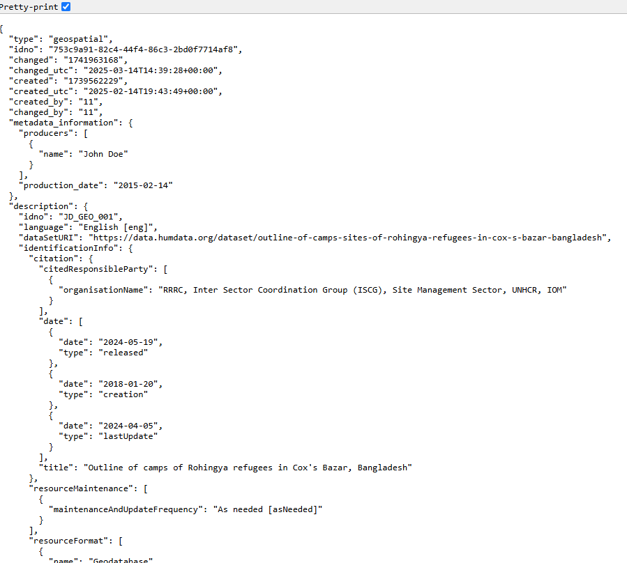

- ***Export RDF/XML*** and ***Export RDF/XML***

  These options allow you to export the metadata related to external resources in JSON or XML format.

- ***PDF documentation***

  A PDF version of the metadata can be automatically created. Select PDF documentation then click on `GENERATE PDF`. When the PDF is generated, click on `DOWNLOAD PDF`. You will obtain a bookmarked PDF file with all entered metadata.

  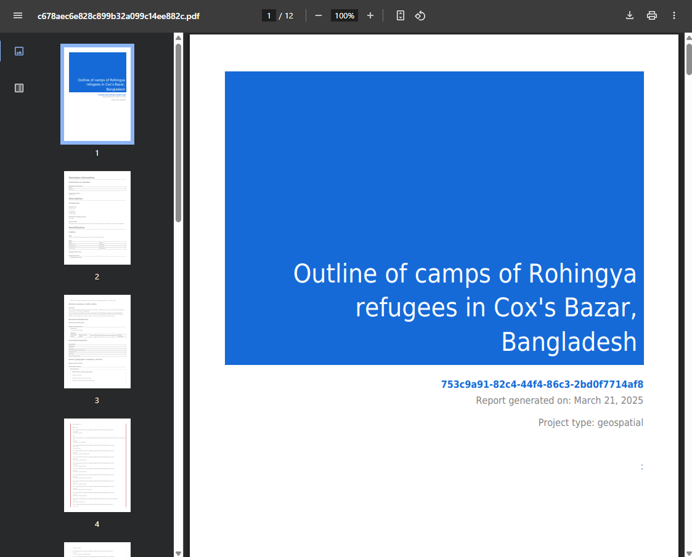

- ***Publish to NADA***

  If you have a NADA catalog and the credentials to publish content in it, you can also `Publish to NADA`. Select a configured NADA catalog, select the options as shown in the screenshot below, and click `PUBLISH`.

  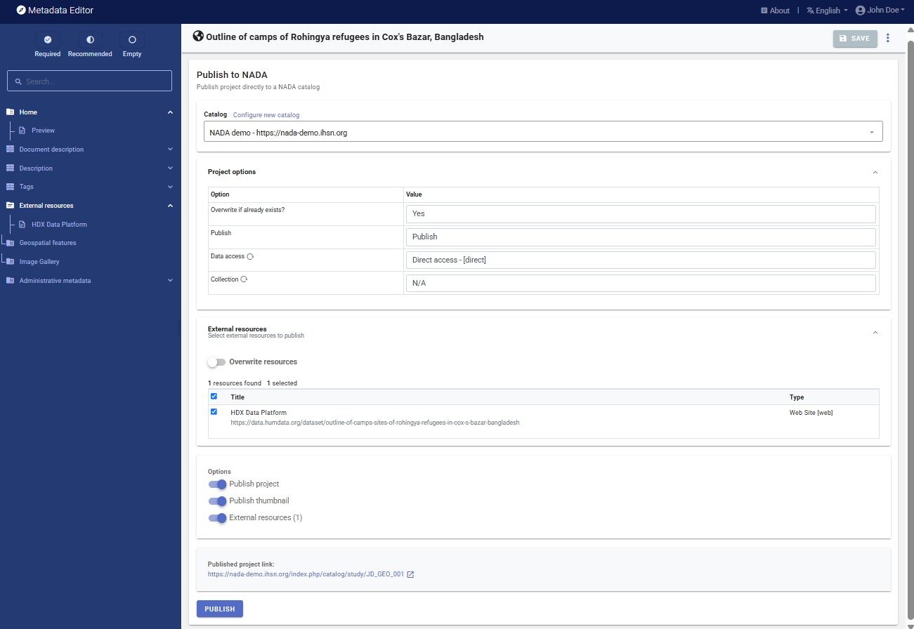

  The dataset will now be listed and made discoverable in the NADA catalog. 

  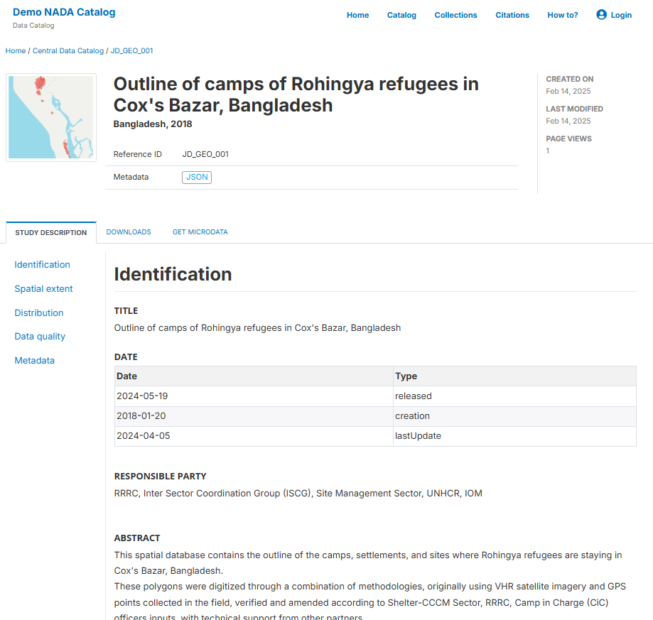

