# Quick Start: Image

In this example, we will document an image extracted from the World Bank photo collection in Flickr (https://www.flickr.com/photos/worldbank/14131666634/in/album-72157626025379650). This image shows a tomato stand in a market near Ramallah’s main mosque. We assume that you want to publish the image in a data catalog, with a link to the World Bank's photo album.

The only file you need to reproduce this Quick-Start example is the image file *.../image/wb_photo_food_market.jpg* (feel free to use another image of your choice).

> This Quick Start section does not include detailed guidance on documenting images. For comprehensive instructions, see the chapter **Documenting Data – Images**.

## Step 1: Create a new project and add a thumbnail

To begin, open the Metadata Editor in your web browser (the URL is determined by where you installed the application), and log in with your username and password. The My projects page will be displayed, showing all projects you have previously created and those that have been shared with you by other data curators, if any. If you are using the application for the first time and no project has been shared with you, the project list will be empty. 

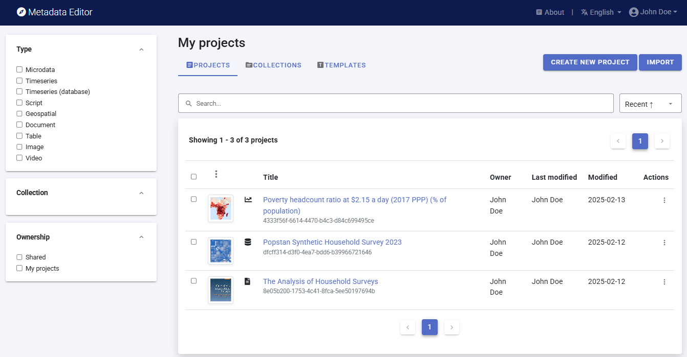

Click on `CREATE NEW PROJECT` and select *Image* when prompted to indicate the type of resource you will be documenting.

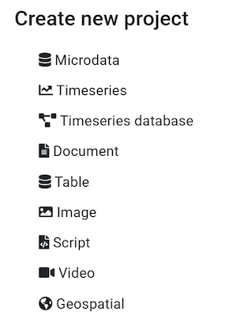
  
A new project page will open in a new tab.

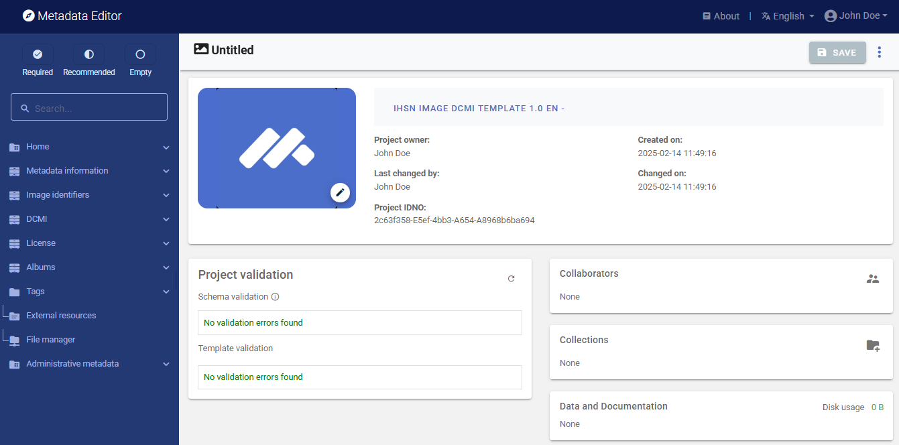

We will use the image itself as a thumbnail. Providing a thumbnail is not required, but recommended. The thumbnail will be displayed in the Metadata Editor project list, and in the NADA catalog if the metadata is published in NADA. Click on the `edit` icon in the screenshot image, and select the image file when prompted. 

The Metadata Editor offers two options to document images, corresponding to two different metadata standards: the Dublin Core (DCMI), or the IPTC. The decision to use one or the other option is made by selecting a DCMI-based or IPTC-based template. An image should not be documented using both options. In this Quick-start example, we will use the default DCMI metadata template, so there is no need to switch template (if the template shown in the *Template selection* frame is not the DCMI template, click on the template name and select a DCMI template from the list). 

## Step 2: Enter metadata

In the navigation tree, select *Metadata information / Information on metadata* to enter information on who documented the image and when. All information in this section is optional. Enter your name (as `Metadata producer`) and the `date` of the day in ISO format YYYY-MM-DD. This is the date when the metadata, not the image, was produced. Then click on `SAVE`.

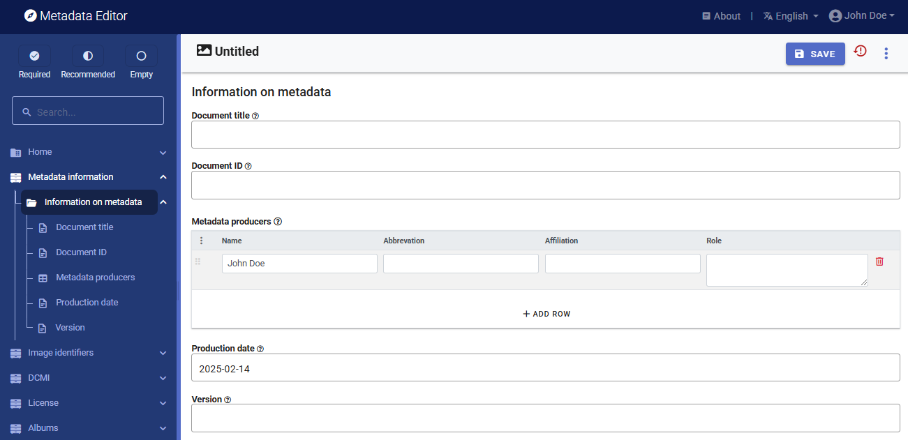

You can now start entering the metadata related to the image itself. In the navigation tree, first select *Image identifiers* and enter the required `Primary ID` (if you want to publish the image in a NADA catalog, make sure that the identifier is not used by another user or for another project). Also enter the (optional) `Other identifiers` for the image. In this example, we have one other identiofier, the one provided in the World Bank Flickr album: *Hoel_121012_DSC_3684*.  

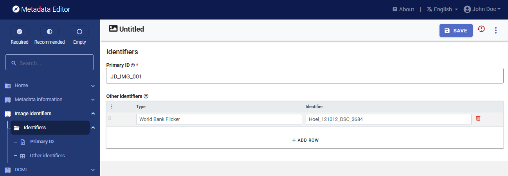

Then proceed with the other sections in the navigation tree and fill out the following metadata elements using the following information provided in the World Bank Flickr album:
- ***Title:*** Market near Ramallah’s main mosque
- ***ID:*** Hoel_121012_DSC_3684
- ***Description:*** Tomato stand in market near Ramallah’s main mosque
- ***Photographer:*** Arne Hoel / World Bank
- ***Taken on:*** October 12, 2012 (2012-10-12 in ISO format)
- ***Tags:*** Middle East; Private Sector Development; West Bank & Gaza; market; Food; Tomato
- ***Resource type:*** Digital photo
- ***Format:*** JPG
- ***License:*** CC BY-NC-ND 2.0 (URL: https://creativecommons.org/licenses/by-nc-nd/2.0/)

This information can be entered in the Metadata Editor as follows:

| From World Bank           | In the metadata template                               | 
| ------------------------- | -------------------------------------------------------| 
| Resource type             | DCMI / Image description / `Resource type `            |
| Taken on                  | DCMI / Image description / `Date`                      |
| Title                     | DCMI / Image description / `Title`                     | 
| Description               | DCMI / Image description / `Caption`                   |
| Format                    | DCMI / Image description / `Format`                    |
| Tags                      | DCMI / Image description / `Keywords` (keyword)        |
| (derived from title)      | DCMI / `Country`                                       |
| Photographer (name)       | DCMI / Authors and rights / `Creator`                  | 
| Photographer (affiliation)| DCMI / Authors and rights / `Publisher`                | 
| License                   | License / `License` (name and URL)                     | 

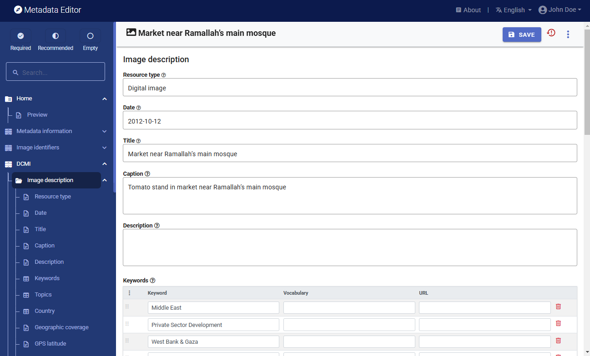

## Step 3: Add external resources

Once you have entered the descriptive metadata, you can finalize the documentation of the image by documenting and attaching *external resources*. External resources include all materials you want to make accessible to users when you publish the image in a catalog. In this example, we will only add one external resource: the link to the Flickr album. 

To create external resources, click on *External resources* in the navigation tree and then click on `Create resource`. Select the resource type ("Web Site" in this case), give it a short title *(World Bank Flickr Album)*, and enter the URL *(https://www.flickr.com/photos/worldbank/14131666634/in/album-72157626025379650)*. Then click `SAVE`. You will now have two external resources listed.

Note: instead of providing a link to the Flickr album, you could have uploaded the image (in its highest available resolution) as an external resource of type *Photo / image*, and uploaded it on the web server.

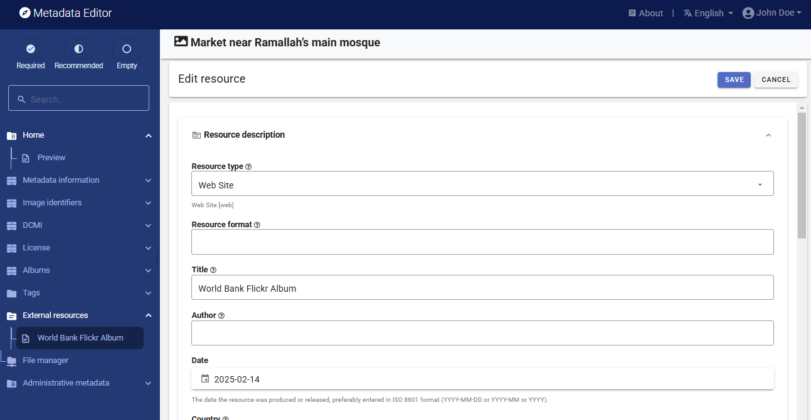

## Step 4: Export and publish metadata

In the project page, a menu of options will be available to you.

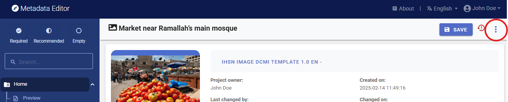

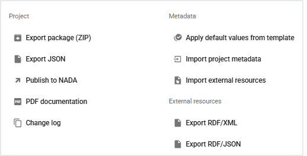

- ***Export package (ZIP)***

  This option allows you to generate a ZIP file containing all metadata and resources related to the project. This package can be shared with others, who can then import it in their own Metadata Editor.

- ***Export JSON***

  Export metadata to JSON will generate a JSON file containing the metadata. The option is provided to include all elements or only the non-private ones. The JSON file will look like this: 

  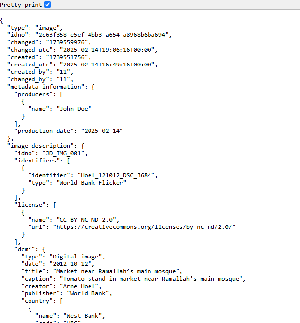

- ***Export RDF/XML*** and ***Export RDF/XML***

  These options allow you to export the metadata related to external resources in JSON or XML format.

- ***PDF documentation***

  A PDF version of the metadata can be automatically created. Select PDF documentation then click on `GENERATE PDF`. When the PDF is generated, click on `DOWNLOAD PDF`. You will obtain a bookmarked PDF file with all entered metadata. Note that such a PDF document is more relevant for data types other than images.

- ***Publish to NADA***

  If you have a NADA catalog and the credentials to publish content in it, you can also `Publish to NADA`. Select a configured NADA catalog, select the options as shown in the screenshot below, and click `PUBLISH`.

  

  The image will now be listed and made discoverable in the NADA catalog, with a link to the Flickr Album. 

  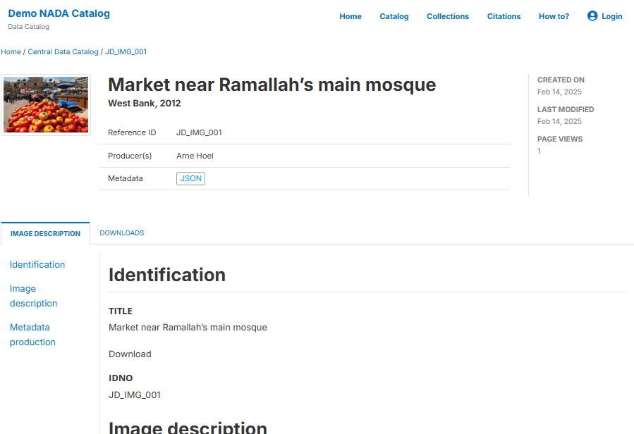

