# Quick Start: Indicator

In this example, we will document an indicator produced by the World Bank, and published in the Bank's Poverty and Inequality Platform (PIP) and World Development Indicators (WDI): the *Poverty headcount ratio at $2.15 a day (2017 PPP) (% of population)*. The objective here is to document the indicator for cataloguing, not to publish the data.

The metadata we will enter in the Metadata Editor is the metadata published by the World Bank at https://data.worldbank.org/indicator/SI.POV.DDAY?locations=US (downloaded on 12 February 2025). We will complement this metadata with information extracted from the data itself, e.g., to obtain the geographic and time coverage. Last, we will document the fact that this indicator is one of the Sustainable Development Goals monitoring indicators.

The only files you need to reproduce this Quick-start example are the image file that will be used as thumbnail (*.../quick_start_files/indicator/poverty_thumbnail.jpg*) and the CSV file (*quick_start_files/indicator/SI.POV.DDAY_countries_data*) that contains the list of countries and years for which the data are available in the WDI database (CSV file extracted from an Excel file downloaded on 13 February 2025 from the World Bank website at https://api.worldbank.org/v2/en/indicator/SI.POV.DDAY?downloadformat=excel).

> This Quick Start section does not include detailed guidance on documenting indicators and time series. For comprehensive instructions, see the chapter **Documenting indicators and databases**. 

## Step 1: Create a new project 

To begin, open the Metadata Editor in your web browser (the URL is determined by where you installed the application), and log in with your username and password. The *My projects* page will be displayed, showing all projects you have previously created and those that have been shared with you by other users of the Metadata Editor, if any. If you are using the application for the first time and no project has been shared with you by other users of the Metadata Editor, the project list will be empty. 

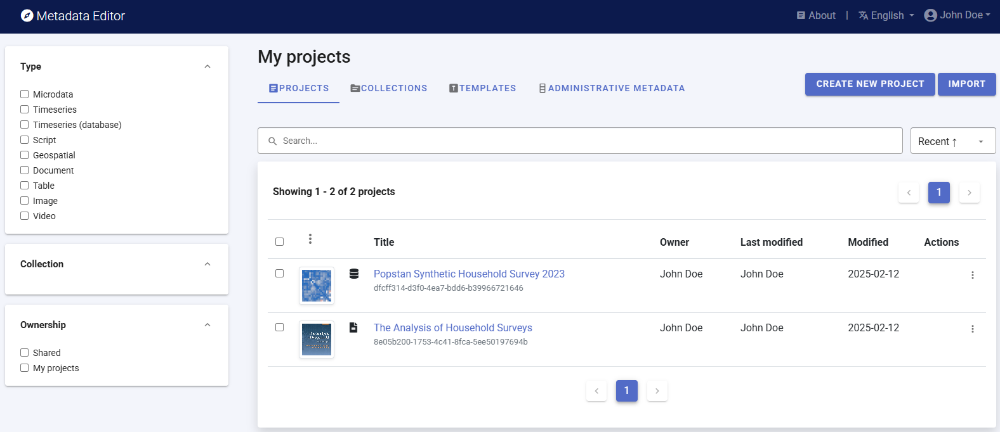

Click on `CREATE NEW PROJECT` and select *Indicator* when prompted to indicate the type of resource you will be documenting.

  
A new *Project* page will open in a new tab.

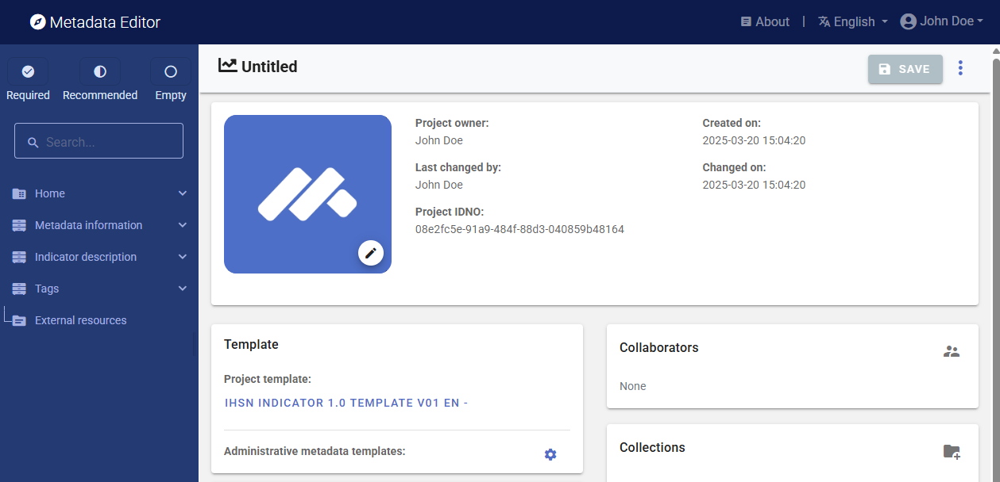

You can use the image *poverty_thumbnail.jpg* as a thumbnail, or your own JPG or PNG file. The thumbnail will be displayed in the Metadata Editor *My projects* list, and in the NADA catalog if the project is published in NADA. Click on the `edit` icon in the screenshot image, and select the image file when prompted. 

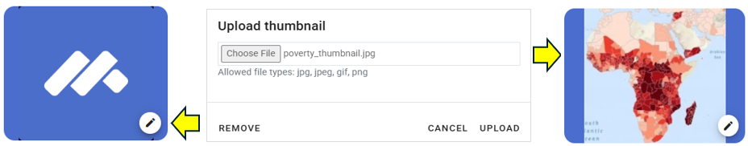

Documenting an indicator consists of entering information (metadata) about the indicator in metadata entry forms defined by a *metadata template*. When you create a new project, a default template is automatically selected. We will use the template named *IHSN DDI 2.5 Template v01 EN*. If this is the template that shows in your screen, no action is needed. Otherwise, click on the template name, and select the template *IHSN DDI 2.5 Template v01 EN* in the list that will appear, then click `APPLY`. 

## Step 2: Enter metadata

In the navigation tree, select *Metadata information / Information on metadata* to enter optional elements used to capture information on who documented the indicator and when. Enter your name (as `Metadata producer`) and the `date` of the day in ISO format YYYY-MM-DD. This is the date when the metadata, not the indicator, was produced. Then click on `SAVE`.

You can now start entering the metadata related to the indicator itself in the "Indicator description" section. In the navigation tree, first select `Title statement` and enter the required `Primary ID`, a unique identifier of your choice, e.g., JD_IND_001 (if you want to publish the indicator in a NADA catalog, make sure that the identifier is not used by another user or for another project). Also enter the (optional) `Other identifiers` for the indicator (enter the WDI indicator identifier: SI.POV.DDAY), and the indicator `title`, which is a required element. Then click `SAVE`.

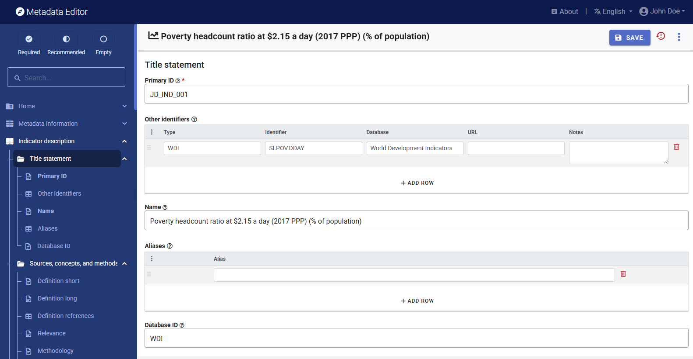

You can now proceed with the other sections in the navigation tree and fill out the relevant metadata elements using the following information extracted from the World Bank website:
- ***Name***: Poverty headcount ratio at $2.15 a day (2017 PPP) (% of population)
- ***Source***: World Bank, Poverty and Inequality Platform. Data are based on primary household survey data obtained from government statistical agencies and World Bank country departments. Data for high-income economies are mostly from the Luxembourg Income Study database. For more information and methodology, please see pip.worldbank.org.
- ***License***:  CC BY-4.0 
- ***Development Relevance***: The World Bank Group is committed to reducing extreme poverty to 3 percent or less, globally, by 2030. Monitoring poverty is important on the global development agenda as well as on the national development agenda of many countries. The World Bank produced its first global poverty estimates for developing countries for World Development Report 1990: Poverty (World Bank 1990) using household survey data for 22 countries (Ravallion, Datt, and van de Walle 1991). Since then there has been considerable expansion in the number of countries that field household income and expenditure surveys.
- ***General Comments***: The World Bank’s internationally comparable poverty monitoring database now draws on income or detailed consumption data from more than 2000 household surveys across 169 countries. See the Poverty and Inequality Platform (PIP) for details (pip.worldbank.org).
- ***Limitations and Exceptions***: Despite progress in the last decade, the challenges of measuring poverty remain. The timeliness, frequency, quality, and comparability of household surveys need to increase substantially, particularly in the poorest countries. The availability and quality of poverty monitoring data remains low in small states, countries with fragile situations, and low-income countries and even some middle-income countries. The low frequency and lack of comparability of the data available in some countries create uncertainty over the magnitude of poverty reduction. Besides the frequency and timeliness of survey data, other data quality issues arise in measuring household living standards. The surveys ask detailed questions on sources of income and how it was spent, which must be carefully recorded by trained personnel. Income is generally more difficult to measure accurately, and consumption comes closer to the notion of living standards. And income can vary over time even if living standards do not. But consumption data are not always available: the latest estimates reported here use consumption data for about two-thirds of countries. However, even similar surveys may not be strictly comparable because of differences in timing or in the quality and training of enumerators. Comparisons of countries at different levels of development also pose a potential problem because of differences in the relative importance of the consumption of nonmarket goods. The local market value of all consumption in kind (including own production, particularly important in underdeveloped rural economies) should be included in total consumption expenditure but may not be. Most survey data now include valuations for consumption or income from own production, but valuation methods vary.
- ***Long Definition***: Poverty headcount ratio at $2.15 a day is the percentage of the population living on less than $2.15 a day at 2017 purchasing power adjusted prices. As a result of revisions in PPP exchange rates, poverty rates for individual countries cannot be compared with poverty rates reported in earlier editions.
- ***Periodicity***: Annual
- ***Related Source Links***: World Bank, Poverty and Inequality Platform: pip.worldbank.org
- ***Short Definition***: Poverty headcount ratio at $2.15 a day is the percentage of the population living on less than $2.15 a day at 2017 international prices.
- ***Statistical Concept and Methodology***: International comparisons of poverty estimates entail both conceptual and practical problems. Countries have different definitions of poverty, and consistent comparisons across countries can be difficult. Local poverty lines tend to have higher purchasing power in rich countries, where more generous standards are used, than in poor countries. Since World Development Report 1990, the World Bank has aimed to apply a common standard in measuring extreme poverty, anchored to what poverty means in the world's poorest countries. The welfare of people living in different countries can be measured on a common scale by adjusting for differences in the purchasing power of currencies. The commonly used $1 a day standard, measured in 1985 international prices and adjusted to local currency using purchasing power parities (PPPs), was chosen for World Development Report 1990 because it was typical of the poverty lines in low-income countries at the time. As differences in the cost of living across the world evolve, the international poverty line has to be periodically updated using new PPP price data to reflect these changes. The last change was in September 2022, when we adopted $2.15 as the international poverty line using the 2017 PPP. Poverty measures based on international poverty lines attempt to hold the real value of the poverty line constant across countries, as is done when making comparisons over time. The $3.65 poverty line is derived from typical national poverty lines in countries classified as Lower Middle Income. The $6.85 poverty line is derived from typical national poverty lines in countries classified as Upper Middle Income. Early editions of World Development Indicators used PPPs from the Penn World Tables to convert values in local currency to equivalent purchasing power measured in U.S dollars. Later editions used 1993, 2005, and 2017 consumption PPP estimates produced by the World Bank. The current extreme poverty line is set at $2.15 a day in 2017 PPP terms, which represents the mean of the poverty lines found in 15 of the poorest countries ranked by per capita consumption. The new poverty line maintains the same standard for extreme poverty - the poverty line typical of the poorest countries in the world - but updates it using the latest information on the cost of living in developing countries. As a result of revisions in PPP exchange rates, poverty rates for individual countries cannot be compared with poverty rates reported in earlier editions. The statistics reported here are based on consumption data or, when unavailable, on income surveys.
- ***Topic***: Poverty; Poverty rates
- ***Unit of Measure***: %

**Additional useful information**
- ***Database ID***: WDI
- ***URL of CC BY-4.0 license***: https://creativecommons.org/licenses/by/4.0/
- ***SDG Goal, Target Corresponding to the Indicator***:
   - *Framework*: Sustainable Development Goals (SDG)
   - *Custodian*: United Nations
   - *Goal 1*: No poverty (End poverty in all forms by 2030) 
   - *Target 1.1*: By 2030, eradicate extreme poverty for all people everywhere, currently measured as people living on less than $1.25 a day
   - *Indicator 1.1.1*: Proportion of the population living below the international poverty line by sex, age, employment status and geographical location (urban/rural)    
- ***Time Coverage***: 1963 to 2023 (as of February 2025)
- ***Geographic Coverage***: 266 countries and regions; the list (names and codes) will be copy/pasted from the CSV file provided.
  
With this information in hand, you can now start documenting the indicator. The content of the WDI metadata and the additional elements can be entered in the Metadata Editor template in the following elements: 

| From World Bank           | In the metadata template (Indicator description)                            | 
| ------------------------- | --------------------------------------------------------------------------- | 
| ID                        | Title statement / `Primary ID`                                              |
| WDI indicator ID          | Title statement / `Other identifiers`                                       |
| Name                      | Title statement / `Name`                                                    |
| Source                    | Sources, concepts and methods / `Notes on data source`                      | 
| License                   | Access and use / `License`                                                  |
| Development Relevance     | Sources, concepts and methods / `Relevance`                                 | 
| General comments          | Sources, concepts and methods / `Notes on data source`                      |
| Limitations and Exceptions| Quality / `Limitations`                                                     | 
| Long Definition           | Sources, concepts and methods / `Definition long`                           |
| Periodicity               | Description / `Methodology`                                                 | 
| Related source links      | Sources, concepts and methods / `Data source`                               |
| Short definition          | Sources, concepts and methods / `Definition short`                          | 
| Stat, Concept and Method. | Sources, concepts and methods / `Methodology`                               |
| Topic                     | Description / `Topics`                                                      | 
| Unit of measure           | Description / `Measurement unit`                                            |
| Database ID               | Indicator description / Title statement /  `Database ID`                    | 
| URL of CC BY-4.0 license  | Access and use / `License (URL)`                                            |
| SDG framework             | Standards and frameworks / Frameworks / `Name + Abbreviation`               |
| SDG custodian             | Standards and frameworks / Frameworks / `Custodian`                         |
| SDG goal                  | Standards and frameworks / Frameworks / `Goal ID + Name + Description`      |
| SDG target                | Standards and frameworks / Frameworks / `Target ID + Name + Description`    |
| SDG indicator             | Standards and frameworks / Frameworks / `Indicator ID + Name + Description` |
| Time coverage             | Geographic and time coverage / `Time coverage`                              |
| Geographic coverage       | Geographic and time coverage / `Countries`                                  |

Note: The geographic coverage for the indicator consists of a large number of countries (266 countries and economies), which must be itemized in the metadata. Entering the country names and codes manually would be tedious. Instead, you may use the copy/paste functionality of the Metadata Editor. The list of countries and country codes is available in the CSV file *SI.POV.DDAY_countries_data.csv*. Copy this list (only including the country names and codes). Select the `Geographic and time coverage / Countries' element in the navigation tree, then click on the copy/paste icon (tripple dots). Select `Paste (Replace)` of `Paste (Append`). The 266 countries and economies will now be in the metadata.   

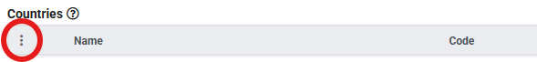

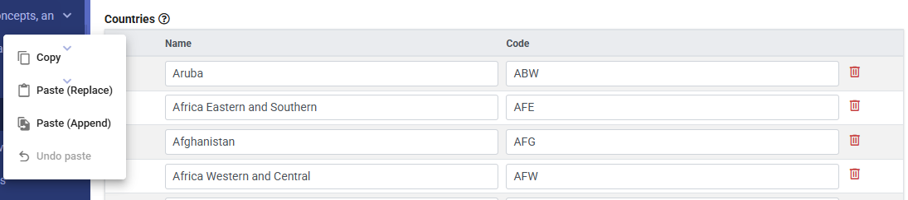

## Step 3: Add information on related resources

Once you have entered the metadata, you can finalize the documentation of the indicator by documenting and attaching external resources. External resources include all materials you want to make accessible to users when you publish the indicator in a catalog. In this example, we will add one external resource: a link to the World Bank Poverty and Inequality Platform website. 

To create an external resource, click on "External resources" in the navigation tree and then click on `Create resource`. Select the resource type from the drop down (in this case, *Web Site*), give it a short title *(Poverty and Inequality Platform (PIP))*, and enter the URL *(https://pip.worldbank.org/home)*. Then click `SAVE`. You will now have an external resources listed.

## Step 4: Export and publish metadata

In the *Project* page, a menu of options is available to you.

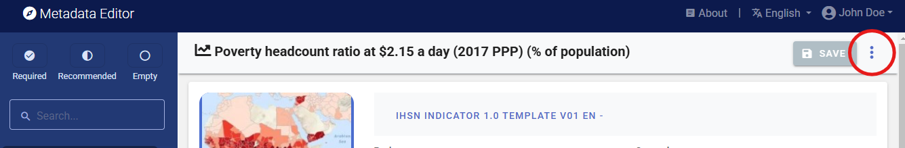

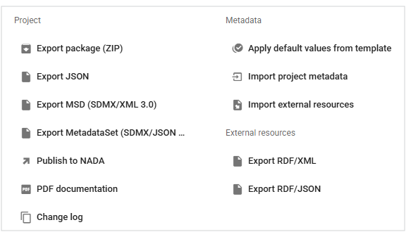

- ***Export package (ZIP)***

  This option will allow you to generate a ZIP file containing all metadata and resources related to the project. This package can be shared with others, who can import it in their own Metadata Editor.

- ***Export JSON***

  Export metadata to JSON will generate a JSON file containing the metadata. The option is provided to include all elements or only the non-private ones. The JSON file will look like this:

  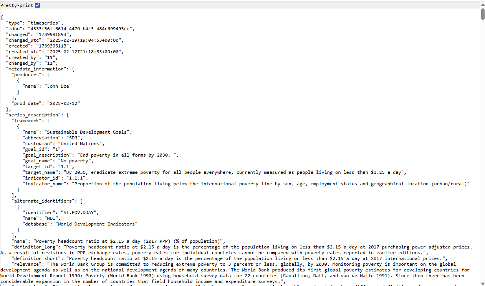

- ***Export MSD (SDMX/XML 3.0)***

  Export a metadata structure definition compliant with the SDMX 3.0 standard.   

- ***Export MetadataSet (SDMX/JSON)***

  Export a metadataset compliant with the SDMX 3.0 standard.  

- ***Export RDF/XML** and **Export RDF/XML***

  These options allow you to export the metadata related to external resources in JSON or XML format.

- ***PDF documentation***

  A PDF version of the metadata can be automatically created. Select PDF documentation then click on `GENERATE PDF`. When the PDF is generated, click on `DOWNLOAD PDF`. You will obtain a bookmarked PDF file with all entered metadata.

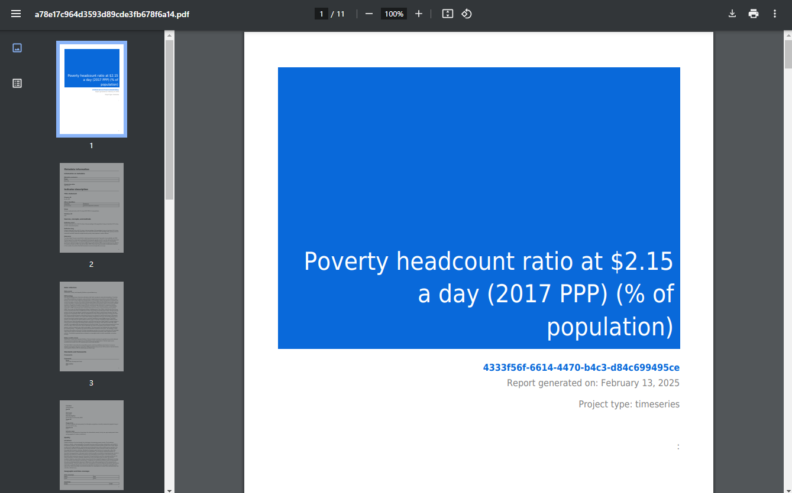

- ***Publish to NADA***

  If you have a NADA catalog and the credentials to publish content in it, you can also `Publish to NADA`. Select a configured NADA catalog, select the options as shown in the screenshot below, and click `PUBLISH`.

  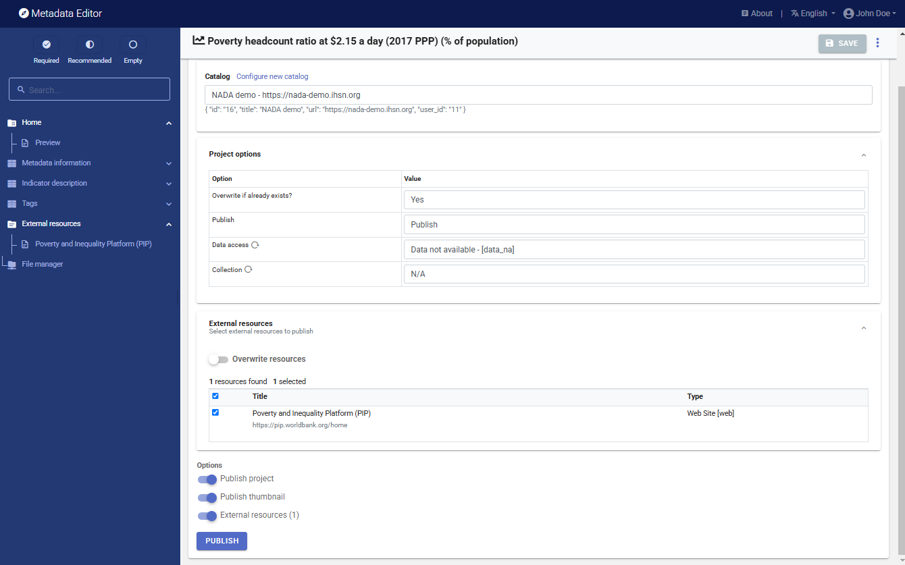

  The indicator will now be listed and made discoverable in the NADA catalog, with a link to the World Bank PIP platform. 

  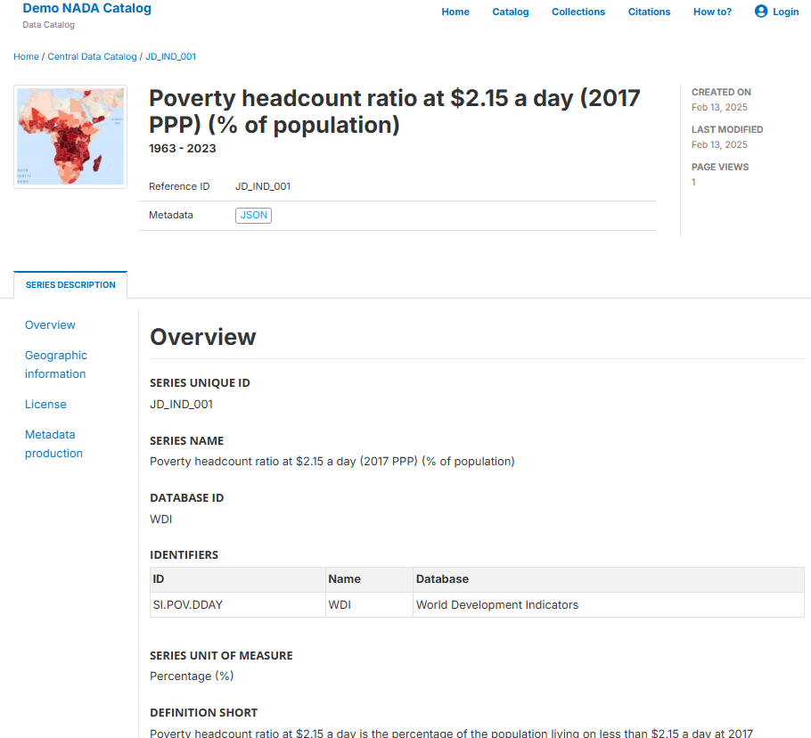

