# Quick start: Microdata

In this example, we will document a survey dataset (microdata) using the DDI Codebook metadata standard. 

> This Quick Start section does not include detailed guidance on documenting microdata. For comprehensive instructions, see the chapter **Documenting Data – Microdata**. 

The dataset we will document is a synthetic household survey dataset created for a fictional country. The files needed to reproduce the example are provided in folder *.../quick_start_files/microdata*. Download and save the content of this folder in a local folder of your choice. The materials provided include:

- Two data files in Stata 17 format. All variables and values have been labeled in the Stata files. The two data files are related. Variable *hid* (an identifier unique to each household) provides a key that allows merging the data files.
   - *WLD_2023_SYNTH-SVY-HLD-EN_v01_M.dta* : a household-level data file containing 49 variables and 8,000 observations. 
   - *WLD_2023_SYNTH-SVY-IND-EN_v01_M.dta* : an individual-level data file containing 27 variables and 32,396 observations. 
- Survey questionnaire and survey documentation, in MS-Excel format.
   - A simplified survey questionnaire (file *synthetic_survey_questionnaire.xlsx*, with sheets *Household form EN* for variables collected at the household level, and *Individual form EN* for variables collected at the individual level.)
   - A simplified technical report, with information on the sampling design (file *synthetic_survey_info.xlsx*, sheet *Survey info*)
- Other: *synthetic_data_logo.jpg* (a logo for the survey, in JPG format)

## Step 1: Create a new project 

To begin, open the Metadata Editor in your web browser (the URL is determined by where you installed the application), and log in with your username and password. The My projects page will be displayed, showing all projects you have previously created and those that have been shared with you by other data curators, if any. If you are using the application for the first time and no project has been shared with you, the project list will be empty. In the example below, we see that one project was previously created.

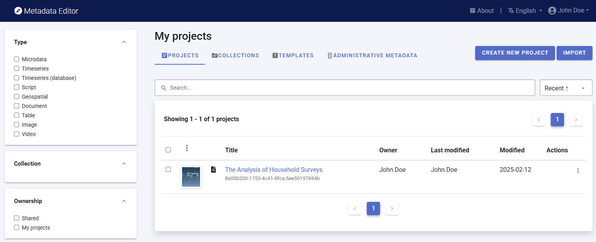

Click on `CREATE NEW PROJECT` and select *Microdata* when prompted to indicate the type of resource you will be documenting (a survey dataset).

  
A new project page will open in a new tab.

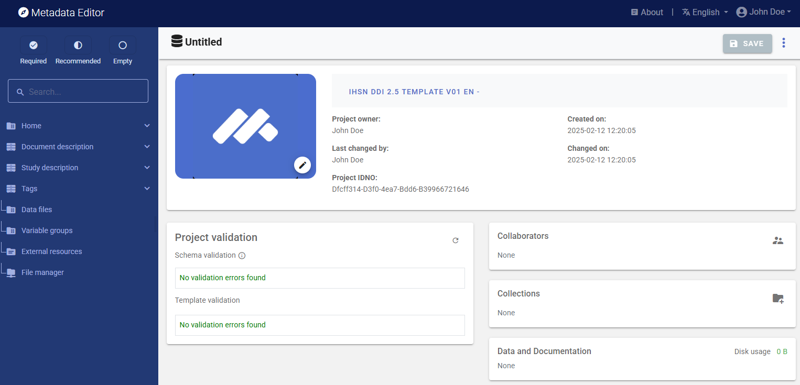

We will use an image as thumbnail for the project. The thumbnail is optional; it will be displayed in the Metadata Editor project list, and in the NADA catalog if the metadata is published in NADA. For a survey or census dataset, you will typically use the logo of the survey or census as thumbnail. You can change the image that will be used as a thumbnail for the project (optional). You may use the provided image (*synthetic_data_logo.jpg*) or another jpg or png file of your choice. Click on the `edit` icon and select the image file when prompted.

Documenting a dataset (or a document in this case) consists of entering metadata in metadata entry forms defined by a *metadata template*. When you create a new project, a default template is automatically selected. We will use this template, so there is no need to switch template.

##Step 2: Add descriptive metadata

In the section *Document description / Metadata preparation*, enter the (optional) information on the metadata. Enter your name (as `Metadata producer`) and the `date` of the day in ISO format YYYY-MM-DD. This is the date when the metadata, not the dataset, was produced. Then click on `SAVE`.

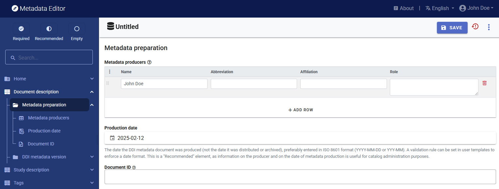

You can now start entering the descriptive metadata related to the survey itself in the *Study Description* section. You will find the relevant information in the Excel file *synthetic_survey_info.xlsx*. This information is also provided below:

- ***Title***:	Popstan Synthetic Household Survey 2023
- ***Acronym***:	PSHS 2023
- ***Country / code***:	Popstan / POP
- ***Producer***:	National Statistics Office (NSO)
- ***Funding***:	The Foundation for Synthetic Data
- ***Dates of data collection***:	4 July 2023 to 27 December 2023
- ***Abstract***:	The 2023 Popstan Synthetic Household Survey is a periodic national welfare monitoring survey conducted by the Popstan National Statistics Office. It is used to update the national poverty profile, based on the (indexed) national poverty line calculated in 2017. 
- ***Series***:	The 2023 survey is the 4th welfare monitoring survey conducted by the National Statistics Office. The survey is conducted every two years. Previous surveys were conducted in 2017, 2019, and 2021. 
- ***Universe***:	Resident population with exception of homeless, nomads, and residents in institutional households
- ***Geographic coverage***:	National (all 10 regions)
- ***Topics***:	Demographics; education; labor; assets ownership; household expenditure, housing, water and sanitation.
- ***Sampling***:	A sample of 8,000 households was selected. The response rate was 100%.
- ***Sample frame***:	Synthetic population census dataset (conducted in January 2023, with January 15 as census night)
- ***Sample design***:	A stratified sample was drawn. The urban/rural areas of each province (geo1) were used as strata. The sample of 8,000 households was selected proportional to the size of each geo1. In each stratum, we randomly enumeration areas (Eas), and in each EA we randomly selected 25 households (uniform sample). 
- ***Weighting***:	The sample weight was calculated for each household (variable hhweight). Considering the sample design and the response rate of 100%, no adjustment or calibration of the weights was required.
- ***Mode of data collection***	Multi-mode: CAPI (face-to-face, using tablets for data capture) and CATI (telephone interviews)
- ***Interviewer's training***:	Interviewers were trained by the staff of the National Statistics Office during a period of two weeks prior to the fieldwork. All interviewers were teachers. The training was provided at the provincial level, in the two national languages.
- ***Fieldwork organization***:	One interviewer was contracted per enumeration area. The interviewers conducted 4 visits to each household during the survey period. One controler was assigned to each team of 5 interviewers. One supervisor was assigned to each province. 
- ***Data processing***:	Data were captured during data collection (face-to-face or by phone) using tablets and the Survey Solutions software application. Validation (range and consistency checks) was implemented in real time by the application. At the completion of each one of the 4 phases of the survey, the data were processed for batch editing. ANalysis and tabulation was then made using R.
- ***Standard compliance***:	The questionnaire was designed in compliance with national classifications and using the survey question bank maintained by the National Statistics Office.
- ***Version of dataset***:	v01_2023_EN
- ***Citation requirement***:	Users of the dataset are requested to cite the data as follows: National Statistics Office (NSO) of Popstan. 2023. Microdata from the Synthetic Household Survey 2023 (version v01_2023_EN). Downloaded from NSO website on [date]

In the navigation tree, first select *Study description / Identification*, and enter the relevant information on the survey. First, enter the `title` of the dataset and the required `Primary ID`, a unique identifier of your choice, e.g., JD_MICRO_001 (if you want to publish the document in a NADA catalog, make sure that the identifier is not used by another user or for another project).  

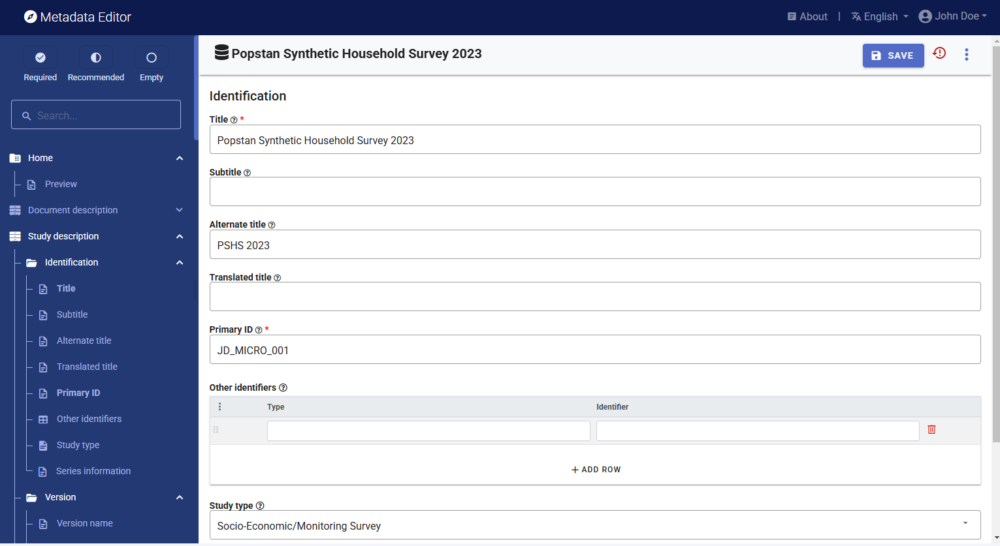

Then browse the navigation tree and find the most appropriate elements for each piece of information contained in the Excel file; populate other sub-sections of the *Study description* as relevant (see table below). Not all fields are expected to be filled, but all available information must be captured in the Metadata Editor. The (?) icon next to each element label will display a description of the element. Click `SAVE` periodically.

The metadata elements in the template correspond to the content of the Excel file *synthetic_survey_info.xlsx* as follows: 

| In synthetic_survey_info.xlsx | In the metadata template (Study description)      | 
| ----------------------------- | ------------------------------------------------- | 
| Title                         | Identification / `Title`                          | 
| Acronym                       | Identification / `Alternate title`                | 
| Country / code                | Universe and geographic coverage / `Country`      | 
| Producer                      | Producers and sponsors / `Primary producer`       | 
| Funding                       | Producers and sponsors / `Funding agencies`       | 
| Dates of data collection      | Data collection / `Dates of data collection`      | 
| Abstract                      | Overview / `Abstract`                             | 
| Series                        | Identification / `Series information`             | 
| Universe                      | Universe and geographic coverage / `Universe`     | 
| Geographic coverage           | Universe and geographic coverage / `Geo. coverage`| 
| Topics                        | Scope / `Topics` (itemize the list)               | 
| Sampling                      | Sampling / `Response rates`                       | 
| Sample frame                  | Sampling / `Sample frame / Name`                  | 
| Sample design                 | Sampling / `Sampling procedure`                   | 
| Weighting                     | Sampling / `Weighting`                            | 
| Mode of data collection       | Data collection / `Mode of data collection`       | 
| Interviewer's training        | Data collection / `Collector training`            | 
| Fieldwork organization        | Data collection / `Control operations`            | 
| Data processing               | Data processing / `Data processing`               | 
| Standard compliance           | Quality standards / `Standard compliance`         | 
| Version of dataset            | Version / `Version name`                          | 
| Citation requirement          | Data access / `Citation requirement`              | 

## Step 3: Import and document the data files (section Study Description)

When all available descriptive information is entered in  *Study description*, click on *Data files* in the navigation bar. On the *Data files* page, click `IMPORT FILES`, select the two Stata data files to be imported (*WLD_2023_SYNTH-SVY-HLD-EN_v01_M.dta* and *WLD_2023_SYNTH-SVY-IND-EN_v01_M.dta*), and click `IMPORT`.

The Editor will import the data files, and extract all available metadata from the files (variable list, names, variable labels, value labels). It will also generate summary statistics.

The *Data files* page will now display your two files, which are also listed in the navigation bar under *Data files*.

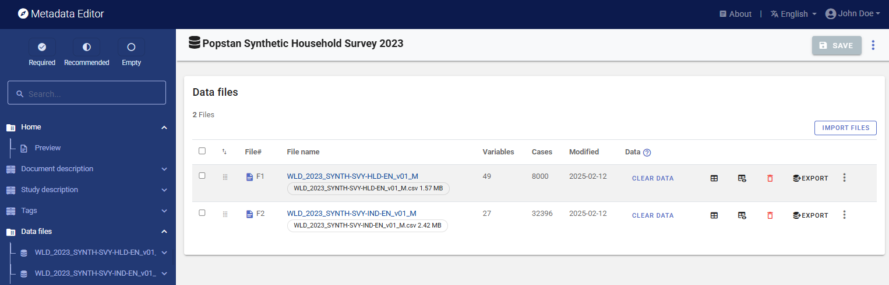

You can preview the data by clicking *Data*, but note that the data cannot be edited in the Metadata Editor.

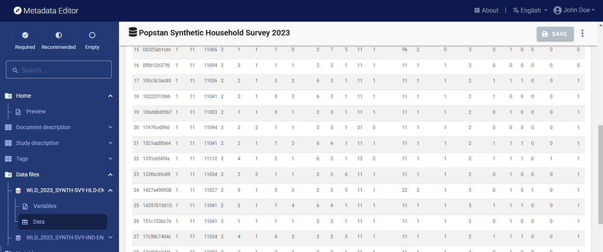

You can also view summary statistics for all variables by clicking on *Variables* for a selected file in the navigation tree, and selecting tab `STATISTICS`.

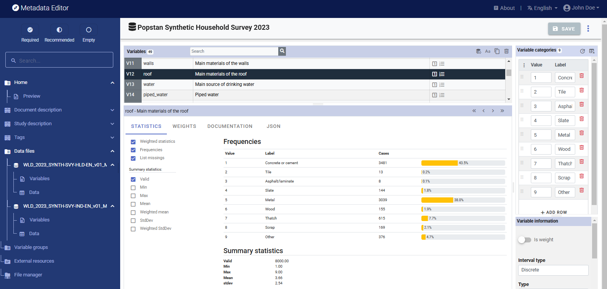

You will now document the data files they contain. First, click on the filename of a data file in the navigation tree, add a brief description of the file, and click `SAVE` (you must save before moving to another page). Do that for both data files. 

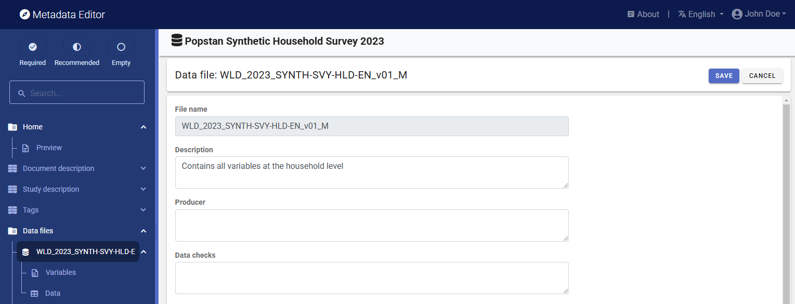

## Step 4: Document the variables

Next, we will add or edit the variable-level information. In the navigation bar, select *Variables* for one of the data files (you will do that for both data files). 

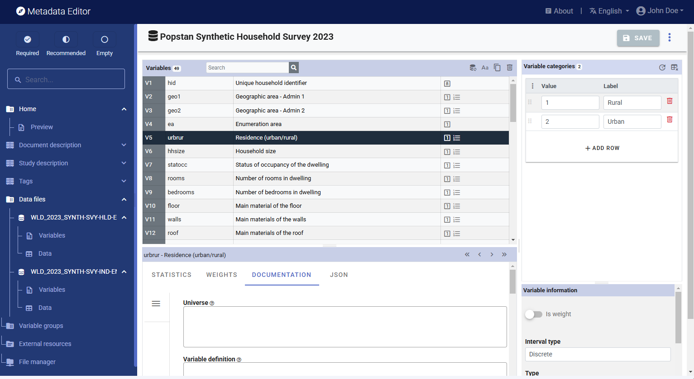

The page displays the list of variables in the selected file, along with multiple options to edit and complete the metadata related to each variable. On this page, you can:

- Edit the variables labels.
- Edit the value labels (for discrete/categorical variables only).
- If necessary, delete variables.
- Tag one or multiple variable(s) as being sample weight(s).
- Add metadata related to the variable (literal question, interviewer instructions, derivation and imputation, and more) in the `DOCUMENTATION` tab.
- Identify values to be treated as *missing value*. The system missing values in Stata or SPSS will be automatically identified as *missing*. However, in some cases, one (or multiple) values may be used to represent missing values (e.g., "99" may have been used as a code to represent missing or unknown for a variable such as age).
- Set the weighting coefficient (if relevant) to be applied to generate weighted summary statistics.
- Select the summary statistics to be included in the metadata (in tab `STATISTICS`).

Note that you cannot rename the variables in the Metadata Editor, as this is considered as a change of data. If you need to change your data (renaming variables, creating new ones, deleting observations, or editing the data themselves), you will have to do that outside the Metadata Editor and re-import the modified data files.  

Refer to the section on Microdata Documentation for a detailed description of all available options.

We will assume for this example that all variable and value labels as extracted from the data files do not need to be edited. You can browse the list of variables to check that their *type* has been properly detected when the data were imported. For instance, the variable *hhsize* (household size) in file *WLD_2023_SYNTH-SVY-HLD-EN_v01_M* has been imported as a discrete variable. This may be fine, but you may prefer to declare it as a continuous variable, which would allow you to generate weighted means in the Metadata Editor. To do this, change the *Interval type* from "Discrete" to "Continuous."  

You will now add metadata for each variable. Most of the relevant metadata at the variable level (other than the metadata extracted automatically from the imported data files) will typically be found in the survey questionnaire and in the interviewer manual. For derived variables, the relevant information may be  found in other technical documents. The `DOCUMENTATION` tab displays the metadata for the variable(s) selected in the list of variables. The following variable-level information will be added:

- `Universe` of the variable
- `Pre-question`, `Literal question`, and `Post-question` as formulated in the questionnaire (for collected variables, not for derived variables)
- `Derivation` or `Imputation` method (for derived variables)

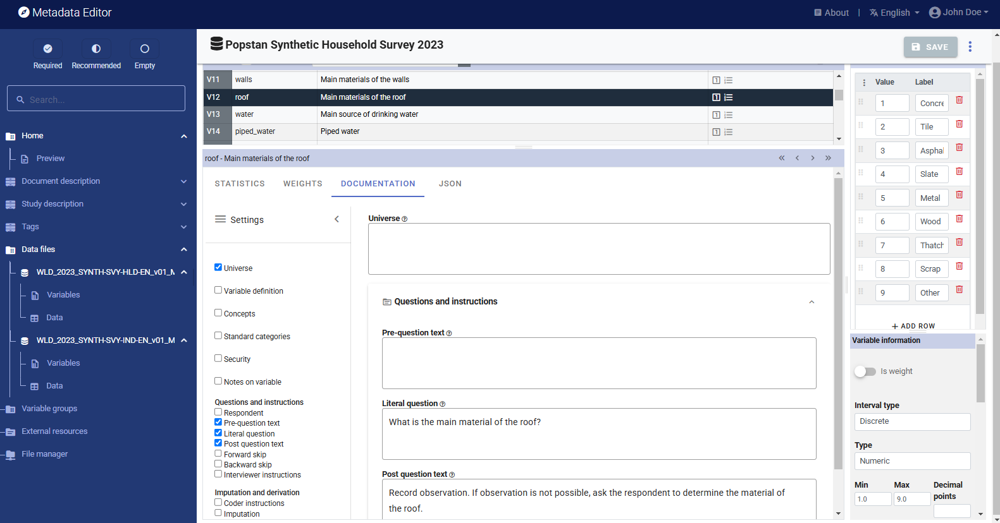

Useful tip: When the information to be entered in the Metadata Editor is the same for multiple variables, you can enter it for all relevant variables in a same file at once. To do that, select multiple variables (using the Shift or Ctrl key) and enter the information in the relevant element(s). For example, the three variables related to education in the *individual* dataset have the same universe ("Population aged 6 and above"). The three variables can be selected, and the information entered in *Universe* will then be automatically applied to the three variables.

After entering all available variable-level metadata, you may want to set and apply a sample weight to generate weighted summary statistics. In the dataset, two variables are used as weighting coefficients: *hhweight* (found in both data files) and *popweight* (found only in the household-level file). In both files, select the variables used as sample weights and click on `Is weight` in the *Variable information* frame. An icon 'w' will be added in the variable list to indicate this special status for the selected variables. 

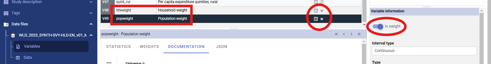

Once the weighting variables have been identified and set as weights, you may use them to generate weighted summary statistics. Proceed as follows:

- In the household-level file:
   - Select variables 2 to 44 (using the Shift key to select a block; do not select the variable *hid* as it would not make sense to generate weighted summary statistics for the unique household identifier). Then, in the `WEIGHTS` tab, select variable *hhweight* as weighting coefficient.
   - Select variables 45 to 47 (quintiles), and select *popweight* as weighting coefficient.
 
- In the individual-level file:
   - Select variables 3 to 26, and in tab `WEIGHTS` select *hhweight* as the weighting coefficient.

You will see that red icons have been added in the list of variables, indicating that the summary statistics for these variables need to be refreshed.

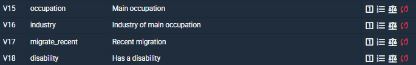

For each file, click on the `Refresh stats` button. The summary statistics will be recalculated to include weighted estimates.

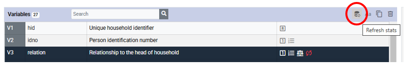

The summary statistics will now display both the unweighted and weighted values.

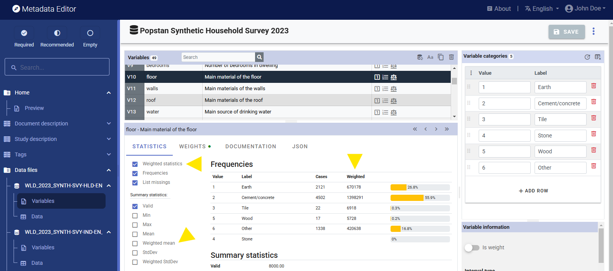

The summary statistics that are displayed in the Metadata Editor will be part of the saved metadata. As a last step in documenting variables, you should browse the variables to verify that the selected summary statistics for each variable are indeed meaningful. Statistics like *mean* or *standard deviation* should not be included for categorical variables.

## Step 5: Add information on related resources

Once you have entered the variable-level metadata for both files, you can finalize the documentation of the dataset by documenting and attaching *external resources* to the survey metadata. External resources include all materials that you want to make accessible to users when you publish the dataset in a catalog. This may include the microdata files if you want to disseminate them (openly or under restrictions). In this example, we will load the dataset and the two Excel files that contain respectively the questionnaire and the information on the survey. The two Stata files can be uploaded as one single ZIP file. Note that you could provide the data in more than one format, for example, you could export them to CSV and SPSS formats and include data files in these formats as external resources, for user convenience.

To create external resources, click on *External resources* in the navigation tree and then click on `Create resource`. For each resource, select the file type ("Document, Questionnaire" for the questionnaire, "Document, Technical" for the survey info, and "Microdata" for the data files), give each resource a short title (e.g., "Dataset in Stata 12 format" for the zipped data file), and upload the corresponding file in the *Resource attachment* part of the metadata entry page. Then click `SAVE`. You will now have three external resources listed.

## Step 6: Export and publish metadata

In the *Project* page, a menu of options will be available to you.

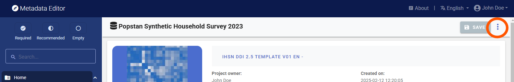

- ***Export package (ZIP)***

  This option will allow you to generate a ZIP file containing all metadata and resources related to the project, including the data files if you have not removed them. This package can be shared with others, who can import it in their own Metadata Editor.

- ***Export DDI Codebook***

  Export metadata compliant with the DDI Codebook as an XML file. 

- ***Export RDF/XML*** and ***Export RDF/XML***

  These options allow you to export the metadata related to external resources in JSON or XML format.

- ***PDF documentation***

  A PDF version of the metadata can be automatically created. Select PDF documentation then click on `GENERATE PDF`. When the PDF is generated, click on `DOWNLOAD PDF`. You will obtain a bookmarked PDF file with all entered metadata.

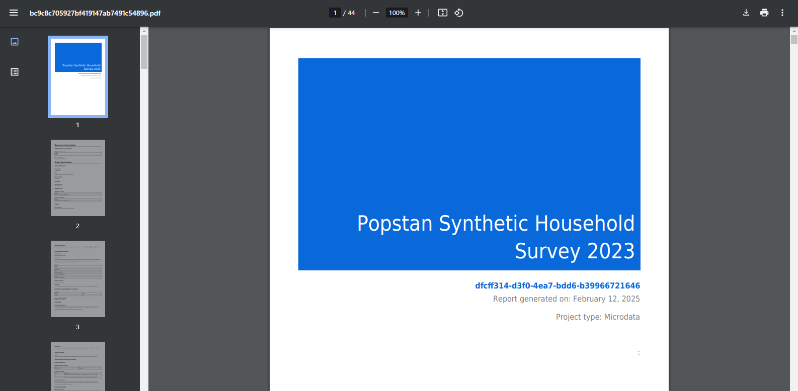

- ***Publish to NADA***

  If you have a NADA catalog and the credentials to publish content in it, you can also "Publish to NADA". Select a configured NADA catalog, select the options as shown in the screenshot below, and click `PUBLISH`.

  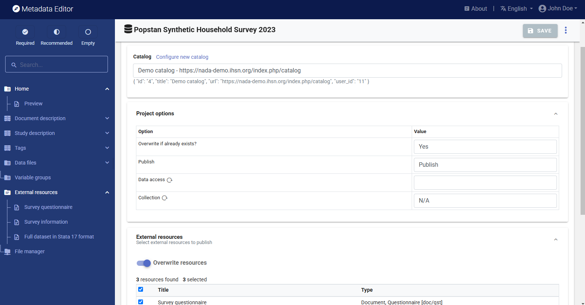

  The dataset will now be listed and made discoverable in the NADA catalog. The microdata will be available to users, under the access policy you selected.

  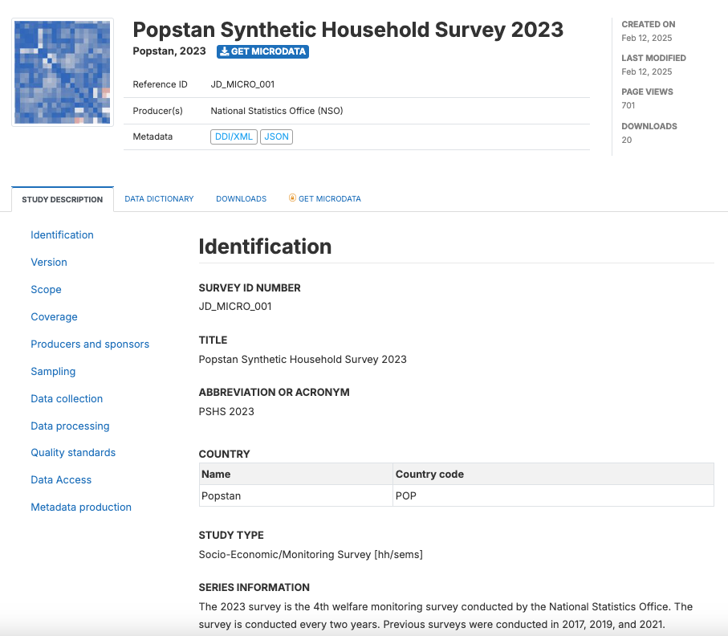

