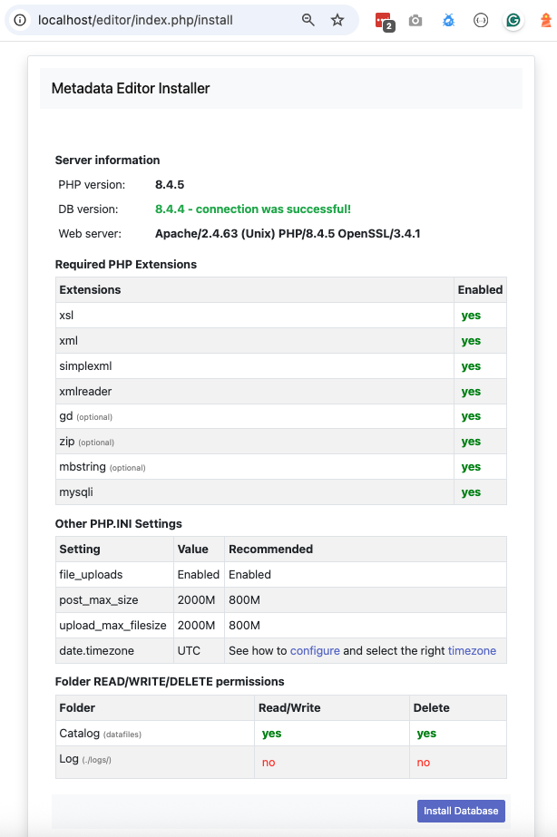
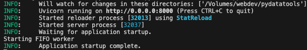

# Installation 

The Metadata Editor can be installed on a server or on a stand-alone personal computer (PC). For installation on a PC, see the section *Installation on a personal computer*. 

Installing the Metadata Editor on a web server provides several advantages:
- **Collaboration**: Multiple users can work on metadata simultaneously.
- **Scalability**: Allows for efficient handling of larger datasets and multiple concurrent users.
- **Accessibility**: Users can access the application from any device with a browser.
- **Centralization of metadata**: If the Metadata Editor runs on an organization's server (typically, on its intranet), all metadata will be stored ina central location. the Metadata Editor can therefore operate as a corporate metadata repository.
- **Permission control**: Running the application on a server allows configuration of an organization's user authentication system.
- **Security**: Centralizing the generation and storage of the metadata on a server facilitates the management of backups and implementation of other security measures. 


## Installation on a server


### Hardware requirements

Ensure your server meets the following minimum specifications:
- CPU: Dual-core processor or higher
- RAM: At least 4 GB (8 GB recommended for larger datasets)
- Storage: Minimum 20 GB of free disk space


### Software requirements

To run the Metadata Editor, you will need:

**OS**:
- Windows
- Linux
- MacOS

**Web server**:
- Apache 2.4 or later
- IIS 6/7.x or later
- NGINX
- PHP: Version 8.1 or later, with the following required extensions:
  - xsl
  - xml
  - mbstring
  - mysqli

**Database**:
- MySQL 8.x or MariaDB. The database is not provided in the Metadata Editor package. The selected database application must be downloaded from its respective repository or website.

**Python**:
- Python 3.12 or later is required for running the FastAPI backend for data import/export and generating summary statistics for Stata, SPSS, and CSV files.


### Downloading and installing the Metadata Editor 


#### Required components

To install the Metadata Editor, you need:
- Metadata Editor: PHP application with a MySQL/MariaDB database.
- PyDataTools: Python backend API for data import/export and summary statistics.


#### Folder structure 

After installation, your directory structure should look like this:

```
metadata_editor
│
+--editor
+--pydatatools
```

#### Downloading the source code

- ***Option 1: Using Git***

Navigate to the web server directory where you want to install the project and run:

```
$ mkdir metadata_editor
$ cd metadata_editor

$ git clone https://github.com/ihsn/editor
$ git clone https://github.com/mah0001/pydatatools
```

- ***Option 2: Using Zip Packages***

   Download the zipped packages and extract them to create the required folder structure:

     - Metadata editor: https://github.com/ihsn/editor/archive/refs/heads/main.zip
    - PyDataTools: https://github.com/mah0001/pydatatools/archive/refs/heads/main.zip
  

#### Configuring the database

**Step 1: Create Database and User**

Use command line, PHPMyAdmin or any other database client tool to connect to your database server.


To connect via command line:

```
$ mysql -u root -p
```


Create database and user account:

- Create a new database (e.g., metadata_editor).

```
CREATE DATABASE metadata_editor;
```

Create a database user with a secure password.

```
CREATE USER 'editor_user'@'localhost' IDENTIFIED BY 'replace-this-with-password';
```


Grant this user access to the metadata_editor database.

```
GRANT ALL PRIVILEGES ON metadata_editor.* TO 'editor_user'@'localhost';
FLUSH PRIVILEGES;
```


**Step 2: Update Database Configuration**

- Navigate to the `editor/application/config/` folder.
- Copy or rename `database.sample.php` to `database.php`.
- Open `database.php` in a text editor and update the following fields:
   - `hostname` - ip address or the machine name where database is hosted
   - `username` - database user name 
   - `password` - database password
   - `database` - database name

```php

$db['default'] = array(
	'dsn'	=> '',
	'hostname' => 'localhost',
	'username' => 'nada_user',
	'password' => '<db-pass-here>',
	'database' => 'metadata_editor',
	'dbdriver' => 'mysqli',
	'dbprefix' => '',
	'pconnect' => FALSE,
	'db_debug' => FALSE,
	'cache_on' => FALSE,
	'cachedir' => '',
	'char_set' => 'utf8',
	'dbcollat' => 'utf8_general_ci',
	'swap_pre' => '',
	'encrypt' => FALSE,
	'compress' => FALSE,
	'stricton' => FALSE,
	'failover' => array(),
	'save_queries' => TRUE,
	'prefix_short_words'=>TRUE
);

```

Save the file.


#### Setting folder permissions

Run the following commands to set read/write permissions for the folders where the data will be stored:

```
$ chmod -R 775 datafiles files logs
```


#### Running the installer

- Open a web browser and navigate to the Editor installation URL. For example: http://your-domain/editor-folder-name, or http://localhost/editor-folder-name.



- Check that all settings are marked with a green tick and fix any that are not on your webserver before running the installer. 
- Click on the `Install Database` button and complete the form to create an initial Site Administrator account.


 
⚠️ Note: Use a complex password (at least 12 characters, including uppercase, numbers, and special characters) to enhance security.


#### Installing and configuring PyDataTools (Python/FastAPI)

- ***Step 1: Install Python*** Download and install Python 3.12 from https://www.python.org/downloads/.

- ***Step 2: Install dependencies*** Navigate to the pydatatools folder and run:

  ```python
	$ pip install -r requirements.txt
  ```

- ***Step 3: Run the FastAPI service*** To start the FastAPI service, run:

   ```
	$ nohup python -m uvicorn main:app --reload --host 0.0.0.0 --port 8000 &
   ```




The Metadata Editor and PyDataTools should now be operational.  


### Email configurations

For the Metadata Editor to function correctly it is important that this step be completed.

Many of the functions within the Editor, such as registration, forgot password require that the Editor be able to send emails to users. 

The email settings are stored in the config file `application/config/email.php`. The following settings are required to configure email:

```

$config['useragent']        = 'PHPMailer';
$config['protocol']         = 'smtp';
$config['smtp_host']        = 'outlook.office365.com';
$config['smtp_auth']        = true;
$config['smtp_user']        = 'your-email-address@outlook.com'; //email or username
$config['smtp_email']       = 'your-email-address@outlook.com'; //email address to send from
$config['smtp_pass']        = 'your-email-account-password';
$config['smtp_port']        = 1025;
$config['smtp_crypto']      = 'tls';

```

- **SMTP_HOST:** Your SMTP server host name 
- **SMTP_AUTH:** Set it to true if your SMTP server requires authentication (username and password) 
- **SMTP_USER:** Email address or user name. If your email server require a username for authentication, type the username, otherwise fill in with the email address
- **SMTP_EMAIL:** Email address same as in SMTP_USER
- **SMTP_PASS:** Email password, if required. Otherwise, leave it empty
- **SMTP_PORT:** Port number used by your email server. e.g. 25, 587, 443
- **SMTP_CRYPTO:** Encryption to use. Options are `tls`, `ssl` or leave it empty if none is required

Once you have updated the configurations, save the file.

**Test the email settings**

The quickest way to test if the email settings are working is to use the “forgot password” option from the user login page. 
- If you are already Logged in, log out and then go to the forgot password page. 
- Enter the administrator or any other accounts email address that you know have an account in the Editor.
- If the email failed, you will see an error message indicating that the email was not sent.

**Test email settings using site admin tool**

The Editor site administration includes a page to test email settings. Open the site administration, go to `settings` menu and open the last option `SMTP settings` and click on `Test email configurations`.

If you have filled in the email configurations (`application/config/email.php`), the page will read all settings from there. Otherwise, fill the email settings and press the button `Send email` to see if your settings are correct. The page will print detailed messages for both success and failed emails.


### Enable backups

The Metadata Editor will operate as a central metadata repository. For a production level installation, it is therefore essential that you implement a proper backup system, with automatic backups as appropriate.


