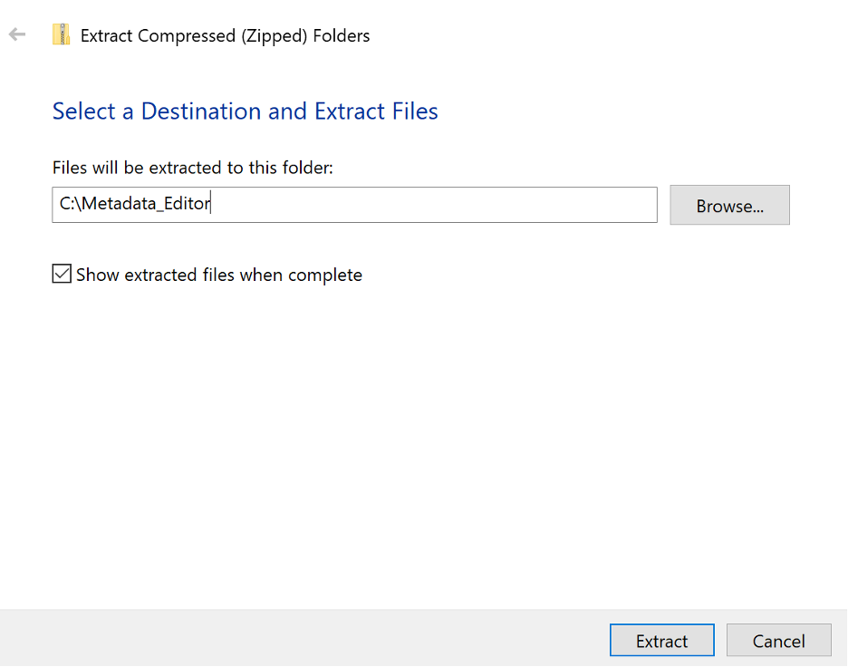
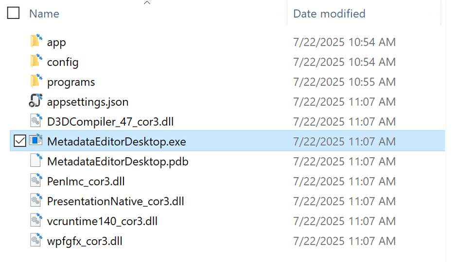
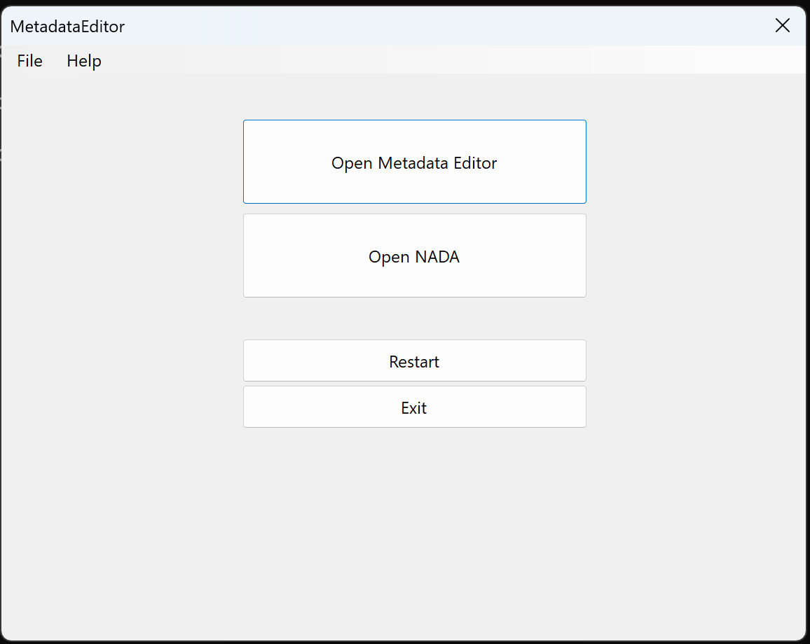
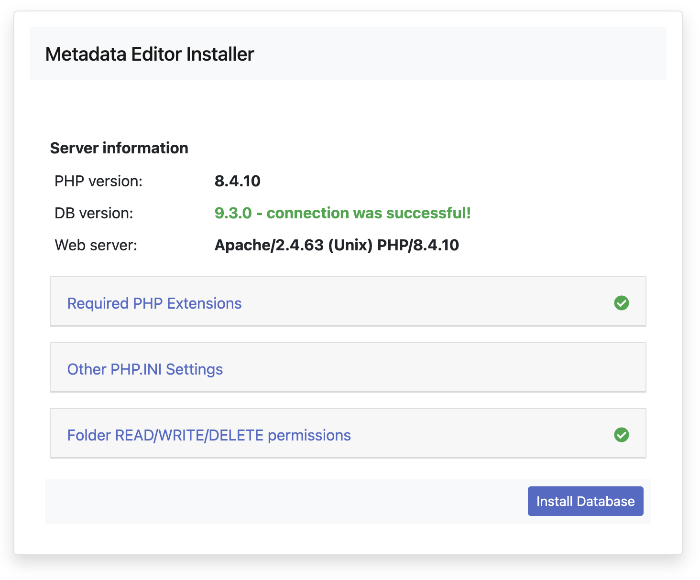
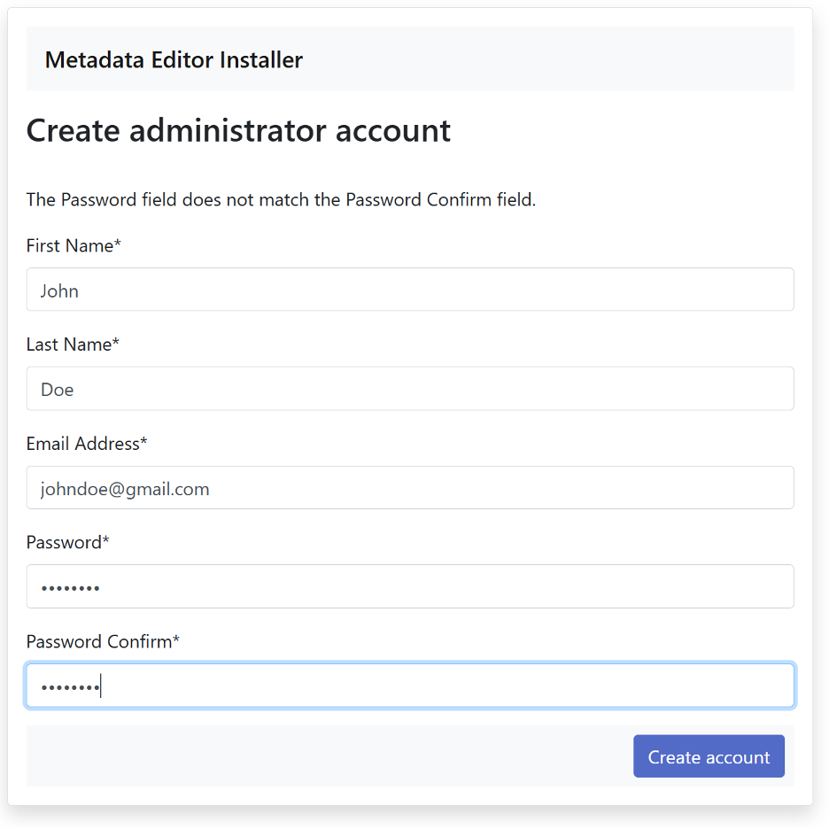
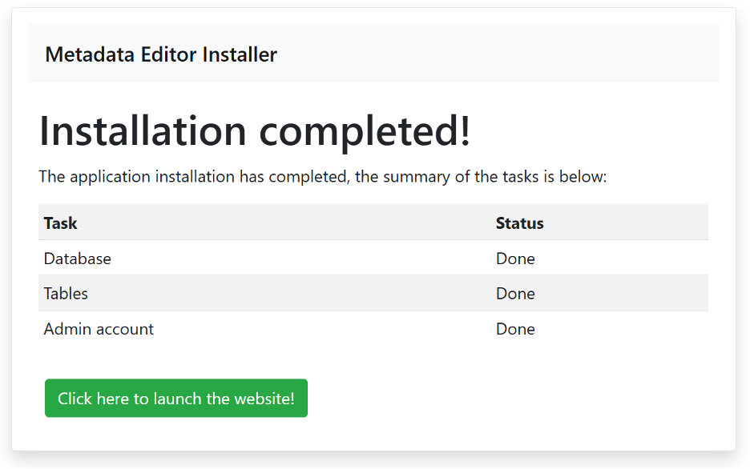

# Installation Guide (Desktop installer)

This document provides step-by-step instructions to install and run the Metadata Editor as a Windows Desktop Application. This desktop version is intended for personal learning, training, and development purposes and is not recommended for production use.

## System Requirements

### Operating System and Hardware Requirements
- **Operating System**: 64-bit Windows 10 or later
- **Memory**: Minimum 8 GB RAM (16 GB recommended)
- **Processor**: Multi-core processor (Intel i5/AMD Ryzen 5 or better recommended)
- **Storage**: 5 GB available disk space
  - Installation requires approximately 1.5 GB
  - Additional space needed for project data and user files
 
- **Visual C++ Runtime for Windows 10**:  Download and install the latest Visual C++ Redistributable from Microsoft: https://learn.microsoft.com/en-us/cpp/windows/latest-supported-vc-redist?view=msvc-170
  -  **Direct link to download Visual C++ Runtime (x64)**: https://aka.ms/vs/17/release/vc_redist.x64.exe 

## Download and Installation

### Step 1: Download the Installer
1. Navigate to the official download page: https://ihsn.org/downloads/MetadataEditorDesktop-1.0.0.zip
2. Download the ZIP file to your computer
3. Note the download location for the next step

### Step 2: Extract the Installation Files
1. Locate the downloaded ZIP file
2. Right-click on the file and select "Extract All..." or use your preferred extraction tool
3. Choose a destination folder (e.g., `C:\Metadata_Editor`)
4. Click "Extract" to unzip the files

### Step 3: Launch the Application
1. Navigate to the extracted folder
2. Double-click on `MetadataEditorDesktop.exe` to start the application

**Note**: For first-time startup, it may take a few minutes for the application to initialize and start properly.

### Step 4: Access the App Launcher
The application will display the App Launcher interface, which provides access to both the Metadata Editor and NADA Catalog.

## Setting Up the Metadata Editor

### Step 5: Install the Metadata Editor
1. Click the "Open Metadata Editor" button in the App Launcher
2. The Metadata Editor will open in your default web browser
3. You will be presented with the web installer interface

### Step 6: Configure the Database
1. Click "Install database" to proceed with the initial setup
2. The system will automatically configure the required database components
3. Wait for the installation process to complete

### Step 7: Create User Account
1. After database installation, you'll be prompted to create an administrator account
2. Fill in the required information:
   - First name, Last name
   - Email address
   - Password
3. Click "Create Account" to proceed

### Step 8: Complete Installation
1. Review the installation summary
2. Click "Launch Application" to start using the Metadata Editor
3. You will be redirected to the main application interface

## Setting Up NADA Catalog

### Step 9: Install NADA (Optional)
1. Return to the App Launcher
2. Click the "Open NADA" button
3. NADA will open in your default web browser
4. Follow the on-screen instructions to set up user accounts and configure NADA
5. Complete the installation process similar to the Metadata Editor

## First-Time Startup Notes

### Important Considerations
- **Initial Startup Time**: The first launch may take several minutes as the system initializes all components
- **Browser Access**: If the editor doesn't appear immediately after clicking the button, wait a few minutes and try again
- **Application Restart**: If issues persist, restart the application using the App Launcher

### Troubleshooting Startup Issues
If the application fails to start properly:
1. Check the log files located in `programs/apache24/logs/` folder
2. Review error messages in the log files for specific issues
3. Ensure all system requirements are met
4. Verify that Visual C++ Runtime is properly installed

### Windows Firewall Configuration
During the first startup, Windows Firewall may prompt for network access permissions:
- **MySQL Service**: Allow private network access only
- **Apache Service**: Allow private network access only
- Select "Private networks" when prompted, not "Public networks"

## Training Materials

### Example Datasets
The application includes comprehensive training materials:
- Locate the `training-materials.zip` file in the installation directory
- Extract the contents to access sample datasets and documentation
- Use these materials to learn the application features and workflows

## Data Management

### User Data Storage
- All user data, projects, and configurations are stored in the `userdata` folder
- This folder is created automatically during installation
- Regular backups of this folder are recommended

### Data Backup Recommendations
- Create regular backups of the `userdata` folder
- Store backups in a secure location
- Consider automated backup solutions for important projects

## Support and Troubleshooting

### Getting Help
For technical support and troubleshooting:
- **Email**: datatools@worldbank.org
- **Documentation**: Refer to the included user guides and training materials
- **Community**: Check for updates and community resources

### Common Issues
1. **Application won't start**: Verify system requirements and Visual C++ Runtime installation
2. **Browser doesn't open**: Check firewall settings and try restarting the application
3. **Database errors**: Review log files in the `programs/apache24/logs/` directory
4. **Performance issues**: Ensure adequate RAM and close unnecessary applications

## Updates and Maintenance

### Updating the Application
*Note: Update procedures will be documented in future releases*

### Regular Maintenance
- Monitor available disk space
- Review log files periodically
- Keep the Visual C++ Runtime updated
- Maintain regular backups of user data

## Security Considerations

### Network Security
- The application runs locally and doesn't require internet access for normal operation
- Firewall rules should be configured for private networks only
- Regular security updates should be applied to the underlying Windows system

### Data Security
- Implement regular backup procedures
- Use strong passwords for user accounts
- Consider encrypting sensitive project data
- Follow organizational data security policies
