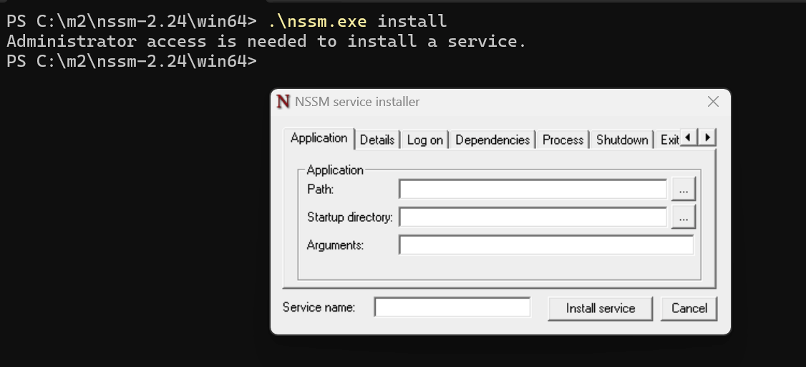
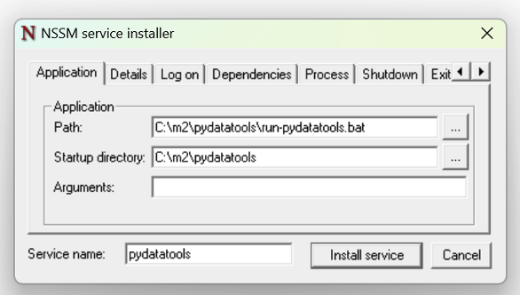
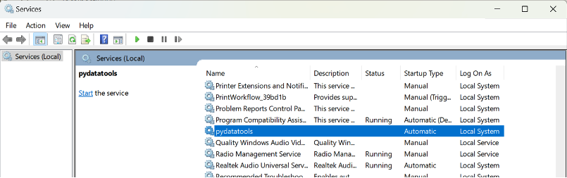

# FastAPI as service

See instructions on setting up FastAPI as a service on Windows and Linux (Systemd service)

## Prerequisites

- Make sure you have already installed and tested the `Metadata Editor FastAPI`, using the [steps here](tech_installation.html##installing-and-configuring-metadata-editor-fastapi-python-fastapi)


## FastAPI service on Windows

To run a FastAPI app as a service on Windows, you can use **NSSM** (Non-Sucking Service Manager) to wrap your FastAPI `uvicorn` command.

---

### Step 1: Download and Install NSSM

- Download NSSM from: https://nssm.cc/download
- Extract and place the nssm.exe file somewhere on your system (e.g., C:\nssm).


### Step 2: Create a Batch File to Run FastAPI
- Create a `.bat` file to run Metadata Editor FastAPI app (e.g., `run_fastapi.bat`). 
- Save the `.bat` file in the same folder as the FastAPI app.


```
@echo off
cd /d C:\path\to\fastapi-app-folder
call C:\path\to\your\venv\Scripts\activate.bat
uvicorn main:app --host 0.0.0.0 --port 8000

```

### Step 3: Install the Service with NSSM

1. Open Command Prompt as Administrator and navigate to the folder where you have extracted `NSSM` e.g. c:\nssm

2. Run the following command to install the service:

```
nssm install
```



3. In the GUI:



- `Path`: C:\path\to\bat\file\run_fastapi.bat
- `Startup directory`: C:\path\to\fastapi-app-folder
- `Service name`: Editor FastAPI


Click **Install service** to finish installing the service.


### Step 4: Start or stop the Service

```
net start <SERVICE-NAME>

net stop <SERVICE-NAME>
```

Or use the Windows services management tool and verify the service for FastAPI (e.g. pydatatools) is listed and is running. If the service is not running, click on the start option to start the service. 


 

To Test the service is running, open a web browser and visit http://locahost:8000 


## FastAPI service on Linux

This guide shows how to run a FastAPI application as a service using **systemd** on Linux.


### Step 1 - Create a virtual environment (recommended)

```
cd /path/to/your/fastapi/app
python3 -m venv venv
source venv/bin/activate
pip install -r requirements.txt

```

### Step 2 - Step 2: Create a systemd service file

Create a service file in `/etc/systemd/system/editor_fastapi.service`:

```
[Unit]
Description=Metadata Editor FastAPI
After=network.target

[Service]
User=your-linux-username
Group=your-linux-username
WorkingDirectory=/path/to/your/fastapi/app
ExecStart=/path/to/your/fastapi/app/venv/bin/uvicorn main:app --host 0.0.0.0 --port 8000
Restart=always

[Install]
WantedBy=multi-user.target
```

Note: Replace `your-linux-username`, `main:app`, and paths accordingly.

### Step 3: Reload systemd and start the service

```
sudo systemctl daemon-reexec
sudo systemctl daemon-reload
sudo systemctl start editor_fastapi.service
```

### Step 4: Enable the service on boot

```
sudo systemctl enable editor_fastapi.service
```

### Step 5: Check service status

```
sudo systemctl status editor_fastapi.service
```


