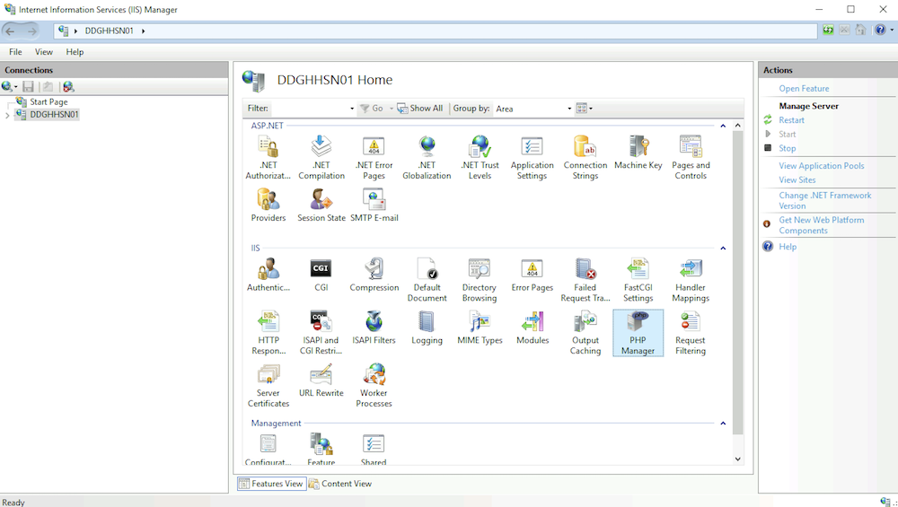
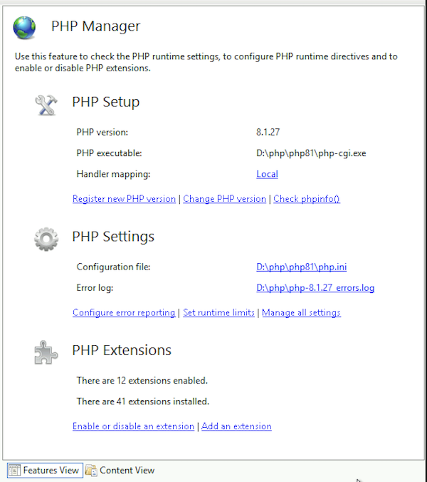
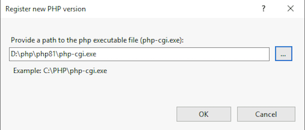
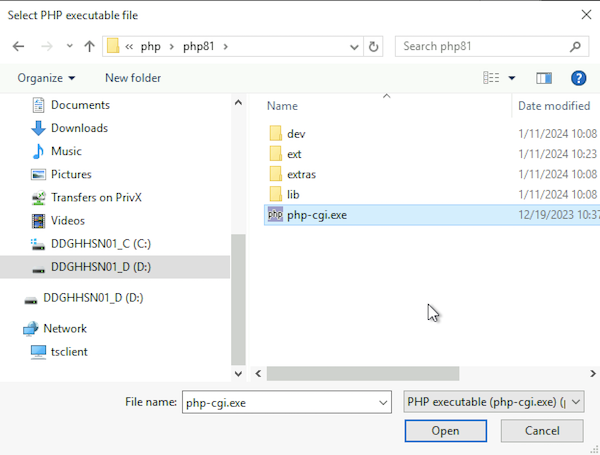
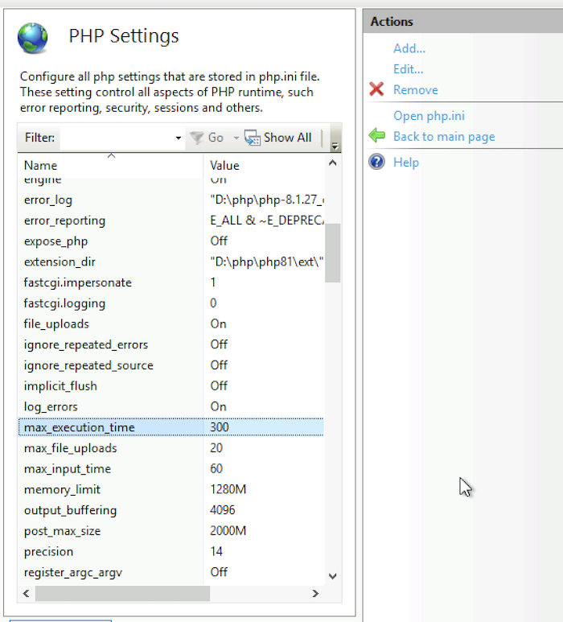
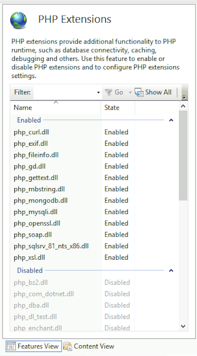

# PHP Installation

When installing PHP on Windows, you can choose between using **Internet Information Services (IIS)** or **Apache HTTP Server**. The installation steps vary depending on the web server selected.

## PHP Installation under IIS

If you are using IIS, it is important to download the **Non-thread safe** version of PHP. You can find the latest PHP 8 builds here:

- [Download PHP for Windows](https://windows.php.net/download/)

### PHP Manager for IIS

The easiest way to install and configure PHP with IIS is by using **PHP Manager for IIS**. It simplifies the setup process and provides a graphical interface to manage multiple PHP versions.

- [Download PHP Manager for IIS 10](https://www.iis.net/downloads/community/2018/05/php-manager-150-for-iis-10)

### URL Rewrite Module

This module is required to enable friendly URLs and routing in many PHP applications.

- [Download URL Rewrite Module](https://www.iis.net/downloads/microsoft/url-rewrite)


### Install PHP using PHP Manager

Follow the steps below to install and configure PHP:

1 - Extract downloaded PHP zip to your local drive e.g. `c:\PHP\PHP82`
2 - Open IIS and click on the server name in the left sidebar, you should be able to see the `PHP Manager` icon in the main content window.

  

3 - Double click on the `PHP Manager` icon to open it. The page shows all installed PHP versions, and options to modify PHP Extensions and runtime settings.



#### Install new version of PHP
To install a new version of PHP, click on the link `Register new PHP version`. It will open a dialog window to select a PHP runtime file.



- You can either type the path in the dialog window or you can click on the three dots to select a file by navigating to the folder where you have extracted the PHP zip file contents.



4 - Once you have finished selecting the php runtime file, you can return to the PHP Manager main page. You should be able to see the PHP version and other information.


#### Change PHP version
The `PHP Manager` allows to have multiple versions of PHP installed and you can select a version of PHP that you want to use for each application under IIS.

For `Metadata Editor`, make sure to use a version of `PHP 8`.

#### PHP Settings
To configure PHP settings such as `timezone`, `file upload limits`, `error reporting` and others. You can make changes using the UI provided or use the link to open the `php.ini` file in notepad.

To make changes, click on `Manage all settings` and it will open the page to show all available settings. You can use this page to find the settings and update them.



For `Metadata Editor`, make sure to configure the following runtime settings:

- `max_execution_time`: 300
- `memory_limit`: 512M - or more
- `post_max_size`: 2000M
- `upload_max_filesize`: 2000M


#### PHP Extensions

To enable/disable PHP extensions, click on the option `Enable or disable an extension`. The page allows you to enable/disable extensions.



For `Metadata Editor`, make sure to have the following extensions enabled:

- `php_curl`
- `php_gd`
- `php_mbstring`
- `php_mysqli`
- `php_openssl`
- `php_xsl`
- `php_zip`


---

## PHP Installation under Apache

If you are using Apache, download the **Thread-safe** version of PHP. You can find it here:

- [Download PHP for Windows](https://windows.php.net/download/)

### Apache HTTP Server

Download and install Apache HTTP Server for Windows:

- [Apache Lounge (Recommended for Windows builds)](https://www.apachelounge.com/download/)

Make sure to download a version of Apache that matches your PHP build architecture (e.g., x64 Thread Safe).

### Configuring Apache to Use PHP

1. Extract PHP to  `C:\php`
2. Open Apache’s `httpd.conf` file and add the following lines:

   ```apache
   LoadModule php_module "C:/php/php8apache2_4.dll"
   AddHandler application/x-httpd-php .php

   PHPIniDir "C:/php"
   ```


3. Restart Apache.

4. Test the setup by creating a phpinfo.php file in your Apache web root:

```
<?php phpinfo(); ?>
```

5. Open your browser and visit:

- http://localhost/phpinfo.php

