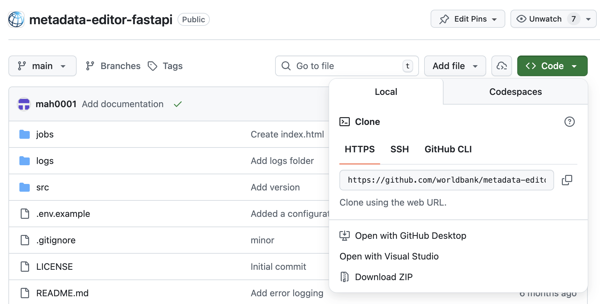
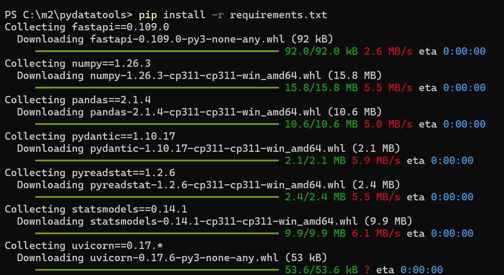
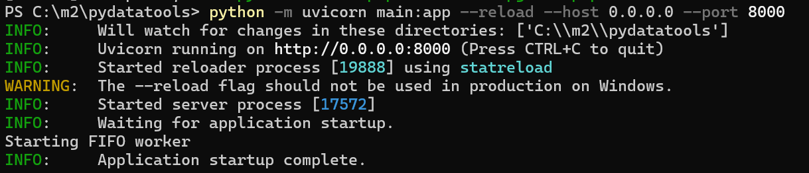
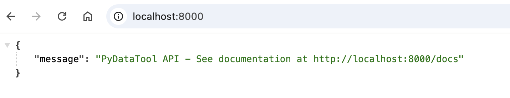
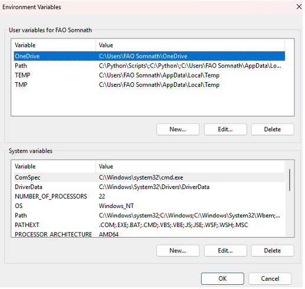
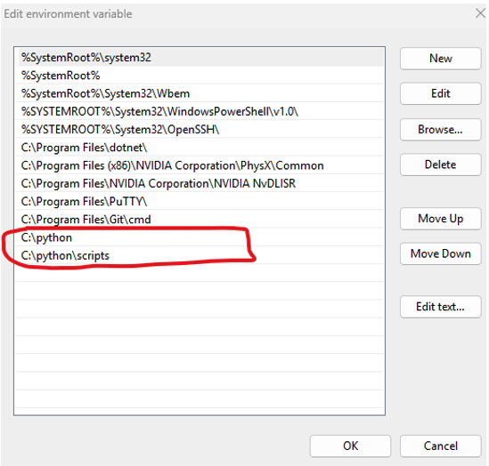

# Installation Guide (Windows Server)

This guide provides step-by-step instructions for installing and configuring the Metadata Editor on Windows server.

---

## System Requirements

Before beginning the installation, ensure your system meets the following requirements:

| Component | Requirement |
|-----------|-------------|
| **PHP** | Version 8.2 or later |
| **MySQL** | Version 8.x or MariaDB 10.x or later |
| **Python** | Version 3.12 |
| **Windows Service Manager** | NSSM (for running services) |
| **Version Control** | GIT (optional, for updates) |
| **IIS** | If using IIS, PHP Manager is recommended |

---

## Installation Procedure

### Step 1: Install PHP

#### Download PHP

1. Visit [php.net](https://windows.php.net/download/)
2. Select PHP 8.2 or later
3. **Important for IIS users:** Download the **Non-Thread Safe (NTS)** version

#### Configure PHP for IIS

If using IIS, use **PHP Manager** for installation:
- Download: [PHP Manager for IIS 10](https://www.iis.net/downloads/community/2018/05/php-manager-150-for-iis-10)
- Alternatively, manually edit the `php.ini` configuration file

#### Enable Required PHP Extensions

Edit the `php.ini` file located in your PHP installation directory and enable the following extensions:

```ini
extension=mysqli
extension=xsl
extension=openssl
extension=curl
extension=mbstring
extension=zip
```

#### Configure PHP Runtime Settings

Update the following settings in `php.ini`:

```ini
memory_limit = 528M
max_execution_time = 60
post_max_size = 2000M
upload_max_filesize = 2000M
display_errors = On
```

---

### Step 2: Install MySQL Database

#### Download MySQL

1. Download MySQL: [dev.mysql.com/downloads/mysql](https://dev.mysql.com/downloads/mysql/)
2. Download MySQL Workbench: [dev.mysql.com/downloads/workbench](https://dev.mysql.com/downloads/workbench/)

#### Configuration During Installation

When installing MySQL:
1. Set a strong password for the root user
2. Note your password—you'll need it later

MySQL Workbench provides a graphical interface for managing your databases. Refer to the [official documentation](https://dev.mysql.com/doc/workbench/en/) for detailed usage instructions.

---

### Step 3: Install Python

1. Download Python 3.12 from [python.org/downloads/windows](https://www.python.org/downloads/windows/)
2. Run the installer
3. **Important:** Check the box to "Add Python to PATH" during installation
4. Complete the installation wizard

---

### Step 4: Install Metadata Editor Frontend

#### Create Folder Structure

Create the following directory structure:

```
C:\inetpub\wwwroot\metadata_editor\
├── editor\
└── editor-fastapi\
```

*Note: For IIS installations, use `C:\inetpub\wwwroot\metadata_editor`*

#### Download Editor Source Code

1. Visit [github.com/worldbank/metadata-editor](https://github.com/worldbank/metadata-editor)
2. Click the **Code** button
3. Select **Download ZIP**
4. Extract the contents into the `editor\` folder


---

### Step 5: Install Metadata Editor FastAPI Backend

The FastAPI backend handles data processing tasks including importing/exporting SPSS and STATA files and generating statistics.

#### Download FastAPI Application

1. Visit [github.com/worldbank/metadata-editor-fastapi](https://github.com/worldbank/metadata-editor-fastapi)
2. Click the **Code** button
3. Select **Download ZIP**
4. Extract the contents into the `editor-fastapi\` folder



#### Install FastAPI Dependencies

Open Command Prompt and navigate to the `editor-fastapi` folder:

```bash
cd C:\inetpub\wwwroot\metadata_editor\editor-fastapi
pip install -r requirements.txt
```



#### Test FastAPI Installation

To verify the installation works, run:

```bash
python -m uvicorn main:app --reload --host 0.0.0.0 --port 8000
```



You should see output confirming the application is running. Open your browser and visit `http://localhost:8000` to verify.



---

### Step 6: Configure Database

#### Create Database

Using MySQL Workbench (GUI) or command line, create a new database:

```sql
CREATE DATABASE metadata_editor;
```

#### Create Database User

Create a dedicated user account for the application:

```sql
CREATE USER 'editor_user'@'localhost' IDENTIFIED BY 'your-secure-password';
GRANT ALL PRIVILEGES ON metadata_editor.* TO 'editor_user'@'localhost';
FLUSH PRIVILEGES;
```

*Replace 'your-secure-password' with a strong password and remember it for the next step.*

For detailed instructions, see the [MySQL Workbench documentation](https://dev.mysql.com/doc/workbench/en/wb-mysql-connections-navigator-management-users-and-privileges.html).

---

### Step 7: Configure Metadata Editor

#### Update Database Connection Settings

1. Navigate to `editor\application\config\`
2. Copy or rename `database.sample.php` to `database.php`
3. Edit `database.php` in a text editor (Notepad or Notepad++)
4. Update the following values:

```php
$db['default'] = array(
	'dsn'	=> '',
	'hostname' => 'localhost',  // or IP address of database server
	'username' => 'editor_user',
	'password' => 'your-secure-password',
	'database' => 'metadata_editor',
	// ... other settings
);
```

5. Save the file

#### Set Folder Permissions

Configure read/write permissions for the following directories:

**Editor Folders:**
- `/Editor/Datafiles/`
- `/Editor/Files/`
- `/Editor/Logs/`

**FastAPI Folders:**
- `/editor-fastapi/Jobs/`

*For IIS: Set these permissions through IIS Manager or file properties dialog.*

#### Configure IIS (Web Server)

1. Open **Internet Information Services (IIS) Manager**
2. Create a new website or virtual directory pointing to: `C:\inetpub\wwwroot\metadata_editor\editor`
3. **Important:** Point to the `editor` subfolder, not the parent `metadata_editor` folder
4. Set the appropriate app pool and permissions

#### Run the Web Installer

1. Open a web browser
2. Navigate to your Metadata Editor URL:
   - **Local:** `http://localhost`
   - **In subfolder:** `http://localhost/editor`
3. Follow the on-screen installation wizard to complete setup

---

### Step 8: Run FastAPI as a Windows Service

*(Optional but recommended for production environments)*

To run FastAPI automatically on system startup, follow these steps:

#### Download NSSM

1. Visit [nssm.cc/download](https://nssm.cc/download)
2. Download the latest version
3. Extract to a folder, e.g., `C:\nssm`

#### Create Startup Batch File

1. Create a new file `run-pydatatools.bat` in the `editor-fastapi\` folder
2. Add the following lines:

```batch
pip install -r requirements.txt
python -m uvicorn main:app --host 0.0.0.0 --port 8000
```

3. Save the file

#### Install Windows Service

1. Open **Command Prompt as Administrator**
2. Run the NSSM installer:

```bash
C:\nssm\nssm.exe install
```

3. Fill in the following fields:
   - **Path:** Full path to `run-pydatatools.bat`
   - **Startup directory:** Path to `editor-fastapi` folder
   - **Service name:** `pydatatools` (or your preferred name)


4. Click **Install service**

#### Add Python to System PATH

To ensure the service can find Python:

1. Press **Windows Key** and search for "System environment variables"
2. Click **Edit the system environment variables**



3. Click **Environment Variables...**
4. Under **System variables**, find and select **Path**
5. Click **Edit**
6. Click **New** and add the path to your Python installation (e.g., `C:\Users\YourUsername\AppData\Local\Programs\Python\Python312`)



7. Click **OK** on all dialogs

#### Verify Service Installation

1. Press **Windows Key** and search for "Services"
2. Look for `pydatatools` in the list


3. If not running, right-click and select **Start**
4. Open your browser and visit `http://localhost:8000` to verify

---

## Troubleshooting

### Common Issues

**Service won't start:**
- Verify Python path is added to system environment variables
- Check that the batch file path is correct
- Review Windows Event Viewer for error messages

**Database connection error:**
- Verify MySQL is running
- Confirm username and password in `database.php`
- Check that the database and user were created successfully

**Permission denied errors:**
- Ensure IIS app pool identity has read/write permissions to required folders
- Check folder ownership and NTFS permissions

**PHP extensions not loading:**
- Verify extension lines are uncommented in `php.ini`
- Check that extension DLL files exist in the `ext\` folder
- Restart IIS or PHP service after changes

---

## Next Steps

Once installation is complete:

1. **Initial Configuration:** Log in to the Metadata Editor and configure basic settings
2. **User Management:** Create user accounts and assign roles
3. **Data Import:** Load your initial datasets


