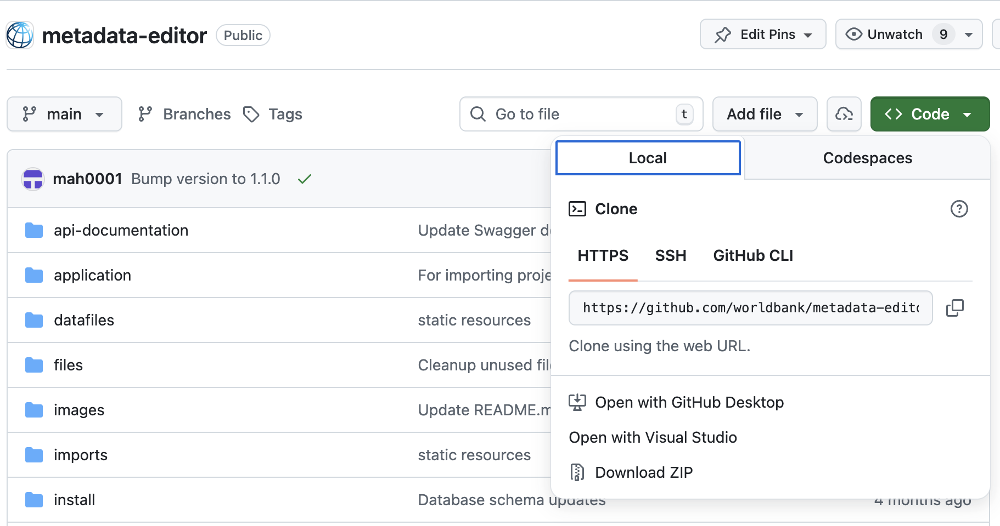
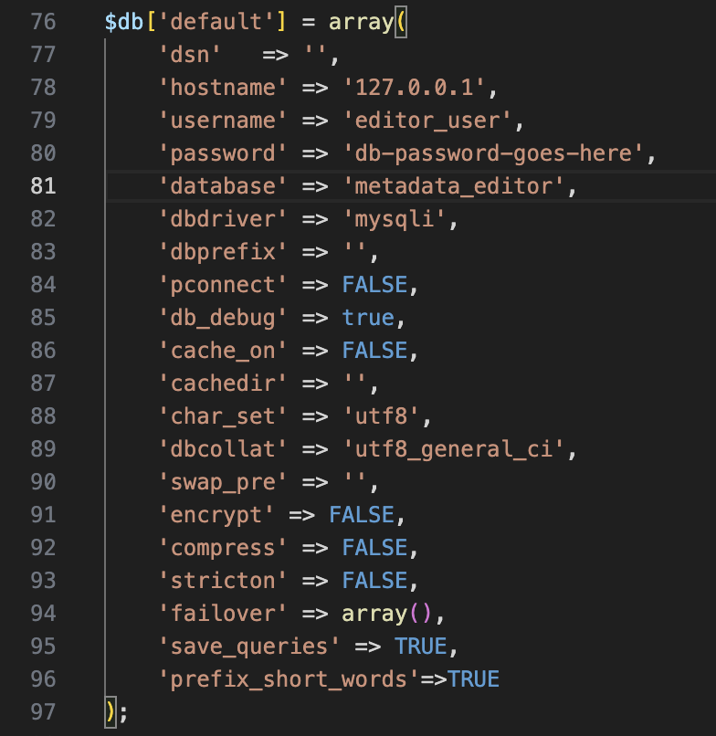

# Installation (Windows server)

Install the Metadata Editor and FastAPI service on **Windows Server** with **IIS**, MySQL/MariaDB, and optional background services.

**Before you start:** [Installation overview](/tech_installation.html) · **After install:** [Post-install configuration](/tech_post_install_configuration.html)

> **IIS on Windows 10/11 Pro** — same steps apply; enable IIS and required features via “Turn Windows features on or off.”


## System requirements

| Component | Requirement |
|-----------|-------------|
| **PHP** | 8.2+ (Non-Thread Safe x64 for IIS) |
| **MySQL / MariaDB** | 8.x / 10.x+ |
| **Python** | 3.11+ (Conda recommended for FastAPI service) |
| **IIS** | 10+ with URL Rewrite; [PHP Manager for IIS](https://www.iis.net/downloads/community/2018/05/php-manager-150-for-iis-10) optional |
| **NSSM** | For FastAPI service and background worker (production) |


## Step 1: Install PHP

1. Download PHP 8.2+ **NTS x64** from [windows.php.net](https://windows.php.net/download/).
2. Configure via [PHP Manager for IIS](/tech_installation_php.html) or manual `php.ini`.
3. Enable extensions:

```ini
extension=mysqli
extension=xsl
extension=openssl
extension=curl
extension=mbstring
extension=zip
```

4. Recommended settings:

```ini
memory_limit = 528M
max_execution_time = 300
post_max_size = 2000M
upload_max_filesize = 2000M
```

Install **IIS URL Rewrite**: https://www.iis.net/downloads/microsoft/url-rewrite


## Step 2: Install MySQL

1. Install MySQL from [dev.mysql.com/downloads/mysql](https://dev.mysql.com/downloads/mysql/).
2. Set and record the root password.
3. Create database and user (Workbench or CLI):

```sql
CREATE DATABASE metadata_editor;
CREATE USER 'editor_user'@'localhost' IDENTIFIED BY 'your-secure-password';
GRANT ALL PRIVILEGES ON metadata_editor.* TO 'editor_user'@'localhost';
FLUSH PRIVILEGES;
```


## Step 3: Folder layout and source code

Create:

```
C:\inetpub\metadata-editor\
├── editor\          ← Metadata Editor (index.php)
└── fastapi\         ← FastAPI service
```

Download from GitHub (ZIP or clone):

- [metadata-editor](https://github.com/worldbank/metadata-editor) → `editor\`
- [metadata-editor-fastapi](https://github.com/worldbank/metadata-editor-fastapi) → `fastapi\`




## Step 4: Configure Metadata Editor

1. Copy `editor\application\config\database.sample.php` to `database.php`.
2. Edit credentials:

```php
$db['default'] = array(
	'hostname' => 'localhost',
	'username' => 'editor_user',
	'password' => 'your-secure-password',
	'database' => 'metadata_editor',
	// ...
);
```



3. **Permissions** — grant the IIS app pool identity **Modify** on:

- `editor\datafiles\`
- `editor\files\`
- `editor\logs\`


## Step 5: Configure IIS

1. Open **IIS Manager**.
2. Create a site or application pointing to **`C:\inetpub\metadata-editor\editor`** (the `editor` subfolder, not the parent).
3. App pool: **No Managed Code**, Integrated pipeline.
4. Ensure URL Rewrite routes requests to `index.php` (standard CodeIgniter/front-controller pattern). The editor root includes **`web.config`** for this.

For optional clean URLs (hide `index.php` in the browser), see [Clean URLs](/tech_installation_clean_urls.html).

Handler mapping and PHP on IIS: [PHP installation (IIS)](/tech_installation_php.html).


## Step 6: Web installer

1. Browse to your site URL (e.g. `http://localhost/` or `http://localhost/metadata-editor/`).
2. Fix any failed prerequisite checks.
3. Run **Install Database** and create the Site Administrator account.


## Step 7: FastAPI service

Follow **[Install and configure the FastAPI service](/tech_installation_data_api.html)**:

1. `fastapi\.env` with `STORAGE_PATH=C:\inetpub\metadata-editor\editor\datafiles`
2. Conda or `.venv` + `pip install -r requirements.txt`
3. Test: `start.bat -f` then open `http://127.0.0.1:8000`
4. Production: **[Run the FastAPI service — Windows](/tech_installation_fastapi.html#windows-nssm)** using `fastapi\deploy\windows\install-service.bat`

Do **not** bind the FastAPI service to `0.0.0.0` on untrusted networks. Do **not** use `--reload` in production.


## Step 8: Background worker (optional)

The Metadata Editor works without this service. Enable for batch jobs or API automation.

From **elevated PowerShell**, with `$AppRoot` = the folder that contains `index.php` (the **editor** root):

```powershell
cd C:\inetpub\metadata-editor\editor\deploy\windows
.\install-service.ps1 -AppRoot "C:\inetpub\metadata-editor\editor"
```

Verify:

```powershell
Get-Service metadata-editor-worker
Get-Content C:\inetpub\metadata-editor\editor\logs\worker.log -Tail 20
```

Details: [Jobs and background workers](/tech_jobs_and_workers.html).


## Step 9: Post-install

Complete **[Post-install configuration](/tech_post_install_configuration.html)** — `data_api_url`, storage paths, SMTP, smoke tests, backups.


## Troubleshooting

| Issue | Check |
|-------|--------|
| PHP extensions missing | `php.ini`; restart IIS |
| Database connection error | `database.php`; MySQL service running |
| Permission denied | IIS app pool identity on `datafiles`, `files`, `logs` |
| Data import fails | FastAPI service; `.env` `STORAGE_PATH`; [Post-install smoke tests](/tech_post_install_configuration.html#smoke-tests) |
| Worker service wrong path | `-AppRoot` must be `editor\` (where `index.php` lives), not the parent `metadata-editor` folder |


## Next steps

1. [Post-install configuration](/tech_post_install_configuration.html)
2. [Managing users and roles](/tech_roles_permissions.html)
3. [Quick start](/quick_start_overview.html)
