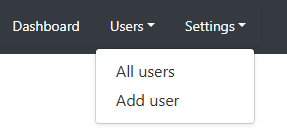
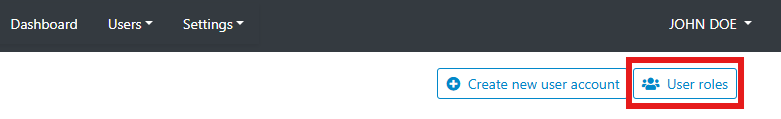

# Managing users and roles

The Metadata Editor operates as a centralized metadata production and management system. It allows the collaborative creation, editing, and deletion of projects. In this context, it is essential to clearly define what each user's role and permissions are. This is defined by (i) controlling who can access the Metadata Editor (who are the "members"), and (ii) defining the role of each member. The Metadata editor provides tools for defining roles, and for assigning them to members. The users and roles management system is accessible only to system administrators. It is accessed from the *Site administration* menu.

## Global permission settings and account activation

**Member**

The Metadata Editor is a web-based application. It is accessed by entering a URL in a web browser. Everyone with access to this URL can open the URL. Typically, the Metadata Editor will be installed on an intranet, not internet. If the person is not registered as a "Member" of the Metadata Editor, opening this link will not provide any access to any information. A person becomes a member when the system administrator register that person, either by activating an organization's authentication system, or by manually registering members in the system.   

A registered member can login to the application. By default, members have no access to any information until their account is activated by the system administrator. When a member logs-in, if her/his account has not been activated, a page will be shown allowing her/him to request activation.

When an account is activated, the system administrator gives the member a role as "Viewer" (the member will not have any active role in the Metadata Editor; s/he will only be able to see projects that have been shared with her/him) or as "Contributor" (the member will be able to create and edit peojects; what s/he can do will be determined by her/his status for each project or collection).

**Collection manager** 

The system administrator can assign the role of "Collection manager" to some members. Collection managers will be allowed to create and edit collections, and to manage permissions associated with collections.

## Roles and permissions at project level 

A set of pre-defined roles is provided by default in the Metadata Editor. Each role come with a specific set of permissions. The roles can be edited, and new ones can be created. When creating new roles, be aware that only one role can be assigned to a member.

The following roles are pre-defined, which apply to specific **Projects**:
- **Member**. A *member* does not have any permission. This is the default role that is assigned when a user registers on the Metadata Editor (or is automatically registered when an organization's authentication system is configured to provide access to all authenticated staff members). Members will only obtain a set of permissions when a system administrator grants them specific roles. 
- **Viewer**. The member is authorized to view the project (and export metadata), but NOT to export data or modify the project in any way. 
- **Editor**. This role allows users to have full access to create and manage projects their own projects or any projects shared with them. The role allows view only access to templates and collections. The users can view, print (PDF, HTML preview), export to JSON all available templates but cannot make any changes to the templates or create new templates. For projects, users can view all available templates and change the template used by the project. 
- **Owner**. The owner of a project is by default the member who created the project. The owner has full permissions on the project (edit, delete, share). Ownership can be transferred.
- **Owner with locking**. The owner of a project is by default the member who created the project. The owner has full permissions on the project (edit, delete, share). Ownership can be transferred.
- **Co-owner**. A co-owner of a project has the same permissions as the owner.
- **Co-owner with locking**. A co-owner of a project has the same permissions as the owner.
- **Editor and Reviewer**. An Editor and Reviewer has all permissions that an Editor has, plus te permission to lock and version projects.
- **Reviewer**. A Reviewer can view a project and lock/version it, but does not have Editor permissions.

For collections: The roles allow the user to manage collections such as create, edit, delete and add users to a collection. For adding projects to a collection, a user must have both admin/owner access to the project and admin/edit role for the collection. 

## Defining a new role

The editor allows creating new custom roles. To create a new role, Administrators can go to users under `site administration` and then click on the navigation link for `User Roles`.

## Roles and permissions for administrative data:

For administrative metadata, user access is managed via the template manager. 

## Publishing to NADA

For publishing projects to NADA data catalogues, user is required to have admin access to the NADA.

## Permission levels in API

API key(s) inherit the same permissions as the user’s interface access. Any operation a user is authorized to perform through the Metadata Editor UI can also be performed programmatically using their API key. Conversely, actions restricted in the UI remain inaccessible via the API as well.
