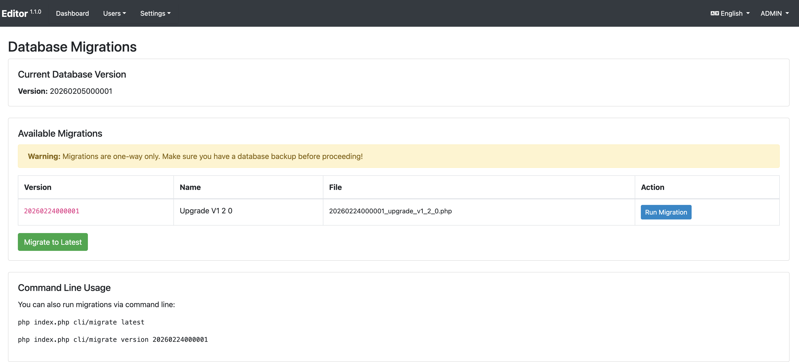

# Upgrade Guide

This guide provides general upgrade instructions. Detailed changes, bug fixes, and version-specific upgrade instructions are published with each release on GitHub:

👉 [https://github.com/worldbank/metadata-editor/releases](https://github.com/worldbank/metadata-editor/releases)

Review the release notes for the version you are upgrading to before proceeding.


## 1. Backup Your Environment

Before making any changes:

- **Application Files**: Copy the entire application directory to a secure location.
- **Database**: Export your database using a tool like `mysqldump`:

  ```bash
  mysqldump -u your_user -p your_database > backup.sql
  ```


## 2. Download the Latest Version

Download the latest release package from the GitHub repository:

👉 [https://github.com/worldbank/metadata-editor/releases](https://github.com/worldbank/metadata-editor/releases)


## 3. Replace Application Files

- Rename your current application folder to preserve it:

  ```bash
  mv metadata-editor metadata-editor-backup
  ```

- Unzip the new release and place it in the original folder path:

  ```bash
  unzip metadata-editor-v1.0.0.zip -d metadata-editor
  ```


## 4. Restore Configuration and User Data

Copy the following files and folders from your backup to the new installation:

- `datafiles/`
- `application/config/config.php`
- `application/config/email.php`
- `application/config/database.php`


## 5. Apply Database Updates

Each release may include database schema changes. Always review the release notes before applying any updates.

**For versions prior to v1.2.0**, database updates are provided as SQL scripts in the release notes. Apply them manually using a database client or tool such as `mysql`:

```bash
mysql -u your_user -p your_database < update.sql
```

**Starting with v1.2.0**, the application uses database migration files to manage schema changes. These migrations can be applied in three ways:

- **Via the CLI** — run the migration command from the application root:

  ```bash
  php index.php cli/migrate latest
  ```

- **Via the Site Administration** — navigate to **Admin > Settings > Database Updates** and apply pending migrations from the interface.




- **Via SQL Script** — The release notes provide information which files to use. Apply the provided SQL update file manually using a database client, e.g., `install/schema.mysql.update-1.2.sql`.

Always review the release notes for each version to confirm which method applies and whether any manual steps are required.


## 📘 Resources

- 🔗 [All releases](https://github.com/worldbank/metadata-editor/releases)
- 🐛 [Report an issue](https://github.com/worldbank/metadata-editor/issues)


## 🛟 Need Help?

If you encounter issues during an upgrade, restore from your backup and report the problem through the GitHub Issues page.

For email support contact: datatools [at] worldbank [dot] org
