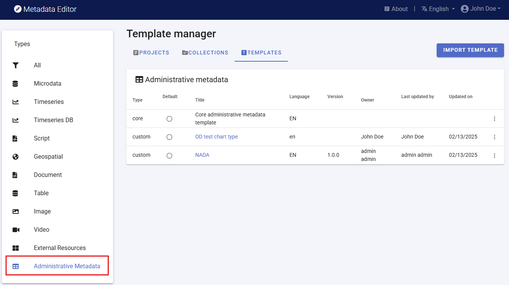
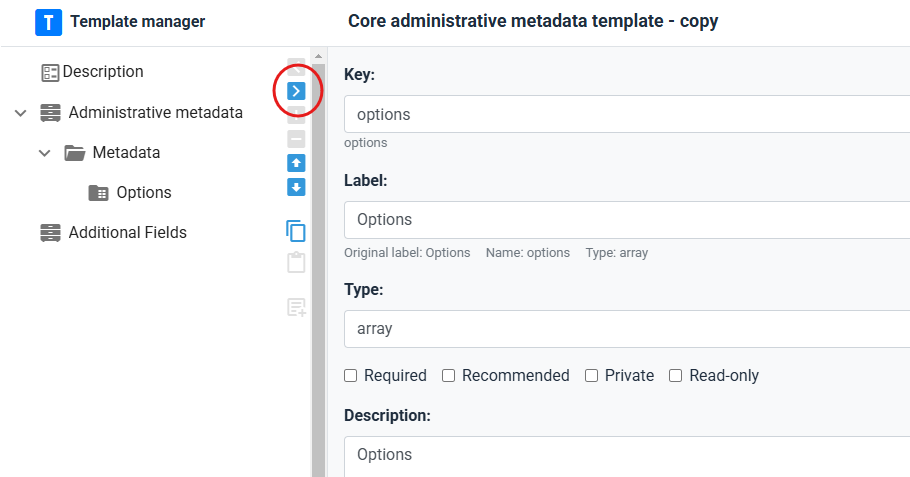
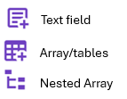
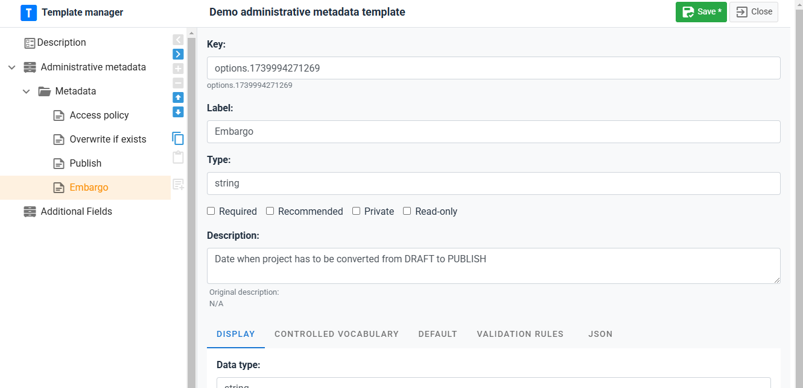
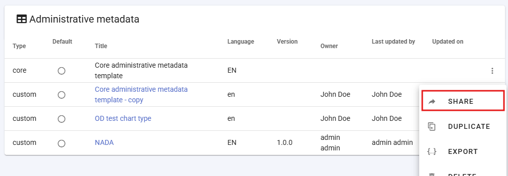
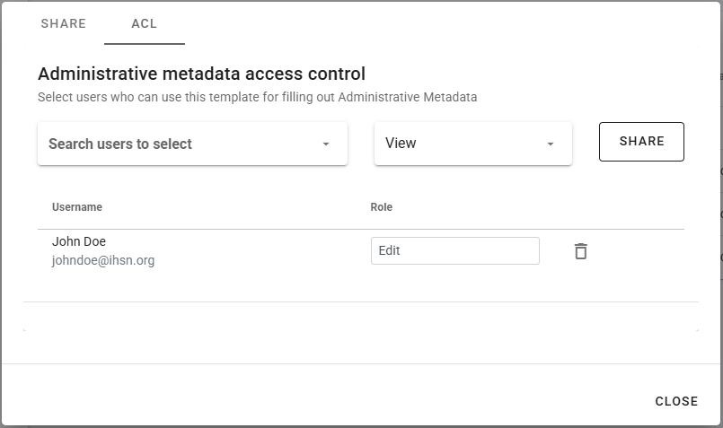
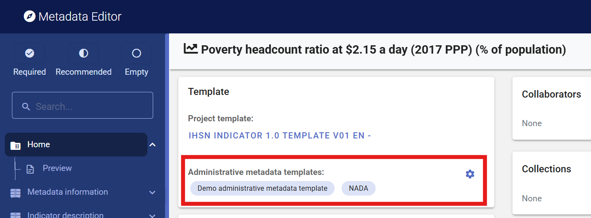
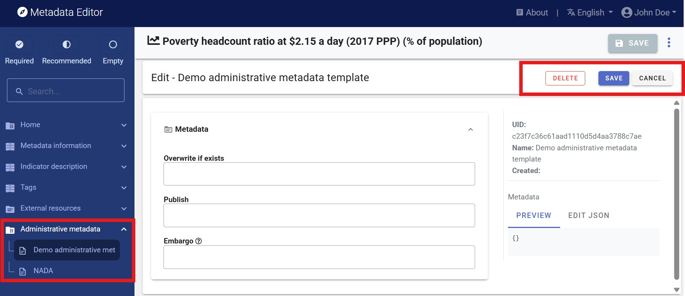

# Administrative metadata

## Purpose

Administrative metadata refers to the metadata required for managing and operating data management and dissemination systems. Administrative metadata will only be used by large data cataloguing systems, and by data systems that require automation of processes. Not all users of the Metadata Editor will need administrative metadata.

Unlike metadata intended for data users, administrative metadata is primarily used internally and is not shared externally. It contains essential instructions that guide software applications, such as data catalogs, in handling data storage, display, and accessibility parameters. 

For example: 
- An organization may maintain two versions of a data catalog: one for internal use, the other one accessible to external users. While the descriptive and structural metadata to be displayed is the same for both versions of the catalog, the data access conditions may differ (for example, data may be openly accessible to internal users, but disseminated externally under different conditions). Administrative metadata may in that case be used to store information on the access policy to be applied to each version of the data catalog. 
- An international organization that publishes time series of indicators in an on-line platform wants to include some viaualizations for each indicator. But not all types of data visualition apply to all indicators (for example, it would not make sense to show a choropleth world map of GDP per capita in local currency, as the estimates are not comparable across countries). In that case, administrative metadata can be used to indicate, for each indicator, what visualizations should be displayed in the platform.  

> The content of administrative metadata will be specific to each organization and IT system. For that reason, no metadata standard is provided for administrative metadata. Instead, administrative metadata templates (or *schemas*) are entirely created "from scratch" using the Template Manager tool in the Metadata Editor. 

The creation of administrative metadata follows a structured approach similar to that of descriptive metadata. A set of metadata elements forms a structured template. These elements are defined by IT specialists to ensure alignment with the organization's system functionalities and operational needs.

Metadata schemas created by an organization can then be used by the organization to capture administrative metadata for any project. Each project can be assigned one or more administrative metadata templates. 

Administrative metadata will be stored within the Metadata Editor and can be exported (as JSON files). It will be accessible via API to allow data management and dissemination systems to retrieve and utilize it as needed. Administrative metadata is not included in metadata exported for public use.  

## Creating administrative metadata templates

Although administrative metadata schemas are specific to each organization and IT system, the Metadata Editor provides a starter template named **Core administrative metadata**. This core template is not editable. But it can be duplicated, and the copy can then be edited for creating custom templates.

To create a new administrative template, select `DUPLICATE` in the list of options available for the template (triple-dot icon next to the template title). In the *Description* page, provide a name (at least), and other information describing the new template being created. Then `SAVE` the template.

You may now start customizing the template by adding your own metadata elements. Start by removing all fields under the *Metadata* section in the navigation tree (but do not delete the section/folder). To remove a field, select the field in the navigation tree and click on the right blue arrow `>`. After removing all fields, you will obtain an empty template, ready for customization. 
  > Do NOT remove the *Metadata* section. You cannot add elements directly under the container, so this folder is necessary.

Start adding the metadata elements you need. Select the *Metadata* folder in the navigation tree, then add an element by clicking on one of the three possible types of elements. The template supports 3 types of elements: 

Once created, add the following information on the metadata element:
- ***Key***: The *Key* is the name under which the element will be stored in the JSON template file (the unique identifier of the metadata element). The key can only contain alphanumeric values, and must be unique to each metadata element within the template.
- ***Label***: Give a label to the new element (replace the *untitled* label).
- For all other components, see section **Designing templates**.

## Defining who can enter administrative metadata for a project

Administrative templates are designed, usually by IT/system experts, for the needs of specific data management or dissemination systems. The information to be entered in an administrative template when a project is documented will usually not be entered by the data curator (who will document the data), but by a system expert. This means that a different permission system will apply to the management of the content of administrative metadata.

The information on who has permission to enter administrative metadata is not set at the project level, but at the template level. The list of contributors authorized to enter content in a metadata template is defined in the ACL tab of the metadata sharing screen.

To access the screen, click on SHARE in the template menu (accessed by clicking on the tripple-dot icon in the template list). 

A popup menu will open, with the option to share the template itself (tab SHARE), and to enter the list of collaborators authorized to enter content when the template is used in a project (in tab ACL). Add the collaborators, making sure to give them **Edit** permission.

## Adding administrative templates to a project 

Administrative metadata templates are added to a project by selecting one or multiple administrative templates in the *Templates* frame of the project home page.

The added templates will be displayed in the navigation tree, under section *Administrative templates*.

To remove a template from a project, select the template in the navigation tree and click on `DELETE`.

Content can then be filled out by an authorized person. 

The content entered in the template can be exported as JSON, and is accessible via API (see chapter **Metadata Editor API**.
   
See also section ***Administrative metadata*** in chapter **Documenting data - General instructions**
