# Designing templates

> This section is about designing templates for the various data types. For administrative metadata templates, see [Administrative metadata](/templates_administrative.html).

Data curators will rarely make use of all elements available in a metadata standard. Many of the available elements may not be relevant in the context of a specific organization. Metadata templates provide a solution to define and tailor subsets of metadata elements available in a standard. 

Metadata templates are created and/or edited using the *Template Manager* tool in the Metadata Editor. 

Not all users of the Metadata Editor can create or edit templates. Site administrators assign the **Template manager** role (or equivalent custom role with template permissions) so selected staff can maintain templates organization-wide. Project **Editor** users can view templates and change which template a project uses, but cannot edit template definitions unless they also have template edit access or are granted access on a specific template via **SHARE**. See [Managing users and roles](/tech_roles_permissions.html#templates-and-sharing).

More than one template can be developed for each metadata standard (i.e., for each main data type). It is highly recommended to keep the number of metadata templates small. This will foster consistency in the metadata being produced, facilitate the work of data curators, and reduce the burden of maintaining a collection of templates.

## Pre-designed templates and template list

You access the **Template Manager** by clicking on `TEMPLATES` in the main menu of the Metadata editor. This will open a page showing all available templates by type of data. The list can be filtered by selecting a data *Type* in the left frame.

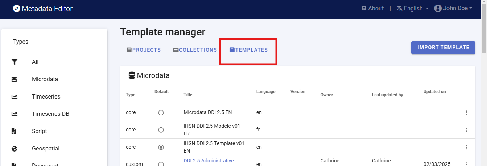

For each main data type (i.e., for each metadata standard), the Metadata Editor provides one or multiple **core** templates which are non-editable. One of the core templates contains **all elements** of the corresponding metadata standard, with their default parameters (label, description, etc.). Other core templates are provided as suggested templates, which only contain what is considered as the most important metadata elements for a general use case. Typically, new templates will be created by generating a copy of a core template, then editing it. 

## Actions on templates

A set of options and actions is available for each template in the *Template list* page (accessed by clicking on the three-dots icon):

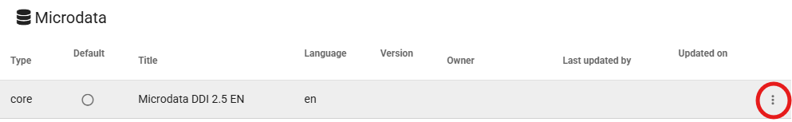

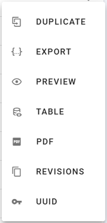

- **`DUPLICATE`**

  Generate an editable copy of the selected template. After duplicating a template, click on its title in Templates list to open the new template page for editing. 

  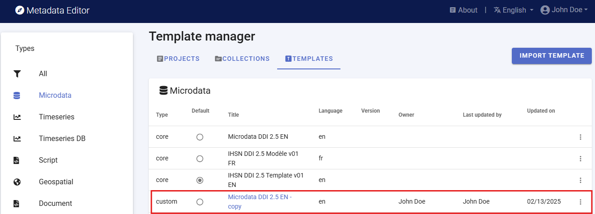

  The duplicated template can be customized, and saved under a new name (edit the `Name` field in the *Template description* page, and click on `SAVE`).

  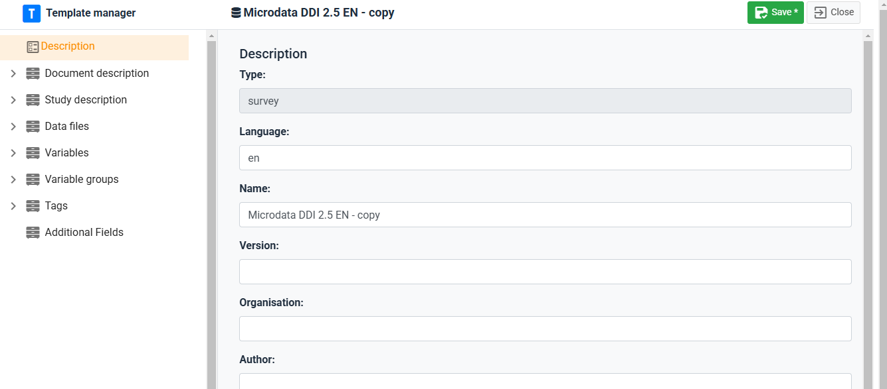

 
- **`EXPORT`** (and `IMPORT`)

  Create a JSON copy of a template, which can then be saved as a file with [.json] extension (to save the JSON file, position the cursor in the text, right-click, and select `Save as`). Exporting templates allows sharing them with other organizations, who can `IMPORT` templates in their own instance of the Metadata Editor.

  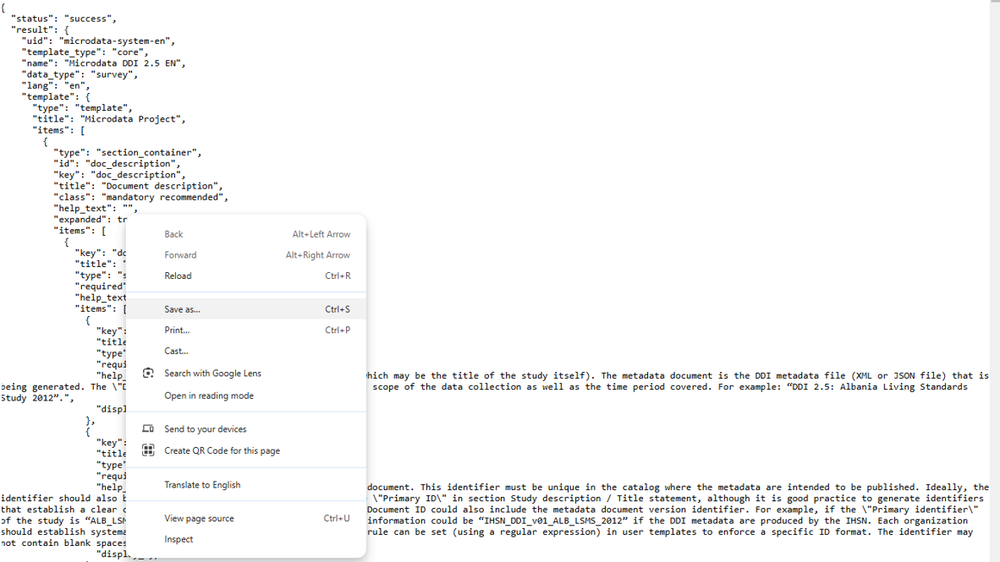

  Exported templates can be imported in the Metadata Editor by clicking on **`IMPORT TEMPLATE`**.

  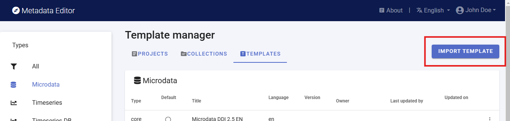

- **`DELETE`**

  Delete the selected template (only available for custom templates, not for core templates). Deleted templates can be restored from the deleted-templates list when your site enables soft delete; permanent removal may require a separate administrator action.

- **`SHARE`**

  Share a custom template with other registered users and assign permissions (for example *View* or *Edit*). Template owners and users with template **admin** access can manage collaborators. For **administrative metadata** templates, the same dialog includes an **ACL** tab that controls who may enter administrative metadata when the template is attached to a project — see [Administrative metadata](/templates_administrative.html#defining-who-can-enter-administrative-metadata-for-a-project).

  

- **`PREVIEW`**

  Generate an HTML version of the template, which will open in a web browser.

  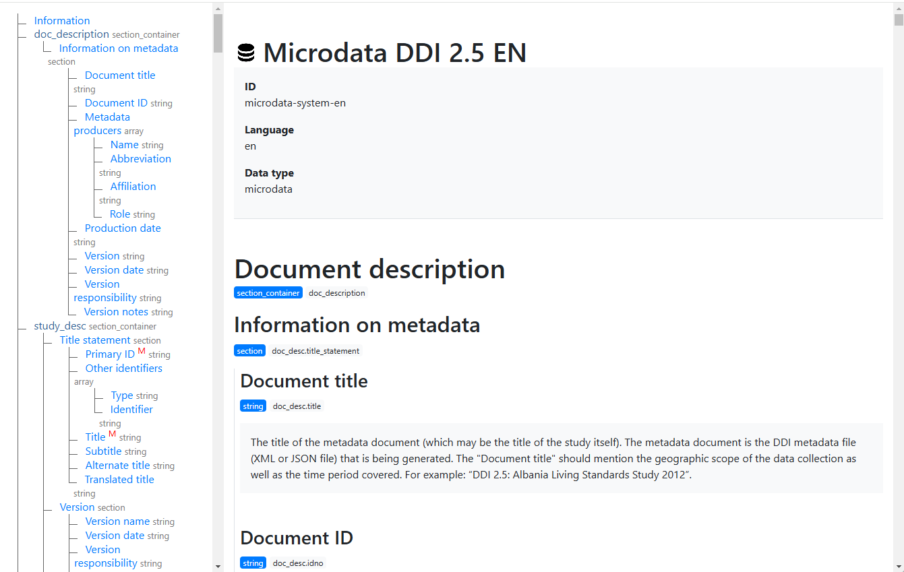

- **`TABLE`**

  Generate a tabular description of the template, which can for example be copy-pasted in MS-Excel if needed.

  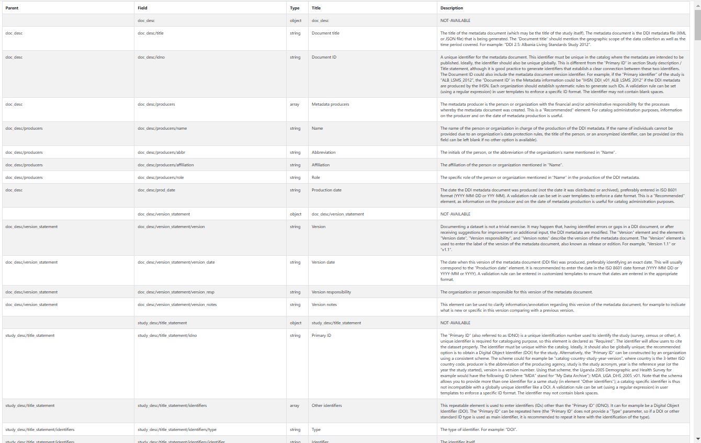

- **`PDF`**

  Generate a PDF version of the template. If the template contains detailed descriptions of the metadata elements, and good examples of content, the PDF file can serve as a useful instruction guide for data curators.

  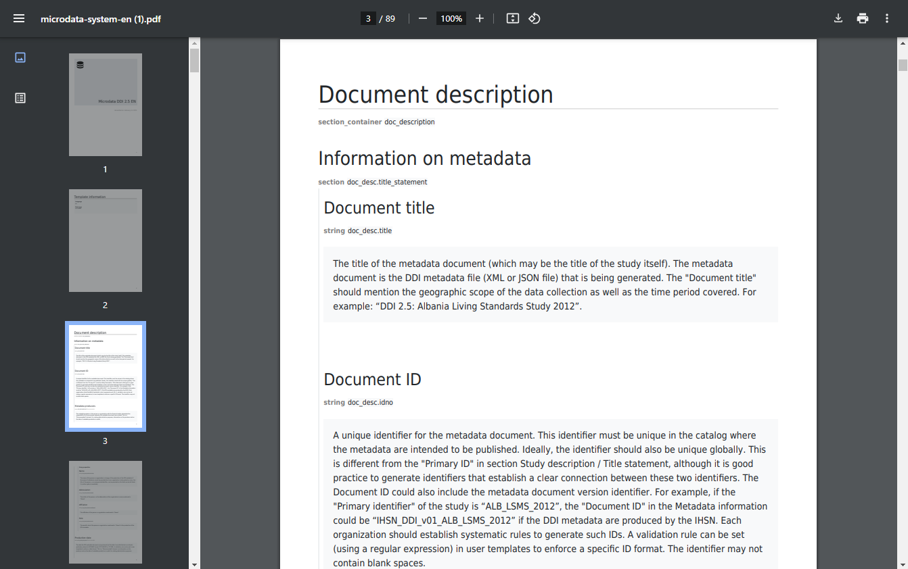

- **`REVISIONS`**

  Provide a history of changes to the template since its creation.

- **`UUID`**

  Allows template administrators to edit the unique identifier of the template. By default, a system identifier is created. This identifier can be changed to a more readable one. This will typically be done for administrative metadata templates.

## Editing a template

### Description page 

You access the *Description* page of a template by clicking on the template *Title* in the list of templates. The *Description* page is where you provide the main identification information of the template. It includes the following elements: 
- **Type**: The type of data to which the template applies (for example microdata, indicator, timeseries or timeseries database, geospatial, document, image, video, script, table, or a [custom schema](/custom_schemas.html) type registered on your site) 
- **Language**: The language of the template
- **Name**: The name of the template.
- **Version**: The version of the template.
- **Organization**: The organization that developed the template or for whom the template was developed.
- **Author**: The author(s) of the template.
- **Description**: A brief description of the template.
- **Instructions**: A set of overall instructions related to the template (not the instructions related to each specific metadata element, which will be added in the template itself). The content of this element can be plain text or formatted text (using markdown syntax; see https://www.markdownguide.org/basic-syntax/ for a guide on formatting text using markdown). 

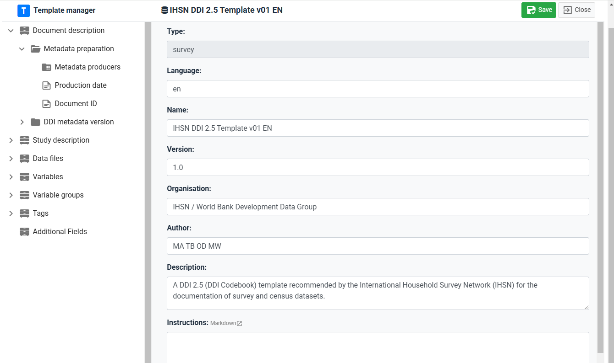

#### Project editor modules {#project-editor-modules}

Some data types include **optional project editor areas** — dedicated screens or navigation entries that are separate from the main metadata form tree (for example geospatial **Feature catalogue** or **Image gallery**). On the template *Description* page, **Project editor modules** lists the optional modules that apply to this template’s data type.

- **Default:** All listed modules are **shown** when a curator opens a project that uses this template.
- **Hide a module:** Turn off the switch for that module. The setting is stored in the template JSON under `editor_modules` (only disabled modules need an entry; `show_in_editor: false` hides the area).
- **What it affects:** Module toggles control **project editor navigation and dedicated screens**. They do **not** remove metadata fields from the template tree; form layout stays in the navigation tree as you designed it.

Which modules exist for each data type is defined in the application configuration; new module types may be added in future releases.

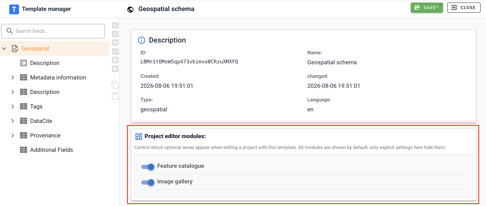

### Navigation tree 

The Template Manager navigation tree shows the structure and content of the template. This structure and content will define the structure and content of the metadata entry pages that data curators will see when they document datasets using the template. 

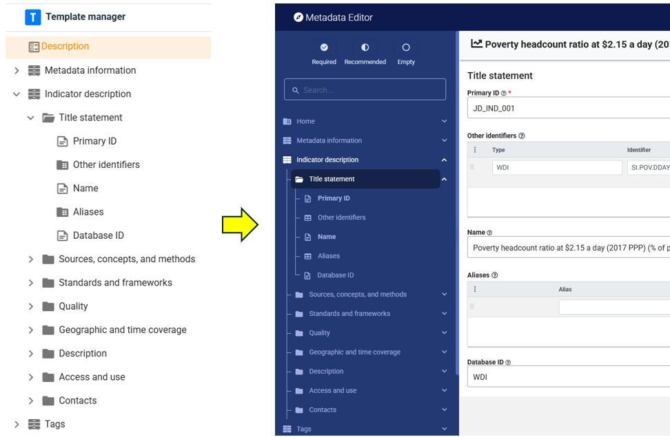

The navigation tree in the Template Manager indicates the type of element using the following icons:

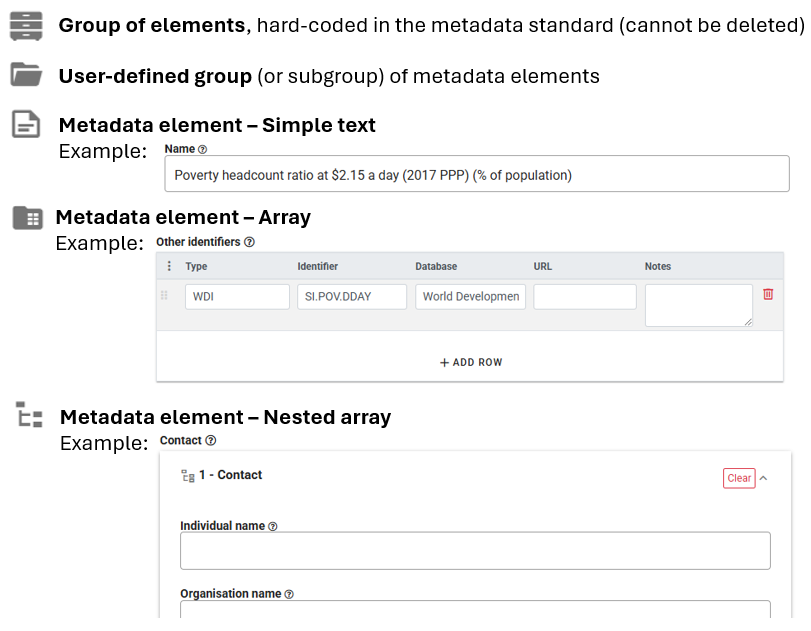

The navigation frame contains a toolbar used to edit the structure and content of the template. The available tools are the following:

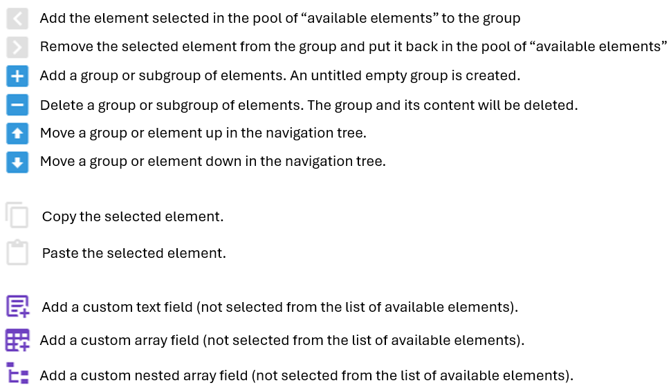

### Customizing a template 

#### Groupings 

Metadata standards organize metadata elements into some main *container*. These groupings are not editable; they are "hardcoded" in the respective metadata standards. Within containers, elements can be organized by *group* and *sub-group* ("sections"). Groups and sub-groups are user-defined. The purpose of the groupings is to organize the metadata elements in a way that will be user-friendly and intuitive to data curators. All metadata elements in a template must be placed in a user-defined group (they cannot be placed directly under a container).

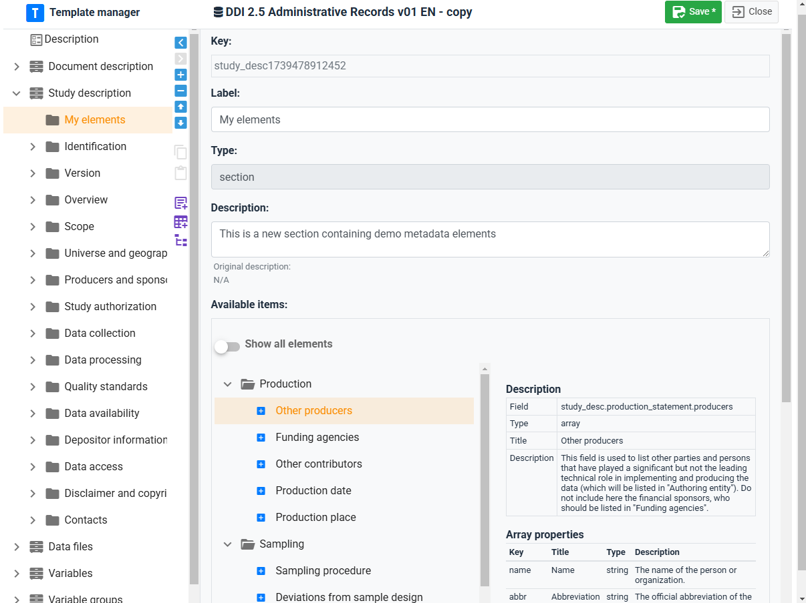

Groups and subgroups are created by clicking on the [+] button in the navigation tree (the button is only active when a container or group is activated in the navigation tree). When a new group is created, replace the *Untitled* label with a (short) label of your choice, and provide a brief description of it (optional). You can move the group up or down the navigation tree by using the *Up* and *Down* arrows.

You can delete a group by clicking on the [-] button. The group and all its elements will then be removed from the navigation tree. All elements that were included in the tree will also be removed. The elements that belong to the standard will be put back to the list of available elements (see below), but their customization will be lost. The *additional* elements that may have been included in the group (elements that do not belong to the standard) will be lost. 

#### Adding metadata elements from the standard

Templates are intended to be a customized organization of metadata elements from a metadata standard (with possible addition of *additional* elements not found in the standard - see next section). A template is therefore created mainly by selecting elements from the list of elements available in the metadata standard, and placing them in the structure shown in the navigation bar. The list of available elements (which contains all elements from the metadata standard that have not yet been selected, i.e. not found in the navigation bar) is shown in the right frame of the Template Manager, **when a group is selected in the navigation bar**. An option is provided to **show all elements**. The list of available elements is the pool of metadata elements from the metadata standard that can be added to the template. 

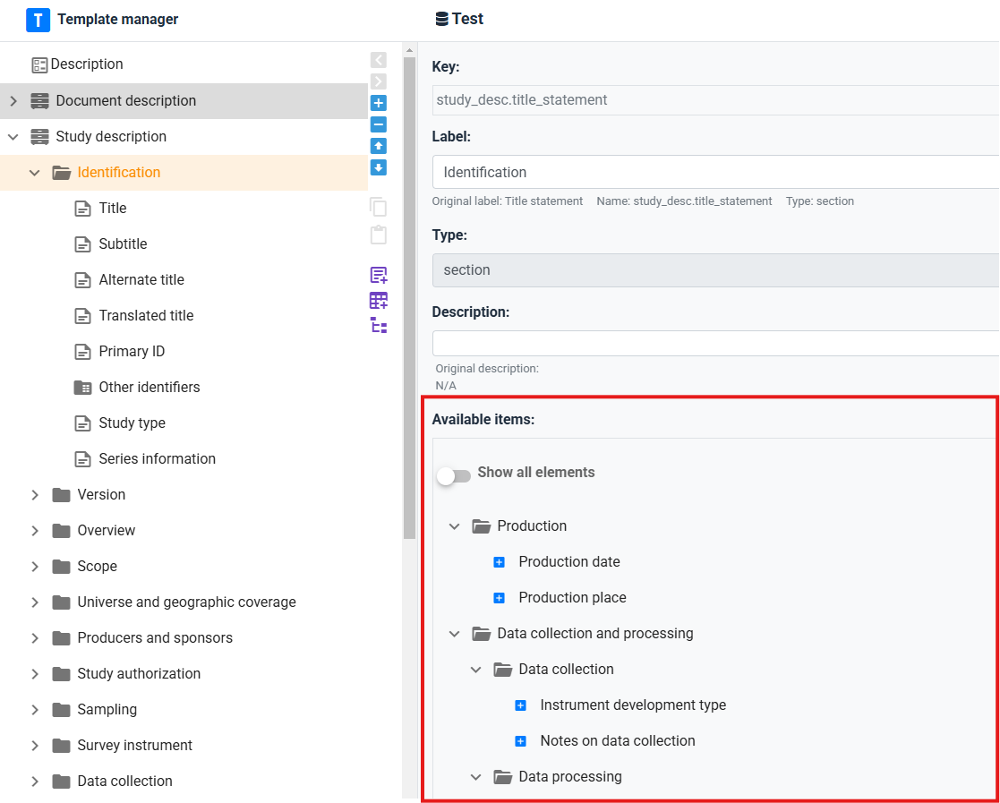

Metadata elements must be placed within groups or sub-groups (not directly under a container).  

- **To add an element from the standard**: In the navigation tree, select the group in which you want to add the element. Then select the element from the list of available elements by clicking on the + button next to the element. The element will now be listed in the group. You can move the element up or down the list within the group. You can remove the element from the navigation tree by selecting it and clicking on the [>] button in the toolbar. The element is sent back to the list of available elements, with its default description (i.e. customizations will be lost). You can also copy/paste elements to move them from one group to another (within the same container). To do this, select the element(s) to be copied, and click on the **Copy** button in the toolbar (the elements included in the clipboard will be marked in the navigation tree). Select the group where the elements have to be pasted, and click on the **Paste** button.  

- **To edit metadata elements**: When you select a metadata element in the navigation tree, all information about the element is displayed in the right frame. Some of this information can be edited. The information includes the following:

- ***Key:*** The key is the unique identifier of the element in the metadata standard (a schema path for built-in types). For standard elements the key is usually fixed; for **additional** fields you define the key (typically under an `additional.*` path for custom fields). Where supported, keys can be edited with care — the editor warns when a key does not match a known schema field. Invalid keys can cause validation or export issues.
  
- ***Label:*** The label of the element can be edited. It should be short and informative.

- ***Type:*** The type of element. A metadata element can be a text field, an array, a nested array, or a simple array.

- ***Status:*** Each element can be categorized as:
   - ***Required***: Required means that metadata for any dataset must contain information for this element. Metadata that fail to include content for a required element will not be validated (validation errors will be displayed).
   - ***Recommended***: This status is mainly used to facilitate metadata entry by data curators and for quality assurance.
   - ***Private***: Some metadata may be useful to the organization who generates the metadata, but not be part of the metadata to be published. Metadata elements marked as private may be excluded from the metadata files exported from the Metadata Editor.  
   - ***Read-only***.

- ***Description:*** The description of the metadata element should provide a clear indication of what data curators are expected to enter in the field. The instructions will be displayed as "help" in the metadata entry pages. By default, the instructions are those that are provided in the metadata standard description. They can be customized. 

- ***Field properties:*** This information only applies to elements of type "array" and "nested_array". Arrays contain multiple elements. The *Field properties* is where the content of the array is selected and edited. 

- ***DISPLAY:*** This tab contains information that only applies to elements of type "text". The following information can be edited:
   - ***Data type:*** This indicates the type of content expected in the element: string (text), number, integer, or boolean.
   - ***Display:*** This indicates the *Data Type*, and *Display options*: how the field will appear in the metadata entry pages, with the following options: "text" (one-line text field), "text area" (multi-line text field), "date" (date in ISO format; the metadata entry page will show a calendar from which the data curator can select a date); "dropdown" (one-line text field with a drop down from which the data curator must select an entry, with no option to enter free text); and "dropdown-custom" (one-line text field with a drop down list, but allowing data curators to enter content other than what the dropdown suggests). The content of the dropdown lists is defined by the *controlled vocabulary* for the element (see below). For selected text fields, the *DISPLAY* tab will also contain information on *Input format* which indicates whether formatted text can be entered for the element. By default, only non-formatted text is allowed. But exceptions can be made to allow Markdown, LaTex, or HTML content to be entered by the data curator. LaTex allows capturing formulas. See section *Documenting data - General instructions* for an example.
     
   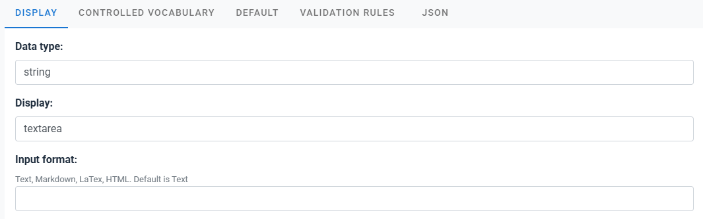
     
#### Controlled vocabularies {#controlled-vocabularies}

The **CONTROLLED VOCABULARY** tab defines how curators pick codes for a field:

| Mode | When to use |
|------|-------------|
| **Custom list** | Codes are defined directly in the template (inline grid). Suitable for small, template-specific lists. |
| **Registry codelist** | Codes are loaded from the site-wide [codelists registry](/managing_codelists.html). Use for shared lists (countries, frequencies, organization taxonomies) maintained in one place. |

At the top of the tab, **Codelist type** switches between these modes. A green dot on the tab title means a vocabulary is configured.

**Text fields:** With either mode, use **Select column to use as value** — **Code**, **Label**, or **Label with code** — to control what is saved in project metadata when the curator picks from the list.

**Array fields (object arrays):** Rows are objects with columns defined under **Field properties**. Registry codelists do not show **Select column to use as value**; instead, after you link a registry list, set **Column mappings** — **Registry code → column** and **Registry label → column**. In the project editor, each code the curator selects adds one row: mapped columns are filled from the registry, and other columns in that row remain editable.

**Schema-controlled values:** Some fields are restricted by the JSON Schema to a fixed set of enum values. The editor shows allowed values as hints and may disable **Registry codelist** until the field has a valid schema path. If inline codes in the template are not allowed by the schema, the template validation panel reports an **enum mismatch**.

**Switching to registry codelist:** Changing **Codelist type** from **Custom list** to **Registry codelist** opens a confirmation dialog. The inline code list is **removed from the template**; codes then come only from the registry entry you link. Maintain codes under [Managing codelists](/managing_codelists.html) so every template linked to that list stays in sync.

| What you see | **Custom list** | **Registry codelist** |
|--------------|-----------------|------------------------|
| Code maintenance | Inline grid on this tab | Registry (shared site-wide) |
| Text fields | Inline grid + **Select column to use as value** | Linked list + **Select column to use as value** |
| Array fields | Inline grid (full row objects) | Pick list + **Column mappings** |

***Using inline codelist:***

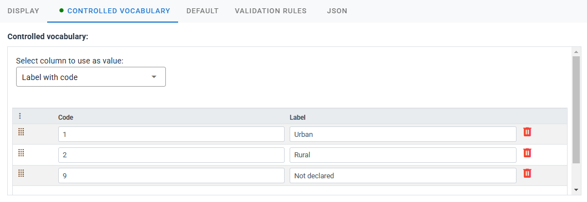

***Using registry codelist:***

- ***DEFAULT:*** A default value can be provided for an element. This will rarely be used. Default values will not be automatically entered in the metadata; instead, the data curator will have the option to "Add default values" when documenting a dataset.
  
  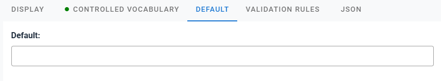
  
- ***VALIDATION RULES:*** Validation rules can be set for a metadata element, to control quality. The content entered for the element by the data curator will be validated against this set of rules, and Validation errors will be shown in the project home page. Validation rules can be of different types: regex (regular expression), min or max (minimum or maximum value, for numeric files), max_length (maximum number of characters in the entry), alpha (only letters accepted), alpha_num (only alphanumeric characters allowed), numeric (numeric value must be entered), is_uri (entry must be a URI). When one or multiple validation rules are entered, a green dot appears next to the title of the tab.
  
  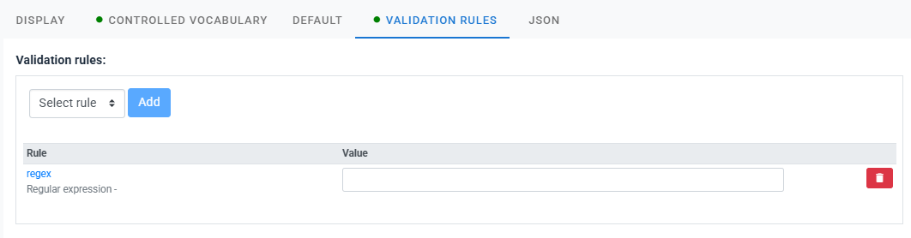
  
- ***JSON:*** The JSON version of the element description. This is not an editable content. 
  
  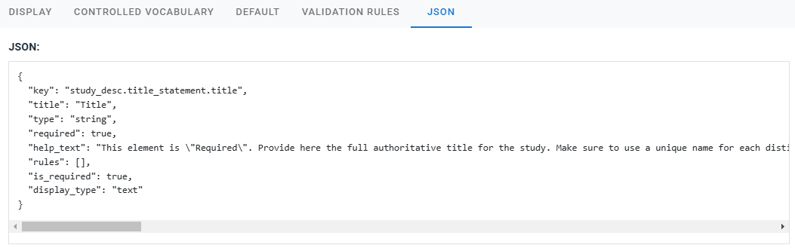

### Creating additional fields 

Metadata elements that are not provided by a metadata standard can be added as "additional fields". Such metadata elements are created and managed the same way as other metadata elements, except that a unique *Key* has to be provided, which will be the identifier of the newly created element.

### Schema alignment and template validation

For built-in and custom schema types, the Template Manager loads the project **JSON Schema** and checks that template field keys align with schema paths.

- **Unknown keys:** Fields whose keys are not recognized may show a warning when you edit the field or save the template.
- **Template validation panel:** When the editor detects issues (invalid keys, enum mismatches, or related alignment problems), a **template validation** list may appear on the template page. Click a row to jump to the affected field.
- **Missing section containers:** Some standards expect fixed top-level *containers* in the tree. If a required container is missing, the editor may offer to add missing section containers — use this before publishing a template to curators.

Alignment checks help prevent projects that validate poorly or export incorrectly; they do not replace field-level **validation rules** defined on individual elements.

## Templates and sharing {#templates-and-sharing}

Template maintenance combines **site roles** and **per-template sharing**:

| Mechanism | Purpose |
|-----------|---------|
| **Template manager** role (site administration) | Global permission to view, edit, duplicate, or delete templates across the site, depending on how permissions are assigned. |
| **SHARE** on a template | Grant specific users access to one template (view or edit) without giving them global template manager rights. |
| **ACL** tab (administrative templates only) | Controls who may fill in administrative metadata when that template is attached to a project — not the same as sharing the template definition itself. |

Project-level **Editor** role does not include editing template definitions unless the user also has template edit access via role or SHARE.

## Setting a template as default

The Template Manager allows the administrator of the system to select, for each data type, the template to be used by default (one default template per type, indicated by the radio button).

