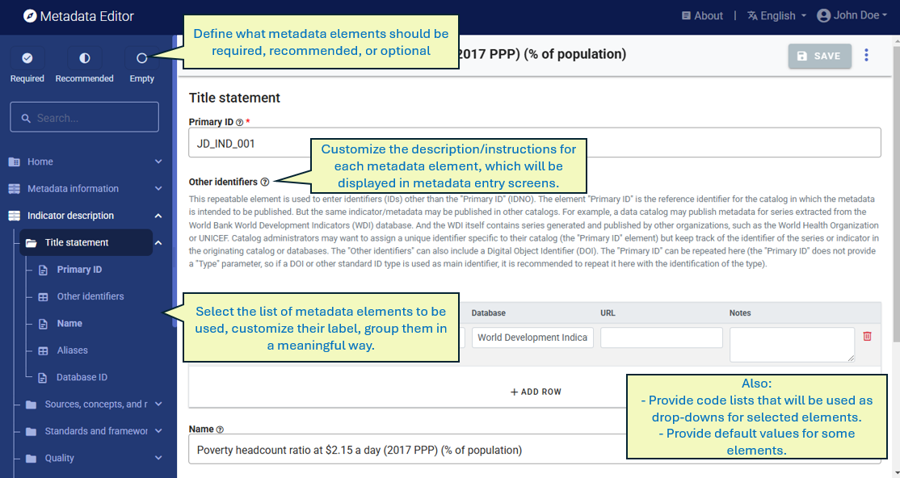

# Purpose of templates

## Simplify and tailor the use of metadata standards

Metadata standards include more metadata elements than needed by any user for documenting a specific dataset. The reason is that standards are developed to address many use cases and meet the needs of diverse organizations. To simplify their usage, **metadata templates** are created and used. Metadata templates are **tailored subsets** of the metadata standard's elements, designed for particular purposes or user groups while maintaining compliance with the standard. Templates will automatically generate the metadata entry pages that the data curators will see when they document a dataset.

Metadata templates allow for tailoring metadata elements in several ways:
- ***Label:*** The label of a metadata element provided in the metadata standard can be replaced with a label that conform to an organization's lexicon or stipulations.
- ***Status:*** Some metadata elements may be declared as *required* in the metadata standard itself. This status cannot be changed. But metadata elements that are not required in a standard can be designated as *required* or *recommended* in a template. Declaring a metadata element as required will not prevent the metadata from being saved when no content is provided, but it will prevent the metadata from being *validated*. It thus serves as a useful quality control. It is however advised against making too many elements required, and to set important but not crucial elements as recommended rather than required.
- ***Description/instructions:*** A tailored description and instructions can be provided in a template for each metadata element. These descriptions serve as guidelines for data curators.
- ***Controlled vocabularies:*** A controlled vocabulary can be specified for a metadata element, when applicable. 
- ***Default values:*** A default value can be set for a metadata element. Default values in the Metadata editor will not be automatically applied; an option is provided to the data curator to apply default values that have been entered in the template.  
- ***Validation rules:*** Customized validation rules can be set for each metadata element, using regular expressions, by setting a valid range for values, or other, to guarantee metadata coherence and uniformity.
- ***Adding elements:*** Elements that are not part of a metadata standard can be added in a template, as *additional* elements.

These various customization options help tailor metadata standards to specific use cases in an organization. They also enable the creation of templates in different languages. 

The Metadata Editor provides a *Template Manager* to generate and edit metadata templates. 

Templates offer flexibility and convenience, but coherence across an organization should be maintained. Ideally, each data type would use a unique template. However, multiple templates per data type are allowable for specialized cases, though this number should be minimized.

## Embed controlled vocabularies in the metadata standards

A **controlled vocabulary**, also known as a **code list**, is a predefined and structured set of terms (with corresponding codes) that are consistently used to populate specific metadata elements. Controlled vocabularies are applied to a limited number of elements within a metadata standard to ensure uniformity and precision.

Utilizing controlled vocabularies helps ensure that the same concept is consistently represented by the same term across various records, thereby reducing ambiguity and enhancing searchability and interoperability. Examples of controlled vocabularies include widely recognized national and international classifications, such as ISO country codes and names or the International Standard Industrial Classification (ISIC). Additionally, they may comprise organization-specific vocabularies, such as keyword taxonomies or tailored code lists designed for specific domains or purposes.  

Controlled vocabularies play a critical role in data discovery. By applying standardized terms to metadata elements, data catalogs can offer these terms as filtering options (facets), allowing users to narrow their search based on specific attributes or categories. This approach significantly enhances the discoverability of datasets, facilitating a more efficient search experience.

## Define schemas for administrative metadata

Administrative metadata is the metadata needed for the administration of specific data management and dissemination systems. As the requirements of such systems vary widely, no pre-defined standard or schema is provided. Templates are used in the Metadata Editor to define the content of administrative metadata schemas, fully tailored to the needs of the systems in place in the organization that uses the Metadata Editor. 

> Instructions related to administrtaive metadata and their templates are provided in the chapter **Documenting data: adminitstrative metadata**.
