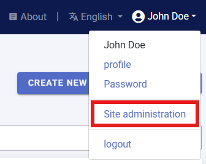
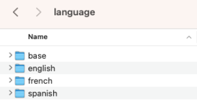
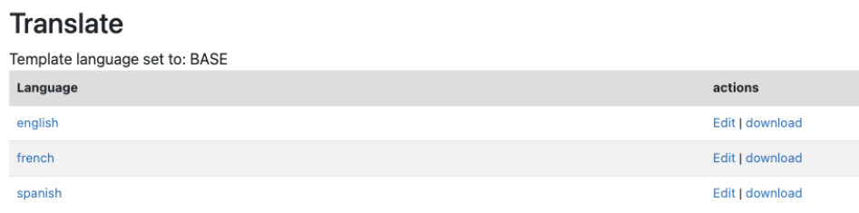
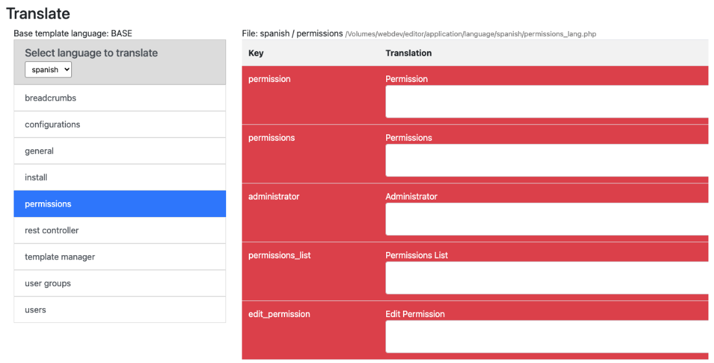
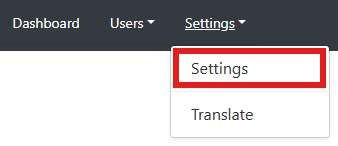
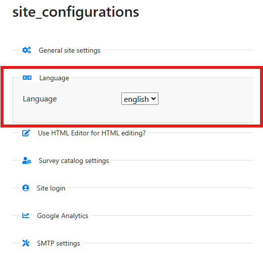
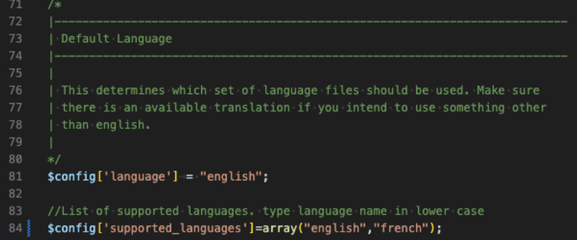
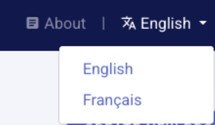

# Translation of the software and templates

## Translating the Metadata Editor software application

The Metadata Editor is designed following internationalization best practices and can be easily translated into other languages using the built-in translation tool.

Translations generate a set of PHP files (.php extension), which must be uploaded to the server where the Metadata Editor is installed. Instructions on where to save these files and how to activate a new language are provided in the following sections.

Translation files can be shared with other organizations using the Metadata Editor. You are encouraged to share your translations and inform the Metadata Editor maintenance team at the World Bank of their availability. Validated translations provided as open materials may be published in the Metadata Editor GitHub repository.

### Supported languages

The Metadata Editor supports translation into any UTF-8 encoded language, including Arabic, Chinese, and Russian.

- For right-to-left (RTL) languages like Arabic, the user interface (UI) must be adjusted to ensure correct display.
- Translations only affect the labels and text, not the overall UI layout.

Note: The application also allows translation from a language to itself (e.g., from English to English). This option can be used to modify the display of labels or text to align with specific terminology used by your organization.

### Adding a new language

If the application is not available in your language, you can create a translation through the user interface. This requires System Administrator privileges. If you have been assigned this role, a *Site Administration* option will appear in the menu when you click on your name.

To add a new language, a folder must be created in the application/languages directory on the server where the Metadata Editor is installed. For example, to create a Spanish translation, create a folder named Spanish.

No UI is provided for creating this folder; it must be done manually.

Once the folder is created, it will appear in the *Translate* section of the UI.

### Creating or editing a translation

To create or edit a translation:
1. Click on `Settings`.
2. Select `Translate` from the *Site Administration* menu.
3. Select the language from the translations page.
4. Click `Edit`.
5. Items without a translation will be highlighted in red. Enter your translation in the text box. Note that if the translation is significantly longer than the original text, it may not display properly in limited-space areas such as buttons and menus.
   
  

After translating each section, `Save` your work.

### Importing a translation

### Activating a translation

To activate a new translation as the default language:

1. Open `Settings` from the *Site Administration* menu.

   

2. Select `Language`.

  

3. Choose the desired language from the list of available translations.

This will set the new language as the default for your instance of the Metadata Editor.

### Enabling multiple languages

The Metadata Editor supports enabling multiple languages, allowing users to switch between them. To enable multiple languages:

1. Edit the the *supported_languages* line of the application/config/config.php file as follows. 

   

3. Modify the supported_languages line to include the desired languages.

Once configured, a dropdown menu will appear in the site navigation menu, allowing users to select their preferred language.

## Translating metadata templates

When translating the Metadata Editor, you may also want to translate the metadata templates, as they also define the User Interface (UI) seen by data curators.

To translate templates:

1. Open the *Template Manager* (see the section on *Designing Templates*).
2. `Duplicate` the template you want to translate, and edit the description of the copy (including the name and language information).
3. Translate all labels, instructions, and controlled vocabularies.
4. Set a translated template as the default for your language.

By translating both the UI and the templates, you ensure a seamless experience for users across different languages.

