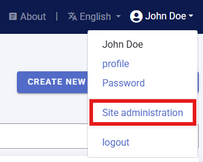
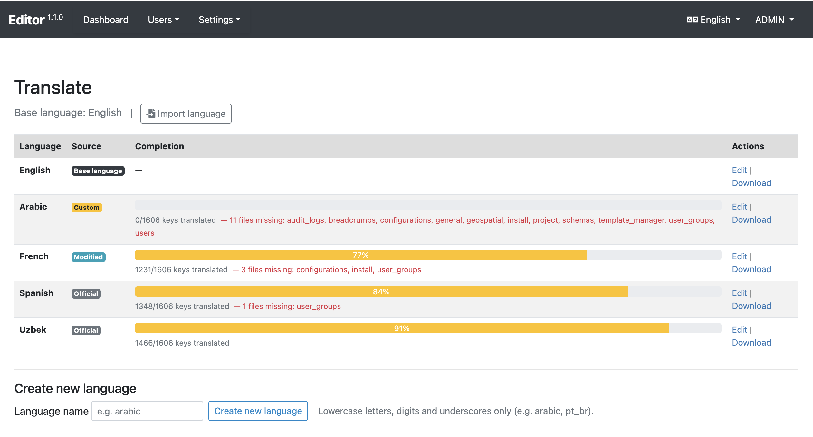
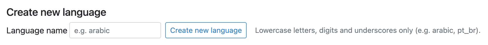
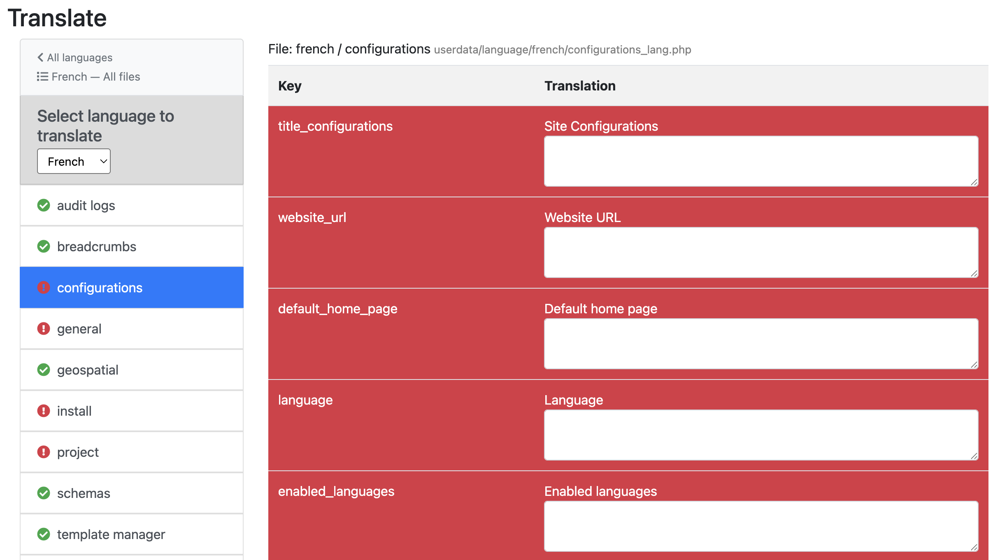
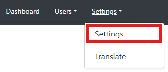
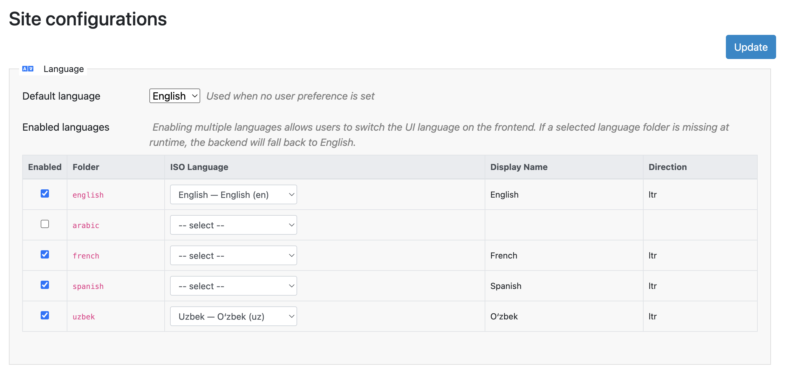

# Translation of the software and templates

## Translating the Metadata Editor software application

The Metadata Editor is designed following internationalization best practices and can be translated into any language using the built-in translation tool. All translation work is done through the user interface — no direct access to the server file system is required.

Translations can be exported as a ZIP file and shared with other organizations using the Metadata Editor. You are encouraged to share your translations and inform the Metadata Editor maintenance team at the World Bank of their availability. Validated translations provided as open materials may be published in the Metadata Editor GitHub repository.


### Supported languages

The Metadata Editor supports translation into any UTF-8 encoded language, including Arabic, Chinese, and Russian.

- For right-to-left (RTL) languages such as Arabic, the user interface automatically applies RTL text direction when those languages are active.
- Translations affect labels and text only, not the overall UI layout.

English is the **base language** and is the reference for all other translations. It can also be edited through the translation UI — for example, to replace default labels with terminology specific to your organization. Any changes are stored separately and do not affect the original application files.


### Accessing the translation tool

The translation tool requires **System Administrator** privileges. If this role has been assigned to your account, a *Site Administration* option will appear in the menu when you click your name.

1. Click your name in the top navigation bar.
2. Select *Site Administration*.
3. Click `Translate`.



---

### The language list

The translation overview page lists all available languages, with **English always shown first** as the base language. For each language it shows:

- **Source badge** — indicates the origin of the translation files:
  - `Base language` — English, the reference language
  - `Official` — the application ships with files for this language
  - `Modified` — an official language that has been customized via the UI
  - `Custom` — a language created entirely through the UI, with no official files
- **Completion** — a progress bar showing the percentage of keys translated, the total key count, and any files that are entirely missing
- **Actions** — `Edit` to open the translation editor; `Download` to export the language as a ZIP file. Both actions are available for all languages including English.



> A language showing **0%** completion or several missing files has not yet been started. A language at **100%** has a translation for every key in the English base.

---

### Creating a new language

If your language is not listed, you can create it directly from the translation overview page. No server access or file system changes are needed.

1. Scroll to the **Create new language** section at the bottom of the language list page.
2. Enter a language name using only lowercase letters, digits, and underscores (e.g., `arabic`, `pt_br`, `zh_cn`).
3. Click **Create new language**.



The new language folder will be created on the server and you will be taken directly to the translation editor for that language.

> Language names must start with a letter and be between 2 and 30 characters long. The name you enter here is used internally by the system. It is separate from the display name shown to users.

---

### Editing a translation

#### Opening a file

1. From the language list, click `Edit` next to the language you want to translate.
2. The translation editor opens with a sidebar on the left listing all translatable files.
3. Each file in the sidebar shows a status icon:
   - ✅ Green check — all keys in this file are translated
   - 🔴 Red exclamation — one or more keys are missing
4. Click a file name to open it for editing.



#### Translating keys

The editor presents each translatable string as a row with two columns: the English source text on the left and a text input for your translation on the right. Rows that have not yet been translated are highlighted in red.

- Enter your translation in the text box next to each English string.
- Keep formatting tags (e.g., `%s`, `<strong>`, `{variable}`) unchanged in your translation.
- If a translation is significantly longer than the English source, it may not display correctly in space-constrained areas such as buttons and menus.

#### Switching between files and languages

- Use the sidebar file list to navigate between translation files within the current language.
- Use the **← All languages** link at the top of the sidebar to return to the language list.
- Use the **Language — All files** link to view all files for the current language without one selected.
- To switch to a different language while keeping the same file open, use the language selector dropdown at the top of the sidebar and click **Switch**.


#### Saving

Click `Save` after completing each file. Your changes are saved to the server immediately. The original application files are never modified — all saved translations are stored separately and take priority over the built-in files.

---

### Downloading a translation

You can export a complete language translation as a ZIP file for backup, sharing, or offline editing.

1. From the language list, click `Download` next to the language.
2. A ZIP file named `{language}-{date}.zip` will be downloaded (e.g., `french-2026-02-20.zip`).

The ZIP contains one JSON file per translatable section, organized in a folder named after the language:

```
french/
  general_lang.json
  install_lang.json
  users_lang.json
  ...
```

Each JSON file is a flat key–value object:

```json
{
  "welcome": "Bienvenue",
  "save": "Enregistrer",
  ...
}
```

> **English download:** Downloading English exports the effective English content — including any customizations you have saved via the editor — and can be used as a starting template for a new translation.

---

### Importing a translation

If you have a previously exported ZIP, or a ZIP prepared by another organization, you can import it directly through the UI.

1. From the language list, click the **Import language** button near the top of the page.
2. Click **Choose file** and select a `.zip` file that matches the export format (a top-level folder named after the language containing `.json` files).
3. Click **Import language**.

On a successful import you will be taken to the translation editor for the imported language. If any files were skipped (e.g., unrecognized file names or invalid content), a summary will be shown so you can review and correct them.

#### Validation applied during import

Each file in the ZIP is validated before it is saved:

| Check | Details |
|---|---|
| ZIP structure | Must have a single top-level folder named after the language |
| File type | Only `.json` files are accepted |
| Known files only | File names must match existing English language files |
| Valid JSON | Must be a flat `{"key": "value"}` object |
| String values only | All keys and values must be plain text strings |
| Key whitelist | Only keys that exist in the English base are imported; unknown keys are ignored |
| Null byte check | Values must not contain null bytes |
| Value length cap | Each value must not exceed 10 KB |

Files that pass all checks are saved to the server. A backup of any previously saved file is created automatically before overwriting.

---

### Activating a translation

To set a language as the default for your instance of the Metadata Editor:

1. Open `Settings` from the *Site Administration* menu.

   

2. Select `Language`.

   

3. Choose the desired language from the list of available translations.

This changes the default language for all users who have not selected a personal preference.

---

### Enabling multiple languages

The Metadata Editor supports enabling multiple languages, allowing individual users to switch between them via a dropdown in the navigation bar.

To enable multiple languages:

1. Open `Settings` from the *Site Administration* menu.
2. Navigate to the **Languages** section.
3. Select the languages you want to make available to users.
4. Save your changes.

Once configured, a language selector dropdown will appear in the site navigation, allowing users to choose their preferred language.


---

## Translating metadata templates

When translating the Metadata Editor, you may also want to translate the metadata templates, as they define the interface seen by data curators when entering metadata.

To translate templates:

1. Open the *Template Manager* (see the section on *Designing Templates*).
2. `Duplicate` the template you want to translate and edit the copy's name and language information.
3. Translate all labels, instructions, and controlled vocabularies in the duplicate.
4. Set the translated template as the default for your language.

By translating both the application UI and the templates, you ensure a consistent experience for users across all languages.

