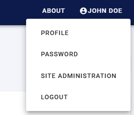
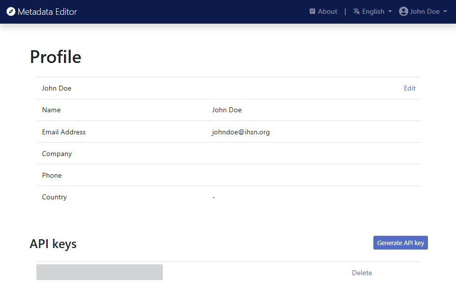

# User login and profile

Access to the Metadata Editor is managed by the system administrator(s) within your organization. User accounts can be created individually or by configuring the organization's authentication system to automatically register all members as authorized users (using a Single Sign-On - SSO).

## Logging In and Out

To access the Metadata Editor (login):

- Open the application URL provided by your organization.
- Enter your email or username and password to log in.

To logout:

Click on `Logout`. Note that you will be automatically logged out after [X minutes] of inactivity.

## Editing your user profile, password, and API key

After logging in, click on your username in the top menu to open a dropdown menu with the following options:

- ***Profile and API keys***

  Clicking on `Profile` opens a page displaying your profile details with an option to edit them.

  

  You can also generate an API key from this page. An API key is required only if you plan to manage metadata programmatically using the Metadata Editor’s API with a programming language such as R or Python.

  > ⚠️ Important: **Keep your API key confidential**. It is equivalent to a password to which your profile and permissions are associated. **If you suspect that your API key has been compromised, delete it immediately and generate a new one.** Refer to the section *The Metadata Editor API* for more details.

- ***Password***

  Opens a page where you can change your password.

- ***Site administration*** 

  (Forthcoming) The *Site administration* option opens a dasboard of projects and users, only accessible to users with administrator credentials. 
