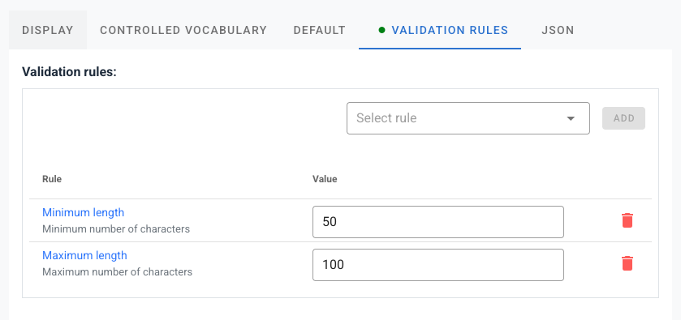
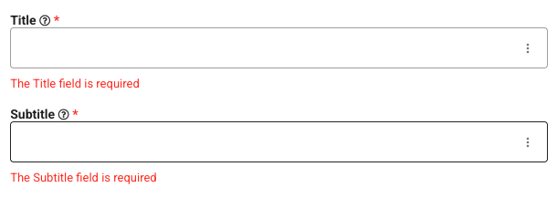
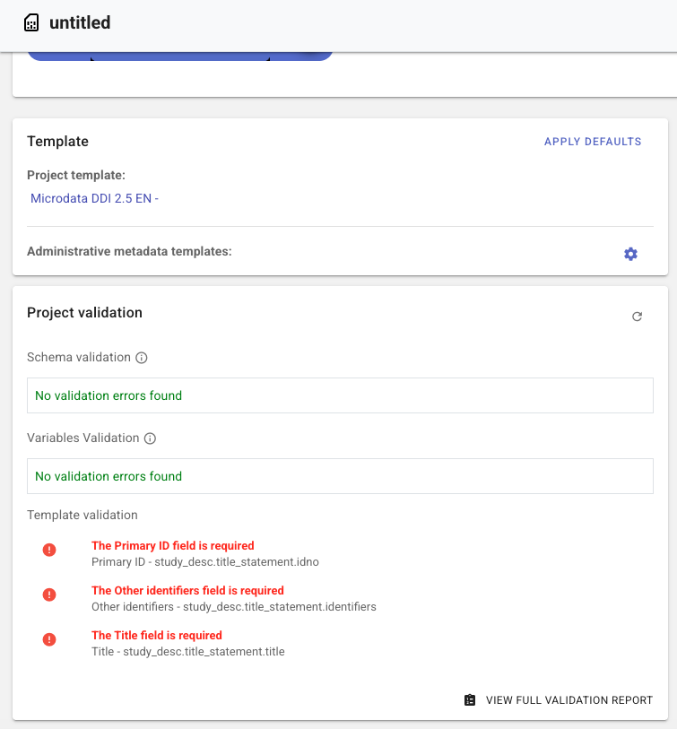
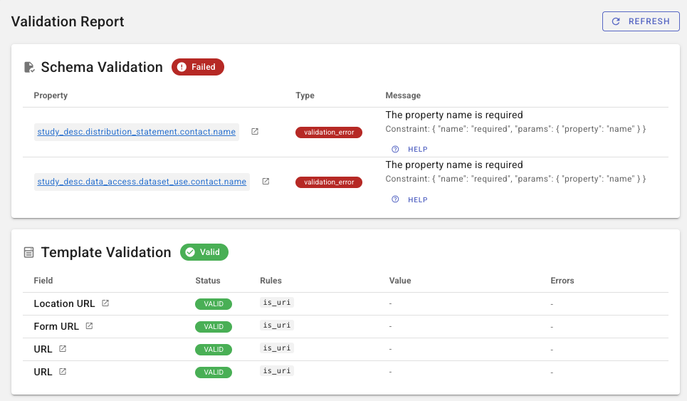
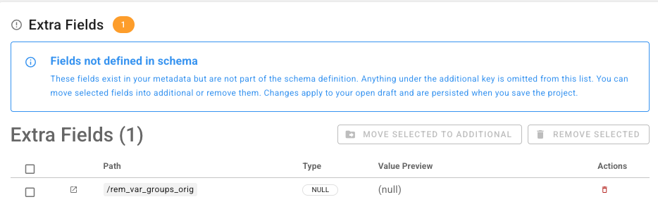
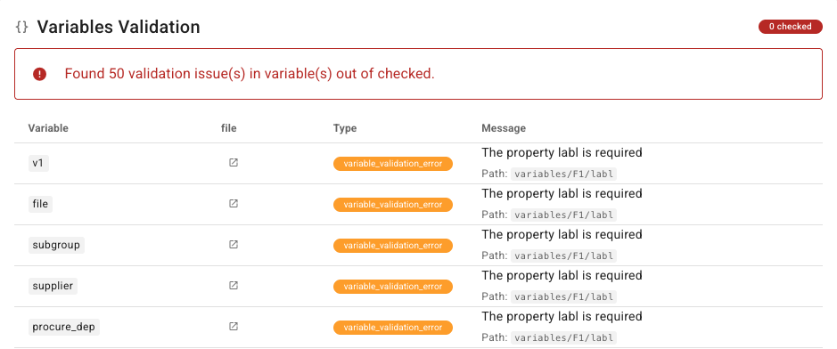

# Validating metadata

The Metadata Editor checks project metadata in two independent layers:

- **Schema validation** — does the saved metadata match the JSON Schema for the project type (required properties, types, enums, and other schema constraints)?
- **Template validation** — does the saved metadata satisfy the **user-defined field rules** on the template assigned to the project (required fields, regular expressions, length, dates, URLs, and similar)?

Validation is a quality-control report. Incomplete or invalid metadata can still be **saved**. Schema and template errors are listed so curators can fix them before export or [publish to NADA](/publish_to_nada.html). Publishing requires metadata with no validation errors.

This page covers schema validation, template rules, the editor UI, the validation report, and the API.


## Schema validation vs template validation

| | Schema validation | Template validation |
|---|---|---|
| **Source of rules** | JSON Schema for the project type (core standard or [custom schema](/custom_schemas.html)) | Field rules and required/recommended status on the **form template** |
| **Typical checks** | Missing schema-required properties, wrong types, enum mismatches, pattern/min/max from the schema | Empty template-required fields, regex, min/max length, `alpha`, `numeric`, URL, ISO dates |
| **Where you define it** | Schema file (core types are fixed; custom types are edited in the schema registry) | Template Manager — field **Status** and **VALIDATION RULES** tab |
| **Where you see it** | Project home **Project validation** panel; full **Validation report** | Same panel and report |
| **API** | `GET /api/validation/{sid}/schema` and `GET /api/editor/validate/{id}` | `GET /api/validation/{sid}/template` |

The two layers are independent. A project can pass schema validation and fail template rules (for example a field that the standard treats as optional but the template marks required). It can also pass template rules and fail schema validation (for example a value that is not in a schema enum).

**Related checks that are not this page:**

- **Template alignment** in Template Manager (unknown keys, enum mismatch against the schema) — see [Designing templates](/templates_design.html#schema-alignment-and-template-validation). That checks the *template* against the schema, not project metadata against template rules.
- **Custom schema upload** — schema files are validated as JSON Schema Draft-07 when you register them. See [JSON Schema guidelines](/custom_schemas_json_schema_guidelines.html).


## Schema validation

Each project type has a JSON Schema. Core types (microdata, indicator, document, and others) ship with the editor. Organization-defined types use a schema from the [schema registry](/managing_custom_schemas.html).

Schema validation runs against the **saved** project metadata (application-managed keys such as `created` and `template_uid` are not treated as study fields). It reports issues such as:

- Missing properties listed in the schema `required` array
- Values that do not match the declared `type` (string, number, array, object, boolean)
- Values not in a schema `enum`
- Failures of schema `pattern`, `minimum` / `maximum`, and similar Draft-07 keywords
- **Array stored as object** — an object with numeric keys where the schema expects an array (common after some imports). The report marks these as `array_as_object` and the UI can convert them.
- **Extra fields** — metadata keys that are not defined in the schema (listed separately from schema errors; they do not always fail schema validation)

For **microdata / survey** projects, schema validation of the study document is complemented by **variable** checks against the variable JSON Schema (empty labels, invalid variable documents). Those appear in the home panel and on the full report.

Schema constraints come from the standard (or your custom schema). You cannot relax a schema-required field in a template. You *can* make additional fields required in the template; that is template validation, not schema validation.


## Template user-defined validation rules

Templates tailor a standard for curators. Two template settings affect validation:

1. **Status — Required.** A field that is not required by the schema can be marked required in the template. Empty required fields do not block **Save**; they appear as template validation errors. Prefer **Recommended** for important but non-mandatory fields. Schema-required fields cannot be made optional. See [Purpose of templates](/templates_purpose.html) and [Designing templates](/templates_design.html).
2. **VALIDATION RULES tab.** Per-field rules that the curator’s value must satisfy when the field has content (and, for `required`, when it is empty).

Open a field in Template Manager. The **VALIDATION RULES** tab lists rules for that element. A green dot on the tab title means one or more rules are set.



### Available rules

| Rule | Parameter | What it checks |
|---|---|---|
| **Regular expression** (`regex`) | Pattern string | Value must match the pattern. Enter the pattern only, without slashes or flags (not `/pattern/`). Use `^` and `$` to match the whole value. Example: `^[A-Z0-9_-]+$`. |
| **Minimum length** (`min`) | Integer | Minimum number of characters |
| **Maximum length** (`max`) | Integer | Maximum number of characters |
| **Letters only** (`alpha`) | — | Alphabetic characters only |
| **Letters and numbers** (`alpha_num`) | — | Letters and digits only |
| **Numeric** (`numeric`) | — | Numeric value |
| **URL** (`is_uri`) | — | Valid URL |
| **Date (YYYY-MM-DD)** (`iso_date`) | — | Complete calendar date, for example `2024-03-15` |
| **Date (YYYY, YYYY-MM, or YYYY-MM-DD)** (`iso_date_partial`) | — | Year, year-month, or full date |

`required` as a *rule* is not added on this tab. Use the field **Required** checkbox instead.

`min` and `max` are **length** constraints, not numeric minimum/maximum values. Use `numeric` together with a regex if you need a numeric range.

Template rules apply to the template assigned to the project. If no template is assigned, the editor (and the template validation API) falls back to the default template for the project type, then to the first core template.


## Validation in the user interface

### Field-level hints

On metadata entry forms, template rules are also applied as input rules on the field (Vuetify/VeeValidate). Invalid values show an error on the control while the curator is editing. These hints use the same rule set as template validation; the authoritative saved-metadata report is the home panel and the full validation report.



### Project home — Project validation panel

On the **Project home** page, the **Project validation** frame summarizes issues for the **saved** metadata:

- **Schema validation** — violations of the JSON Schema (and, for microdata, variable schema issues)
- **Template validation** — violations of template required status and VALIDATION RULES

Click an error to open the field that needs to be edited. Use **View full validation report** for the detailed report (schema issues with types and paths, every template field that has rules, extra fields, and remediations).

The panel refreshes after metadata changes (with a short delay). Save the project so the report matches what is stored.



### Full validation report

The full report is a dedicated project page (from the home panel). It loads schema, template, extra-field, and (for microdata) variable results from the validation API. Use **Refresh** after you save corrections.




## The validation report

The report is organized in sections. HTTP-style APIs that feed this page return **HTTP 200** even when `validation.valid` is `false`; the `valid` flag (and the issue lists) tell you whether metadata passed.

### Schema validation

Each issue includes:

- **Property / path** — JSON Pointer or field path; click it to jump to the field in the editor
- **Type** — for example `validation_error`, `array_as_object`, or `type_mismatch`
- **Message** — human-readable explanation; some rows also show the schema constraint and expected vs actual type
- **Help** — short guidance for that error type

A green **Valid** chip means no schema issues. **Failed** lists the issues.

Fixable type problems (including array-as-object) can be corrected from the report; the editor updates the in-memory metadata. **Save** the project to persist the fix.

### Template validation

The template section lists fields that have template rules, with status (**valid** / **invalid**), rules applied, a value preview, and error messages. Click the field path to open it in the editor.

If template validation was skipped (no usable template), the section shows a warning instead of pass/fail.

### Extra fields

**Extra fields** are metadata paths that are not defined in the project-type JSON Schema (the `additional` subtree is handled separately). They often come from imports or from fields removed from a later schema/template.

Users with edit access can:

- **Move selected to additional** — keep the values under `additional` (JSON Patch; schema validation is skipped while applying the patch)
- **Remove selected** — delete the paths



A related API, `GET /api/validation/{sid}/template_extra_fields`, lists fields present in the metadata but not in the selected template. That comparison is available via the API; the on-screen extra-fields table is the schema extra-fields list.

### Variables (microdata)

For microdata/survey projects, a **Variables validation** section lists variable-level schema issues (variable name, file, type, message). The list is capped (the UI shows the first 50 by default; the API `limit` can go up to 1000). Click through to the data file’s variables page.




## Validation API

Authenticate with an API key as described in [Introduction to the API](/ME_API.html). `{sid}` on `/api/validation/...` routes is the **numeric project ID** (not IDNO). `{id}` on `/api/editor/validate/{id}` accepts project ID or IDNO.

View access is enough to read reports. Edit access is required for remediations (`move_to_additional`, `remove_fields`, `fix_array_as_object`).

Full request/response schemas are in the [API reference](/api_reference_openapi.html) (Validation tag).

### Pass/fail vs structured report

| Endpoint | What it checks | When invalid |
|---|---|---|
| `GET /api/editor/validate/{id}` | JSON Schema for the project type; for microdata, also all variables | **HTTP 400** with `errors`. Template rules are **not** applied. |
| `GET /api/validation/{sid}/schema` | Same schema check as above, as a structured report | **HTTP 200** with `validation.valid: false` and `validation.issues` |
| `GET /api/validation/{sid}/template` | Template field rules | **HTTP 200** with `validation.valid: false` (or `valid: null` if skipped) |

Use `/api/editor/validate/{id}` when a pipeline only needs pass/fail. Use `/api/validation/{sid}/schema` and `/api/validation/{sid}/template` when you need paths, messages, and (for templates) the per-field report that the UI shows.

`GET /api/validation/{sid}` is an alias of `GET /api/validation/{sid}/schema`.

### Template report

`GET /api/validation/{sid}/template`

- Default: template assigned to the project, else the type default, else the first core template (`validation.template_uid_source` is `assigned`, `default`, or `core`).
- Optional query `template_uid` — validate against another template of the **same data type** without changing the project assignment (`template_uid_source` is `override`). HTTP 400 if the UID is unknown or the type does not match.

Response (simplified):

```json
{
  "status": "success",
  "validation": {
    "template_uid": "my-template-uid",
    "template_uid_source": "assigned",
    "valid": false,
    "issues": [],
    "validation_report": [
      {
        "field": "study_desc.title_statement.idno",
        "path": "/study_desc/title_statement/idno",
        "title": "Primary ID",
        "status": "invalid",
        "rules_applied": ["regex"],
        "errors": ["..."],
        "error_count": 1
      }
    ]
  }
}
```

### Other validation endpoints

| Method | Path | Purpose |
|---|---|---|
| GET | `/api/validation/{sid}/variables` | Microdata variable schema report. Query `limit` (default 50, max 1000); `mode=light` checks empty labels only. HTTP 400 for non-microdata projects. |
| GET | `/api/validation/{sid}/extra_fields` | Metadata paths not in the type JSON Schema |
| GET | `/api/validation/{sid}/template_extra_fields` | Metadata paths not in the selected template (`template_uid` optional, same fallback as template validation) |
| POST | `/api/validation/{sid}/move_to_additional` | Move selected paths into `additional` (JSON body with paths; edit access) |
| POST | `/api/validation/{sid}/remove_fields` | Remove selected paths (edit access) |
| POST | `/api/validation/{sid}/fix_array_as_object` | Convert numeric-key objects to arrays at given JSON Pointers (edit access) |

Remediation POSTs skip schema validation while applying the JSON Patch so the cleanup can succeed; re-run schema/template GETs afterward.

### Validate on update

On **update** or **JSON Patch**, you can schema-validate the stored document before saving:

- Update: include `"validate": true` in the body (create does not schema-validate the request body).
- Patch: schema validation runs by default; set `"validate": false` to skip.

That flag is schema validation only; it does not apply template rules. After saving, call `GET /api/validation/{sid}/template` if you need template results.

See the OpenAPI `validate` property on create/update request parameters.

### Example

Schema report for project ID `123`:

```http
GET /api/validation/123/schema
X-API-Key: your_api_key_here
```

Template report against a specific template:

```http
GET /api/validation/123/template?template_uid=my-template-uid
X-API-Key: your_api_key_here
```

Pass/fail (ID or IDNO):

```http
GET /api/editor/validate/123
X-API-Key: your_api_key_here
```


## Related topics

- [Purpose of templates](/templates_purpose.html) — required vs recommended; why template rules exist
- [Designing templates](/templates_design.html) — VALIDATION RULES tab; template-to-schema alignment
- [General instructions](/documenting_general_instructions.html) — project home page
- [JSON Schema guidelines](/custom_schemas_json_schema_guidelines.html) — authoring schemas that the editor will enforce
- [Publish to NADA](/publish_to_nada.html) — publishing requires metadata with no validation errors
- [Introduction to the API](/ME_API.html) / [API reference](/api_reference_openapi.html)
- [Structural metadata (project)](/documenting_indicator_data_structure.html#validation) — indicator DSD structure and data validation (separate from this page)
